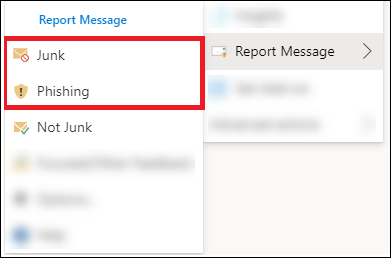

# Report false positives and false negatives in Outlook

[!INCLUDE [Microsoft 365 Defender rebranding](../includes/microsoft-defender-for-office.md)]

**Applies to**
- [Exchange Online Protection](exchange-online-protection-overview.md)
- [Microsoft Defender for Office 365 plan 1 and plan 2](defender-for-office-365.md)
- [Microsoft 365 Defender](../defender/microsoft-365-defender.md)

> [!NOTE]
> If you're an admin in a Microsoft 365 organization with Exchange Online mailboxes, we recommend that you use the Submissions portal in the [Microsoft 365 Defender](https://security.microsoft.com). For more information, see [Use Admin Submission to submit suspected spam, phish, URLs, and files to Microsoft](admin-submission.md).

In Microsoft 365 organizations with mailboxes in Exchange Online or on-premises mailboxes using hybrid modern authentication, you can submit false positives (good email that was blocked or sent to junk folder) and false negatives (unwanted email or phish that was delivered to the inbox) to Exchange Online Protection (EOP).

## What do you need to know before you begin?

- For the best user submission experience, use the Report Message add-in or the Report Phishing add-in.

  > [!IMPORTANT]
  > The built-in experience for reporting junk or phishing in Outlook can't use the [user submission policy](./user-submission.md). We recommend using the Report Message add-in or the Report Phishing add-in instead.

- The Report Message add-in and the Report Phishing add-in work for Outlook in all platforms (Outlook on the web, iOS, Android, and Desktop).

- If you're an admin in an organization with Exchange Online mailboxes, use the Submissions portal in the Microsoft 365 Defender. For more information, see [Use Admin Submission to submit suspected spam, phish, URLs, and files to Microsoft](admin-submission.md).

- You can configure to send messages directly to Microsoft, a mailbox you specify, or both. For more information, see [User submissions policies](user-submission.md).

- For more information on how to get and enable the Report Message or the Report Phishing add-ins, see [Enable the Report Message or the Report Phishing add-ins](enable-the-report-message-add-in.md).

- For more information about reporting messages to Microsoft, see [Report messages and files to Microsoft](report-junk-email-messages-to-microsoft.md).

## Use the Report Message feature

### Report junk and phishing messages

For messages in the Inbox or any other email folder except Junk Email, use the following method to report spam and phishing messages:

1. Select the **More actions** ellipses on the top-right corner of the selected message, select **Report message** from the dropdown menu, and then select **Junk** or **Phishing**.

   
   
   

2. The selected messages will be sent to Microsoft for analysis and:
   - Moved to the Junk Email folder if they were reported as spam.
   - Deleted if they were reported as phishing.

### Report messages that are not junk

1. Select the **More actions** ellipses on the top-right corner of the selected message, select **Report message** from the dropdown menu, and then select **Not Junk**.

   
   
   

2. The selected message will be sent to Microsoft for analysis and moved to Inbox or any other specified folder.

## View and review reported messages

To review messages that users report to Microsoft, you have these options:

- Use the Admin Submissions portal. For more information, see [View user submissions to Microsoft](admin-submission.md#view-user-submissions-to-microsoft).
- Create a mail flow rule (also known as a transport rule) to send copies of reported messages. For instructions, see [Use mail flow rules to see what users are reporting to Microsoft](/exchange/security-and-compliance/mail-flow-rules/use-rules-to-see-what-users-are-reporting-to-microsoft).
