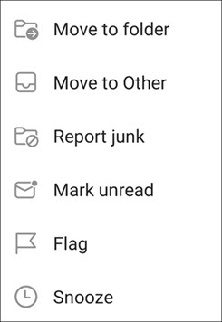
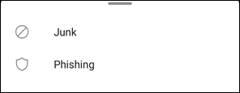
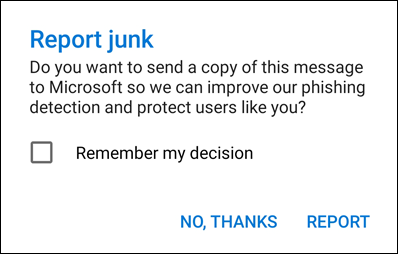
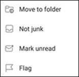

# Report junk and phishing email in Outlook for iOS and Android in Exchange Online

[!INCLUDE [Microsoft 365 Defender rebranding](../includes/microsoft-defender-for-office.md)]

In Microsoft 365 organizations with mailboxes in Exchange Online or on-premises mailboxes using [hybrid modern authentication](https://docs.microsoft.com/microsoft-365/enterprise/hybrid-modern-auth-overview), you can use the built-in reporting options in Outlook for iOS and Android to submit false positives (good email marked as spam), false negatives (bad email allowed), and phishing messages to Exchange Online Protection (EOP).

## What do you need to know before you begin

- If you're an admin in an organization with Exchange Online mailboxes, we recommend that you use the Submissions portal in the Security & Compliance Center. For more information, see [Use Admin Submission to submit suspected spam, phish, URLs, and files to Microsoft](admin-submission.md).

- You can configure reported messages to be copied or redirected to a mailbox that you specify. For more information, see [User Submissions policies](user-submission.md).

- For more information about reporting messages to Microsoft, see [Report messages and files to Microsoft](report-junk-email-messages-to-microsoft.md).

  > [!NOTE]
  > If junk email reporting is disabled for Outlook in the user submission policy, junk or phishing messages will be moved to the Junk folder and not reported to your admin or Microsoft.

## Report spam and phishing messages in Outlook for iOS and Android

For messages in the Inbox, or any other email folder except Junk Email, use the following steps to report spam and phishing messages for iOS and Android:

1. Select one or more messages.
2. In the top-right corner tap on the three vertical dots. The action menu opens.

   

3. Tap **Report junk** and then select **Junk** or **Phishing**.

   

4. In the dialog that appears, you can choose **Report** or **No Thanks**. On selecting **No Thanks**, if you tapped **Junk** the message moves to the Junk Email folder, if you tapped **Phishing** the message moves to the Deleted Items folder. Select **Report** to also send a copy of the message to Microsoft.

   

If you change your mind, select **Undo** on the toast notification that appears. The message remains in the Inbox folder.

## Report non-spam messages from the Junk folder in Outlook for iOS and Android

In the Junk folder, use the following steps to report spam false positives:

1. Select one or more messages.
2. In the top-right corner tap on the three vertical dots. The action menu opens.

   

3. Tap **Not junk**.

A toast notification appears that the email has moved to your Inbox. If you change your mind, select **Undo** on the toast notification. The email remains in the Junk folder.
