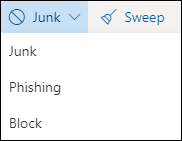
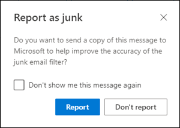
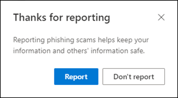
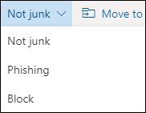
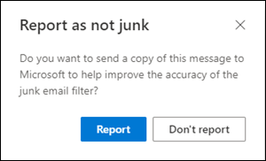
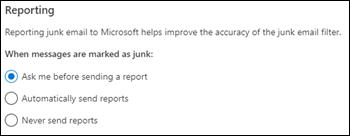

# Report junk and phishing email in Outlook on the web in Exchange Online

[!INCLUDE [Microsoft 365 Defender rebranding](../includes/microsoft-defender-for-office.md)]

**Applies to**
- [Exchange Online Protection](https://go.microsoft.com/fwlink/?linkid=2148611)
- [Microsoft Defender for Office 365 plan 1 and plan 2](https://go.microsoft.com/fwlink/?linkid=2148715)
- [Microsoft 365 Defender](https://go.microsoft.com/fwlink/?linkid=2118804)

In Microsoft 365 organizations with mailboxes in Exchange Online, you can use the built-in reporting options in Outlook on the web (formerly known as Outlook Web App) to submit false positives (good email marked as spam), false negatives (bad email allowed) and phishing messages to Exchange Online Protection (EOP).

## What do you need to know before you begin?

- If you're an admin in an organization with Exchange Online mailboxes, we recommend that you use the Submissions portal in the Security & Compliance Center. For more information, see [Use Admin Submission to submit suspected spam, phish, URLs, and files to Microsoft](admin-submission.md).

- Admins can disable or enable the ability for users to report messages to Microsoft in Outlook on the web. For details, see the [Disable or enable junk email reporting in Outlook on the web](#disable-or-enable-junk-email-reporting-in-outlook-on-the-web) section later in this article.

- You can configure reported messages to be copied or redirected to a mailbox that you specify. For more information, see [User submissions policies](user-submission.md).

- For more information about reporting messages to Microsoft, see [Report messages and files to Microsoft](report-junk-email-messages-to-microsoft.md).

## Report spam and phishing messages in Outlook on the web

1. For messages in the Inbox or any other email folder except Junk Email, use either of the following methods to report spam and phishing messages:

   - Select the message, click **Junk** on the toolbar, and then select **Junk** or **Phishing**.

     

   - Select one or more messages, right-click, and then select **Mark as junk**.

2. In the dialog that appears, click **Report**. If you change your mind, click **Don't Report**.

   |Junk|Phishing|
   |:---:|:---:|
   |||

3. The selected messages will be sent to Microsoft for analysis. To confirm that the messages have been submitted, open your **Sent Items** folder to view the submitted messages.

## Report non-spam and phishing messages from the Junk Email folder in Outlook on the web

1. In the Junk Email folder, use either of the following methods to report spam false positives or phishing messages:

   - Select the message, click **Not Junk** on the toolbar, and then select **Not Junk** or **Phishing**.

     

   - Select one or more messages, right-click, and then select **Mark as not junk**.

2. In the dialog that appears, read the information and click **Report**. If you change your mind, click **Don't Report**.

   |Not Junk|Phishing|
   |:---:|:---:|
   |||

3. The selected messages will be sent to Microsoft for analysis. To confirm that the messages have been submitted, open your **Sent Items** folder to view the submitted messages.

## Disable or enable junk email reporting in Outlook on the web

By default, users can report spam false positives, false negatives, and phishing messages to Microsoft for analysis in Outlook on the web. Admins can configure Outlook on the web mailbox policies in Exchange Online PowerShell to prevent users from reporting spam false positives and spam false negatives to Microsoft. You can't disable the ability for users to report phishing messages to Microsoft.

### What do you need to know before you begin?

- To connect to Exchange Online PowerShell, see [Connect to Exchange Online PowerShell](https://docs.microsoft.com/powershell/exchange/connect-to-exchange-online-powershell).

- You need to be assigned permissions in Exchange Online before you can do the procedures in this article. Specifically you need the **Recipient Policies** or **Mail Recipients** roles, which are assigned to the **Organization Management** and **Recipient Management** role groups by default. For more information about role groups in Exchange Online, see [Permissions in Exchange Online](https://docs.microsoft.com/exchange/permissions-exo/permissions-exo) and [Modify role groups in Exchange Online](https://docs.microsoft.com/Exchange/permissions-exo/role-groups#modify-role-groups).

- Every organization has a default policy named OwaMailboxPolicy-Default, but you can create custom policies. Custom policies are applied to scoped users before the default policy. For more information about Outlook on the web mailbox policies, see [Outlook on the web mailbox policies in Exchange Online](https://docs.microsoft.com/Exchange/clients-and-mobile-in-exchange-online/outlook-on-the-web/outlook-web-app-mailbox-policies).

- Disabling junk email reporting doesn't remove the ability to mark a message as junk or not junk in Outlook on the web. Selecting a message in the Junk email folder and clicking **Not junk** \> **Not junk** still moves the message back into the Inbox. Selecting a message in any other email folder and clicking **Junk** \> **Junk** still moves the message into the Junk Email folder. What's no longer available is the option to report the message to Microsoft.

### Use Exchange Online PowerShell to disable or enable junk email reporting in Outlook on the web

1. To find your existing Outlook on the web mailbox policies and the status of junk email reporting, run the following command:

   ```powershell
   Get-OwaMailboxPolicy | Format-Table Name,ReportJunkEmailEnabled
   ```

2. To disable or enable junk email reporting in Outlook on the web, use the following syntax:

   ```powershell
   Set-OwaMailboxPolicy -Identity "<OWAMailboxPolicyName>" -ReportJunkEmailEnabled <$true | $false>
   ```

   This example disables junk email reporting in the default policy.

   ```powershell
   Set-OwaMailboxPolicy -Identity "OwaMailboxPolicy-Default" -ReportJunkEmailEnabled $false
   ```

   This example enables junk email reporting in the custom policy named Contoso Managers.

   ```powershell
   Set-OwaMailboxPolicy -Identity "Contoso Managers" -ReportJunkEmailEnabled $true
   ```

For detailed syntax and parameter information, see [Get-OwaMailboxPolicy](https://docs.microsoft.com/powershell/module/exchange/get-owamailboxpolicy) and [Set-OwaMailboxPolicy](https://docs.microsoft.com/powershell/module/exchange/set-owamailboxpolicy).

### How do you know this worked?

To verify that you've successfully enabled or disabled junk email reporting in Outlook on the web, use any of the following steps:

- In Exchange Online PowerShell, run the following command and verify the **ReportJunkEmailEnabled** property value:

  ```powershell
  Get-OwaMailboxPolicy | Format-Table Name,ReportJunkEmailEnabled
  ```

- Open an affected user's mailbox in Outlook on the web, select a message in the Inbox, click **Junk** \> **Junk** and verify the prompt to report the message to Microsoft is or is not displayed.<sup>\*</sup>

- Open an affected user's mailbox in Outlook on the web, select a message in the Junk Email folder, click **Junk** \> **Junk** and verify the prompt to report the message to Microsoft is or is not displayed.<sup>\*</sup>

<sup>\*</sup> Users can hide the prompt to report the message while still reporting the message. To check this setting in Outlook on the web:

1. Click **Settings**  \> **View all Outlook settings** \> **Junk email**.
2. In the **Reporting** section, verify the value: **Ask me before sending a report**.

   
