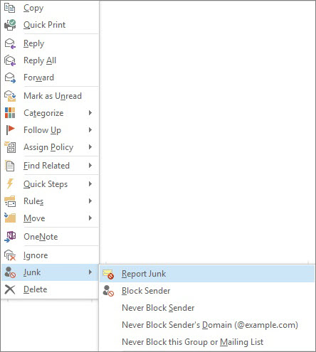
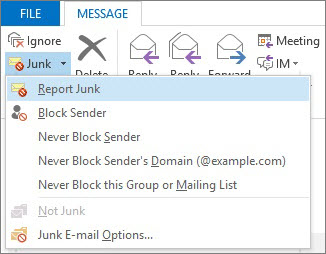

# Report junk email messages to Microsoft

The Microsoft Junk Email Reporting Add-in for Microsoft Office Outlook offers several ways for you to report junk email messages:

- From the Outlook ribbon

- From your Inbox

- From within an opened email message

The Junk Email Reporting Add-in helps you submit reports to the Microsoft Exchange Online Protection (EOP) service. If your mailbox is not protected by the service, your junk email report submission will not affect your spam filters. Administrators can learn about more spam settings that apply to a whole organization at [How to prevent good email from being marked as spam in Office 365](prevent-email-from-being-marked-as-spam.md) or [How to reduce spam email in Office 365](reduce-spam-email.md). These are helpful if you have administrator-level control and you want to prevent false positives or false negatives.

> [!TIP]
> You can also submit spam messages directly to Microsoft by using the [junk@office365.microsoft.com](mailto:junk@office365.microsoft.com) email address, and false positive (non-spam) messages by using the [not_junk@office365.microsoft.com](mailto:not_junk@office365.microsoft.com) email address. For more information, see [Submit spam, non-spam, and phishing scam messages to Microsoft for analysis](submit-spam-non-spam-and-phishing-scam-messages-to-microsoft-for-analysis.md).

### To report junk email messages from Outlook

[Use the Report Message add-in](https://support.office.com/article/b5caa9f1-cdf3-4443-af8c-ff724ea719d2)

### To report junk email messages from your Inbox

1. Right-click the message or messages that you want to report as junk.

2. Select **Junk** and then click **Report Junk**.
    

3. The **Microsoft Junk E-mail Reporting Add-in** dialog box opens. If you're sure that you want to submit the messages you selected as junk, click **Yes**.
    

    > [!NOTE]
    > If you don't want to receive this confirmation message when submitting junk messages, check **Do not show this message again**.

The selected messages will be sent to Microsoft for analysis and moved to the Junk Email folder. To confirm that the messages have been submitted, open your **Sent Items** folder to view the submitted messages.

### To report a junk email message from within an opened message

1. From within an opened message, click the **Report Junk** button on the message ribbon. For example, click **Junk** \> **Report Junk**
    

2. The **Microsoft Junk E-mail Reporting Add-in** dialog box opens. If you're sure that you want to submit the message you selected as junk, click **Yes**.
    

    > [!NOTE]
    > If you don't want to receive this confirmation message when submitting junk messages, check **Do not show this message again**.

The selected message will be sent to Microsoft for analysis and moved to the Junk Email folder. To confirm that the message has been submitted, open your **Sent Items** folder to view the submitted message.

## For more information

[Enable the Report Message add-in](enable-the-report-message-add-in.md)

[Troubleshooting and support information](troubleshooting-and-support-information.md)

[How to prevent good email from being marked as spam in Office 365](prevent-email-from-being-marked-as-spam.md)

[How to reduce spam email in Office 365](reduce-spam-email.md)
