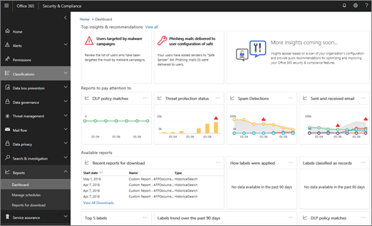

# Smart reports and insights in the Security & Compliance Center

[!INCLUDE [Microsoft 365 Defender rebranding](../includes/microsoft-defender-for-office.md)]

**Applies to**
- [Exchange Online Protection](exchange-online-protection-overview.md)
- [Microsoft Defender for Office 365 plan 1 and plan 2](defender-for-office-365.md)
- [Microsoft 365 Defender](../mtp/microsoft-threat-protection.md)

If you are part of your organization's Microsoft for 365 for business security team and have the necessary [permissions assigned in the Security & Compliance Center](permissions-in-the-security-and-compliance-center.md), you can access a variety of reports, including smart reports and insights. Read this article to get an overview of these reports and insights, and where to go to learn more about specific reports.

## Smart reports and insights overview

Monitoring capabilities available in the Security & Compliance Center include smart reports and insights that enable your security and compliance administrators to focus on high-priority issues, such as security attacks or increased suspicious activity. In a dashboard, smart reports and insights resemble the following image:

In addition to highlighting problem areas, smart reports and insights include recommendations and links to view and explore data and also take quick actions. For example, if your organization suddenly has a high number of email messages being marked as spam by end users, you might be advised to revisit your anti-spam policies to ensure the right level of protection is in place.

## Types of reports in the Security & Compliance Center

A wide variety of reports are available in the Security & Compliance Center. (Go to **Reports** \> **Dashboard** to get an all-up view.) The following table lists available reports with links to learn more:

****

|Type of information|How to get there|Where to go to learn more|
|---|---|---|
|**Security & Compliance Center reports** (all up) 
 Top insights and recommendations, and links to Security & Compliance reports, including data loss prevention reports, labels, email security reports, Defender for Office 365 reports, and more|In the Security & Compliance Center, go to **Reports** \> **Dashboard**|[Monitor and view reports in the Microsoft 365 security center](../mtp/monitoring-and-reporting.md)|
|**Data loss prevention** 
 Data loss prevention policy matches, false positives and overrides, and links to create or edit policies|In the Security & Compliance Center, go to **Data loss prevention** \> **Policy**|[View the reports for data loss prevention](../../compliance/view-the-dlp-reports.md)|
|**Data governance** 
 Information about how labels are applied, labels classified as records, label trends, and more|In the Security & Compliance Center, go to **Information governance** \> **Dashboard**|[View the data governance reports](../../compliance/view-the-data-governance-reports.md)|
|**Threat management dashboard** (this is also referred to as the Security dashboard) 
 Threat detections, malware trends, top targeted users, details about sent and received email messages, and more|In the Security & Compliance Center, go to **Threat management** \> **Dashboard**|[View reports for Defender for Office 365](view-reports-for-mdo.md)|
|**Threat explorer** (also referred to as Explorer) or **Real-time detections** 
 Suspected malware detected in email and files in Microsoft 365|In the Security & Compliance Center, go to **Threat management** \> **Explorer** or **Real-time detections**  |[Threat Explorer (or real-time detections)](threat-explorer.md)|
|**Defender for Office 365 and email security reports** 
 Email security and threat protection reports (including malware, spam, phishing, and spoofing reports)|In the Security & Compliance Center, go to **Reports** \> **Dashboard**|[View reports for Defender for Office 365](view-reports-for-mdo.md) 
 [View email security reports in the Security & Compliance Center](view-email-security-reports.md)|
|**Mail flow** 
 Information about sent and received email messages, recent alerts, top senders and recipients, email forwarding reports, and more|In the Security & Compliance Center, go to **Mail flow** \> **Dashboard** and **Reports** \> **Dashboard**|[Mail flow insights in the Security & Compliance Center](mail-flow-insights-v2.md) 
 [View mail flow reports in the Security & Compliance Center](view-mail-flow-reports.md)|
|**GDPR compliance** 
 Information about GDPR compliance, including links to data subjects, label trends, and active & closed cases|In the Security & Compliance Center, go to **Data privacy** \> **GDPR dashboard**|[General Data Protection Regulation Summary](https://docs.microsoft.com/compliance/regulatory/gdpr)|
|**Audit log** 
 Information about Microsoft 365 activities, users, files or folders, and more|In the Security & Compliance Center, go to **Search & investigation** \> **Audit log search**|[Search the audit log in the Security & Compliance Center](../../compliance/search-the-audit-log-in-security-and-compliance.md)|
|**Compliance reports** 
 FedRAMP reports, governance, risk and compliance reports, ISO information security management reports, and Service Organization Controls audit and assessment reports|In the Security & Compliance Center, go to **Service assurance** \> **Compliance reports**|[Plan for security & compliance in Office 365](../../compliance/plan-for-security-and-compliance.md)|
|

## Related topics

[Monitor and view reports in the Microsoft 365 security center](../mtp/monitoring-and-reporting.md)

[Protect against threats in Office 365](protect-against-threats.md)
