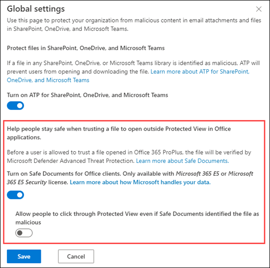

# Safe Documents in Microsoft 365 E5

[!INCLUDE [Microsoft 365 Defender rebranding](../includes/microsoft-defender-for-office.md)]

**Applies to**
- [Microsoft Defender for Office 365 plan 2](defender-for-office-365.md)
- [Microsoft 365 Defender](../defender/microsoft-365-defender.md)

Safe Documents is a feature in Microsoft 365 E5 or Microsoft 365 E5 Security that uses [Microsoft Defender for Endpoint](/windows/security/threat-protection/microsoft-defender-atp/microsoft-defender-advanced-threat-protection) to scan documents and files that are opened in [Protected View](https://support.microsoft.com/office/d6f09ac7-e6b9-4495-8e43-2bbcdbcb6653) or [Application Guard for Office](https://support.microsoft.com/en-us/topic/application-guard-for-office-9e0fb9c2-ffad-43bf-8ba3-78f785fdba46).

## What do you need to know before you begin?

- Safe Documents is available only to users with *Microsoft 365 E5* or *Microsoft 365 E5 Security* licenses. These licenses are not included in Microsoft Defender for Office 365 plans.

- Safe Documents is supported in Microsoft 365 Apps for enterprise (formerly known as Office 365 ProPlus) version 2004 or later.

- You open the Security & Compliance Center at <https://protection.office.com>. To go directly to the **ATP Safe Attachments** page, open <https://protection.office.com/safeattachmentv2>.

- To connect to Exchange Online PowerShell, see [Connect to Exchange Online PowerShell](/powershell/exchange/connect-to-exchange-online-powershell).

- You need to be assigned permissions in **Exchange Online** before you can do the procedures in this article:
  - To configure Safe Documents settings, you need to be a member of the **Organization Management** or **Security Administrator** role groups.
  - For read-only access to Safe Documents settings, you need to be a member of the **Global Reader** or **Security Reader** role groups.

  For more information, see [Permissions in Exchange Online](/exchange/permissions-exo/permissions-exo).

  > [!NOTE]
  >
  > - Adding users to the corresponding Azure Active Directory role in the Microsoft 365 admin center gives users the required permissions _and_ permissions for other features in Microsoft 365. For more information, see [About admin roles](../../admin/add-users/about-admin-roles.md).
  >
  > - The **View-Only Organization Management** role group in [Exchange Online](/Exchange/permissions-exo/permissions-exo#role-groups) also gives read-only access to the feature.

### How does Microsoft handle your data?

To keep you protected, Safe Documents sends files to the [Microsoft Defender for Endpoint](/windows/security/threat-protection/microsoft-defender-atp/microsoft-defender-advanced-threat-protection) cloud for analysis. Details on how Microsoft Defender for Endpoint handles your data can be found here: [Microsoft Defender for Endpoint data storage and privacy](/windows/security/threat-protection/microsoft-defender-atp/data-storage-privacy).

Files sent by Safe Documents are not retained in Defender beyond the time needed for analysis (typically, less than 24 hours).

## Use the Security & Compliance Center to configure Safe Documents

1. In the Security & Compliance Center, go to **Threat management** \> **Policy** \> **ATP Safe Attachments**, and then click **Global settings**.

2. In the **Global settings** fly out that appears, configure the following settings:

   - **Turn on Safe Documents for Office clients**: Move the toggle to the right to turn on the feature: .

   - **Allow people to click through Protected View even if Safe Documents identifies the file as malicious**: We recommend that you leave this option turned off (leave the toggle to the left: ).

   When you're finished, click **Save**.

   

### Use Exchange Online PowerShell to configure Safe Documents

Use the following syntax:

```powershell
Set-AtpPolicyForO365 -EnableSafeDocs <$true | $false> -AllowSafeDocsOpen <$true | $false>
```

- The _EnableSafeDocs_ parameter enables or disables Safe Documents for the entire organization.
- The _AllowSafeDocsOpen_ parameter allows or prevents users from leaving Protected View (that is, opening the document) if the document has been identified as malicious.

This example enables Safe Documents for the entire organization, and prevents users from opening documents that have been identified as malicious from Protected View.

```powershell
Set-AtpPolicyForO365 -EnableSafeDocs $true -AllowSafeDocsOpen $false
```

For detailed syntax and parameter information, see [Set-AtpPolicyForO365](/powershell/module/exchange/set-atppolicyforo365).

### Onboard to the Microsoft Defender for Endpoint Service to enable auditing capabilities

To deploy Microsoft Defender for Endpoint you must go through the various phases of deployment. After onboarding you can configure auditing capabilities in the Security & Compliance Center. 
To learn more see [Onboard to the Microsoft Defender for Endpoint service] (/security/defender-endpoint/onboarding). If you need additional help please refer to the [Troubleshoot Microsoft Defender for Endpoint onboarding issues] (/security/defender-endpoint/troubleshoot-onboarding).

### How do I know this worked?

To verify that you've enabled and configured Safe Documents, do any of the following steps:

- In the Security & Compliance Center, go to **Threat management** \> **Policy** \> **ATP Safe Attachments**, click **Global settings**, and verify the **Turn on Safe Documents for Office clients** and **Allow people to click through Protected View even if Safe Documents identifies the file as malicious** settings.

- Run the following command in Exchange Online PowerShell and verify the property values:

  ```powershell
  Get-AtpPolicyForO365 | Format-List *SafeDocs*
  ```

- The following files are available to test Safe Documents protection. These documents are similar to the EICAR.TXT file for testing anti-malware and anti-virus solutions. The files are not harmful, but they will trigger Safe Documents protection.

  - [SafeDocsDemo.docx](https://github.com/MicrosoftDocs/microsoft-365-docs/raw/public/microsoft-365/downloads/SafeDocsDemo.docx)
  - [SafeDocsDemo.pptx](https://github.com/MicrosoftDocs/microsoft-365-docs/raw/public/microsoft-365/downloads/SafeDocsDemo.pptx)
  - [SafeDocsDemo.xlsx](https://github.com/MicrosoftDocs/microsoft-365-docs/raw/public/microsoft-365/downloads/SafeDocsDemo.xlsx)
