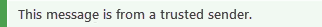

# Safety tips in email messages

[!INCLUDE [Microsoft 365 Defender rebranding](../includes/microsoft-defender-for-office.md)]

**Applies to**
- [Exchange Online Protection](exchange-online-protection-overview.md)
- [Microsoft Defender for Office 365 plan 1 and plan 2](defender-for-office-365.md)
- [Microsoft 365 Defender](../defender/microsoft-365-defender.md)

Exchange Online Protection (EOP) and Microsoft 365 protect you with spam, phishing, and malware prevention. Today, some of these attacks are so well crafted that they look legitimate. Sending messages to the Junk Email folder isn't always enough. Now, when you check your email in Outlook or Outlook on the web or any email client, EOP automatically checks the sender and adds a safety tip to the top of the email.

Safety tips in Outlook do not depend on what version of Outlook you're using because the safety tip is cracked open and inserted directly into the message body. This means that the safety tip will show up in whatever email client you're using. It's done at the email filter level and not rendered at the mail client level, so not only does it show up in any version of Outlook, it also shows up in any email client.

The safety tip -- a color-coded message -- will warn you about potentially harmful messages. Most messages in your inbox won't have a safety tip. You'll only see them when EOP and Microsoft 365 have information you need to help prevent spam, phishing, and malware attacks. If safety tips do show up on in your inbox, you can use the following examples to learn more about each type of safety tip.

- Suspicious mail (red safety tip).

    

    A red safety tip in an email means that the message you received contains something suspicious, such as a phishing scam. We recommend that you delete this kind of email message from your inbox without opening it.

- Safe mail (green safety tip).

    

    In addition to unsafe messages, we'll also tell you about valid messages from senders we trust with a green safety tip. A green safety tip in an email means that we checked the sender of the message and verified that it's safe. Microsoft maintains this list of trusted senders which includes financial organizations and others that are frequently spoofed or impersonated.

## Working with safety tips

Admins can turn safety tips on or off in anti-spam policies. For more information, see [Configure anti-spam policies in Office 365](configure-your-spam-filter-policies.md).

If you disagree with how EOP categorized a message (that is, the message is not spam or it should have been marked as spam), you can submit the messages to Microsoft for analysis to help make your experience better. For instructions, see [Report messages and files to Microsoft](report-junk-email-messages-to-microsoft.md). You can also click on the Feedback link in the safety tip to submit comments directly to Microsoft to help us improve.
