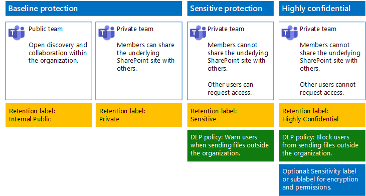

# Secure files in Microsoft Teams

This article provides recommendations for configuring teams in Microsoft Teams and their underlying SharePoint sites for file protection that balances security with ease of collaboration. This article defines four different configurations, starting with a public site within your organization with the most open sharing policies. Each additional configuration represents a meaningful step up in protection, but the ability to access and collaborate on files stored within Teams is reduced to the relevant set of team members. Use these recommendations as a starting point and adjust the configurations to meet the needs of your organization.

The configurations in this article align with Microsoft's recommendations for three tiers of protection for data, identities, and devices:

- Baseline protection

- Sensitive protection

- Highly confidential protection

For more information about these tiers and capabilities recommended for each tier, see the following resources.

- [Identity and Device Protection for Office 365](https://docs.microsoft.com/office365/enterprise/microsoft-cloud-it-architecture-resources#identity-and-device-protection-for-office-365)

- [File Protection Solutions in Office 365](https://docs.microsoft.com/office365/enterprise/microsoft-cloud-it-architecture-resources#file-protection-solutions-in-office-365)

## Capability overview

Recommendations for secured teams draw on a variety of Microsoft 365 capabilities. The following illustration shows the recommended configurations.

As illustrated:

- Baseline protection includes a public team and private team. Public teams can be discovered and accessed by anybody in the organization. Private teams can only be discovered and accessed by members of the team. Both of these configurations allow for sharing of the underlying SharePoint site on which files are stored outside the team group.

- Teams for sensitive and highly confidential protection are private teams in which sharing and the requesting of access for the underlying site is limited.

- [Retention labels](../../compliance/labels.md) provide a way to classify files within the underlying SharePoint sites. Each of the underlying SharePoint sites are configured to automatically label files in document libraries with a default retention label. Corresponding to the four team configurations, the labels in this example are Internal Public, Private, Sensitive, and Highly Confidential. Users can change the labels on the individual files, but this configuration ensures all files receive a default label.

- [Data loss prevention](../../compliance/data-loss-prevention-policies.md) (DLP) policies are configured for the Sensitive and Highly Confidential retention labels to either warn or prevent users when they attempt to send these types of files outside the organization.

- If needed for your scenario, you can use [sensitivity labels](../../compliance/sensitivity-labels.md) to protect highly confidential files with encryption and permissions. For Azure Information Protection customers, you can use your Azure Information Protection labels in the Microsoft 365 compliance center, and your labels will be synced with the Azure portal in case you choose to perform additional or advanced configuration. Azure Information Protection labels and Office 365 sensitivity labels are fully compatible with each other. This means, for example, if you have content labeled by Azure Information Protection, you won't need to reclassify or relabel your content. Not all customers need this level of protection.

## Organization-wide settings for SharePoint and OneDrive

SharePoint and OneDrive include organization-wide settings that affect all sites and users. Some of these settings can also be adjusted at the site level to be more restrictive (but not less). This section discusses tenant-wide settings that affect security and collaboration.

### Sharing

For this solution, we recommend the following organization-wide settings:

- Keep the default sharing policy that allows all sharing with all account types, including anonymous sharing.

- Set anonymous links to expire, if desired.

- Change the default link type for sharing to Internal. This helps prevent accidental data leakage outside your organization.

While it might seem counterintuitive to allow external sharing, this approach provides more control over file sharing compared to sending files in email. SharePoint and Outlook work together to provide secure collaboration on files.

- By default, Outlook shares a link to a file instead of sending the file in email.

- SharePoint and OneDrive make it easy to share links to files with contributors who are both inside and outside your organization

You also have controls to help govern external sharing. For example, you can:

- Disable an anonymous guest link.

- Revoke user access to a site.

- See who has access to a specific site or document.

- Set anonymous sharing links to expire (tenant setting).

- Limit who can share outside your organization (tenant setting).

### Use external sharing together with data loss prevention (DLP)

If you don't allow external sharing, users with a business need will find alternate tools and methods. Microsoft recommends you combine external sharing with DLP policies to protect sensitive and highly confidential files.

### Device access settings

Device access settings for SharePoint and OneDrive let you determine whether access is limited to browser only (files can't be downloaded) or if access is blocked. For more information, see [Control access from unmanaged devices](https://docs.microsoft.com/sharepoint/control-access-from-unmanaged-devices).

To use device access settings with recommended conditional access policies in Azure Active Directory, see [Policy recommendations for securing SharePoint sites and files](https://docs.microsoft.com/microsoft-365/enterprise/sharepoint-file-access-policies).

Visit these settings to decide if you want to change the default settings for OneDrive sites. Currently, the sharing and device access settings are duplicated from the SharePoint admin center and apply to both environments.

## Team and SharePoint site configuration

The following table summarizes the configuration for each of the teams and their underlying SharePoint site described earlier in this article. Use these configurations as starting point recommendations and adjust the site types and configurations to meet the needs of your organization. Not every organization needs every type of team. Only a small number of organizations require teams with highly confidential protection.

||||||
|:-----|:-----|:-----|:-----|:-----|
||**Baseline protection #1**|**Baseline protection #2**|**Sensitive protection**|**Highly confidential**|
|Description|Public team with open discovery and collaboration within the organization.|Private team with sharing of the underlying SharePoint site allowed outside the group.|Private team, but sharing of the underlying SharePoint site is only allowed to members of the site. DLP warns users when attempting to send files outside the organization.|Private team with sensitivity labels for file encryption and permissions that travel with the file. DLP prevents users from sending files outside the organization.|
|Private or public team site|Public|Private|Private|Private|
|Who has access?|Everybody in the organization, including B2B users.|Members of the site only. Others can request access.|Members of the team only. Others can request access to the underlying site, which is approved by a team owner.|Members only. Others cannot request access to the underlying site.|
|Site-level sharing controls|Sharing allowed with anybody. Default settings.|Sharing allowed with anybody. Default settings.|Members cannot share access to the site.   Non-members can request access to the site, but these requests need to be addressed by a group owner for the team.|Members cannot share access to the site.   Non-members cannot request access to the site or its contents.|
|Site-level device access controls|No additional controls.|No additional controls.|Prevents users from downloading files to non-compliant or non-domain joined devices. This allows browser-only access from all other devices.|Block downloading of files to non-compliant or non-domain joined devices.|
|Retention labels|Internal Public|Private|Sensitive|Highly Confidential|
|DLP policies|||Warn users when sending files that are labeled as Sensitive outside the organization.   To block external sharing of sensitive data types, such as credit card numbers or other personal data, you can configure additional DLP policies for these data types (including custom data types you configure).|Block users from sending files that are labeled as highly confidential outside organization. Allow users to override this by providing justification, including who they are sharing the file with.|
|Sensitivity labels||||Use sensitivity labels to encrypt and grant permissions to files. This protection travels with the files in case they are leaked from the underlying SharePoint site.|

For the steps to deploy the four different types of teams in this solution, see [Deploy teams for three tiers of protection for files](deploy-teams-three-tiers.md).

## Office 365 retention labels

Using retention labels is recommended for environments with sensitive data. After you configure and publish retention labels:

- You can apply a default label to a document library in the underlying SharePoint site for a team, so that all documents in the **Files** section of the team get the default label.

- You can apply labels to content automatically if it matches specific conditions.

- You can apply DLP policies that are based on retention labels.

- People in your organization can apply a label manually to content in Outlook on the web, Outlook 2010 and later, OneDrive, SharePoint, and Office 365 groups. Users often know best what type of content they're working with, so they can classify it and have the appropriate DLP policy applied.

As illustrated, this solution includes creating the following retention labels:

- Highly Confidential

- Sensitive

- Private

- Internal Public

These labels are mapped to the recommended sites in the illustrations and charts earlier in this article. This solution recommends configuring DLP policies to help prevent the leakage of files labeled as Sensitive and Highly Confidential.

For the steps to configure retention labels and DLP policies in this solution, see [Protect files in teams with retention labels and DLP](deploy-teams-retention-DLP.md).

## Sensitivity labels

If warranted for your security scenario, you can use sensitivity labels to apply protections that follow the files wherever they go. Sensitivity labels in the Microsoft 365 compliance center and Azure Information Protection labels are the same. For this solution, we recommend you use a sensitivity label or sublabel to encrypt and grant permissions to files that need to be protected with the highest level of security.

For more information, see [Overview of sensitivity labels](../../compliance/sensitivity-labels.md).

For the steps to configure sensitivity labels in this solution, see [Protect files in teams with sensitivity labels](deploy-teams-sensitivity-labels.md).

## See also

[Cloud adoption and hybrid solutions](https://docs.microsoft.com/office365/enterprise/cloud-adoption-and-hybrid-solutions)
