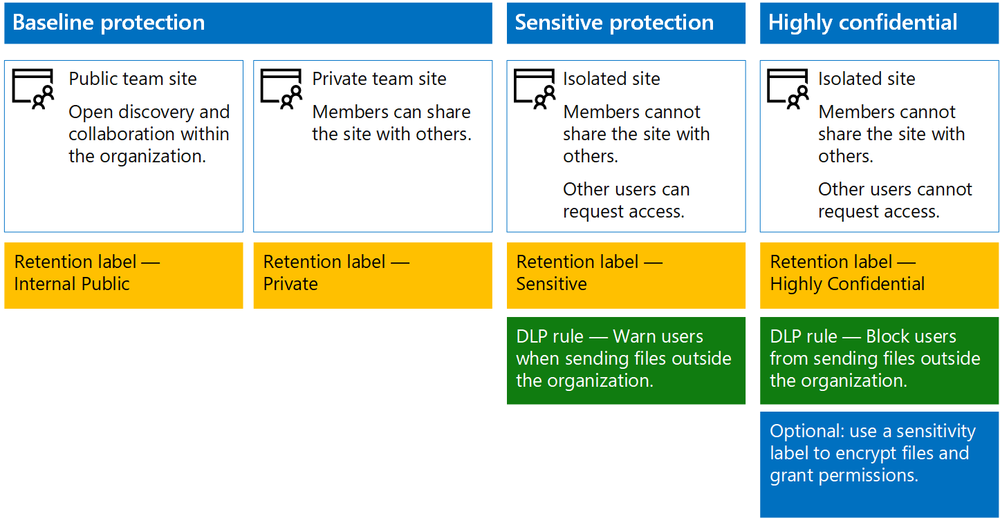

# Secure SharePoint Online sites and files

This article provides recommendations for configuring SharePoint Online team sites and file protection that balances security with ease of collaboration. This article defines four different configurations, starting with a public site within your organization with the most open sharing policies. Each additional configuration represents a meaningful step up in protection, but the ability to access and collaborate on resources is reduced to the relevant set of users. Use these recommendations as a starting point and adjust the configurations to meet the needs of your organization.

The configurations in this article align with Microsoft's recommendations for three tiers of protection for data, identities, and devices:

- Baseline protection

- Sensitive protection

- Highly confidential protection

For more information about these tiers and capabilities recommended for each tier, see the following resources.

- [Identity and Device Protection for Office 365](https://docs.microsoft.com/office365/enterprise/microsoft-cloud-it-architecture-resources#identity-and-device-protection-for-office-365)

- [File Protection Solutions in Office 365](https://docs.microsoft.com/office365/enterprise/microsoft-cloud-it-architecture-resources#file-protection-solutions-in-office-365)

## Capability overview

Recommendations for SharePoint Online team sites draw on a variety of Microsoft 365 capabilities. The following illustration shows the recommended configurations for four SharePoint Online team sites.

As illustrated:

- Baseline protection includes two options for SharePoint Online team sites — a public site and private site. Public sites can be discovered and accessed by anybody in the organization. Private sites can only be discovered and accessed by members of the site. Both of these site configurations allow for sharing outside the group.

- Sites for sensitive and highly confidential protection are private sites with access limited only to members of specific groups.

- [Retention labels](../../compliance/labels.md) provide a way to classify files within the sites. Each of the SharePoint Online team sites are configured to automatically label files in document libraries with a default retention label for the site. Corresponding to the four site configurations, the labels in this example are Internal Public, Private, Sensitive, and Highly Confidential. Users can change the labels, but this configuration ensures all files receive a default label.

- [Data loss prevention](../../compliance/data-loss-prevention-policies.md) (DLP) policies are configured for the Sensitive and Highly Confidential retention labels to either warn or prevent users when they attempt to send these types of files outside the organization.

- If needed for your scenario, you can use [sensitivity labels](../../compliance/sensitivity-labels.md) to protect highly confidential files with encryption and permissions. For Azure Information Protection customers, you can use your Azure Information Protection labels in the Microsoft 365 compliance center, and your labels will be synced with the Azure portal in case you choose to perform additional or advanced configuration. Azure Information Protection labels and Office 365 sensitivity labels are fully compatible with each other. This means, for example, if you have content labeled by Azure Information Protection, you won't need to reclassify or relabel your content. Not all customers need this level of protection.

## Tenant-wide settings for SharePoint Online and OneDrive for Business

SharePoint Online and OneDrive for Business include tenant-wide settings that affect all sites and users. Some of these settings can also be adjusted at the site level to be more restrictive (but not less). This section discusses tenant-wide settings that affect security and collaboration.

### Sharing

For this solution, we recommend the following tenant-wide settings:

- Keep the default sharing policy that allows all sharing with all account types, including anonymous sharing.

- Set anonymous links to expire, if desired.

- Change the default link type for sharing to Internal. This helps prevent accidental data leakage outside your organization.

While it might seem counterintuitive to allow external sharing, this approach provides more control over file sharing compared to sending files in email. SharePoint Online and Outlook work together to provide secure collaboration on files.

- By default, Outlook shares a link to a file instead of sending the file in email.

- SharePoint Online and OneDrive for Business make it easy to share links to files with contributors who are both inside and outside your organization

You also have controls to help govern external sharing. For example, you can:

- Disable an anonymous guest link.

- Revoke user access to a site.

- See who has access to a specific site or document.

- Set anonymous sharing links to expire (tenant setting).

- Limit who can share outside your organization (tenant setting).

### Use external sharing together with data loss prevention (DLP)

If you don't allow external sharing, users with a business need will find alternate tools and methods. Microsoft recommends you combine external sharing with DLP policies to protect sensitive and highly confidential files.

### Device access settings

Device access settings for SharePoint Online and OneDrive for Business let you determine whether access is limited to browser only (files can't be downloaded) or if access is blocked. For more information, see [Control access from unmanaged devices](https://docs.microsoft.com/sharepoint/control-access-from-unmanaged-devices).

To use device access settings with recommended conditional access policies in Azure Active Directory, see [Policy recommendations for securing SharePoint sites and files](https://docs.microsoft.com/microsoft-365/enterprise/sharepoint-file-access-policies).

### OneDrive for Business

Visit these settings to decide if you want to change the default settings for OneDrive for Business sites. Currently, the sharing and device access settings are duplicated from the SharePoint Online admin center and apply to both environments.

## SharePoint team site configuration

The following table summarizes the configuration for each of the team sites described earlier in this article. Use these configurations as starting point recommendations and adjust the site types and configurations to meet the needs of your organization. Not every organization needs every type of site. Only a small number of organizations require highly confidential protection.

||||||
|:-----|:-----|:-----|:-----|:-----|
||**Baseline protection #1**|**Baseline protection #2**|**Sensitive protection**|**Highly confidential**|
|Description|Open discovery and collaboration within the organization.|Private site and group with sharing allowed outside the group.|Private site with sharing allowed only to members of the site. DLP warns users when attempting to send files outside the organization.|Private site and file encryption and permissions with sensitivity labels. DLP prevents users from sending files outside the organization.|
|Private or public team site|Public|Private|Private|Private|
|Who has access?|Everybody in the organization, including B2B users and guest users.|Members of the site only. Others can request access.|Members of the site only. Others can request access.|Members only. Others cannot request access.|
|Site-level sharing controls|Sharing allowed with anybody. Default settings.|Sharing allowed with anybody. Default settings.|Members cannot share access to the site.   Non-members can request access to the site, but these requests need to be addressed by a site administrator.|Members cannot share access to the site.   Non-members cannot request access to the site or contents.|
|Site-level device access controls|No additional controls.|No additional controls.|Prevents users from downloading files to non-compliant or non-domain joined devices. This allows browser-only access from all other devices.|Block downloading of files to non-compliant or non-domain joined devices.|
|Retention labels|Internal Public|Private|Sensitive|Highly Confidential|
|DLP policies|||Warn users when sending files that are labeled as Sensitive outside the organization.   To block external sharing of sensitive data types, such as credit card numbers or other personal data, you can configure additional DLP policies for these data types (including custom data types you configure).|Block users from sending files that are labeled as highly confidential outside organization. Allow users to override this by providing justification, including who they are sharing the file with.|
|Sensitivity labels||||Use sensitivity labels to automatically encrypt and grant permissions to files. This protection travels with the files in case they are leaked.   Office 365 cannot read files encrypted with sensitivity labels. Additionally, DLP policies can only work with the metadata (including labels) but not the contents of these files (such as credit card numbers within files).|

For the steps to deploy the four different types of SharePoint Online team sites in this solution, see [Deploy SharePoint Online sites for three tiers of protection](../../compliance/deploy-sharepoint-online-sites-for-three-tiers-of-protection.md).

## Office 365 retention labels

Using retention labels is recommended for environments with sensitive and highly confidential data. After you configure and publish retention labels:

- You can apply a default label to a document library in a SharePoint Online team site, so that all documents in that library get the default label.

- You can apply labels to content automatically if it matches specific conditions.

- You can apply DLP policies that are based on retention labels.

- People in your organization can apply a label manually to content in Outlook on the web, Outlook 2010 and later, OneDrive for Business, SharePoint Online, and Office 365 groups. Users often know best what type of content they're working with, so they can classify it and have the appropriate DLP policy applied.

As illustrated, this solution includes creating the following retention labels:

- Highly Confidential

- Sensitive

- Private

- Internal Public

These labels are mapped to the recommended sites in the illustrations and charts earlier in this article. This solution recommends configuring DLP policies to help prevent the leakage of files labeled as Sensitive and Highly Confidential.

For the steps to configure retention labels and DLP policies in this solution, see [Protect SharePoint Online files with retention labels and DLP](../../compliance/protect-sharepoint-online-files-with-office-365-labels-and-dlp.md).

## Sensitivity labels

If warranted for your security scenario, you can use sensitivity labels to apply protections that follow the files wherever they go. Sensitivity labels in the Microsoft 365 compliance center and Azure Information Protection labels are the same. For this solution, we recommend you use a sensitivity label or a sub-label of the Highly Confidential sensitivity label to encrypt and grant permissions to files that need to be protected with the highest level of security.

Be aware that when sensitivity label encryption is applied to files stored in Office 365, the service cannot process the contents of these files. Co-authoring, eDiscovery, search, Delve, and other collaborative features do not work. DLP policies can only work with the metadata (including retention labels) but not the contents of these files (such as credit card numbers within files).

For more information, see [Overview of sensitivity labels](../../compliance/sensitivity-labels.md).

### Adding permissions for external users

There are two ways you can grant external users access to files protected with a sensitivity label. In both these cases, external users must have an Azure AD account. If external users aren't members of an organization that uses Azure AD, they can obtain an Azure AD account as an individual by using this sign-up page: [https://aka.ms/aip-signup](https://aka.ms/aip-signup).

- Add external users to an Azure AD group that is used to configure protection for a label

  You'll need to first add the account as a B2B user in your directory. It can take a couple of hours for [group membership caching by Azure Rights Management](https://docs.microsoft.com/information-protection/plan-design/prepare). With this method, permissions are granted to all existing files protected with the label (even files protected before a user is added to the Azure AD group).

- Add external users directly to the label protection

  You can add all users from an organization (e.g. Fabrikam.com), an Azure AD group (such as a finance group within an organization), or an individual user. For example, you can add an external team of regulators to the protection for a label. With this method, permissions are granted only to files protected with the label after the external entity is added to the protection.

### Deploying and using a sensitivity label

For the steps to configure a sensitivity label in this solution, see [Protect SharePoint Online files with a sensitivity label](../../compliance/protect-sharepoint-online-files-with-sensitivity-label.md).

## Next step

Build this out as a proof-of-concept with [Secure SharePoint Online sites in a dev/test environment](secure-sharepoint-online-sites-in-a-dev-test-environment.md).

## See Also

[Microsoft Security Guidance for Political Campaigns, Nonprofits, and Other Agile Organizations](microsoft-security-guidance-for-political-campaigns-nonprofits-and-other-agile-o.md)

[Cloud adoption and hybrid solutions](https://docs.microsoft.com/office365/enterprise/cloud-adoption-and-hybrid-solutions)
