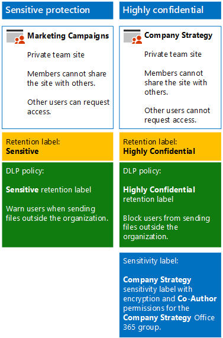

# Secure SharePoint Online sites in a dev/test environment

This article provides step-by-step instructions to create a dev/test environment that includes the sensitive and highly confidential SharePoint sites for the [Secure SharePoint Online sites and files](secure-sharepoint-online-sites-and-files.md) solution.



Use this dev/test environment to experiment and fine-tune settings for your specific needs before deploying these types of team sites in production.

## Phase 1: Build out your Microsoft 365 Enterprise test environment

If you just want to test sensitive and highly confidential team sites in a lightweight way with the minimum requirements, follow the instructions in [Lightweight base configuration](https://docs.microsoft.com/microsoft-365/enterprise/lightweight-base-configuration-microsoft-365-enterprise).

If you want to test sensitive and highly confidential team sites in a simulated enterprise, follow the instructions in [Password hash synchronization](https://docs.microsoft.com/microsoft-365/enterprise/password-hash-sync-m365-ent-test-environment).

> [!NOTE]
> Testing sensitive and highly confidential team sites does not require the simulated enterprise test environment, which includes a simulated intranet connected to the Internet and directory synchronization for an Active Directory Domain Services (AD DS) forest. It is provided here as an option so that you can test sensitive and highly confidential team sites and experiment with it in an environment that represents a typical organization.

## Phase 2: Create and configure your Azure Active Directory (AD) groups and users

In this phase, you create and configure the Azure AD groups and users for your fictional organization.

First, create two groups for a typical organization with the Azure portal.

1. Create a separate tab in your browser, and then go to the Azure portal at [https://portal.azure.com](https://portal.azure.com). If needed, sign in with the credentials of the global administrator account for your Microsoft 365 E5 trial or paid subscription.

2. In the Azure portal, click **Azure Active Directory > Groups**.

3. On the **Groups - All groups** blade, click **+ New group**.

4. On the **Group** blade:

   - Select **Security** in **Group type**.

   - Type **C-Suite** in **Name**.

   - Select **Assigned** in **Membership type**.

5. Click **Create**, and then close the **Group** blade.

6. Repeat steps 3-5 for a new group named **Marketing staff**.

Next, you configure automatic licensing so that members of your groups are automatically assigned licenses for your Office 365 and EMS subscriptions.

1. In the Azure portal, click **Azure Active Directory > Licenses > All products**.

2. In the list, select **Microsoft 365 Enterprise E5**, and then click **Assign**.

3. In the **Assign license** blade, click **Users and groups**.

4. In the list of groups, select the following:

   - C-Suite

   - Marketing staff

5. Click **Select**, and then click **Assign**.

6. Close the Azure portal tab in your browser.

Next, you [Connect with the Azure Active Directory PowerShell for Graph module
](https://docs.microsoft.com/office365/enterprise/powershell/connect-to-office-365-powershell#connect-with-the-azure-active-directory-powershell-for-graph-module).

Fill in your organization name, your location, and a common password, and then run these commands from the PowerShell command prompt or Integrated Script Environment (ISE) to create user accounts and add them to their groups:

```powershell
$orgName="<organization name, such as contoso for the contoso.onmicrosoft.com trial subscription domain name>"
$location="<the ISO ALPHA2 country code, such as US for the United States>"
$commonPassword="<common password for all the new accounts>"

$PasswordProfile=New-Object -TypeName Microsoft.Open.AzureAD.Model.PasswordProfile
$PasswordProfile.Password=$commonPassword

$groupName="C-Suite"
$userNames=@("CEO","CFO","CIO")
$groupID=(Get-AzureADGroup | Where { $_.DisplayName -eq $groupName }).ObjectID
ForEach ($element in $userNames){
New-AzureADUser -DisplayName $element -PasswordProfile $PasswordProfile -UserPrincipalName ($element + "@" + $orgName + ".onmicrosoft.com") -AccountEnabled $true -MailNickName $element -UsageLocation $location
Add-AzureADGroupMember -RefObjectId (Get-AzureADUser | Where { $_.DisplayName -eq $element }).ObjectID -ObjectId $groupID
}
$groupName="Marketing staff"
$userNames=@("Marketing1", "Marketing2")
$groupID=(Get-AzureADGroup | Where { $_.DisplayName -eq $groupName }).ObjectID
ForEach ($element in $userNames){
New-AzureADUser -DisplayName $element -PasswordProfile $PasswordProfile -UserPrincipalName ($element + "@" + $orgName + ".onmicrosoft.com") -AccountEnabled $true -MailNickName $element -UsageLocation $location
Add-AzureADGroupMember -RefObjectId (Get-AzureADUser | Where { $_.DisplayName -eq $element }).ObjectID -ObjectId $groupID
}
```

> [!NOTE]
> The use of a common password here is for automation and ease of configuration for a dev/test environment. Obviously, this is highly discouraged for production subscriptions.

Use these steps to verify that group-based licensing is working correctly.

1. From the **Microsoft Office Home** tab of your browser, click the **Admin** tile.

2. From the new **Microsoft 365 admin center** tab of your browser, click **Users**.

3. In the list of users, click **CEO**.

4. In the pane that lists the properties of the **CEO** user account, verify that it has been assigned the **Microsoft 365 Enterprise E5** license (in **Product licenses**).

## Phase 3: Create Office 365 retention labels

In this phase, you create the retention labels for documents in your SharePoint team sites.

1. Sign in to the [Microsoft 365 compliance portal](https://compliance.microsoft.com) with your global admin account.

2. From the **Home - Microsoft 365 compliance** tab of your browser, click **Classifications > Labels**.

3. Click **Retention labels > Create a label**.

4. On the **Name your label** pane, type **Sensitive** in **Name your label**, and then click **Next**.

5. On the **File plan descriptors** pane, click **Next**.

6. On the **Label settings** pane, if needed, set **Retention** to **On**, and then click **Next**.

7. On the **Review your settings** pane, click **Create the label**.

8. Repeat steps 3-7 for an additional retention label named **Highly Confidential**.

9. From the **Home > Labels** pane, click **Publish labels**.

10. On the **Choose labels to publish** pane, click **Choose labels to publish**.

11. On the **Choose labels** pane, click **Add** and select all four labels.

12. Click **Done**.

13. On the **Choose labels to publish** pane, click **Next**.

14. On the **Choose locations** pane, click **Next**.

15. On the **Name your policy** pane, type **Example organization** in **Name**, and then click **Next**.

16. On the **Review your settings** pane, click **Publish labels**, and then click **Close**.

## Phase 4: Create your team sites

In this phase, you create and configure sensitive and highly confidential team sites for your example organization.

### Sensitive team site for marketing campaigns

First, create a sensitive-level team site for members of the marketing group to collaborate on ongoing marketing campaigns.

1. [Create a new private team site](https://support.office.com/article/ef10c1e7-15f3-42a3-98aa-b5972711777d) with the name **Marketing Campaigns**.

2. In the tool bar of the SharePoint team site, click the settings icon, and then click **Site permissions**.

3. In the **Site permissions** pane, under **Sharing Settings**, click **Change sharing settings**.

4. Under **Sharing permissions**, choose **Only site owners can share files, folders, and the site**, and then click **Save**.

Next, configure the documents folder of the Marketing Campaigns SharePoint team site for the Sensitive retention label.

1. In the **Marketing Campaigns-Home** tab of your browser, click **Documents**.

2. Click the settings icon, and then click **Library settings**.

3. Under **Permissions and Management**, click **Apply label to items in this library**.

4. In **Settings-Apply Label**, select **Sensitive**, and then click **Save**.

Next, configure a data loss prevention (DLP) policy that notifies users when they share a document with the Sensitive label, which includes documents in the Marketing Campaigns site, outside the organization.

1. Sign in to the [Microsoft 365 compliance portal](https://compliance.microsoft.com/) with your global admin account.

2. On the new **Microsoft 365 compliance** tab in your browser, click **Policies > Data loss prevention**.

3. In the **Home > Data loss prevention** pane, click **Create a policy**.

4. In the **Start with a template or create a custom policy** pane, click **Custom**, and then click **Next**.

5. In the **Name your policy** pane, type **Sensitive label SharePoint sites** in **Name**, and then click **Next**.

6. In the **Choose locations** pane, click **Let me choose specific locations**, and then click **Next**.

7. In the list of locations, disable the **Exchange email**, **OneDrive accounts**, and **Teams chat and channel messages** locations, and then click **Next**.

8. In the **Customize the type of content you want to protect** pane, click **Edit**.

9. In the **Choose the types of content to protect** pane, click **Add** in the drop-down box, and then click **Retention labels**.

10. In the **Retention labels** pane, click **Add**, select the **Sensitive** label, click **Add**, and then click **Done**.

11. In the **Choose the types of content to protect** pane, click **Save**.

12. In the **Customize the type of content you want to protect** pane, click **Next**.

13. In the **What do you want to do if we detect sensitive info?** pane, click **Customize the tip and email**.

14. In the **Customize policy tips and email notifications** pane, click **Customize the policy tip text**.

15. In the text box, type or paste in the following:

    To share with a user outside the organization, download the file and then open it. Click File, then Protect Document, and then Encrypt with Password, and then specify a strong password. Send the password in a separate email or other means of communication.

16. Click **OK**.

17. In the **What do you want to do if we detect sensitive info?** pane, click **Next**.

18. In the **Do you want to turn on the policy or test things out first?** pane, click **Yes, turn it on right away**, and then click **Next**.

19. In the **Review your settings** pane, click **Create**, and then click **Close**.

### Company strategy team site

First, create a highly confidential-level team site for the senior leadership team to collaborate on company strategy.

1. [Create a new private team site](https://support.office.com/article/ef10c1e7-15f3-42a3-98aa-b5972711777d) with the name **Company Strategy**.
2. In the tool bar of the SharePoint team site, click the settings icon, and then click **Site permissions**.

3. In the **Site permissions** pane, under **Sharing Settings**, click **Change sharing settings**.

4. Under **Sharing permissions**, choose **Only site owners can share files, folders, and the site**.

5. Turn off **Allow access requests**, and then click **Save**.

Next, configure the documents folder of the Company Strategy SharePoint team site for the Highly Confidential label.

1. In the **Company Strategy-Home** tab of your browser, click **Documents**.

2. Click the settings icon, and then click **Library settings**.

3. Under **Permissions and Management**, click **Apply label to items in this library**.

4. In **Settings-Apply Label**, select **Highly Confidential**, and then click **Save**.

Next, configure a DLP policy that blocks users when they share a document with the Highly Confidential label, which includes documents in the Company Strategy site, outside the organization.

1. Sign in to the [Microsoft 365 compliance portal](https://compliance.microsoft.com/) with your global admin.

2. On the new **Microsoft 365 compliance** tab in your browser, click **Policies > Data loss prevention**.

3. In the **Home > Data loss prevention** pane, click **Create a policy**.

4. In the **Start with a template or create a custom policy** pane, click **Custom**, and then click **Next**.

5. In the **Name your policy** pane, type **Highly Confidential label SharePoint sites** in **Name**, and then click **Next**.

6. In the **Choose locations** pane, click **Let me choose specific locations**, and then click **Next**.

7. In the list of locations, disable the **Exchange email**, **OneDrive accounts**, and **Teams chat and channel messages** locations, and then click **Next**.

8. In the **Customize the type of content you want to protect** pane, click **Edit**.

9. In the **Choose the types of content to protect** pane, click **Add** in the drop-down box, and then click **Retention labels**.

10. In the **Retention labels** pane, click **Add**, select the **Highly Confidential** label, click **Add**, and then click **Done**.

11. In the **Choose the types of content to protect** pane, click **Save**.

12. In the **Customize the type of content you want to protect** pane, click **Next**.

13. In the **What do you want to do if we detect sensitive info?** pane, click **Customize the tip and email**.

14. In the **Customize policy tips and email notifications** pane, click **Customize the policy tip text**.

15. In the text box, type or paste in the following:

    To share with a user outside the organization, download the file and then open it. Click File, then Protect Document, and then Encrypt with Password, and then specify a strong password. Send the password in a separate email or other means of communication.

16. Click **OK**.

17. In the **Do you want to turn on the policy or test things out first?** pane, click **Yes, turn it on right away**, and then click **Next**.

18. In the **Do you want to turn on the policy or test things out first?** pane, click **Yes, turn it on right away**, and then click **Next**.

19. In the **Review your settings** pane, click **Create**, and then click **Close**.

Use [these instructions](https://docs.microsoft.com/microsoft-365/compliance/encryption-sensitivity-labels) to configure a sensitivity label with the following settings:

- The name of the label is Company Strategy

- Encryption is enabled

- The Company Strategy group has Co-Author permissions

After creating, publish the new label. If you sign in as a member of the Company Strategy group, you will see the new label in the Sensitivity option in the Home toolbar of Word, Excel, and PowerPoint. Select the Company Strategy label from the Sensitivity option to assign the label to a file.

Files in the documents section of the Company Strategy SharePoint team site are assigned the Highly confidential retention label and are subject to the configured DLP policy. Files can also have the Company Strategy sensitivity label assigned.

Here is the resulting configuration for the Marketing Campaigns and Company Strategy team sites.


## Next step

When you are ready for production deployment of secure SharePoint Online sites, see [Secure SharePoint Online sites and files](secure-sharepoint-online-sites-and-files.md) for detailed information and links to step-by-step deployment articles.

## See Also

[Secure SharePoint Online sites and files](secure-sharepoint-online-sites-and-files.md)

[Cloud adoption and hybrid solutions](https://docs.microsoft.com/office365/enterprise/cloud-adoption-and-hybrid-solutions)

[Microsoft Security Guidance for Political Campaigns, Nonprofits, and Other Agile Organizations](microsoft-security-guidance-for-political-campaigns-nonprofits-and-other-agile-o.md)
