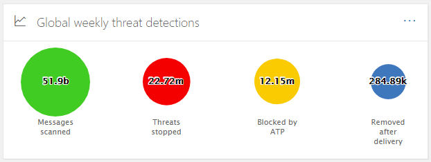
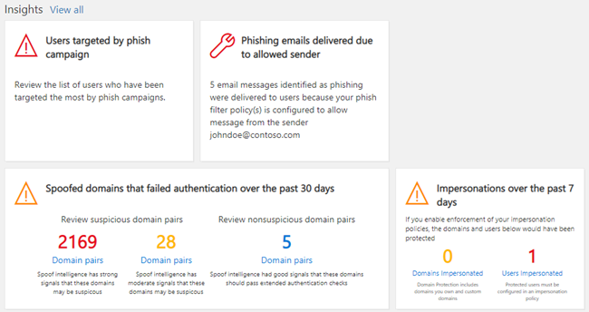
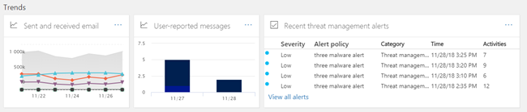

# Security Dashboard

[!INCLUDE [Microsoft 365 Defender rebranding](../includes/microsoft-defender-for-office.md)]

## Basic functions and how to open Security Dashboard

The [Security & Compliance Center](../../compliance/go-to-the-securitycompliance-center.md) enables your organization to manage data protection and compliance. Assuming you have the necessary permissions, the Security Dashboard enables you to review your Threat Protection Status, as well as view and act on security alerts.

Watch the video to get an overview, and then read this article to learn more.

> [!VIDEO https://www.microsoft.com/videoplayer/embed/RE1VV3o]

Depending on what your organization's subscription includes, the Security Dashboard includes several widgets, such as Threat Management Summary, Threat Protection Status, Global Weekly Threat Detections, Malware, and more, as described in the following sections.

To view the Security Dashboard, in the [Security & Compliance Center](../../compliance/go-to-the-securitycompliance-center.md), go to **Threat management** \> **Dashboard**.

> [!NOTE]
> You must be a global administrator, a security administrator, or a security reader to view the Security Dashboard. Some widgets require additional permissions to view. To learn more, see [Permissions in the Security & Compliance Center](permissions-in-the-security-and-compliance-center.md).

## Threat Management Summary

The Threat Management Summary widget tells you at a glance how your organization was protected from threats over the past seven (7) days.

The information you'll see in the Threat Management Summary depends on what you subscription includes. The following table describes what information is included for Office 365 E3 and Office 365 E5.

|Office 365 E3|Office 365 E5|
|---|---|
|Malware messages blocked Phishing messages blocked Messages reported by users    |Malware messages blocked Phishing messages blocked Messages reported by users Zero-day malware blocked Advanced phishing messages detected Malicious URLs blocked|

To view or access the Threat Management Summary widget, you must have permissions to view Defender for Office 365 reports. To learn more, see [What permissions are needed to view the Defender for Office 365 reports?](view-reports-for-atp.md#what-permissions-are-needed-to-view-the-defender-for-office-365-reports).

## Threat Protection Status

The Threat Protection Status widget shows threat protection effectiveness with a trending and detailed view of phish and malware.

The details depend on whether your Microsoft 365 subscription includes [Exchange Online Protection](exchange-online-protection-overview.md) (EOP) with or without [Microsoft Defender for Office 365](defender-for-office-365.md).

|If your subscription includes...|You'll see these details|
|---|---|
|EOP but not Microsoft Defender for Office 365|Malicious email that was detected and blocked by EOP.
 See [Threat Protection Status report (EOP)](view-email-security-reports.md#threat-protection-status-report).|
|Microsoft Defender for Office 365|Malicious content and malicious email detected and blocked by EOP and Defender for Office 365 
 Aggregated count of unique email messages with malicious content blocked by the anti-malware engine, [zero-hour auto purge](zero-hour-auto-purge.md), and Defender for Office 365 features (including [Safe Links](atp-safe-links.md), [Safe Attachments](atp-safe-attachments.md), and [Anti-phishing in Defender for Office 365](set-up-anti-phishing-policies.md#exclusive-settings-in-anti-phishing-policies-in-microsoft-defender-for-office-365)). 
 See [Threat protection status report](view-reports-for-atp.md#threat-protection-status-report).|

To view or access the Threat Protection Status widget, you must have permissions to view Defender for Office 365 reports. To learn more, see [What permissions are needed to view the Defender for Office 365 reports?](view-reports-for-atp.md#what-permissions-are-needed-to-view-the-defender-for-office-365-reports)

## Global Weekly Threat Detections

The Global Weekly Threat Detections widget shows how many threats were detected in email messages over the past seven (7) days.

The metrics are calculated as described in the following table:

|Metric|How it's calculated|
|---|---|
|Messages scanned|Number of email messages scanned multiplied by the number of recipients|
|Threats stopped|Number of email messages identified as containing malware multiplied by the number of recipients|
|Blocked by [Defender for Office 365 ](defender-for-office-365.md)|Number of email messages blocked by Defender for Office 365 multiplied by the number of recipients|
|Removed after delivery|Number of messages removed by [zero-hour auto purge](zero-hour-auto-purge.md) multiplied by the number of recipients|

## Malware

Malware widgets show details about malware trends and malware family types over the past seven (7) days.

## Insights

Insights not only surface key issues you should review, they also include recommendations and actions to consider.

For example, you might see that phishing email messages are being delivered because some users have disabled their junk mail options. To learn more about how insights work, see [Reports and insights in the Security & Compliance Center](reports-and-insights-in-security-and-compliance.md).

## Threat investigation and response

If your organization's subscription includes  [Microsoft Defender for Office 365 Plan 2](office-365-ti.md), your Security Dashboard has a section that includes advanced threat investigation and response tools. These tools include [automated investigation and response capabilities](automated-investigation-response-office.md). Automated investigation and response can be helpful in scenarios such as [addressing compromised user accounts quickly](address-compromised-users-quickly.md).

To learn more, see [Get started using Automated investigation and response (AIR) in Office 365](office-365-air.md).

## Trends

Near the bottom of the Security Dashboard is a **Trends** section, which summarizes email flow trends for your organization. Reports provide information about email categorized as spam, malware, phishing attempts, and good email. Click a tile to view more detailed information in the report.

And, if your organization's subscription includes [Defender for Office 365 Plan 2](office-365-ti.md), you will also have a **Recent threat management alerts** report in this section that enables your security team to view and take action on high-priority security alerts.

To view or access the Sent and Received Email widget, you must have permissions to view Defender for Office 365 reports. To learn more, see [What permissions are needed to view the Defender for Office 365 reports?](view-reports-for-atp.md#what-permissions-are-needed-to-view-the-defender-for-office-365-reports).

To view or access the Recent Threat Management Alerts widget, you must have permissions to view alerts. To learn more, see [RBAC permissions required to view alerts](../../compliance/alert-policies.md#rbac-permissions-required-to-view-alerts).

## Related topics

[View email security reports in the Security & Compliance Center](view-email-security-reports.md)

[View reports for Microsoft Defender for Office 365](view-reports-for-atp.md)

[Defender for Office 365](defender-for-office-365.md)

[Office 365 Threat investigation and response](office-365-ti.md)
