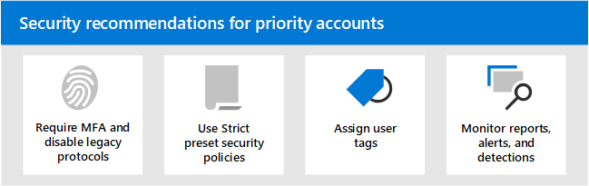

# Security recommendations for priority accounts in Microsoft 365

Not all user accounts have access to the same company information. Some accounts have access to sensitive information, such as financial data, product development information, partner access to critical build systems, and more. If compromised, accounts that have access to highly confidential information pose a serious threat. We call these types of accounts _priority accounts_. Priority accounts include (but aren't limited to) CEOs, CISOs, CFOs, infrastructure admin accounts, build system accounts, and more.

For attackers, ordinary phishing attacks that cast a random net for ordinary or unknown users are inefficient. On the other hand, _spear phishing_ or _whaling_ attacks that target priority accounts are very rewarding for attackers. So, priority accounts require stronger than ordinary protection to help prevent account compromise.

Microsoft 365 and Microsoft Defender for Office 365 contain several key features that provide additional layers of security for your priority accounts. This article describes these capabilities and how to use them.

****

|Task|All Office 365 Enterprise plans|Microsoft 365 E3|Microsoft 365 E5|
|---|:---:|:---:|:---:|
|[Increase sign-in security for priority accounts](#increase-sign-in-security-for-priority-accounts)||||
|[Use Strict preset security policies for priority accounts](#use-strict-preset-security-policies-for-priority-accounts)||||
|[Apply user tags to priority accounts](#apply-user-tags-to-priority-accounts)||||
|[Monitor priority accounts in alerts, reports, and detections](#monitor-priority-accounts-in-alerts-reports-and-detections)||||
|[Train users](#train-users)||||
|

## Increase sign-in security for priority accounts

Priority accounts require increased sign-in security. You can increase their sign-in security by requiring multi-factor authentication (MFA) and disabling legacy authentication protocols.

For instructions, see [Step 1. Increase sign-in security for remote workers with MFA](https://docs.microsoft.com/microsoft-365/solutions/empower-people-to-work-remotely-secure-sign-in). Although this article is about remote workers, the same concepts apply to priority users.

**Note**: We strongly recommend that you globally disable legacy authentication protocols for all priority users as described in the previous article. If your business requirements prevent you from doing so, Exchange Online offers the following controls to help limit the scope of legacy authentication protocols:

- You can use [authentication policies](https://docs.microsoft.com/exchange/clients-and-mobile-in-exchange-online/disable-basic-authentication-in-exchange-online) and [Client Access Rules](https://docs.microsoft.com/exchange/clients-and-mobile-in-exchange-online/client-access-rules/client-access-rules) in Exchange Online to block or allow Basic authentication and legacy authentication protocols like POP3, IMAP4, and authenticated SMTP for specific users.

- You can disable POP3 and IMAP4 access on individual mailboxes. You can disable authenticated SMTP at the organizational level and enable it on specific mailboxes that still require it. For instructions, see the following topics:
  - [Enable or Disable POP3 or IMAP4 access for a user](https://docs.microsoft.com/exchange/clients-and-mobile-in-exchange-online/pop3-and-imap4/enable-or-disable-pop3-or-imap4-access)
  - [Enable or disable authenticated client SMTP submission (SMTP AUTH)](https://docs.microsoft.com/exchange/clients-and-mobile-in-exchange-online/authenticated-client-smtp-submission)

It's also worth noting that Basic authentication is in the process of being deprecated in Exchange Online for Exchange Web Services (EWS), Exchange ActiveSync, POP3, IMAP4, and remote PowerShell. For details, see this [blog post](https://developer.microsoft.com/office/blogs/deferred-end-of-support-date-for-basic-authentication-in-exchange-online/).

## Use Strict preset security policies for priority accounts

Priority users require more stringent actions for the various protections that are available in Exchange Online Protection (EOP) and Defender for Office 365.

For example, instead of delivering messages that were classified as spam to the Junk Email folder, you should quarantine those same messages if they're intended for priority accounts.

You can implement this stringent approach for priority accounts by using the Strict profile in preset security policies.

Preset security policies are a convenient and central location to apply our recommended Strict policy settings for all of the protections in EOP and Defender for Office 365. For more information, see [Preset security policies in EOP and Microsoft Defender for Office 365](preset-security-policies.md).

For details about how the Strict policy settings differ from the the default and Standard policy settings, see [Recommended settings for EOP and Microsoft Defender for Office 365 security](recommended-settings-for-eop-and-office365-atp.md).

## Apply user tags to priority accounts

User tags in Microsoft Defender for Office 365 Plan 2 (as part of Microsoft 365 E5 or an add-on subscription) are a way to quickly identify and classify specific users or groups of users in reports and incident investigations.

**Priority accounts** is a type of built-in user tag (known as a _system tag_) that you can use to identify incidents and alerts that involve priority accounts. For more information about **priority accounts**, see [Manage and monitor priority accounts](https://docs.microsoft.com/microsoft-365/admin/setup/priority-accounts).

You can also create custom tags to further identify and classify your priority accounts. For more information, see [User tags](user-tags.md). Note that you can manage **priority accounts** (system tags) in the same interface as custom user tags.

## Monitor priority accounts in alerts, reports, and detections

After you secure and tag your priority users, you can use the available reports, alerts, and investigations in EOP and Defender for Office 365 to quickly identify incidents or detections that involve priority accounts. The features that support user tags are described in the following table.

 

****

|Feature|Description|
|---|---|
|Alerts|The user tags of affected users are visible and available as filters on the **View alerts** page in the Security & Compliance Center. For more information, see [Viewing alerts](https://docs.microsoft.com/microsoft-365/compliance/alert-policies#viewing-alerts).|
|Threat Explorer 
 Real-time detections|In **Threat Explorer** (Microsoft Defender for Office 365 Plan 2) or **Real-time detections** (Microsoft Defender for Office 365 Plan 1), user tags are visible in the Email grid view and the Email details flyout. User tags are also available as a filterable property. For more information, see  [Tags in Threat Explorer](threat-explorer.md#tags-in-threat-explorer).|
|Campaign Views|User tags are one of many filterable properties in Campaign Views in Microsoft Defender for Office 365 Plan 2. For more information, see [Campaign Views](campaigns.md).|
|Threat protection status report|In virtually all of the views and detail tables in the **Threat protection status report**, you can filter the results by **priority accounts**. For more information, see [Threat protection status report](view-email-security-reports.md#threat-protection-status-report).|
|Email issues for priority accounts report|The **Email issues for priority accounts** report in the Exchange admin center (EAC) contains information about undelivered and delayed messages for **priority accounts**. For more information, see [Email issues for priority accounts report](https://docs.microsoft.com/exchange/monitoring/mail-flow-reports/mfr-email-issues-for-priority-accounts-report).|
|

## Train users

Training users with priority accounts can help save those users and your security operations team much time and frustration. Savvy users are less likely to open attachments or click links in questionable email messages, and they are more likely to avoid suspicious websites.

The Harvard Kennedy School [Cybersecurity Campaign Handbook](https://www.belfercenter.org/CyberPlaybook) provides excellent guidance for establishing a strong culture of security awareness within your organization, including training users to identify phishing attacks.

Microsoft 365 provides the following resources to help inform users in your organization:

 

****

|Concept|Resources|Description|
|---|---|---|
|Microsoft 365|[Customizable learning pathways](https://docs.microsoft.com/office365/customlearning/)|These resources can help you put together training for users in your organization.|
|Microsoft 365 security|[Learning module: Secure your organization with built-in, intelligent security from Microsoft 365](https://docs.microsoft.com/learn/modules/security-with-microsoft-365)|This module enables you to describe how Microsoft 365 security features work together and to articulate the benefits of these security features.|
|Multi-factor authentication|[Two-step verification: What is the additional verification page?](https://docs.microsoft.com/azure/active-directory/user-help/multi-factor-authentication-end-user-first-time)|This article helps end users understand what multi-factor authentication is and why it's being used at your organization.|
|Attack simulation training|[Get started using Attack simulation training](attack-simulation-training-get-started.md)|Attack simulation training in Microsoft Defender for Office 365 Plan 2 allows admin to configure, launch, and track simulated phishing attacks against specific groups of users.|

In addition, Microsoft recommends that users take the actions described in this article: [Protect your account and devices from hackers and malware](https://support.microsoft.com/office/066d6216-a56b-4f90-9af3-b3a1e9a327d6). These actions include:

- Using strong passwords
- Protecting devices
- Enabling security features on Windows 10 and Mac PCs (for unmanaged devices)

## See also

[Announcing Priority Account Protection in Microsoft Defender for Office 365](https://techcommunity.microsoft.com/t5/microsoft-defender-for-office/announcing-priority-account-protection-in-microsoft-defender-for/ba-p/1696385)
