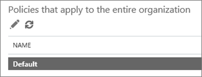

# Set up a custom blocked URLs list using ATP Safe Links

> [!IMPORTANT]
> This article is intended for business customers who have [Office 365 Advanced Threat Protection](office-365-atp.md). If you are a home user looking for information about Safe Links in Outlook, see [Advanced Outlook.com security](https://support.office.com/article/882d2243-eab9-4545-a58a-b36fee4a46e2).

With [Office 365 Advanced Threat Protection](office-365-atp.md) (ATP), your organization can have a custom list of website addresses (URLs) that are blocked. When a URL is blocked, people who click on links to the blocked URL are taken to a [warning page](atp-safe-links-warning-pages.md) that resembles the following image: 
  

  
The blocked URLs list is defined by your organization's Microsoft 365 for business security team, and that list applies to everyone in the organization who is covered by Office 365 ATP Safe Links policies. 
  
Read this article to learn how to set up your organization's custom blocked URLs list for [ATP Safe Links in Office 365](atp-safe-links.md).
  
## View or edit a custom list of blocked URLs

[ATP Safe Links in Office 365](atp-safe-links.md) uses several lists, including your organization's custom blocked URLs list. If you have the necessary permissions, you can set up your organization's custom list. You do this by editing your organization's default Safe Links policy.

To edit (or define) ATP policies, you must be assigned one of the roles described in the following table: 

|Role  |Where/how assigned  |
|---------|---------|
|global administrator |The person who signs up to buy Office 365 is a global admin by default. (See [About Office 365 admin roles](https://docs.microsoft.com/office365/admin/add-users/about-admin-roles) to learn more.)         |
|Security Administrator |Azure Active Directory admin center ([https://aad.portal.azure.com](https://aad.portal.azure.com))|
|Exchange Online Organization Management |Exchange admin center ([https://outlook.office365.com/ecp](https://outlook.office365.com/ecp))  or    PowerShell cmdlets (See [Exchange Online PowerShell](https://docs.microsoft.com/powershell/exchange/exchange-online/exchange-online-powershell)) |

> [!TIP]
> To learn more about roles and permissions, see [Permissions in the Security &amp; Compliance Center](permissions-in-the-security-and-compliance-center.md).

### To view or edit a custom blocked URLs list
  
1. Go to [https://protection.office.com](https://protection.office.com) and sign in with your work or school account. 
    
2. In the left navigation, under **Threat management**, choose **Policy** \> **Safe Links**.
    
3. In the **Policies that apply to the entire organization** section, select **Default**, and then choose **Edit** (the Edit button resembles a pencil).  This enables you to view your list of blocked URLs. At first, you might not have any URLs listed here. 
  
4. Select the **Enter a valid URL** box, type a URL, and then choose the plus sign (**+**). 

5. When you are finished adding URLs, in the lower right corner of the screen, choose **Save**.
    
## A few things to keep in mind

While you add URLs to your list, keep the following points in mind: 

- Do not include a forward slash ( **/**) at the end of the URL. For example, instead of entering `https://www.contoso.com/`, enter `https://www.contoso.com`.
    
- You can specify a domain-only URL (like `contoso.com` or `tailspintoys.com`). This will block clicks on any URL that contains the domain.

- You can specify a subdomain (like `toys.contoso.com*`) without blocking a full domain (like `contoso.com`). This will block clicks any URL that contains the subdomain, but it won't block clicks to a URL that contains the full domain.  
    
- You can include up to three wildcard asterisks (\*) per URL. The following table lists some examples of what you can enter and what effect those entries have.
    
|**Example Entry**|**What It Does**|
|:-----|:-----|
|`contoso.com` or `*contoso.com*`    |Blocks the domain, subdomains, and paths, such as `https://www.contoso.com`, `https://sub.contoso.com`, and `https://contoso.com/abc`    |
|`https://contoso.com/a`    |Blocks a site `https://contoso.com/a` but not additional subpaths like `https://contoso.com/a/b`    |
|`https://contoso.com/a*`    |Blocks a site `https://contoso.com/a` and additional subpaths like `https://contoso.com/a/b`    |
|`https://toys.contoso.com*`    |Blocks a subdomain ("toys" in this case) but allow clicks to other domain URLs (like `https://contoso.com` or `https://home.contoso.com`).    |
   

## How to define exceptions for certain users in an organization

If you want certain groups to be able to view URLs that might be blocked for others, you can specify an ATP Safe Links policy that applies to specific recipients. See [Set up a custom "do not rewrite" URLs list using ATP Safe Links](set-up-a-custom-do-not-rewrite-urls-list-with-atp.md).
  

