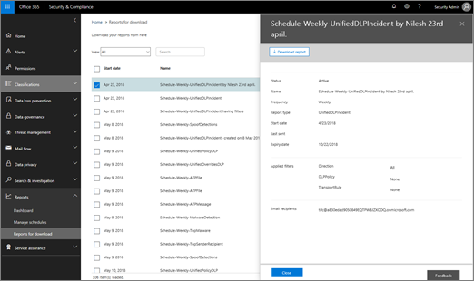

# Set up and download a custom report in the Security &amp; Compliance Center

In the [Security &amp; Compliance Center](https://protection.office.com), several [reports and insights](reports-and-insights-in-security-and-compliance.md) are available to help your organization's security team mitigate and address threats to your organization. If you're a member of your organization's security team, you can configure a report with custom date ranges and filters, and then download your custom report. 
  
## Download a custom report

> [!IMPORTANT]
> Make sure that you have the necessary [permissions for the Office 365 Security &amp; Compliance Center](permissions-in-the-security-and-compliance-center.md). In general, Office 365 global administrators, security administrators, and security readers can access reports in the Security &amp; Compliance Center. 
  
1. In the [Security &amp; Compliance Center](https://protection.office.com), go to **Reports** \> **Dashboard**.
    
2. Choose a report. (For this example, we'll use the Message Disposition Report.) 
  
3. In the upper left corner of the report, choose **Request report**.
    
4. In the **Request report** dialog box, specify a name, start date, and end date for the report. Then choose **Next**. 
  
5. Specify any filters you want to use for the report. (For example, you might specify a client IP address for the Message Disposition Report.) Then choose **Next**.
    
6. Specify email recipients for the report, and then choose **Save**.
    
## Related topics

[Reports and insights in the Office 365 Security &amp; Compliance Center](reports-and-insights-in-security-and-compliance.md)
  
[Create a schedule for a report in the Security &amp; Compliance Center](create-a-schedule-for-a-report.md)
  
[Manage schedules for reports in the Security &amp; Compliance Center](manage-schedules-for-multiple-reports.md)
  
[Download existing reports in the Security &amp; Compliance Center](download-existing-reports.md)
  

