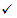

# Anti-phishing policies in Microsoft 365

[!INCLUDE [Microsoft 365 Defender rebranding](../includes/microsoft-defender-for-office.md)]

**Applies to**
- [Exchange Online Protection](https://go.microsoft.com/fwlink/?linkid=2148611)
- [Microsoft Defender for Office 365 plan 1 and plan 2](https://go.microsoft.com/fwlink/?linkid=2148715)
- [Microsoft 365 Defender](https://go.microsoft.com/fwlink/?linkid=2118804)

Policies to configure anti-phishing protection settings are available in Microsoft 365 organizations with Exchange Online mailboxes, standalone Exchange Online Protection (EOP) organizations without Exchange Online mailboxes, and Microsoft Defender for Office 365 organizations.

Anti-phishing policies in Microsoft Defender for Office 365 are only available in organizations that have Defender for Office 365. For example:

- Microsoft 365 Enterprise E5, Microsoft 365 Education A5, etc.
- [Microsoft 365 Enterprise](https://www.microsoft.com/microsoft-365/enterprise/home)
- [Microsoft 365 Business](https://www.microsoft.com/microsoft-365/business)
- [Microsoft Defender for Office 365 as an add-on](https://products.office.com/exchange/advance-threat-protection)

The high-level differences between anti-phishing policies in EOP and anti-phishing policies in Microsoft Defender for Office 365 are described in the following table:

****

|Feature|Anti-phishing policies in EOP|Anti-phishing policies in Microsoft Defender for Office 365|
|---|:---:|:---:|
|Automatically created default policy|||
|Create custom policies|||
|Policy settings\*|||
|Impersonation settings|||
|Spoof settings|||
|Advanced phishing thresholds|||
|

\* In the default policy, the policy name and description are read-only (the description is blank), and you can't specify who the policy applies to (the default policy applies to all recipients).

To configure anti-phishing policies, see the following articles:

- [Configure anti-phishing policies in EOP](configure-anti-phishing-policies-eop.md)

- [Configure anti-phishing policies in Microsoft Defender for Office 365](configure-atp-anti-phishing-policies.md)

The rest of this article describes the settings that are available in anti-phishing policies in EOP and Defender for Office 365.

## Policy settings

The following policy settings are available in anti-phishing policies in EOP and Microsoft Defender for Office 365:

- **Name**: You can't rename the default anti-phishing policy, but you can name and rename custom policies that you create.

- **Description** You can't add a description to the default anti-phishing policy, but you can add and change the description for custom policies that you create.

- **Applied to**: Identifies internal recipients that the anti-phishing policy applies to. This value is required in custom policies, and not available in the default policy (the default policy applies to all recipients).

  You can only use a condition or exception once, but you can specify multiple values for the condition or exception. Multiple values of the same condition or exception use OR logic (for example, _\<recipient1\>_ or _\<recipient2\>_). Different conditions or exceptions use AND logic (for example, _\<recipient1\>_ and _\<member of group 1\>_).

  - **Recipient is**: One or more mailboxes, mail users, or mail contacts in your organization.
  - **Recipient is a member of**: One or more groups in your organization.
  - **The recipient domain is**: One or more of the configured accepted domains in Microsoft 365.

  - **Except when**: Exceptions for the rule. The settings and behavior are exactly like the conditions:

    - **Recipient is**
    - **Recipient is a member of**
    - **The recipient domain is**

  > [!NOTE]
  > The **Applied to** setting is required in custom anti-phishing policies to identify the message **recipients** <u>that the policy applies to</u>. Anti-phishing policies in Microsoft Defender for Office 365 also have [impersonation settings](#impersonation-settings-in-anti-phishing-policies-in-microsoft-defender-for-office-365) where you can specify individual sender email addresses or sender domains <u>that will receive impersonation protection</u> as described later in this article.

## Spoof settings

Spoofing is when the From address in an email message (the sender address that's show in email clients) doesn't match the domain of the email source. For more information about spoofing, see [Anti-spoofing protection in Microsoft 365](anti-spoofing-protection.md).

The following spoof settings are available in anti-phishing policies in EOP and Microsoft Defender for Office 365:

- **Anti-spoofing protection**: Enables or disables anti-spoofing protection. We recommend that you leave it enabled. You use the **spoof intelligence policy** to allow or block specific spoofed internal and external senders. For more information, see [Configure spoof intelligence in Microsoft 365](learn-about-spoof-intelligence.md).

  > [!NOTE]
  >
  > - Anti-spoofing protection is enabled by default in the default anti-phishing policy and in any new custom anti-phishing policies that you create.
  >
  > - You don't need to disable anti-spoofing protection if your MX record doesn't point to Microsoft 365; you enable Enhanced Filtering for Connectors instead. For instructions, see [Enhanced Filtering for Connectors in Exchange Online](https://docs.microsoft.com/Exchange/mail-flow-best-practices/use-connectors-to-configure-mail-flow/enhanced-filtering-for-connectors).
  >
  > - Disabling anti-spoofing protection only disables implicit spoofing protection from [composite authentication](email-validation-and-authentication.md#composite-authentication) checks. If the sender fails explicit [DMARC](use-dmarc-to-validate-email.md) checks where the policy is set to quarantine or reject, the message is still quarantined or rejected.

  For messages from blocked spoofed senders, you can also specify the action to take on the messages:

  - **Move message to Junk Email folder**: This is the default value. The message is delivered to the mailbox and moved to the Junk Email folder. In Exchange Online, the message is moved to the Junk Email folder if the junk email rule is enabled on the mailbox (it's enabled by default). For more information, see [Configure junk email settings on Exchange Online mailboxes in Microsoft 365](configure-junk-email-settings-on-exo-mailboxes.md).

  - **Quarantine the message**: Sends the message to quarantine instead of the intended recipients. For information about quarantine, see the following articles:

    - [Quarantine in Microsoft 365](quarantine-email-messages.md)
    - [Manage quarantined messages and files as an admin in Microsoft 365](manage-quarantined-messages-and-files.md)
    - [Find and release quarantined messages as a user in Microsoft 365](find-and-release-quarantined-messages-as-a-user.md)

- **Unauthenticated Sender**: See the information in the next section.

### Unauthenticated Sender

Unauthenticated sender identification is part of the [Spoof settings](#spoof-settings) that are available in anti-phishing policies in EOP and Microsoft Defender for Office 365 as described in the previous section.

The **Unauthenticated Sender** setting enables or disables unauthenticated sender identification in Outlook. Specifically:

- A question mark (?) is added to the sender's photo if the message does not pass SPF or DKIM checks **and** the message does not pass DMARC or [composite authentication](email-validation-and-authentication.md#composite-authentication). Disabling unauthenticated sender identification prevents the question mark from being added to the sender's photo.

- The via tag (chris@contoso.com <u>via</u> fabrikam.com) is added if the domain in the From address (the message sender that's displayed in email clients) is different from the domain in the DKIM signature or the **MAIL FROM** address. For more information about these addresses, see [An overview of email message standards](how-office-365-validates-the-from-address.md#an-overview-of-email-message-standards).

  Disabling unauthenticated sender identification does not prevent the via tag from being added if the domain in the From address is different from the domain in the DKIM signature or the MAIL FROM address.

To prevent the question mark or via tag from being added to messages from specific senders, you have the following options:

- Allow the sender to spoof in the spoof intelligence policy. This action will prevent the via tag from appearing in messages from the sender when unauthenticated sender identification is disabled. For instructions, see [Configure spoof intelligence in Microsoft 365](learn-about-spoof-intelligence.md).

- [Configure email authentication](email-validation-and-authentication.md#configure-email-authentication-for-domains-you-own) for the sender domain.
  - For the question mark in the sender's photo, SPF or DKIM are the most important.
  - For the via tag, confirm the domain in the DKIM signature or the **MAIL FROM** address matches (or is a subdomain of) the domain in the From address.

For more information, see [Identify suspicious messages in Outlook.com and Outlook on the web](https://support.microsoft.com/office/3d44102b-6ce3-4f7c-a359-b623bec82206)

## Exclusive settings in anti-phishing policies in Microsoft Defender for Office 365

This section describes the policy settings that are only available in anti-phishing policies in Microsoft Defender for Office 365.

> [!NOTE]
> The default anti-phishing policy in Microsoft Defender for Office 365 provides [spoof protection](set-up-anti-phishing-policies.md#spoof-settings) and mailbox intelligence for all recipients. However, the other available [impersonation protection](#impersonation-settings-in-anti-phishing-policies-in-microsoft-defender-for-office-365) features and [advanced settings](set-up-anti-phishing-policies.md#advanced-phishing-thresholds-in-anti-phishing-policies-in-microsoft-defender-for-office-365) are not configured or enabled in the default policy. To enable all protection features, modify the default anti-phishing policy or create additional anti-phishing policies.

### Impersonation settings in anti-phishing policies in Microsoft Defender for Office 365

Impersonation is where the sender or the sender's email domain in a message looks similar to a real sender or domain:

- An example impersonation of the domain contoso.com is ćóntoso.com.
- An example impersonation of the user michelle@contoso.com is michele@contoso.com.

An impersonated domain might otherwise be considered legitimate (registered domain, configured email authentication records, etc.), except its intent is to deceive recipients.

The following impersonation settings are only available in anti-phishing policies in Microsoft Defender for Office 365:

- **Users to protect**: Prevents the specified internal or external email addresses from being impersonated **as message senders**. For example, you receive an email message from the Vice President of your company asking you to send her some internal company information. Would you do it? Many people would send the reply without thinking.

  You can use protected users to add internal and external sender email addresses to protect from impersonation. This list of **senders** that are protected from user impersonation is different from the list of **recipients** that the policy applies to (all recipients for the default policy; specific recipients as configured in the **Applied to** setting in the [Policy settings](#policy-settings) section).

  > [!NOTE]
  >
  > - In each anti-phishing policy, you can specify a maximum of 60 protected users (sender email addresses). You can't specify the same protected user in multiple policies. So, regardless of how many policies apply to a recipient, the maximum number of protected users (sender email addresses) for each individual recipient is 60. For more information about policy priority and how policy processing stops after the first policy is applied, see [Order and precedence of email protection](how-policies-and-protections-are-combined.md).
  >
  > - User impersonation protection does not work if the sender and recipient have previously communicated via email. If the sender and recipient have never communicated via email, the message will be identified as an impersonation attempt.

  By default, no sender email addresses are configured for impersonation protection in **Users to protect**. Therefore, by default, no sender email addresses are covered by impersonation protection, either in the default policy or in custom policies.

  When you add internal or external email addresses to the **Users to protect** list, messages from those **senders** are subject to impersonation protection checks. The message is checked for impersonation **if** the message is sent to a **recipient** that the policy applies to (all recipients for the default policy; **Applied to** recipients in custom policies). If impersonation is detected in the sender's email address, the impersonation protections actions for users are applied to the message (what to do with the message, whether to show impersonated users safety tips, etc.).

- **Domains to protect**: Prevents the specified domains from being impersonated **in the message sender's domain**. For example, all domains that you own ([accepted domains](https://docs.microsoft.com/exchange/mail-flow-best-practices/manage-accepted-domains/manage-accepted-domains)) or specific domains (domains you own or partner domains). This list of **sender domains** that are protected from impersonation is different from the list of **recipients** that the policy applies to (all recipients for the default policy; specific recipients as configured in the **Applied to** setting in the [Policy settings](#policy-settings) section).

  > [!NOTE]
  > The maximum number of protected domains that you can define in all anti-phishing policies is 50.

  By default, no sender domains are configured for impersonation protection in **Domains to protect**. Therefore, by default, no sender domains are covered by impersonation protection, either in the default policy or in custom policies.

  When you add domains to the **Domains to protect** list, messages from **senders in those domains** are subject to impersonation protection checks. The message is checked for impersonation **if** the message is sent to a **recipient** that the policy applies to (all recipients for the default policy; **Applied to** recipients in custom policies). If impersonation is detected in the sender's domain, the impersonation protection actions for domains are applied to the message (what to do with the message, whether to show impersonated users safety tips, etc.).

- **Actions for protected users or domains**: Choose the action to take on inbound messages that contain impersonation attempts against the protected users and protected domains in the policy. You can specify different actions for impersonation of protected users vs. impersonation of protected domains:

  - **Don't apply any action**

  - **Redirect message to other email addresses**: Sends the message to the specified recipients instead of the intended recipients.

  - **Move message to Junk Email folder**: The message is delivered to the mailbox and moved to the Junk Email folder. In Exchange Online, the message is moved to the Junk Email folder if the junk email rule is enabled on the mailbox (it's enabled by default). For more information, see [Configure junk email settings on Exchange Online mailboxes in Microsoft 365](configure-junk-email-settings-on-exo-mailboxes.md).

    - **Quarantine the message**: Sends the message to quarantine instead of the intended recipients. For information about quarantine, see the following articles:

    - [Quarantine in Microsoft 365](quarantine-email-messages.md)
    - [Manage quarantined messages and files as an admin in Microsoft 365](manage-quarantined-messages-and-files.md)
    - [Find and release quarantined messages as a user in Microsoft 365](find-and-release-quarantined-messages-as-a-user.md)

  - **Deliver the message and add other addresses to the Bcc line**: Deliver the message to the intended recipients and silently deliver the message to the specified recipients.

  - **Delete the message before it's delivered**: Silently deletes the entire message, including all attachments.

- **Safety tips**: Enables or disables the following impersonation safety tips that will appear messages that fail impersonation checks:

  - **Impersonated users**: The From address contains a protected user.
  - **Impersonated domains**: The From address contains a protected domain.
  - **Unusual characters**: The From address contains unusual character sets (for example, mathematical symbols and text or a mix of uppercase and lowercase letters) in a protected sender or domain.

  > [!IMPORTANT]
  >
  > Even when the impersonation safety tips are turned off, **we recommended** that you use a mail flow rule (also known as a transport rule) to add a message header named **X-MS-Exchange-EnableFirstContactSafetyTip** with value **enable** to messages. A safety tip will notify recipients the first time they get a message from the sender or if they don't often get messages from the sender.
  > :::image type="content" source="../../media/safety-tip-first-contact-multiple-recipients.png" alt-text="The text of the safety tip for impersonation protection with multiple recipients.":::

- **Mailbox intelligence**: Enables or disables artificial intelligence (AI) that determines user email patterns with their frequent contacts. This setting helps the AI distinguish between legitimate and spoofed email from those contacts. Mailbox intelligence is only available for Exchange Online mailboxes.

- **Mailbox intelligence based impersonation protection**: Enables or disables enhanced impersonation results based on each user's individual sender map. This intelligence allows Microsoft 365 to customize user impersonation detection and better handle false positives. When user impersonation is detected, you can define a specific action to take on the message:

  - **Don't apply any action**
  - **Redirect message to other email addresses**
  - **Move message to Junk Email folder**
  - **Quarantine the message**
  - **Deliver the message and add other addresses to the Bcc line**
  - **Delete the message before it's delivered**

- **Trusted senders and domains**: Exceptions to the impersonation protection settings. Messages from the specified senders and sender domains are never classified as impersonation-based attacks by the policy. In other words, the action for protected senders, protected domains, or mailbox intelligence protection aren't applied to these trusted senders or sender domains. The maximum limit for these lists is approximately 1000 entries.

### Advanced phishing thresholds in anti-phishing policies in Microsoft Defender for Office 365

The following advanced phishing thresholds are only available in anti-phishing policies in Microsoft Defender for Office 365. These thresholds control the sensitivity for applying machine learning models to messages for determining a phishing verdict:

- **1 - Standard**: This is the default value. The severity of the action that's taken on the message depends on the degree of confidence that the message is phishing (low, medium, high, or very high confidence). For example, messages that are identified as phishing with a very high degree of confidence have the most severe actions applied, while messages that are identified as phishing with a low degree of confidence have less severe actions applied.

- **2 - Aggressive**: Messages that are identified as phishing with a high degree of confidence are treated as if they were identified with a very high degree of confidence.

- **3 - More aggressive**: Messages that are identified as phishing with a medium or high degree of confidence are treated as if they were identified with a very high degree of confidence.

- **4 - Most aggressive**: Messages that are identified as phishing with a low, medium, or high degree of confidence are treated as if they were identified with a very high degree of confidence.

The chance of false positives (good messages marked as bad) increases as you increase this setting. For information about the recommended settings, see [anti-phishing policy in Microsoft Defender for Office 365 settings](recommended-settings-for-eop-and-office365-atp.md#anti-phishing-policy-settings-in-microsoft-defender-for-office-365).
