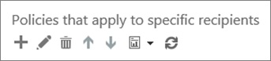

# Set up Office 365 ATP Safe Links policies

> [!IMPORTANT]
> This article is intended for business customers who have [Office 365 Advanced Threat Protection](office-365-atp.md). If you are a home user looking for information about Safe Links in Outlook, see [Advanced Outlook.com security](https://support.office.com/article/882d2243-eab9-4545-a58a-b36fee4a46e2).

[ATP Safe Links](atp-safe-links.md), a feature of [Office 365 Advanced Threat Protection](office-365-atp.md) (ATP), can help protect your organization from malicious links used in phishing and other attacks. If you have the necessary [permissions for the Office 365 Security &amp; Compliance Center](permissions-in-the-security-and-compliance-center.md), you can set up ATP Safe Links policies to help ensure that when people click web addresses (URLs), your organization is protected. Your ATP Safe Links policies can be configured to scan URLs in email and URLs in Office documents.
  
[New features are continually being added to ATP](office-365-atp.md#new-features-in-office-365-atp). As new features are added, you may need to make adjustments to your existing ATP Safe Links policies.

## What to do 
  
1. Review the prerequisites.
    
2. Review and edit the default ATP Safe Links policy that applies to everyone. For example, you can [set up your custom blocked URLs list for ATP Safe Links](set-up-a-custom-blocked-urls-list-wtih-atp.md).
    
3. Add or edit policies for specific email recipients, including [setting up your custom "Do not rewrite" URLs list for ATP Safe Links](set-up-a-custom-do-not-rewrite-urls-list-with-atp.md).
    
4. Learn about ATP Safe Links policy options (in this article), including settings for recent changes.
    
## Step 1: Review the prerequisites

- Make sure that your organization has [Office 365 Advanced Threat Protection](office-365-atp.md).
    
- Make sure that you have the necessary permissions. To define (or edit) ATP policies, you must be assigned an appropriate role. Some examples are described in the following table:  

    |Role  |Where/how assigned  |
    |---------|---------|
    |global administrator |The person who signs up to buy Office 365 is a global admin by default. (See [About Office 365 admin roles](https://docs.microsoft.com/office365/admin/add-users/about-admin-roles) to learn more.)         |
    |Security Administrator |Azure Active Directory admin center ([https://aad.portal.azure.com](https://aad.portal.azure.com))|
    |Exchange Online Organization Management |Exchange admin center ([https://outlook.office365.com/ecp](https://outlook.office365.com/ecp))  or    PowerShell cmdlets (See [Exchange Online PowerShell](https://docs.microsoft.com/powershell/exchange/exchange-online/exchange-online-powershell)) |

    To learn more about roles and permissions, see [Permissions in the Office 365 Security &amp; Compliance Center](permissions-in-the-security-and-compliance-center.md).

- Make sure that Office clients are configured to use [Modern Authentication](https://docs.microsoft.com/office365/enterprise/modern-auth-for-office-2013-and-2016) (this is for ATP Safe Links protection in Office documents).
    
- [Learn about ATP Safe Links policy options](#step-4-learn-about-atp-safe-links-policy-options) (in this article). 

- Allow up to 30 minutes for your new or updated policy to spread to all Office 365 datacenters.
    
## Step 2: Define (or review) the ATP Safe Links policy that applies to everyone

When you have [Office 365 Advanced Threat Protection](office-365-atp.md), you will have a default ATP Safe Links policy that applies to everyone in your organization. Make sure to review, and if needed, edit your default policy.
  
1. Go to [https://protection.office.com](https://protection.office.com) and sign in with your work or school account. 
    
2. In the left navigation, under **Threat management**, choose **Policy \>** **Safe Links**.
    
3. In the **Policies that apply to the entire organization** section, select **Default**, and then choose **Edit** (the Edit button resembles a pencil). 
  
4. In the **Block the following URLs** section, specify one or more URLs that you want to prevent people in your organization from visiting. (See [Set up a custom blocked URLs list using ATP Safe Links](set-up-a-custom-blocked-urls-list-wtih-atp.md).)
    
5. In the **Settings that apply to content except email** section, select (or clear) the options you want to use. (We recommend that you select all the options.) 
    
6. Choose **Save**.
    
## Step 3: Add (or edit) ATP Safe Links policies that apply to specific email recipients

After you have reviewed (or edited) the default ATP Safe Links policy that applies to everyone, your next step is to define additional policies that would apply to specific recipients. For example, you can specify exceptions to your default policy by defining an additional policy. 
  
1. Go to [https://protection.office.com](https://protection.office.com) and sign in with your work or school account. 
    
2. In the left navigation, under **Threat management**, choose **Policy**.
    
3. Choose **Safe Links**.
    
4. In the **Policies that apply to specific recipients** section, choose **New** (the New button resembles a plus sign ( **+**)). 
  
5. Specify the name, description, and settings for your policy. **Example:** To set up a policy called "no direct click through" that does not allow people in a certain group in your organization to click through to a specific website without ATP Safe Links protection, you might specify the following recommended settings: 
    
  - In the **Name** box, type no direct click through.
    
  - In the **Description** box, type a description like, Prevents people in certain groups from clicking through to a website without ATP Safe Links verification.
    
  - In the **Select the action** section, choose **On**.
    
  - Select **Apply real-time URL scanning for suspicious links and links that point to files** if you would like to enable URL detonation for suspicious and file-pointing URLs (recommended). And select **Wait for URL scanning to complete before delivering the message** if you wish to only have users receive messages after the URLs have been fully scanned.
    
  - Select **Apply Safe Links to messages sent within the organization** if you would like to enable Safe Links for messages sent between users within your organization (recommended).
    
  - Select **Do not allow user to click through to original URL** if you do not wish the individual users to override a *scan in progress* or *URL blocked* notification pages.
    
  - (This is optional) In the **Do not rewrite the following URLs** section, specify one or more URLs that are considered to be safe for your organization. (See [Set up a custom "Do not rewrite" URLs list using ATP Safe Links](set-up-a-custom-do-not-rewrite-urls-list-with-atp.md))
    
  - In the **Applied To** section, choose **The recipient is a member of**, and then choose the group(s) you want to include in your policy. Choose **Add**, and then choose **OK**.
    
6. Choose **Save**.

> [!NOTE]
> ATP Safe Links policies with higher priority will take precedence. If a user is subject to two or more polices, only the higher priority policy will take effect.
    
## Step 4: Learn about ATP Safe Links policy options

As you set up or edit your ATP Safe Links policies, will see several options available. In case you are wondering what these options are, the following table describes each one and its effect. Remember that there are two main kinds of ATP Safe Links policies to define or edit:
- a [default policy](#default-policy-options) that applies to everyone; and  
- additional [policies for specific recipients](#policies-that-apply-to-specific-email-recipients) 

### Default policy options

Default policy options apply to everyone in your organization.

|This option  |Does this  |
|---------|---------|
| **Block the following URLs**      | Enables your organization to have a custom list of URLs that are automatically blocked. When users click a URL in this list, they'll be taken to a [warning page](atp-safe-links-warning-pages.md) that explains why the URL is blocked. To learn more, see [Set up a custom blocked URLs list using Office 365 ATP Safe Links](set-up-a-custom-blocked-urls-list-wtih-atp.md). |
| **Microsoft 365 Apps for enterprise, Office for iOS and Android**      | When this option is selected, ATP Safe Links protection is applied to URLs in Word, Excel, and PowerPoint files on Windows or Mac OS, email messages in Outlook, Office documents on iOS or Android devices, Visio 2016 files on Windows, and files open in the web versions of Office apps (Word, PowerPoint, Excel, Outlook, and OneNote), provided the user has signed in to Office 365. |
| **Don't track when users click ATP Safe Links**    | When this option is selected, click data for URLs in Word, Excel, PowerPoint, Visio documents, and Outlook email messages is not stored.    |
|**Don't let users click through ATP Safe Links to original URL**   |When this option is selected, users cannot proceed past a [warning page](atp-safe-links-warning-pages.md) to a URL that is determined to be malicious.    |

### Policies that apply to specific email recipients

|This option  |Does this  |
|---------|---------|
|**Off**   |Does not scan URLs in email messages.    Enables you to define an exception rule, such as a rule that does not scan URLs in email messages for a specific group of recipients.    |
|**On**   |Rewrites URLs to route users through ATP Safe Links protection when the users click URLs in email messages and enables ATP Safe Links within Outlook (C2R) on Windows.    Checks a URL when clicked against a list of blocked or malicious URLs and triggers a detonation of the URL in the background asynchronously if the URL does not have a valid reputation.    |
|**Apply real-time URL scanning for suspicious links and links that point to files**   |When this option is selected, suspicious URLs and links that point to downloadable content are scanned.    |
|**Wait for URL scanning to complete before delivering the message**   |When this option is selected, messages that contain URLs to be scanned will be held until the URLs finish scanning and are confirmed to be safe before the messages are delivered.    |
|**Apply Safe Links to messages sent within the organization**   | When this option is available and selected, ATP Safe Links protection is applied to email messages sent between people in your organization, provided the email accounts are hosted in Office 365.    |
|**Do not track user clicks**   |When this option is selected, click data for URLs in email from external senders is not stored. URL click tracking for links within email messages sent within the organization is currently not supported.    |
|**Do not allow users to click through to original URL**   |When this option is selected, users cannot proceed past a [warning page](atp-safe-links-warning-pages.md) to a URL that is determined to be malicious.    |
|**Do not rewrite the following URLs**   |Leaves URLs as they are. Keeps a custom list of safe URLs that don't need scanning for a specific group of email recipients in your organization.  See [Set up a custom "Do not rewrite" URLs list using ATP Safe Links](set-up-a-custom-do-not-rewrite-urls-list-with-atp.md) for more details, including recent changes to support for wildcard asterisks (\*).    |
   
## Next steps

Once your ATP Safe Links policies are in place, you can see how ATP is working for your orgnization by viewing reports. See the following resources to learn more:

- [View reports for Office 365 Advanced Threat Protection](view-reports-for-atp.md)

- [Use Explorer in the Security &amp; Compliance Center](threat-explorer.md)

Stay on top of new features coming to ATP. visit the [Microsoft 365 Roadmap](https://www.microsoft.com/microsoft-365/roadmap?filters=O365).
