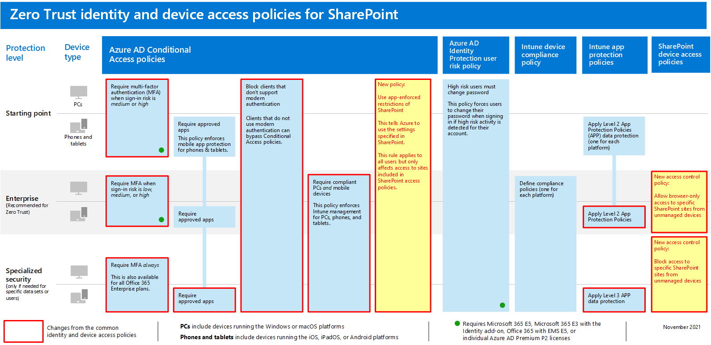
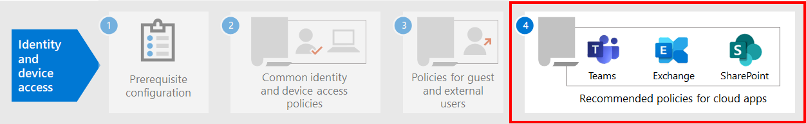

# Policy recommendations for securing SharePoint sites and files

**Applies to**
- [Exchange Online Protection](exchange-online-protection-overview.md)
- [Microsoft Defender for Office 365 plan 1 and plan 2](defender-for-office-365.md)
- SharePoint Online 

This article describes how to implement the recommended identity and device-access policies to protect SharePoint and OneDrive for Business. This guidance builds on the [common identity and device access policies](identity-access-policies.md).

These recommendations are based on three different tiers of security and protection for SharePoint files that can be applied based on the granularity of your needs: **baseline**, **sensitive**, and **highly regulated**. You can learn more about these security tiers, and the recommended client operating systems, referenced by these recommendations in [the overview](microsoft-365-policies-configurations.md).

In addition to implementing this guidance, be sure to configure SharePoint sites with the right amount of protection, including setting appropriate permissions for sensitive and highly-regulated content.

## Updating common policies to include SharePoint and OneDrive for Business

To protect files in SharePoint and OneDrive, the following diagram illustrates which policies to update from the the common identity and device access policies.

[See a larger version of this image](https://github.com/MicrosoftDocs/microsoft-365-docs/raw/public/microsoft-365/media/microsoft-365-policies-configurations/identity-access-ruleset-sharepoint.png)

If you included SharePoint when you created the common policies, you only need to create the new policies. For Conditional Access policies, SharePoint includes OneDrive.

The new policies implement device protection for sensitive and highly-regulated content by applying specific access requirements to SharePoint sites that you specify.

The following table lists the policies you either need to review and update or create new for SharePoint. The common policies link to the associated configuration instructions in the [Common identity and device access policies](identity-access-policies.md) article.

|Protection level|Policies|More information|
|---|---|---|
|**Baseline**|[Require MFA when sign-in risk is *medium* or *high*](identity-access-policies.md#require-mfa-based-on-sign-in-risk)|Include SharePoint in the assignment of cloud apps.|
||[Block clients that don't support modern authentication](identity-access-policies.md#block-clients-that-dont-support-multi-factor)|Include SharePoint in the assignment of cloud apps.|
||[Apply APP data protection policies](identity-access-policies.md#apply-app-data-protection-policies)|Be sure all recommended apps are included in the list of apps. Be sure to update the policy for each platform (iOS, Android, Windows).|
||[Require compliant PCs](identity-access-policies.md#require-compliant-pcs-but-not-compliant-phones-and-tablets)|Include SharePoint in list of cloud apps.|
||[Use app enforced restrictions in SharePoint](#use-app-enforced-restrictions-in-sharepoint)|Add this new policy. This tells Azure Active Directory (Azure AD) to use the settings specified in SharePoint. This policy applies to all users, but only affects access to sites included in SharePoint access policies.|
|**Sensitive**|[Require MFA when sign-in risk is *low*, *medium* or *high*](identity-access-policies.md#require-mfa-based-on-sign-in-risk)|Include SharePoint in the assignments of cloud apps.|
||[Require compliant PCs *and* mobile devices](identity-access-policies.md#require-compliant-pcs-and-mobile-devices)|Include SharePoint in the list of cloud apps.|
||[SharePoint access control policy](#sharepoint-access-control-policies): Allow browser-only access to specific SharePoint sites from unmanaged devices.|This prevents edit and download of files. Use PowerShell to specify sites.|
|**Highly regulated**|[*Always* require MFA](identity-access-policies.md#require-mfa-based-on-sign-in-risk)|Include SharePoint in the assignment of cloud apps.|
||[SharePoint access control policy](#use-app-enforced-restrictions-in-sharepoint): Block access to specific SharePoint sites from unmanaged devices.|Use PowerShell to specify sites.|
|

## Use app-enforced restrictions in SharePoint

If you implement access controls in SharePoint, you must create this Conditional Access policy in Azure AD to tell Azure AD to enforce the policies you configure in SharePoint. This policy applies to all users, but only affects access to the sites you specify using PowerShell when you create the access controls in SharePoint.

To configure this policy see "Block or limit access to specific SharePoint site collections or OneDrive accounts" in [Control access from unmanaged devices](https://docs.microsoft.com/sharepoint/control-access-from-unmanaged-devices).

## SharePoint access control policies

Microsoft recommends you protect content in SharePoint sites with sensitive and highly-regulated content with device access controls. You do this by creating a policy that specifies the level of protection and the sites to apply the protection to.

- Sensitive sites: Allow browser-only access. This prevents users from editing and downloading files.
- Highly regulated sites: Block access from unmanaged devices.

See "Block or limit access to specific SharePoint site collections or OneDrive accounts" in [Control access from unmanaged devices](https://docs.microsoft.com/sharepoint/control-access-from-unmanaged-devices).

## How these policies work together

It's important to understand that SharePoint site permissions are typically based on business need for access to sites. These permissions are managed by site owners and can be highly dynamic. Using SharePoint device access policies ensures protection to these sites, regardless of whether users are assigned to an Azure AD group associated with baseline, sensitive, or highly regulated protection.

The following illustration provides an example of how SharePoint device access policies protect access to sites for a user.

[See a larger version of this image](https://github.com/MicrosoftDocs/microsoft-365-docs/raw/public/microsoft-365/media/microsoft-365-policies-configurations/SharePoint-rules-scenario.png)

James has baseline Conditional Access policies assigned, but he can be given access to SharePoint sites with sensitive or highly-regulated protection.

- If James accesses a sensitive or highly-regulated site he is a member of using his PC, his access is granted as long as his PC is compliant.
- If James accesses a sensitive site he is a member of using his unmanaged phone, which is allowed for baseline users, he will receive browser-only access to the sensitive site due to the device access policy configured for this site.
- If James accesses a highly regulated site he is a member of using his unmanaged phone, he will be blocked due to the access policy configured for this site. He can only access this site using his managed and compliant PC.

## Next step

Configure Conditional Access policies for:

- [Microsoft Teams](teams-access-policies.md)
- [Exchange Online](secure-email-recommended-policies.md)
