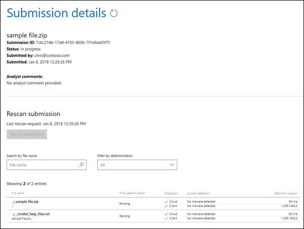

# Submitting malware and non-malware to Microsoft for analysis

When customers receive an email with a suspected virus, they often ask "What do I do now?"
  
This topic helps answer that question and guides you through our recommended process. It's intended for customers using Office 365 or Exchange Online Protection (EOP) with on-premises mail servers.
  
It's important to understand the difference between an infected and uninfected email. Any email that has an attachment containing a script or malicious executable is considered a virus. This doesn't include subscription-based messages with links to malicious sites. Those messages would be considered spam and not viruses, and a different approach is used for spam messages. For more information about combating spam using the service, see [Anti-Spam Protection](anti-spam-and-anti-malware-protection.md) and its associated sub-topics, including [Submit spam, non-spam, and phishing scam messages to Microsoft for analysis](submit-spam-non-spam-and-phishing-scam-messages-to-microsoft-for-analysis.md). 
  
By using the service, you're automatically provided with anti-malware protection. To further combat potential threats, you should avoid opening messages that look suspicious and never open an attachment from someone you don't know. Also avoid opening messages that urge you to open or click.

Admins can send email, url, and attachments to Microsoft for review. See [Admin submissions in Office 365 ATP](admin-submission.md).
  
## Submitting malware to Microsoft for analysis

If you suspect that your device has been infected by a virus that made it past our filters, you should submit the email virus sample immediately to the [Microsoft Defender Security Intelligence](https://www.microsoft.com/wdsi/filesubmission) (WSDI) website for further analysis. To receive analysis updates, sign into the WDSI website, or enter a valid email address. We recommend that you use your Microsoft work or school account email address. 
  
After you've uploaded the file or files, note the **Submission ID** that's created for your sample submission (for example, a Submission ID might resemble 7c6c214b-17d4-4703-860b-7f1e9da03f7f). 
  

  
After we receive the sample, we'll investigate and if it's determined that the sample contains malware, we'll take corrective action to prevent the virus from going undetected.
  
If you continue receiving infected messages or attachments, then you should copy the message headers from the email virus, and contact Microsoft Customer Service and Support for further assistance. Be sure to have your **Submission ID** ready as well. 
  
## Submitting non-malware to Microsoft for analysis

You can also submit a file that you believe was incorrectly detected as malware to the WDSI website (just select **No** for the question, **Do you believe this file contains malware?**).
  
After we receive the sample, we'll investigate and if it's determined that the sample is clean, we'll take corrective action to prevent the file from being detected as malware.
  

