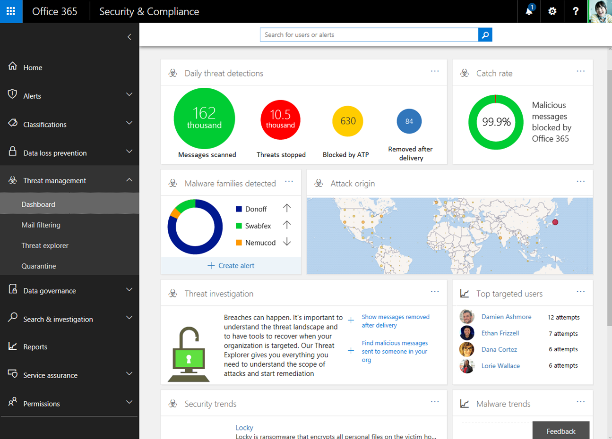
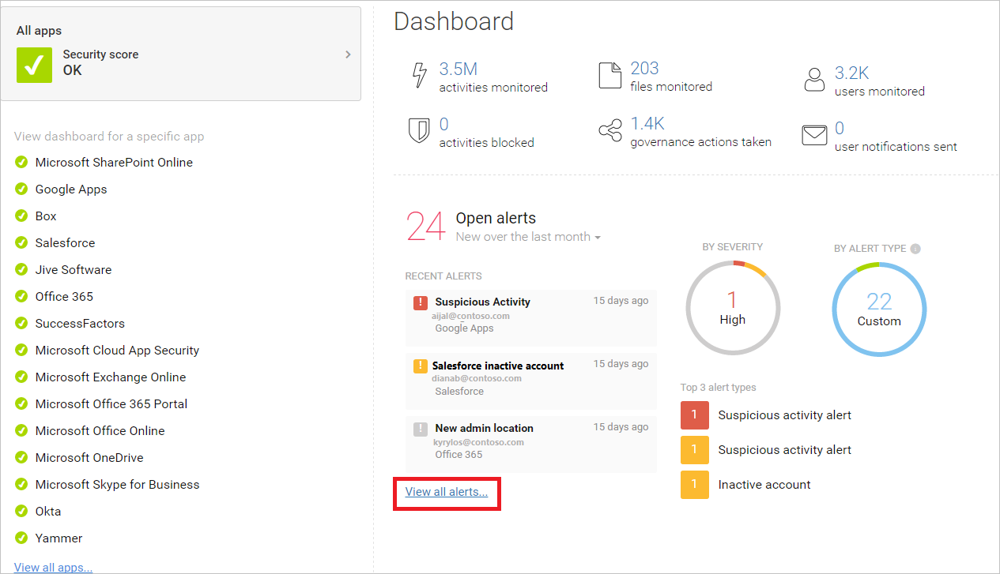

# Configure your Microsoft 365 tenant for increased security

[!INCLUDE [Microsoft 365 Defender rebranding](../includes/microsoft-defender-for-office.md)]

**Applies to**
- [Exchange Online Protection](exchange-online-protection-overview.md)
- [Microsoft Defender for Office 365 plan 1 and plan 2](defender-for-office-365.md)
- [Microsoft 365 Defender](../defender/microsoft-365-defender.md)

This topic walks you through recommended configuration for tenant-wide settings that affect the security of your Microsoft 365 environment. Your security needs might require more or less security. Use these recommendations as a starting point.

## Check Office 365 Secure Score

Office 365 Secure Score analyzes your organization's security based on your regular activities and security settings and assigns a score. Begin by taking note of your current score. Adjusting some tenant-wide settings will increase your score. The goal is not to achieve the max score, but to be aware of opportunities to protect your environment that do not negatively affect productivity for your users. See [Microsoft Secure Score](../defender/microsoft-secure-score.md).

## Tune threat management policies in the Microsoft 365 security center

The Microsoft 365 security center includes capabilities that protect your environment. It also includes reports and dashboards you can use to monitor and take action. Some areas come with default policy configurations. Some areas do not include default policies or rules. Visit these policies under threat management to tune threat management settings for a more secure environment.

****

|Area|Includes a default policy|Recommendation|
|---|---|---|
|**Anti-phishing**|Yes|<ul><li>Impersonation protection — If you have Defender for Office 365 and a custom domain, configure the impersonation protection settings in the default anti-phishing policy to protect the email accounts of your most valuable users, such as your CEO, and to protect your domain. More information: [Impersonation settings in anti-phishing policies](set-up-anti-phishing-policies.md#impersonation-settings-in-anti-phishing-policies-in-microsoft-defender-for-office-365) and [Impersonation insight](impersonation-insight.md)</li><li>Spoof intelligence — Review senders who are spoofing your domain. Block or allow these senders. More information: [Spoof intelligence insight in EOP](learn-about-spoof-intelligence.md) and [Manage the Tenant Allow/Block List](tenant-allow-block-list.md).</li></ul>|
|**Anti-Malware Engine**|Yes| Edit the default policy: <ul><li>Common Attachment Types Filter: Select On</li></ul> 
 You can also create custom malware filter policies and apply them to specified users, groups, or domains in your organization. 
 More information: <ul><li>[Anti-malware protection](anti-malware-protection.md)</li><li>[Configure anti-malware policies](configure-anti-malware-policies.md)</li></ul>|
|**Safe Attachments in Microsoft Defender for Office 365**|No|On the main page for Safe Attachments, click **Global settings** and turn on this setting: <ul><li>**Turn on Defender for Office 365 for SharePoint, OneDrive, and Microsoft Teams**</li></ul> 
 Create a Safe Attachments policy with these settings: <ul><li> **Block**: Select **Block** as the unknown malware response.</li><li>**Enable redirect**: Check this box and enter an email address, such as an admin or quarantine account.</li><li>**Apply the above selection if malware scanning for attachments times out or error occurs**: Check this box.</li><li>***Applied to**: **The recipient domain is** \> select your domain.</li></ul> 
 More information: [Safe Attachments for SharePoint, OneDrive, and Microsoft Teams](mdo-for-spo-odb-and-teams.md) and [Set up Safe Attachments policies](set-up-safe-attachments-policies.md)|
|**Safe Links in Microsoft Defender for Office 365**|Yes|On the main page for Safe Links, click **Global settings**: <ul><li>**Use Safe Links in: Office 365 applications**: Verify this setting is turned on.</li><li>**Do not track when users click Safe Links**: Turn this setting off to track user clicks.</li></ul> 
 Create a Safe Links policy with these settings: <ul><li>**Select the action for unknown potentially malicious URLs in messages**: Verify this setting is **On**.</li><li>**Select the action for unknown or potentially malicious URLs within Microsoft Teams**: Verify this setting is **On**.</li><li>**Apply real-time URL scanning for suspicious links and links that point to files**: Check this box.</li><li>**Wait for URL scanning to complete before delivering the message**: Check this box.</li><li>**Apply Safe Links to email messages sent within the organization**: Check this box</li><li>**Do not allow users to click through to original URL**: Check this box.</li><li>**Applied To**: **The recipient domain is** \> select your domain.</li></ul> 
 More information: [Set up Safe Links policies](set-up-safe-links-policies.md).|
|**Anti-Spam (Mail filtering)**|Yes| What to watch for: Too much spam — Choose the Custom settings and edit the Default spam filter policy. More information: [Microsoft 365 Email Anti-Spam Protection](anti-spam-protection.md).|
|***Email Authentication***|Yes|Email authentication uses a Domain Name System (DNS) to add verifiable information to email messages about the sender of an email. Microsoft 365 sets up email authentication for its default domain (onmicrosoft.com), but Microsoft 365 admins can also use email authentication for custom domains. Three authentication methods are used: <ul><li>Sender Policy Framework (or SPF).</li><ul><li>For setup, see [Set up SPF in Microsoft 365 to help prevent spoofing](set-up-spf-in-office-365-to-help-prevent-spoofing.md).</li></ul> <li>DomainKeys Identified Mail (DKIM).</li><ul><li>See [Use DKIM to validate outbound email sent from your custom domain](use-dkim-to-validate-outbound-email.md).</li><li>After you've configured DKIM, enable it in the security center.</li></ul><li>Domain-based Message Authentication, Reporting, and Conformance (DMARC).</li><ul><li>For DMARC setup [Use DMARC to validate email in Microsoft 365](use-dmarc-to-validate-email.md).</li></ul></ul>|
|

> [!NOTE]
> For non-standard deployments of SPF, hybrid deployments, and troubleshooting: [How Microsoft 365 uses Sender Policy Framework (SPF) to prevent spoofing](how-office-365-uses-spf-to-prevent-spoofing.md).

## View dashboards and reports in the security and compliance centers

Visit these reports and dashboards to learn more about the health of your environment. The data in these reports will become richer as your organization uses Office 365 services. For now, be familiar with what you can monitor and take action on. For more information, see : [Reports in the Microsoft 365 security and compliance centers](../../compliance/reports-in-security-and-compliance.md).

****

|Dashboard|Description|
|---|---|
|[Threat management dashboard](security-dashboard.md)|In the **Threat management** section of the security center, use this dashboard to see threats that have already been handled, and as a handy tool for reporting out to business decision makers on what threat investigation and response capabilities have already done to secure your business.|
|[Threat Explorer (or real-time detections)](threat-explorer.md)|This is also in the **Threat management** section of the security center. If you are investigating or experiencing an attack against your tenant, use Explorer (or real-time detections) to analyze threats. Explorer (and the real-time detections report) shows you the volume of attacks over time, and you can analyze this data by threat families, attacker infrastructure, and more. You can also mark any suspicious email for the Incidents list.|
|Reports — Dashboard|In the **Reports** section of security center, view audit reports for your SharePoint Online and Exchange Online organizations. You can also access Azure Active Directory (Azure AD) user sign-in reports, user activity reports, and the Azure AD audit log from the **View reports** page.|
|

## Configure additional Exchange Online tenant-wide settings

Many of the controls for security and protection in the Exchange admin center are also included in the security center. You do not need to configure these in both places. Here are a couple of additional settings that are recommended.

****

|Area|Includes a default policy|Recommendation|
|---|---|---|
|**Mail Flow** (mail flow rules, also known as transport rules)|No|Add a mail flow rule to help protect against ransomware by blocking executable file types and Office file types that contain macros. For more information, see [Use mail flow rules to inspect message attachments in Exchange Online](/exchange/security-and-compliance/mail-flow-rules/inspect-message-attachments). 
 See these additional topics: <ul><li>[Protect against ransomware](../../admin/security-and-compliance/secure-your-business-data.md#5-protect-against-ransomware)</li><li>[Malware and Ransomware Protection in Microsoft 365](/compliance/assurance/assurance-malware-and-ransomware-protection)</li><li>[Recover from a ransomware attack in Office 365](recover-from-ransomware.md)</li></ul> 
 Create a mail flow rule to prevent auto-forwarding of email to external domains. For more information, see [Mitigating Client External Forwarding Rules with Secure Score](/archive/blogs/office365security/mitigating-client-external-forwarding-rules-with-secure-score). 
 More information: [Mail flow rules (transport rules) in Exchange Online](/exchange/security-and-compliance/mail-flow-rules/mail-flow-rules)|
|**Enable modern authentication**|No|Modern authentication is a prerequisite for using multi-factor authentication (MFA). MFA is recommended for securing access to cloud resources, including email. 
 See these topics: <ul><li>[Enable or disable modern authentication in Exchange Online](/Exchange/clients-and-mobile-in-exchange-online/enable-or-disable-modern-authentication-in-exchange-online)</li><li>[Skype for Business Online: Enable your tenant for modern authentication](https://social.technet.microsoft.com/wiki/contents/articles/34339.skype-for-business-online-enable-your-tenant-for-modern-authentication.aspx)</li></ul> 
 Modern authentication is enabled by default for Office 2016 clients, SharePoint Online, and OneDrive for Business. 
 More information: [How modern authentication works for Office 2013 and Office 2016 client apps](../../enterprise/modern-auth-for-office-2013-and-2016.md)|
|

## Configure tenant-wide sharing policies in SharePoint admin center

Microsoft recommendations for configuring SharePoint team sites at increasing levels of protection, starting with baseline protection. For more information, see [Policy recommendations for securing SharePoint sites and files](sharepoint-file-access-policies.md).

SharePoint team sites configured at the baseline level allow sharing files with external users by using anonymous access links. This approach is recommended instead of sending files in email.

To support the goals for baseline protection, configure tenant-wide sharing policies as recommended here. Sharing settings for individual sites can be more restrictive than this tenant-wide policy, but not more permissive.

****

|Area|Includes a default policy|Recommendation|
|---|---|---|
|**Sharing** (SharePoint Online and OneDrive for Business)|Yes|External sharing is enabled by default. These settings are recommended: <ul><li>Allow sharing to authenticated external users and using anonymous access links (default setting).</li><li>Anonymous access links expire in this many days. Enter a number, if desired, such as 30 days.</li><li>Default link type — select Internal (people in the organization only). Users who wish to share using anonymous links must choose this option from the sharing menu.</li></ul> 
 More information: [External sharing overview](/sharepoint/external-sharing-overview)|
|

SharePoint admin center and OneDrive for Business admin center include the same settings. The settings in either admin center apply to both.

## Configure settings in Azure Active Directory

Be sure to visit these two areas in Azure Active Directory to complete tenant-wide setup for more secure environments.

### Configure named locations (under conditional access)

If your organization includes offices with secure network access, add the trusted IP address ranges to Azure Active Directory as named locations. This feature helps reduce the number of reported false positives for sign-in risk events.

See: [Named locations in Azure Active Directory](/azure/active-directory/active-directory-named-locations)

### Block apps that don't support modern authentication

Multi-factor authentication requires apps that support modern authentication. Apps that do not support modern authentication cannot be blocked by using conditional access rules.

For secure environments, be sure to disable authentication for apps that do not support modern authentication. You can do this in Azure Active Directory with a control that is coming soon.

In the meantime, use one of the following methods to accomplish this for SharePoint Online and OneDrive for Business:

- Use PowerShell, see [Block apps that do not use modern authentication (ADAL)](/mem/intune/protect/app-modern-authentication-block).

- Configure this in the SharePoint admin center on the "device access' page — "Control access from apps that don't use modern authentication." Choose Block.

## Get started with Cloud App Security or Office 365 Cloud App Security

Use Office 365 Cloud App Security to evaluate risk, to alert on suspicious activity, and to automatically take action. Requires Office 365 E5 plan.

Or, use Microsoft Cloud App Security to obtain deeper visibility even after access is granted, comprehensive controls, and improved protection for all your cloud applications, including Office 365.

Because this solution recommends the EMS E5 plan, we recommend you start with Cloud App Security so you can use this with other SaaS applications in your environment. Start with default policies and settings.

More information:

- [Deploy Cloud App Security](/cloud-app-security/getting-started-with-cloud-app-security)

- [More information about Microsoft Cloud App Security](https://www.microsoft.com/cloud-platform/cloud-app-security)

- [What is Cloud App Security?](/cloud-app-security/what-is-cloud-app-security)

## Additional resources

These articles and guides provide additional prescriptive information for securing your Microsoft 365 environment:

- [Microsoft security guidance for political campaigns, nonprofits, and other agile organizations](microsoft-security-guidance-for-political-campaigns-nonprofits-and-other-agile-o.md) (you can use these recommendation in any environment, especially cloud-only environments)

- [Recommended security policies and configurations for identities and devices](microsoft-365-policies-configurations.md) (these recommendations include help for AD FS environments)