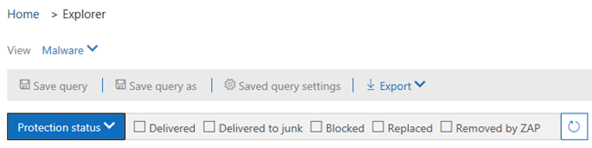
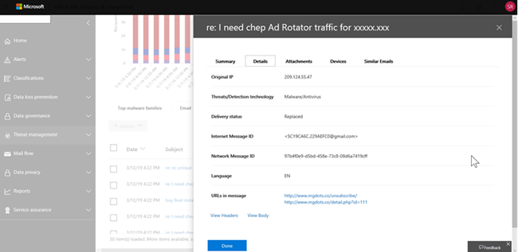
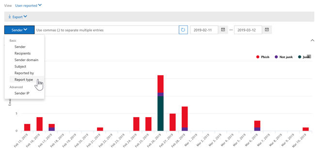
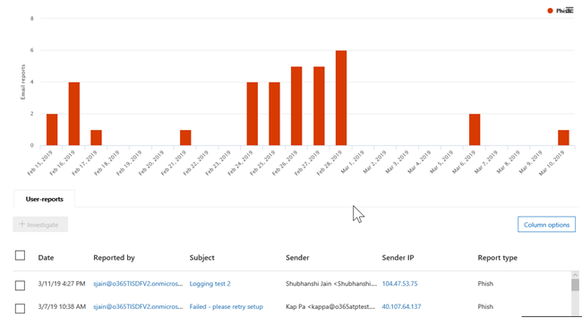
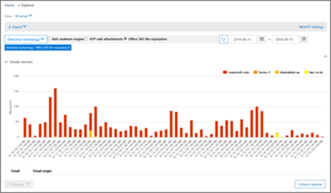
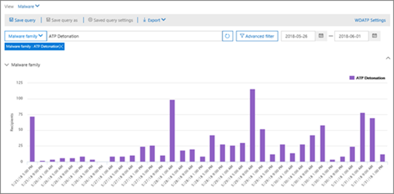
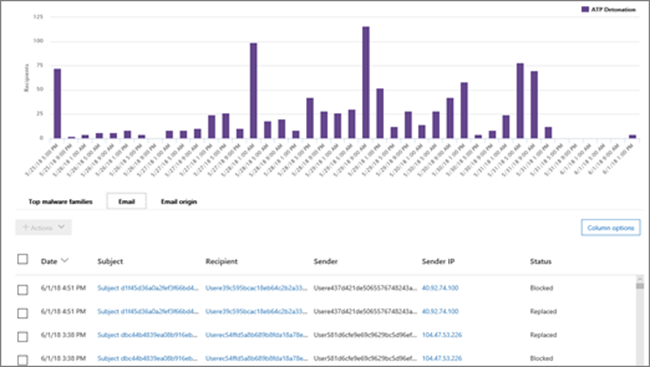

# Views in Threat Explorer and real-time detections

[!INCLUDE [Microsoft 365 Defender rebranding](../includes/microsoft-defender-for-office.md)]

**Applies to**
- [Microsoft Defender for Office 365 plan 1 and plan 2](office-365-atp.md)
- [Microsoft 365 Defender](../mtp/microsoft-threat-protection.md)

[Threat Explorer](threat-explorer.md) (and the real-time detections report) is a powerful, near real-time tool to help Security Operations teams investigate and respond to threats in the Security & Compliance Center. Explorer (and the real-time detections report) displays information about suspected malware and phish in email and files in Office 365, as well as other security threats and risks to your organization.

- If you have [Microsoft Defender for Office 365](office-365-atp.md) Plan 2, then you have Explorer.
- If you have Microsoft Defender for Office 365 Plan 1, then you have real-time detections.

When you first open Explorer (or the real-time detections report), the default view shows email malware detections for the past 7 days. This report can also show Microsoft Defender for Office 365 detections, such as malicious URLs detected by [Safe Links](atp-safe-links.md), and malicious files detected by [Safe Attachments](atp-safe-attachments.md). This report can be modified to show data for the past 30 days (with a Microsoft Defender for Office 365 P2 paid subscription). Trial subscriptions will include data for the past seven days only.

****

|Subscription|Utility|Days of Data|
|---|---|---|
|Microsoft Defender for Office 365 P1 trial|Real-time detections|7|
|Microsoft Defender for Office 365 P1 paid|Real-time detections|30|
|Microsoft Defender for Office 365 P1 paid testing Defender for Office 365 P2 trial|Threat Explorer|7|
|Microsoft Defender for Office 365 P2 trial|Threat Explorer|7|
|Microsoft Defender for Office 365 P2 paid|Threat Explorer|30|
|

Use the **View** menu to change what information is displayed. Tooltips help you determine which view to use.

Once you have selected a view, you can apply filters and set up queries to conduct further analysis. The following sections provide a brief overview of the various views available in Explorer (or real-time detections).

## Email > Malware

To view this report, in Explorer (or real-time detections), choose **View** \> **Email** \> **Malware**. This view shows information about email messages that were identified as containing malware.

Click **Sender** to open your list of viewing options. Use this list to view data by sender, recipients, sender domain, subject, detection technology, protection status, and more.

For example, to see what actions were taken on detected email messages, choose **Protection status** in the list. Select an option, and then click the Refresh button to apply that filter to your report.

Below the chart, view more details about specific messages. When you select an item in the list, a fly-out pane opens, where you can learn more about the item you selected.

## Email > Phish

To view this report, in Explorer (or real-time detections), choose **View** \> **Email** \> **Phish**. This view shows email messages identified as phishing attempts.

Click **Sender** to open your list of viewing options. Use this list to view data by sender, recipients, sender domain, sender IP, URL domain, click verdict, and more.

For example, to see what actions were taken when people clicked on URLs that were identified as phishing attempts, choose **Click verdict** in the list, select one or more options, and then click the Refresh button.

Below the chart, view more details about specific messages, URL clicks, URLs, and email origin.

When you select an item in the list, such as a URL that was detected, a fly-out pane opens, where you can learn more about the item you selected.

## Email > Submissions

To view this report, in Explorer (or real-time detections), choose **View** \> **Email** \> **Submissions**. This view shows email that users have reported as junk, not junk, or phishing email.

Click **Sender** to open your list of viewing options. Use this list to view information by sender, recipients, report type (the user's determination that the email was junk, not junk, or phish), and more.

For example, to view information about email messages that were reported as phishing attempts, click **Sender** \> **Report type**, select **Phish**, and then click the Refresh button.

Below the chart, view more details about specific email messages, such as subject line, the sender's IP address, the user that reported the message as junk, not junk, or phish, and more.

Select an item in the list to view additional details.

## Email > All email

To view this report, in Explorer, choose **View** \> **Email** \> **All mail**. This views shows an all-up view of email activity, including email identified as malicious due to phishing or malware, as well all non-malicious mail (normal email, spam, and bulk mail).

> [!NOTE]
> If you get an error that reads **Too much data to display**, add a filter and, if necessary, narrow the date range you're viewing.

To apply a filter, choose **Sender**, select an item in the list, and then click the Refresh button. In our example, we used **Detection technology** as a filter (there are several options available). View information by sender, sender's domain, recipients, subject, attachment filename, malware family, protection status (actions taken by your threat protection features and policies in Office 365), detection technology (how the malware was detected), and more.

Below the chart, view more details about specific email messages, such as subject line, recipient, sender, status, and so on.

## Content > Malware

To view this report, in Explorer (or real-time detections), choose **View** \> **Content** \> **Malware**. This view shows files that were identified as malicious by [Microsoft Defender for Office 365 in SharePoint Online, OneDrive for Business, and Microsoft Teams](atp-for-spo-odb-and-teams.md).

View information by malware family, detection technology (how the malware was detected), and workload (OneDrive, SharePoint, or Teams).

Below the chart, view more details about specific files, such as attachment filename, workload, file size, who last modified the file, and more.

## Click-to-filter capabilities

With Explorer (and real-time detections), you can apply a filter in a click. Click an item in the legend, and that item becomes a filter for the report. For example, suppose we are looking at the Malware view in Explorer:

Clicking **ATP Detonation** in this chart results in a view like this:

In this view, we are now looking at data for files that were detonated by [Safe Attachments](atp-safe-attachments.md). Below the chart, we can see details about specific email messages that had attachments that were detected by Safe Attachments.

Selecting one or more items activates the **Actions** menu, which offers several choices from which to choose for the selected item(s).

The ability to filter in a click and navigate to specific details can save you a lot of time in investigating threats.

## Queries and filters

Explorer (as well as the real-time detections report) has several powerful filters and querying capabilities that enable you to drill into details, such as top targeted users, top malware families, detection technology and more. Each kind of report offers a variety of ways to view and explore data.

> [!IMPORTANT]
> Do not use wildcard characters, such as an asterisk or a question mark, in the query bar for Explorer (or real-time detections). When you search on the **Subject field** for email messages, Explorer (or real-time detections) will perform partial matching and yield results similar to a wildcard search.
