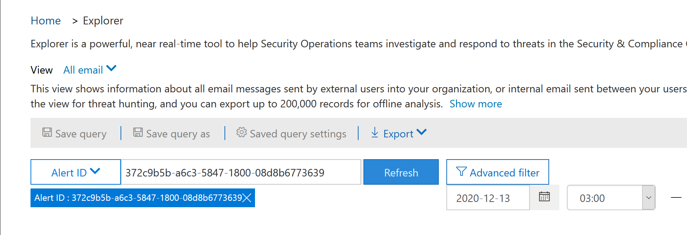
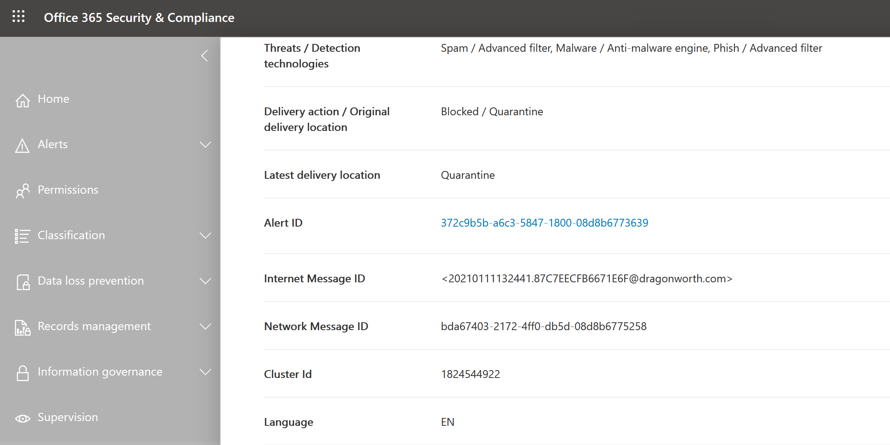

# Threat Explorer and real-time detections

[!INCLUDE [Microsoft 365 Defender rebranding](../includes/microsoft-defender-for-office.md)]

If your organization has [Office 365 Advanced Threat Protection](office-365-atp.md) (Office 365 ATP), and you have the [necessary permissions](#required-licenses-and-permissions), you have either **Explorer** or **real-time detections** (formerly *real-time reports* — [see what's new](#new-features-in-threat-explorer-and-real-time-detections)!). In the Security & Compliance Center, go to **Threat management**, and then choose **Explorer** _or_ **Real-time detections**.

|With ATP Plan 2, you see:|With ATP Plan 1, you see:|
|---|---|
|||
|

With Explorer (or real-time detections), you have a powerful report that enables your Security Operations team to investigate and respond to threats effectively and efficiently. The report resembles the following image:

With this report, you can:

- [See malware detected by Microsoft 365 security features](#see-malware-detected-in-email-by-technology)
- [View data about phishing URLs and click verdict](#view-data-about-phishing-urls-and-click-verdict)
- [Start an automated investigation and response process from a view in Explorer](#start-automated-investigation-and-response) (ATP Plan 2 only)
- ... [Investigate malicious email, and more](#more-ways-to-use-explorer-or-real-time-detections)!

## Improvements to Threat Hunting Experience

### Introduction of Alert ID for MDO alerts within Explorer/Real-time detections (Preview)
Today, if you navigate from an alert to Threat Explorer, it opens a filtered view within the Explorer, with the view filtered by Alert policy ID (policy ID being a unique identifier for an Alert policy).
We are making this integration more relevant by introducing the alert ID (see an example of alert ID below) in Threat Explorer and Real-time detections so that you see messages which are relevant to the specific alert, as well as a count of emails. You will also be able to see if a message was part of an alert, as well as navigate from that message to the specific alert.  
Alert ID is available within the URL when you are viewing an individual alert; an example being https://protection.office.com/viewalerts?id=372c9b5b-a6c3-5847-fa00-08d8abb04ef1

> [!div class="mx-imgBorder"]
> 

> [!div class="mx-imgBorder"]
> 

 
### Extending the Explorer (and Real-time detections) data retention and search limit for trial tenants from 7 to 30 days (Preview)  
As part of this change, you will be able to search for, and filter email data across 30 days (an increase from the previous 7 days) in Threat Explorer/Real-time detections for both Defender for Office P1 and P2 trial tenants. 
This does not impact any production tenants for both P1 and P2/E5 customers, which already has the 30 day data retention and search capabilities. 

### Updated limits for Export of records for Threat Explorer (Preview) 
As part of this update, the number of rows for Email records that can be exported from Threat Explorer is increased from 9990 to 200,000 records. The set of columns that can be exported currently will remain the same, but the number of rows will increase from the current limit.

### Updated Threat Information for Emails

We have focused on platform and data quality improvements to increase data accuracy and consistency for email records. These set of updates includes consolidation of pre-delivery and post-delivery information (example action executed on an email as part of ZAP process) into a single record  along with added richness like Spam verdict, Entity level threats (e.g. which URL was malicious) and latest delivery locations. 

After these updates, you'll see a single entry for each message, regardless of the different post-delivery events that have taken place on the message. Actions can include ZAP, Manual Remediation (which means admin action), Dynamic Delivery etc. 

In addition to showing malware and phish threats, you'll now be able to see spam verdict associated with an email. Within the email, you will be able to see all the threats associated with the email along with the corresponding detection technologies. Each email can have 0, 1, or multiple threats. You'll see the current Threats in the Details section of the Email flyout. Additionally, for multiple threats (e.g., an email having both Malware and Phish), Detection tech field would give the Threat-Detection mapping, meaning which detection tech led to the identification of the Threat.

The set of detection technologies has been updated to include new detection methods, as well as spam detection technologies, and aross all the different email views (Malware, Phish, All Email), you'll have the same, consistent set of Detection technologies to filter the results. 

**Note**: Verdict analysis might not necessarily be tied to entities. As an example, an email might be classified as Phish or Spam, but there are no URLs which have any Phish/Spam verdict stamped on them. This is because our filters also evaluate content and other details for an email, before assigning a verdict. 
 
#### Threats in URLs

Within email flyout-> Details tab, you would now be able to see the specific threat for a URL (Threat for a URL can be Malware, Phish, Spam or None)

### Updated Timeline View

In addition to identifying all delivery and post-delivery events, timeline view also gives information about the Threat identified at that point of time for a subset of these events. It also gives you more information about Additional Actions (e.g. ZAP, Manual Remediation) along with the Result of that action. Timeline view contains information about the Original delivery and subsequently any post-delivery events performed on an email.

-	Source: This can be Admin/System/user based on what was the source of the event.
-	Event: This includes top level events like Original Delivery, Manual Remediation, ZAP, Submissions, and Dynamic Delivery .
-	Action: This covers the specific action that was taken either as part of ZAP or Admin Action (e.g., Soft Delete).
-	Threats: Covers the threats (Malware, Phish, Spam) identified at that point of time.
-	Result/Details: Covers more information about the Result of the Action, whether it was performed as part of ZAP/Admin Action.

### Original and Latest Delivery location

Today, we surface delivery Location within email grid and email flyout. Going forward, the Delivery Location field will be renamed to Original Delivery Location. Additionally, we're also introducing another field called Latest delivery location. 

The original delivery location would give more information about where an email was delivered initially. The latest delivery location would include location where an email may have landed after system actions like ZAP or admin actions like **Move to Deleted Items**. Latest delivery location is intended to inform admins of the message's last known location post-delivery or any system/admin actions. By design, it doesn't include any end user related actions on the email. For example: if a user deletes a message or moves the message to archive/pst, the message "delivery" location will not be updated. However, if a system action updated the location (e.g., ZAP resulting in an email moving to Quarantine), you would see the Latest delivery location as Quarantine. 

**Note**: There are few cases where Delivery Location and Delivery Action may show 'Unknown' as the value:

- You might see Delivery location as Delivered, and Delivery Location as Unknown. This happens when the message was delivered, but an Inbox rule moved the message to a default folder (Draft, Archive, etc.) instead of the Inbox or Junk Email folders. 

- Latest Delivery Location can be unknown if an admin/system action (e.g., ZAP, Admin Action) is attempted, but the message isn't found. Typically, the action happens after the user has moved or deleted the Message. In such cases, verify the Result/Details Column in timeline view. Look for the message: Message moved or deleted by the user.

### Additional Actions 

Additional Actions consist of the actions that were applied post the delivery of the Email, and can include ZAP, Manual Remediation (action taken by an Admi;n e.g., Soft Delete), Dynamic Delivery, and Reprocessed (an email was retroactively detected as good). 

> [!NOTE]
>
> - As part of this change, the Removed by ZAP value currently surfaced in the Delivery Action filter is going away. You'll have a way to search for all email with the ZAP attempt through the Additional Actions.
>
> -There will be new fields and values for Detection technologies and Additional actions (especially for ZAP scenarios). Evaluate your existing Saved Queries and Tracked queries to make sure they work with the new values. 

### System overrides 

System overrides are a method of making exceptions to the intended delivery location of a message by overriding the delivery location provided by system (based on the threats and other detections identified by our filtering stack). System overrides can be set through tenant or user policy to deliver the message as suggested by the policy. Overrides are useful in identifying any unintentional delivery of malicious messages due to configurations gaps (for example, a very broad Safe Sender policy set by a user). These override values can be:

- Allowed by user policy: This is when a user allows domains or senders by creating policies at the mailbox level.
- Blocked by user policy: This is when a user blocks domains or senders by creating policies at the mailbox level.
- Allowed by org policy: This is when the organization's security teams set policies or Exchange mail flow rules (also known as transport rules) to allow senders and domains for users in their organization. This can be for a set of users or the entire organization.
- Blocked by org policy: This is when the organization's security teams set policies or mail flow rules to block senders, domains, message languages, or source IPs for users in their organization. This can also be for a set of users or the entire organization.
- File extension blocked by org policy: This is when a file type extension is blocked by the security teams of an organization through the anti-malware policy settings. These values will now be displayed in email details to help with investigations. Secops teams can also filter on blocked file extensions using the rich filtering capability.

### Improvements around URL and Clicks Experience

The set of improvements focussed towards URL and URL clicks data include:

-	Showing full Clicked URL (including any query Parameters which are part of URL) within the Clicks Section in URL Flyout. Currently we show the URL domain and path in title bar. We're extending that information to show the full URL.
-	Fixes across URL filters (URL vs URL domain vs URL Domain and path): We've made updates around searching for messages that contain a URL/Click verdict. As part of that, we've enabled support for protocol agnostic searches (meaning, you can directly search for a URL without http). By default, the URL search maps to http, unless explicitly specified. For example:

  a.	Search with and without the `http://` prefix in "URL", "URL Domain", and "URL Domain and Path" filter fields. This behavior is consistent, and should show the same result.
  b.	Search for the `https://` prefix in "URL". When not present, the `http://` prefix is assumed.
  c.	 `/` in beginning and end of the "URL path", "URL Domain", "URL domain and path" fields is ignored. `/` at the end of the "URL" field is ignored. 

### Phish Confidence Level

Phish confidence level helps to identify the degree of confidence, with which an email was categorized as Phish. The two possible values are High and Normal. In the initial stages, this filter will be available only in the Phish view of Threat Explorer.

### ZAP URL Signal 

Typically used for ZAP Phish Alert scenarios where an was email identified as Phish and removed after delivery. This is used to connect the alert with the corresponding results in Explorer. It is one of the IOCs for the alert. 

## Experience Improvements to Threat Explorer and Real-Time Detections

As part of improving the hunting process, we have made a few updates to Threat Explorer and Real-Time Detections. These are ‘experience’ improvements, with the focus on making the hunting experience more consistent. These changes are outlined below:

- [Timezone improvements](#timezone-improvements)
- [Update in the Refresh process](#update-in-the-refresh-process)
- [Chart drilldown to add to filters](#chart-drilldown-to-add-to-filters)
- [In product information updates](#in-product-information-updates)

### Timezone improvements

You will see the timezone for the email records within the Portal, as well as for Exported data. The timezone will be visible across experiences like Email Grid, Details Flyout, Email Timeline, and Similar Emails, so that the timezone for the result set is clear to the user.

### Update in the Refresh process

We have heard feedback around confusion with automatic refresh (e.g. for date, as soon as you change the date, the page would refresh) and manual refresh (for other filters). Similarly, removing filters leads to automatic refresh, this causes situations where changing the different filters while modifying the query can cause inconsistent search experiences. To solve this, we are moving to a manual filtering mechanism.

From an experience standpoint, the user can apply and remove the different range of filters (from the filter set, and date), and press the refresh button to filter the results once they are done with defining the query. The refresh button has also been updated to call it out clearly on the screen. We have also updated tooltips and in-product documentation around this change.

### Chart drilldown to add to filters

You will now be able to click on the chart legend values to add that value as a filter. Note that you will still have to click on the refresh button to filter the results as part of the change described above.

### In product information updates

You should also see additional details within the product. For example, the total number of search results within grid (see below), as well as improvements around labels, error messages and tooltips, to give more information around filters, search experience, and result set.

## Extended capabilities in Threat Explorer

### Top targeted users

Today we expose the list of the top targeted users in the Malware View for Emails (within the Top Malware Families section). We will be extending this view within Phish and All Email views as well, where you will be able to see the top five targeted users along with the number of attempts for each user for the corresponding view (for example, for Phish view you will be able to see the number of Phish attempts).
You will also be able to export the list of targeted users up to a limit of 3000 along with the number of attempts for offline analysis for each email view. In addition to that, selecting No. of attempts (for example, 13 attempts below) would open a filtered view in Threat Explorer, so that you can look at more details across emails and threats for that user.

### Exchange transport rules
As part of data enrichment, you should also be able to see all the different transport rules which were applied to a message. This information will be present within the Email grid view (to view this, select Column options in the grid and add Exchange Transport Rule from the Column options in the grid) as well as Details flyout in the email.
You would be able to see both the GUID as well as the name of the transport rules which were applied to the message. Additionally, you would be able to search for the messages using the name of the transport rule. This would be a ‘Contains’ search which means you will be able to search using partial searches as well.

#### Important Note:
ETR search and name availability would depend on the specific role that has been assigned to you. You will need to have one of the following roles/permissions in order to view the ETR names and search.  If you do not have any of the following roles assigned to you, you will not be able to see the names of the transport rules, and search for the messages using the ETR names. However, you will be able to see the ETR label and GUID information within the Email Details. Your other experiences around viewing records in Email Grids, Email flyouts, Filters, and Export are not impacted.

- EXO Only - Data Loss Prevention: All
- EXO Only - O365SupportViewConfig: All
- AAD or EXO - Security Admin: All
- AAD or EXO - Security Reader: All
- EXO Only - Transport Rules: All
- EXO Only - View-Only Configuration: All

Within the email grid, Details flyout, and Exported CSV, the ETRs are presented with a Name/GUID as shown below.

### Inbound connectors

Connectors are a collection of instructions that customize the way your email flows to and from your Microsoft 365 or Office 365 organization, with the ability to apply any security restriction or controls. Within Threat Explorer, you will now have the ability to view the connectors which are related to an email as well as search for emails using the connector names.
The search for connectors is ‘Contains’ in nature which means partial keyword searches should work as well.
Within the Main grid view, the Details flyout, and the Exported CSV, the connectors are shown in the Name/GUID format as shown below:

## New features in Threat Explorer and real-time detections

Three new features added into Threat Explorer and real-time detections:

- [Preview email header and download email body](#preview-email-header-and-download-email-body)
- [Email timeline](#email-timeline)
- [Export URL click data](#export-url-click-data)

These new features are outlined below.

### Preview email header and download email body

The ability to preview an email header and download the email body are new features available in Threat Explorer. Admins will be able to analyze downloaded headers/email messages for threats. Because downloading email messages can risk the exposure of information, this process is controlled by roles-based access control (RBAC). A new role, *Preview*, must be added to another role group (such as Security Operations or Security Administrator) to grant the ability to download mails and preview headers in all-email messages view.

But Explorer (and real-time detections) also adds fresh new fields designed to give you a more complete picture of where your email messages land. Part of the goal of this change is to make hunting easier for Security Ops people, but the net result is knowing the location of problem email messages at a glance.

How is this done? Delivery Status is now broken out into two columns:

- **Delivery Action** - What is the status of this email?
- **Delivery Location** - Where was this email routed as a result?

Delivery Action is the action taken on an email due to existing policies or detections. Here are the possible actions an email can take:

|Delivered|Junked|Blocked|Replaced|
|---|---|---|---|
|Email was delivered to Inbox or folder of a user and the user can directly access it.|Email was sent to either user’s Junk folder or Deleted folder, and the user has access to emails in those folders.|Any emails that are quarantined, that  failed, or were dropped. This is completely inaccessible by the user!|Any email where malicious attachments are replaced by .txt files that state the attachment was malicious.|

|Delivered|Junked|Blocked|Replaced|
|---|---|---|---|
|Email was delivered to the user's inbox or another folder, and the user can directly access it.|Email was sent to either user's Junk folder or Deleted folder, and the user has access to email messages in those folders.|Any email messages that are quarantined, that failed, or were dropped, and are not accessible by the user.|Any email messages where malicious attachments were replaced by .txt files that state the attachments were malicious.|
|

And here is what the user can see, and what they can't:

|Accessible to end users|Inaccessible to end users|
|---|---|
|Delivered|Blocked|
|Junked|Replaced|

Delivery location shows the results of policies and detections that run post-delivery. It's linked to a Delivery Action. This field was added to give insight into the action taken when a problem mail is found. Here are the possible values of delivery location:

- **Inbox or folder**: The email is in inbox or a folder (according to your email rules).
- **On-prem or external**: The mailbox doesn't exist on cloud but is on-premises.
- **Junk folder**: The email is in the Junk folder of a user.
- **Deleted items folder**: The email in the Deleted items folder of a user.
- **Quarantine**: The email in quarantine, and is not in a user's mailbox.
- **Failed**: The email failed to reach the mailbox.
- **Dropped**: The email gets lost somewhere in the mail flow.

### Email timeline

The **Email Timeline** is another new Explorer feature aimed at making the hunting experience better for admins. It cuts down on randomization because there is less time spent checking different locations to try to understand the event. When multiple events happen at, or close to, the same time on an email, those events will show up in a timeline view. In fact, some events that happen post-delivery to your mail will be captured in the 'Special action' column. Combining the information from the timeline of that mail with the special action taken on the mail post-delivery will give admins insight into how their policies work, where the mail was finally routed, and, in some cases, what the final assessment was.

For more discussion about investigating malicious email messages, see [Investigate and remediate malicious email that was delivered in Office 365](investigate-malicious-email-that-was-delivered.md).

### Export URL click data

Also, you will now be able to export reports for URL clicks to Microsoft Excel in order to view both their Network Message ID, and their Click Verdict, making the task of understanding where your URL click traffic originated easier. Here's how it works. Starting in Threat Management on the Office 365 quick-launch, click through this chain:

**Explorer** \> **View Phish** \> **Clicks** \> **Top URLs or URL Top Clicks** \> **Click on any record to open URL flyout**

When you click on a URL in the list, you'll see a new Export button on the fly-out panel. Use this button to move data to an Excel spreadsheet for easier reporting.

You can get to the same location in the real-time detections report as follows:

**Explorer** \> **Real-time Detections** \> **View Phish** \> **URLs** \> **Top URLs or Top Clicks** \> **Click on any record to open URL flyout** \> **Navigate to the Clicks Tab.**

> [!TIP]
> Network Message ID maps the click back to specific mails when you search through Explorer or associated 3rd party tools via Network Message ID. Searching through the Network Message ID will give admins the specific email associated with a click result. On export having, the correlating identification of Network Message ID makes for quicker and more powerful analysis.

## See malware detected in email by technology

Suppose you want to see malware detected in email, by Microsoft 365 technology. To do this, use the [Email > Malware](threat-explorer-views.md#email--malware) view of Explorer (or real-time detections).

1. In the Security & Compliance Center ([https://protection.office.com](https://protection.office.com)), choose **Threat management** > **Explorer** (or **Real-time detections**). (This example uses Explorer.)

2. In the **View** menu, choose **Email** > **Malware**.

   

3. Click **Sender**, and then choose **Basic** > **Detection technology**.

   Your detection technologies are now available as filters for the report.

   

4. Select an option, and then click the **Refresh** button to apply that filter.

   

The report refreshes to show the results malware detected in email, using the technology option you selected. From here, you can conduct further analysis.

## View data about phishing URLs and click verdict

Suppose that you want to see phishing attempts through URLs in email, including a list of URLs that were allowed, blocked, and overridden. Identifying URLs that were clicked requires [Safe Links](atp-safe-links.md) to be configured. Make sure that you have set up [Safe Links policies](set-up-atp-safe-links-policies.md) for time-of-click protection and logging of click verdicts by Safe Links.

To review phish URLs in messages and clicks on URLs in phish messages, use the [Email > Phish](threat-explorer-views.md#email--phish) view of Explorer (or real-time detections).

1. In the Security & Compliance Center ([https://protection.office.com](https://protection.office.com)), choose **Threat management** > **Explorer** (or **Real-time detections**). (This example uses Explorer.)

2. In the **View** menu, choose **Email** > **Phish**.

   

3. Click **Sender**, and then choose **URLs** > **Click verdict**.

4. Select one or more options, such as **Blocked** and **Block overridden**, and then click the **Refresh** button that is on the same line as the options to apply that filter. (Don't refresh your browser window.)

   

    The report refreshes to show two different URL tables on the URL tab under the report:

   - **Top URLs** are the URLs contained in the messages you have filtered down to, and the email delivery action counts for each URL. In the phish email view, this list typically will contain legitimate URLs. Attackers include a mix of good and bad URLs in their messages to try to get them delivered, but they will make the malicious links more interesting for the user to click. The table of URLs is sorted by total email count (but note that this column is hidden to simplify the view).

   - **Top clicks** are the Safe Links wrapped URLs that were clicked, sorted by total click count (this column is also not shown to simplify the view). Total counts by column indicate the Safe Links click verdict count for each clicked URL. In the phish email view, these are more often suspicious or malicious URLs, but could include URLs that are not threats but are in phish messages. URL clicks on unwrapped links will not show up here.

   The two URL tables show top URLs in phishing email messages by delivery action and location, and they show URL clicks that were blocked (or visited despite a warning) so that you can understand what potential bad links were received by users and interacted with by users. From here, you can conduct further analysis. For example, below the chart, you can see the top URLs in email messages that were blocked in your organization's environment.

   

   Select a URL to view more detailed information.

   > [!NOTE]
   > In the URL flyout dialog, the filtering on email messages is removed to show you the full view of the URL's exposure in your environment. This lets you filter down email messages in Explorer to ones you are concerned about, find specific URLs that are potential threats, then expand your understanding of the URL exposure in your environment (via the URL details dialog) without having to add URL filters to the Explorer view itself.

### Interpretation of different click verdicts

Within the Email or URL flyouts, Top Clicks as well as within our filtering experiences, you will see different click values as part of your hunting experience. Below are the possible values of Click Verdicts and their interpretation:

- **None**: We were unable to capture the verdict for the URL. The user might have clicked through the URL.
- **Allowed**: The user was allowed to navigate to the URL.
- **Blocked**: The User was blocked from navigating to the URL.
- **Pending verdict**: The user was presented with the detonation pending page.
- **Blocked overridden**: The user was blocked from navigating to the URL; however, the user overrode the block to navigate to the URL.
- **Pending verdict bypassed**: The user was presented with the detonation page; however, the user overrode the page to navigate to the URL.
- **Error**: The user was presented with the error page. This can also mean there was an error in capturing the verdict.
- **Failure**: There was unknown exception while capturing the verdict. The user might have clicked through the URL.

## Review email messages reported by users

Suppose that you want to see email messages that users in your organization have reported as Junk, Not Junk, or Phishing by using the [Report Message add-in for Outlook and Outlook on the web](enable-the-report-message-add-in.md). To do this, use the [Email > Submissions](threat-explorer-views.md#email--submissions) view of Explorer (or real-time detections).

1. In the Security & Compliance Center ([https://protection.office.com](https://protection.office.com)), choose **Threat management** > **Explorer** (or **Real-time detections**). (This example uses Explorer.)

2. In the **View** menu, choose **Email** > **Submissions**.

   

3. Click **Sender**, and then choose **Basic** > **Report type**.

4. Select an option, such as **Phish**, and then click the **Refresh** button.

   

The report refreshes to show data about email messages that people in your organization have reported as a phishing attempt. You can use this information to conduct further analysis, and if necessary, adjust your [ATP anti-phishing policies](configure-atp-anti-phishing-policies.md).

## Start automated investigation and response

> [!NOTE]
> Automated investigation and response capabilities are available in **Office 365 ATP Plan 2** and **Office 365 E5**.

(NEW!) [Automated investigation and response](automated-investigation-response-office.md) can save your security operations team much time and effort in investigating and mitigating cyberattacks. In addition to configuring alerts that can trigger a security playbook, you can start an automated investigation and response process from a view in Explorer.

For details on this, see [Example: A security administrator triggers an investigation from Explorer](automated-investigation-response-office.md#example-a-security-administrator-triggers-an-investigation-from-threat-explorer).

## More ways to use Explorer (or real-time detections)

In addition to the scenarios outlined in this article, you have many more reporting options available with Explorer (or real-time detections).

- [Find and investigate malicious email that was delivered](investigate-malicious-email-that-was-delivered.md)
- [Threat protection status report](view-email-security-reports.md#threat-protection-status-report)
- [Get an overview of the views in Threat Explorer (and real-time detections)](threat-explorer-views.md)
- [Automated investigation and response in Microsoft Threat Protection](https://docs.microsoft.com/microsoft-365/security/mtp/mtp-autoir)

## Required licenses and permissions

You must have [Office 365 ATP](office-365-atp.md) to get Explorer or real-time detections.

- Explorer is included in Office 365 ATP Plan 2.
- The real-time detections report is included in Office 365 ATP Plan 1.
- Plan to assign licenses for all users who should be protected by Office 365 ATP. (Explorer or real-time detections shows detection data for licensed users.)

To view and use Explorer or real-time detections, you must have appropriate permissions, such as those granted to a security administrator or security reader.

- For the Security &amp; Compliance Center, you must have one of the following roles assigned:

  - Organization Management
  - Security Administrator (this can be assigned in the Azure Active Directory admin center ([https://aad.portal.azure.com](https://aad.portal.azure.com)))
  - Security Reader

- For Exchange Online, you must have one of the following roles assigned in either the Exchange admin center ([https://outlook.office365.com/ecp](https://outlook.office365.com/ecp)) or with PowerShell cmdlets (See [Exchange Online PowerShell](https://docs.microsoft.com/powershell/exchange/exchange-online-powershell)):

  - Organization Management
  - View-only Organization Management
  - View-Only Recipients role
  - Compliance Management

To learn more about roles and permissions, see the following resources:

- [Permissions in the Security &amp; Compliance Center](permissions-in-the-security-and-compliance-center.md)
- [Feature permissions in Exchange Online](https://docs.microsoft.com/exchange/permissions-exo/feature-permissions)

## Some differences between Threat Explorer and real-time detections

- The **real-time detections** report is available in Office 365 ATP Plan 1, whereas **Threat Explorer** is available in Office 365 ATP Plan 2.
- The **real-time detections** report allows you to view detections in real-time. **Threat Explorer** does this as well, but also allows you to view additional details for a given attack.
- An **All email** view is available in **Threat Explorer** (and is not in the **real-time detections** report).
- More filtering capabilities and available actions are included in **Threat Explorer**.

For more details, see [Office 365 ATP Service Description: Feature availability across Advanced Threat Protection (ATP) plans](https://docs.microsoft.com/office365/servicedescriptions/office-365-advanced-threat-protection-service-description#feature-availability-across-advanced-threat-protection-atp-plans).
