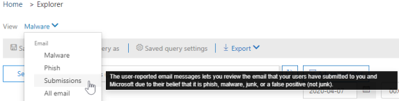

# Threat Explorer and real-time detections

If your organization has [Office 365 Advanced Threat Protection](office-365-atp.md) (Office 365 ATP), and you have the [necessary permissions](#required-licenses-and-permissions), you have either **Explorer** or **real-time detections** (formerly *real-time reports* — [see what's new](#new-features-in-threat-explorer-and-real-time-detections)!). In the Security & Compliance Center, go to **Threat management**, and then choose **Explorer** OR **Real-time detections**. 

|With ATP Plan 2, you see:  |With ATP Plan 1, you see:  |
|---------|---------|
|      |         |

With Explorer (or real-time detections), you have a powerful report that enables your Security Operations team to investigate and respond to threats effectively and efficiently. The report resembles the following image: 

With this report, you can:
- [See malware detected by Office 365 security features](#see-malware-detected-in-email-by-technology)
- [View data about phishing URLs and click verdict](#view-data-about-phishing-urls-and-click-verdict)
- [Start an automated investigation and response process from a view in Explorer](#start-automated-investigation-and-response) (ATP Plan 2 only)
- ... [Investigate malicious email, and more](#more-ways-to-use-explorer-or-real-time-detections)!

## New features in Threat Explorer and real-time detections

Three new features added into Threat Explorer and real-time detections:
- [Preview email header and download email body](#preview-email-header-and-download-email-body)
- [Email timeline](#email-timeline)
- [Export URL click data](#export-url-click-data)

These new features are outlined below.

### Preview email header and download email body

The ability to preview an email header and download the email body are new features available in Threat Explorer. Admins will be able to analyze downloaded headers/email messages for threats. Because downloading email messages can risk the exposure of information, this process is controlled by roles-based access control (RBAC). A new role, *Preview*, must be added to another Office 365 role group (such as Security Operations or Security Administrator) to grant the ability to download mails and preview headers in all-email messages view.

But Explorer (and real-time detections) also adds fresh new fields designed to give you a more complete picture of where your email messages land. Part of the goal of this change is to make hunting easier for Security Ops people, but the net result is knowing the location of problem email messages at a glance.

How is this done? Delivery Status is now broken out into two columns:

- **Delivery Action** - What is the status of this email?
- **Delivery Location** - Where was this email routed as a result?

Delivery Action is the action taken on an email due to existing policies or detections. Here are the possible actions an email can take:

|Delivered  |Junked  |Blocked  |Replaced  |
|---------|---------|---------|---------|
|Email was delivered to the user's inbox or another folder, and the user can directly access it.    | Email was sent to either user's Junk folder or Deleted folder, and the user has access to email messages in those folders.       | Any email messages that are quarantined, that failed, or were dropped, and are not accessible by the user.     | Any email messages where malicious attachments were replaced by .txt files that state the attachments were malicious.     |

And here is what the user can see, and what they can't:

|Accessible to end users  |Inaccessible to end users  |
|---------|---------|
|Delivered     | Blocked        |
|Junked     | Replaced        |

Delivery location shows the results of policies and detections that run post-delivery. It's linked to a Delivery Action. This field was added to give insight into the action taken when a problem mail is found. Here are the possible values of delivery location:

- **Inbox or folder**: The email is in inbox or a folder (according to your email rules).
- **On-prem or external**: The mailbox doesn't exist on cloud but is on-premises.
- **Junk folder**: The email is in the Junk folder of a user.
- **Deleted items folder**: The email in the Deleted items folder of a user.
- **Quarantine**: The email in quarantine, and is not in a user's mailbox.
- **Failed**: The email failed to reach the mailbox.
- **Dropped**: The email gets lost somewhere in the mail flow.

### Email timeline

The **Email Timeline** is another new Explorer feature aimed at making the hunting experience better for admins. It cuts down on randomization because there is less time spent checking different locations to try to understand the event. When multiple events happen at, or close to, the same time on an email, those events will show up in a timeline view. In fact, some events that happen post-delivery to your mail will be captured in the 'Special action' column. Combining the information from the timeline of that mail with the special action taken on the mail post-delivery will give admins insight into how their policies work, where the mail was finally routed, and, in some cases, what the final assessment was.

For more discussion about investigating malicious email messages, see [Find and investigate malicious email that was delivered in Office 365](https://docs.microsoft.com/office365/securitycompliance/investigate-malicious-email-that-was-delivered).

### Export URL click data

Also, you will now be able to export reports for URL clicks to Microsoft Excel in order to view both their Network Message ID, and their Click Verdict, making the task of understanding where your URL click traffic originated easier. Here's how it works. Starting in Threat Management on the Office 365 quick-launch, click through this chain:

**Explorer** > **View Phish** > **Clicks** > **Top URLs or URL Top Clicks** > **Click on any record to open URL flyout**

When you click on a URL in the list, you'll see a new Export button on the fly-out panel. Use this button to move data to an Excel spreadsheet for easier reporting.

You can get to the same location in the real-time detections report as follows:

**Explorer** > **Real-time Detections** > **View Phish** > **URLs** > **Top URLs or Top Clicks** > **Click on any record to open URL flyout** > **Navigate to the Clicks Tab.**

> [!TIP]
> Network Message ID maps the click back to specific mails when you search through Explorer or associated 3rd party tools via Network Message ID. Searching through the Network Message ID will give admins the specific email associated with a click result. On export having, the correlating identification of Network Message ID makes for quicker and more powerful analysis.

## See malware detected in email by technology

Suppose you want to see malware detected in email, by Office 365 technology. To do this, use the [Email > Malware](threat-explorer-views.md#email--malware) view of Explorer (or real-time detections).

1. In the Security & Compliance Center ([https://protection.office.com](https://protection.office.com)), choose **Threat management** > **Explorer** (or **Real-time detections**). (This example uses Explorer.)

2. In the **View** menu, choose **Email** > **Malware**.  

3. Click **Sender**, and then choose **Basic** > **Detection technology**. Your detection technologies are now available as filters for the report.   

4. Select an option, and then click the **Refresh** button to apply that filter.   

The report refreshes to show the results malware detected in email, using the technology option you selected. From here, you can conduct further analysis.

## View data about phishing URLs and click verdict

Suppose that you want to see phishing attempts through URLs in email, including a list of URLs that were allowed, blocked, and overridden. Identifying URLs that were clicked requires [ATP Safe links](atp-safe-links.md) to be configured. Make sure that you have set up [ATP Safe Links policies](set-up-atp-safe-links-policies.md) for time-of-click protection and logging of click verdicts by ATP Safe Links. 

To review phish URLs in messages and clicks on URLs in phish messages, use the [Email > Phish](threat-explorer-views.md#email--phish) view of Explorer (or real-time detections).

1. In the Security & Compliance Center ([https://protection.office.com](https://protection.office.com)), choose **Threat management** > **Explorer** (or **Real-time detections**). (This example uses Explorer.)

2. In the **View** menu, choose **Email** > **Phish**.  

3. Click **Sender**, and then choose **URLs** > **Click verdict**.

4. Select one or more options, such as **Blocked** and **Block overridden**, and then click the **Refresh** button that is on the same line as the options to apply that filter. (Don't refresh your browser window.)  

    The report refreshes to show two different URL tables on the URL tab under the report:

   - **Top URLs** are the URLs contained in the messages you have filtered down to, and the email delivery action counts for each URL. In the phish email view, this list typically will contain legitimate URLs. Attackers include a mix of good and bad URLs in their messages to try to get them delivered, but they will make the malicious links more interesting for the user to click. The table of URLs is sorted by total email count (NOTE: This column is not shown to simplify the view).

   - **Top clicks** are the Safe Links wrapped URLs that were clicked, sorted by total click count (this column is also not shown to simplify the view). Total counts by column indicate the Safe Links click verdict count for each clicked URL. In the phish email view, these are more often suspicious or malicious URLs, but could include clean URLs that are in phish messages. URL clicks on unwrapped links will not show up here.
   
   The two URL tables show top URLs in phishing email messages by delivery action and location, and they show URL clicks that were blocked (or visited despite a warning) so that you can understand what potential bad links were received by users and interacted with by users. From here, you can conduct further analysis. For example, below the chart, you can see the top URLs in email messages that were blocked in your organization's environment.
   
   
   
   Select a URL to view more detailed information. **Note**: In the URL flyout dialog, the filtering on email messages is removed to show you the full view of the URL's exposure in your environment. This lets you filter down email messages in Explorer to ones you are concerned about, find specific URLs that are potential threats, then expand your understanding of the URL exposure in your environment (via the URL details dialog) without having to add URL filters to the Explorer view itself.

## Review email messages reported by users

Suppose that you want to see email messages that users in your organization have reported as Junk, Not Junk, or Phishing by using the [Report Message add-in for Outlook and Outlook on the web](enable-the-report-message-add-in.md). To do this, use the [Email > Submissions](threat-explorer-views.md#email--submissions) view of Explorer (or real-time detections).

1. In the Security & Compliance Center ([https://protection.office.com](https://protection.office.com)), choose **Threat management** > **Explorer** (or **Real-time detections**). (This example uses Explorer.)

2. In the **View** menu, choose **Email** > **Submissions**.  

3. Click **Sender**, and then choose **Basic** > **Report type**.

4. Select an option, such as **Phish**, and then click the **Refresh** button.    

The report refreshes to show data about email messages that people in your organization have reported as a phishing attempt. You can use this information to conduct further analysis, and if necessary, adjust your [ATP anti-phishing policies](set-up-anti-phishing-policies.md).

## Start automated investigation and response

> [!NOTE]
> Automated investigation and response capabilities are available in **Office 365 ATP Plan 2** and **Office 365 E5**.

(NEW!) [Automated investigation and response](automated-investigation-response-office.md) can save your security operations team much time and effort in investigating and mitigating cyberattacks. In addition to configuring alerts that can trigger a security playbook, you can start an automated investigation and response process from a view in Explorer. 

For details on this, see [Example: A security administrator triggers an investigation from Explorer](automated-investigation-response-office.md#example-a-security-administrator-triggers-an-investigation-from-threat-explorer).

## More ways to use Explorer (or real-time detections)

In addition to the scenarios outlined in this article, you have many more reporting options available with Explorer (or real-time detections). 
- [Find and investigate malicious email that was delivered](investigate-malicious-email-that-was-delivered.md)
- [View malicious files detected in SharePoint Online, OneDrive, and Microsoft Teams](malicious-files-detected-in-spo-odb-or-teams.md)
- [Get an overview of the views in Threat Explorer (and real-time detections)](threat-explorer-views.md)

## Required licenses and permissions

You must have [Office 365 ATP](office-365-atp.md) to get Explorer or real-time detections.
- Explorer is included in Office 365 ATP Plan 2. 
- The real-time detections report is included in Office 365 ATP Plan 1.
- Plan to assign licenses for all users who should be protected by Office 365 ATP. (Explorer or real-time detections shows detection data for licensed users.)

To view and use Explorer or real-time detections, you must have appropriate permissions, such as those granted to a security administrator or security reader. 

- For the Security &amp; Compliance Center, you must have one of the following roles assigned:
    - Organization Management
    - Security Administrator (this can be assigned in the Azure Active Directory admin center ([https://aad.portal.azure.com](https://aad.portal.azure.com)))
    - Security Reader

- For Exchange Online, you must have one of the following roles assigned in either the Exchange admin center ([https://outlook.office365.com/ecp](https://outlook.office365.com/ecp)) or with PowerShell cmdlets (See [Exchange Online PowerShell](https://docs.microsoft.com/powershell/exchange/exchange-online/exchange-online-powershell)):
    - Organization Management
    - View-only Organization Management
    - View-Only Recipients role
    - Compliance Management

To learn more about roles and permissions, see the following resources:

- [Permissions in the Office 365 Security &amp; Compliance Center](permissions-in-the-security-and-compliance-center.md)
- [Feature permissions in Exchange Online](https://docs.microsoft.com/exchange/permissions-exo/feature-permissions)
  
## Some differences between Threat Explorer and real-time detections

 - The **real-time detections** report is available in Office 365 ATP Plan 1, whereas **Threat Explorer** is available in Office 365 ATP Plan 2.
 - The **real-time detections** report allows you to view detections in real-time. **Threat Explorer** does this as well, but also allows you to view additional details for a given attack.
