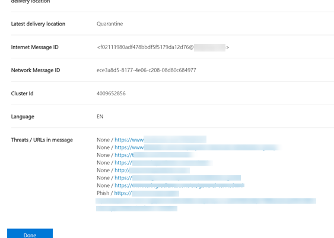

# Threat Explorer and Real-time detections

**Applies to**
- [Microsoft Defender for Office 365 plan 1 and plan 2](https://go.microsoft.com/fwlink/?linkid=2148715)
- [Microsoft 365 Defender](https://go.microsoft.com/fwlink/?linkid=2118804)

If your organization has [Microsoft Defender for Office 365](defender-for-office-365.md), and you have the [necessary permissions](#required-licenses-and-permissions), you have either **Explorer** or **Real-time detections** (formerly *Real-time reports* — [see what's new](#new-features-in-threat-explorer-and-real-time-detections)!). In the Security & Compliance Center, go to **Threat management**, and then choose **Explorer** _or_ **Real-time detections**.

|With Microsoft Defender for Office 365 Plan 2, you see:|With Microsoft Defender for Office 365 Plan 1, you see:|
|---|---|
|||
|

Explorer or Real-time detections helps your security operations team investigate and respond to threats efficiently. The report resembles the following image:

With this report, you can:

- [See malware detected by Microsoft 365 security features](#see-malware-detected-in-email-by-technology)
- [View phishing URL and click verdict data](#view-phishing-url-and-click-verdict-data)
- [Start an automated investigation and response process from a view in Explorer](#start-automated-investigation-and-response) (Defender for Office 365 Plan 2 only)
- [Investigate malicious email, and more](#more-ways-to-use-explorer-and-real-time-detections)

## Improvements to Threat Explorer and Real-time detections

### Tags in Threat Explorer

> [!NOTE]
> The user tags feature is in *Preview*, isn't available to everyone, and is subject to change. For information about the release schedule, check out the Microsoft 365 roadmap.

User tags identify specific groups of users in Microsoft Defender for Office 365. For more information about tags, including licensing and configuration, see [User tags](user-tags.md).

In Threat Explorer, you can see information about user tags in the following experiences.

#### Email grid view

The **Tags** column in the email grid contains all the tags that have been applied to the sender or recipient mailboxes. By default, system tags like priority accounts are shown first.

> [!div class="mx-imgBorder"]
> 

#### Filtering

You can use tags as a filter. Hunt just across priority accounts or specific user tags scenarios. You can also exclude results that have certain tags. Combine this functionality with other filters to narrow your scope of investigation.

> [!div class="mx-imgBorder"]
> 

#### Email detail flyout
To view the individual tags for sender and recipient, select the subject to open the message details flyout. On the **Summary** tab, the sender and recipient tags are shown separately, if they're present for an email.
The information about individual tags for sender and recipient also extends to exported CSV data, where you can see these details in two separate columns.

> [!div class="mx-imgBorder"]
> 

Tags information is also shown in the URL clicks flyout. To view it, go to Phish or All Email view and then to the **URLs** or **URL Clicks** tab. Select an individual URL flyout to view additional details about clicks for that URL, including tags associated with that click.

> [!div class="mx-imgBorder"]
> 

## Improvements to the threat hunting experience (upcoming)

### Updated threat information for emails

We've focused on platform and data-quality improvements to increase data accuracy and consistency for email records. Improvements include consolidation of pre-delivery and post-delivery information, such as actions executed on an email as part of the ZAP process, into a single record. Additional details like spam verdict, entity-level threats (for example, which URL was malicious), and latest delivery locations are also included.

After these updates, you'll see a single entry for each message, regardless of the different post-delivery events that affect the message. Actions can include ZAP, manual remediation (which means admin action), dynamic delivery, and so on.

In addition to showing malware and phishing threats, you see the spam verdict associated with an email. Within the email, see all the threats associated with the email along with the corresponding detection technologies. An email can have zero, one, or multiple threats. You'll see the current threats in the **Details** section of the email flyout. For multiple threats (such as malware and phishing), the **Detection tech** field shows the threat-detection mapping, which is the detection technology that identified the threat.

The set of detection technologies now includes new detection methods, as well as spam-detection technologies. You can use the same set of detection technologies to filter the results across the different email views (Malware, Phish, All Email).

> [!NOTE]
> Verdict analysis might not necessarily be tied to entities. As an example, an email might be classified as phish or spam, but there are no URLs that are stamped with a phish/spam verdict. This is because the filters also evaluate content and other details for an email before assigning a verdict.

#### Threats in URLs

You can now see the specific threat for a URL on the email flyout **Details** tab. The threat can be *malware*, *phish*, *spam*, or *none*.)

> [!div class="mx-imgBorder"]
> 

### Updated timeline view (upcoming)

> [!div class="mx-imgBorder"]
> 

Timeline view identifies all delivery and post-delivery events. It includes information about the threat identified at that point of time for a subset of these events. Timeline view also provides information about any additional action taken (such as ZAP or manual remediation), along with the result of that action. Timeline view information includes:

- **Source:** Source of the event. It can be admin/system/user.
- **Event:** Includes top-level events like original delivery, manual remediation, ZAP, submissions, and dynamic delivery.
- **Action:** The specific action that was taken either as part of ZAP or admin action (for example, soft delete).
- **Threats:** Covers the threats (malware, phish, spam) identified at that point of time.
- **Result/Details:** More information about the result of the action, such as whether it was performed as part of ZAP/admin action.

### Original and latest delivery location

Currently, we surface delivery location in the email grid and email flyout. The **Delivery location** field is getting renamed ***Original delivery location***. And we're introducing another field, ***Latest delivery location***.

**Original delivery location** will give more information about where an email was delivered initially. **Latest delivery location** will state where an email landed after system actions like *ZAP* or admin actions like *Move to deleted items*. Latest delivery location is intended to tell admins the message's last-known location post-delivery or any system/admin actions. It doesn't include any end-user actions on the email. For example, if a user deleted a message or moved the message to archive/pst, the message "delivery" location won't be updated. But if a system action updated the location (for example, ZAP resulting in an email moving to quarantine), **Latest delivery location** would show as "quarantine."

> [!div class="mx-imgBorder"]
> 

> [!NOTE]
> There are a few cases where **Delivery location** and **Delivery action** may show as "unknown":
>
> - You might see **Delivery location** as "delivered" and **Delivery location** as "unknown" if the message was delivered, but an Inbox rule moved the message to a default folder (such as Draft or Archive) instead of to the Inbox or Junk Email folder.
>
> - **Latest delivery location** can be unknown if an admin/system action (such as ZAP) was attempted, but the message wasn't found. Typically, the action happens after the user  moved or deleted the message. In such cases, verify the **Result/Details** column in timeline view. Look for the statement "Message moved or deleted by the user."

> [!div class="mx-imgBorder"]
> 

### Additional actions

*Additional actions* were applied after delivery of the email. They can include *ZAP*, *manual remediation* (action taken by an Admin such as soft delete), *dynamic delivery*, and *reprocessed* (for an email that was retroactively detected as good).

> [!NOTE]
> - As part of the pending changes, the "Removed by ZAP" value currently surfaced in the Delivery Action filter is going away. You'll have a way to search for all email with the ZAP attempt through **Additional actions**.
>
> - There will be new fields and values for **Detection technologies** and **Additional actions** (especially for ZAP scenarios). You'll need to evaluate your existing saved queries and tracked queries to make sure they work with the new values.

> [!div class="mx-imgBorder"]

> 

### System overrides

*System overrides* enable you to make exceptions to the intended delivery location of a message. You override the delivery location provided by the system, based on the threats and other detections identified by the filtering stack. System overrides can be set through tenant or user policy to deliver the message as suggested by the policy. Overrides can identify unintentional delivery of malicious messages due to configurations gaps, such as an overly broad Safe Sender policy set by a user. These override values can be:

- Allowed by user policy: A user creates policies at the mailbox level to allows domains or senders.
- Blocked by user policy: A user creates policies at the mail box level to block domains or senders.
- Allowed by org policy: The organization's security teams set policies or Exchange mail flow rules (also known as transport rules) to allow senders and domains for users in their organization. This can be for a set of users or the entire organization.
- Blocked by org policy: The organization's security teams set policies or mail flow rules to block senders, domains, message languages, or source IPs for users in their organization. This can be applied to a set of users or the entire organization.
- File extension blocked by org policy: An organization's security team blocks a file name extension through the anti-malware policy settings. These values will now be displayed in email details to help with investigations. Secops teams can also use the rich-filtering capability to filter on blocked file extensions.

> [!div class="mx-imgBorder"]
> 

### Improvements for the URL and clicks experience

The improvements include:

- Show the full clicked URL (including any query parameters that are part of the URL) in the **Clicks** section of the URL flyout. Currently, the URL domain and path appear in the title bar. We're extending that information to show the full URL.

- Fixes across URL filters (*URL* versus *URL domain* versus *URL domain and path*): The updates affect searching for messages that contain a URL/click verdict. We enabled support for protocol-agnostic searches, so you can search for a URL without using `http`. By default, the URL search maps to http, unless another value is explicitly specified. For example:

   -  Search with and without the `http://` prefix in the **URL**, **URL Domain**, and **URL Domain and Path** filter fields. The searches should show the same results.

   -  Search for the `https://` prefix in **URL**. When no value is specified, the `http://` prefix is assumed.

   - `/` is ignored at the beginning and end of the **URL path**, **URL Domain**, **URL domain and path** fields. `/` at the end of the **URL** field is ignored.

### Phish confidence level

Phish confidence level helps identify the degree of confidence with which an email was categorized as "phish." The two possible values are *High* and *Normal*. In the initial stages, this filter will be available only in the Phish view of Threat Explorer.

### ZAP URL signal

The ZAP URL signal is typically used for ZAP Phish alert scenarios where an email was identified as Phish and removed after delivery. This signal connects the alert with the corresponding results in Explorer. It's one of the IOCs for the alert.

To improve the hunting process, we've updated Threat Explorer and Real-time detections to make the hunting experience more consistent. The changes are outlined here:

- [Timezone improvements](#timezone-improvements)
- [Update in the refresh process](#update-in-the-refresh-process)
- [Chart drilldown to add to filters](#chart-drilldown-to-add-to-filters)
- [In product information updates](#in-product-information-updates)

### Filter by user tags

You can now sort and filter on system or custom user tags to quickly grasp the scope of threats. To learn more, see [User tags](user-tags.md).

> [!IMPORTANT]
> Filtering and sorting by user tags is currently in public preview. This functionality may be substantially modified before it's commercially released. Microsoft makes no warranties, express or implied, with respect to the information provided about it.

### Timezone improvements

You'll see the time zone for the email records in the Portal as well as for Exported data. It will be visible across experiences like Email Grid, Details flyout, Email Timeline, and Similar Emails, so the time zone for the result set is clear.

> [!div class="mx-imgBorder"]
> 

### Update in the refresh process

Some users have commented about confusion with automatic refresh (for example, as soon as you change the date, the page refreshes) and manual refresh (for other filters). Similarly, removing filters leads to automatic refresh. Changing filters while modifying the query can cause inconsistent search experiences. To resolve these issues, we're moving to a manual-filtering mechanism.

From an experience standpoint, the user can apply and remove the different range of filters (from the filter set and date) and select the refresh button to filter the results after they've defined the query. The refresh button is also now emphasized on the screen. We've also updated the related tooltips and in-product documentation.

> [!div class="mx-imgBorder"]
> 

### Chart drilldown to add to filters

You can now chart legend values to add them as filters. Select the **Refresh** button to filter the results.

> [!div class="mx-imgBorder"]
> 

### In-product information updates

Additional details are now available within the product, such as the total number of search results within the grid (see below). We've improved labels, error messages, and tooltips to provide more information about the filters, search experience, and result set.

> [!div class="mx-imgBorder"]
> 

## Extended capabilities in Threat Explorer

### Top targeted users

Today we expose the list of the top targeted users in the Malware view for emails, in the **Top Malware Families** section. We'll be extending this view in the Phish and All Email views as well. You'll be able to see the top-five targeted users, along with the number of attempts for each user for the corresponding view. For example, for Phish view, you'll see the number of Phish attempts.

You'll be able to export the list of targeted users, up to a limit of 3,000, along with the number of attempts for offline analysis for each email view. In addition, selecting the number of attempts (for example, 13 attempts in the image below) will open a filtered view in Threat Explorer, so you can see more details across emails and threats for that user.

> [!div class="mx-imgBorder"]
> 

### Exchange transport rules

As part of data enrichment, you'll be able to see all the different Exchange transport rules (ETR) that were applied to a message. This information will be available in the Email grid view. To view it,  select **Column options** in the grid and then **Add Exchange Transport Rule** from the column options. It will also be visible on the **Details** flyout in the email.

You'll be able to see both the GUID and the name of the transport rules that were applied to the message. You'll be able to search for the messages by using the name of the transport rule. This is a "Contains" search, which means you can do partial searches as well.

#### Important note:

ETR search and name availability depend on the specific role that's assigned to you. You need to have one of the following roles/permissions to view the ETR names and search. If you don't have any of these roles assigned to you, you can't see the names of the transport rules or search for messages by using ETR names. However, you could see the ETR label and GUID information in the Email Details. Other record-viewing experiences in Email Grids, Email flyouts, Filters, and Export are not affected.

- EXO Only - Data Loss Prevention: All
- EXO Only - O365SupportViewConfig: All
- Microsoft Azure Active Directory or EXO - Security Admin: All
- AAD or EXO - Security Reader: All
- EXO Only - Transport Rules: All
- EXO Only - View-Only Configuration: All

Within the email grid, Details flyout, and Exported CSV, the ETRs are presented with a Name/GUID as shown below.

> [!div class="mx-imgBorder"]
> 

### Inbound connectors

Connectors are a collection of instructions that customize how your email flows to and from your Microsoft 365 or Office 365 organization. They enable you to apply any security restrictions or controls. Within Threat Explorer, you can now view the connectors that are related to an email and search for emails by using connector names.

The search for connectors is "contains" in nature, which means partial keyword searches should work as well. Within the Main grid view, the Details flyout, and the Exported CSV, the connectors are shown in the Name/GUID format as shown here:

> [!div class="mx-imgBorder"]
> 

## New features in Threat Explorer and Real-time detections

Three new features are available in Threat Explorer and Real-time detections:

- [Preview email header and download email body](#preview-email-header-and-download-email-body)
- [Email timeline](#email-timeline)
- [Export URL click data](#export-url-click-data)

These new features are outlined below.

### Preview email header and download email body

You can now preview an email header and download the email body in Threat Explorer Admins can analyze downloaded headers/email messages for threats. Because downloading email messages can risk exposure of information, this process is controlled by role-based access control (RBAC). A new role, *Preview*, must be added to another role group (such as Security Operations or Security Administrator) to grant the ability to download mails in all-email messages view. However, viewing email header does not require any additional role (other than what is required to view messages in Threat Explorer).

Explorer and Real-time detections will also get new fields that provide a more complete picture of where your email messages land. These changes  make hunting easier for Security Ops. But the main result is you can know the location of problem email messages at a glance.

How is this done? Delivery status is now broken out into two columns:

- **Delivery action** - Status of the email.
- **Delivery location** - Where the email was routed.

*Delivery action* is the action taken on an email due to existing policies or detections. Here are the possible actions for an email:

|Delivered|Junked|Blocked|Replaced|
|---|---|---|---|
|Email was delivered to the inbox or folder of a user, and the user can access it.|Email was sent to the user's Junk  or Deleted folder, and the user can access it.|Emails that are quarantined, that failed, or were dropped. These mails are inaccessible to the user.|Email had malicious attachments replaced by .txt files that state the attachment was malicious.|

Here is what the user can and can't see:

|Accessible to end users|Inaccessible to end users|
|---|---|
|Delivered|Blocked|
|Junked|Replaced|

**Delivery location** shows the results of policies and detections that run post-delivery. It's linked to ***Delivery action***. These are the possible values:

- *Inbox or folder*: The email is in the inbox or a folder (according to your email rules).
- *On-prem or external*: The mailbox doesn't exist on cloud but is on-premises.
- *Junk folder*: The email is in a user's Junk folder.
- *Deleted items folder*: The email in a user's Deleted items folder.
- *Quarantine*: The email is in quarantine and not in a user's mailbox.
- *Failed*: The email failed to reach the mailbox.
- *Dropped*: The email got lost somewhere in the mail flow.

### Email timeline

The **Email timeline** is a new Explorer feature that improves the hunting experience for admins. It cuts the time spent checking different locations to try to understand the event. When multiple events happen at or close to the same time an email arrives, those events are displayed in a timeline view. Some events that happen to your email post-delivery are captured in the **Special action** column. Admins can combine  information from the timeline with the special action taken on the mail post-delivery to get insight into how their policies work, where the mail was finally routed, and, in some cases, what the final assessment was.

For more information, see [Investigate and remediate malicious email that was delivered in Office 365](investigate-malicious-email-that-was-delivered.md).

### Export URL click data

You can now export reports for URL clicks to Microsoft Excel to view their **network message ID** and **click verdict**, which helps explain where your URL click traffic originated. Here's how it works: In Threat Management on the Office 365 quick-launch bar, follow this chain:

**Explorer** \> **View Phish** \> **Clicks** \> **Top URLs** or **URL Top Clicks** \> select any record to open the URL flyout.

When you select a URL in the list, you'll see a new **Export** button on the fly-out panel. Use this button to move data to an Excel spreadsheet for easier reporting.

Follow this path to get to the same location in the Real-time detections report:

**Explorer** \> **Real-time detections** \> **View Phish** \> **URLs** \> **Top URLs** or **Top Clicks** \> Select any record to open the URL flyout \> navigate to the **Clicks** tab.

> [!TIP]
> The Network Message ID maps the click back to specific mails when you search on the ID through Explorer or associated third-party tools. Such searches identify the email associated with a click result. Having the correlated Network Message ID makes for quicker and more powerful analysis.

> [!div class="mx-imgBorder"]
> 

## See malware detected in email by technology

Suppose you want to see malware detected in email sorted by Microsoft 365 technology. To do this, use the [Email > Malware](threat-explorer-views.md#email--malware) view of Explorer (or Real-time detections).

1. In the Security & Compliance Center (<https://protection.office.com>), choose **Threat management** \> **Explorer** (or **Real-time detections**). (This example uses Explorer.)

2. In the **View** menu, choose **Email** \> **Malware**.

   > [!div class="mx-imgBorder"]
   > 

3. Click **Sender**, and then choose **Basic** \> **Detection technology**.

   Your detection technologies are now available as filters for the report.

   > [!div class="mx-imgBorder"]
   > 

4. Choose an option. Then select the **Refresh** button to apply that filter.

   > [!div class="mx-imgBorder"]
   > 

The report refreshes to show the results that malware detected in email, using the technology option you selected. From here, you can conduct further analysis.

## View phishing URL and click verdict data

Suppose that you want to see phishing attempts through URLs in email, including a list of URLs that were allowed, blocked, and overridden. To identify URLs that were clicked, [Safe Links](safe-links.md) must be configured. Make sure that you set up [Safe Links policies](set-up-safe-links-policies.md) for time-of-click protection and logging of click verdicts by Safe Links.

To review phish URLs in messages and clicks on URLs in phish messages, use the [**Email** > **Phish**](threat-explorer-views.md#email--phish) view of Explorer or Real-time detections.

1. In the Security & Compliance Center (<https://protection.office.com>), choose **Threat management** \> **Explorer** (or **Real-time detections**). (This example uses Explorer.)

2. In the **View** menu, choose **Email** \> **Phish**.

   > [!div class="mx-imgBorder"]
   > 

3. Click **Sender**, and then choose **URLs** \> **Click verdict**.

4. Select one or more options, such as **Blocked** and **Block overridden**, and then select the **Refresh** button on the same line as the options to apply that filter. (Don't refresh your browser window.)

   > [!div class="mx-imgBorder"]
   > 

   The report refreshes to show two different URL tables on the URL tab under the report:

   - **Top URLs** are the URLs in the messages that you filtered down to and the email delivery action counts for each URL. In the Phish email view, this list typically contains legitimate URLs. Attackers include a mix of good and bad URLs in their messages to try to get them delivered, but they make the malicious links look more interesting. The table of URLs is sorted by total email count, but this column is hidden to simplify the view.

   - **Top clicks** are the Safe Links-wrapped URLs that were clicked, sorted by total click count. This column also isn't displayed, to simplify the view. Total counts by column indicate the Safe Links click verdict count for each clicked URL. In the Phish email view, these are usually suspicious or malicious URLs. But the view could include URLs that aren't threats but are in phish messages. URL clicks on unwrapped links don't show up here.

   The two URL tables show top URLs in phishing email messages by delivery action and location. The tables show URL clicks that were blocked or visited despite a warning, so you can see what potential bad links were presented to users and that the user's clicked. From here, you can conduct further analysis. For example, below the chart you can see the top URLs in email messages that were blocked in your organization's environment.

   > [!div class="mx-imgBorder"]
   > 

   Select a URL to view more detailed information.

   > [!NOTE]
   > In the URL flyout dialog box, the filtering on email messages is removed to show the full view of the URL's exposure in your environment. This lets you filter for email messages you're concerned about in Explorer, find specific URLs that are potential threats, and then expand your understanding of the URL exposure in your environment (via the URL details dialog box) without having to add URL filters to the Explorer view itself.

### Interpretation of click verdicts

Within the Email or URL flyouts, Top Clicks as well as within our filtering experiences, you'll see different click verdict values:

- **None:** Unable to capture the verdict for the URL. The user might have clicked through the URL.
- **Allowed:** The user was allowed to navigate to the URL.
- **Blocked:** The user was blocked from navigating to the URL.
- **Pending verdict:** The user was presented with the detonation-pending page.
- **Blocked overridden:** The user was blocked from navigating directly to the URL. But the user overrode the block to navigate to the URL.
- **Pending verdict bypassed:** The user was presented with the detonation page. But the user overrode the message to access the URL.
- **Error:** The user was presented with the error page, or an error occurred in capturing the verdict.
- **Failure:** An unknown exception occurred while capturing the verdict. The user might have clicked through the URL.

## Review email messages reported by users

Suppose that you want to see email messages that users in your organization reported as *Junk*, *Not Junk*, or *Phishing* through the [Report Message add-in](enable-the-report-message-add-in.md) or the [Report Phishing add-in](enable-the-report-phish-add-in.md). To see them, use the [**Email** > **Submissions**](threat-explorer-views.md#email--submissions) view of Explorer (or Real-time detections).

1. In the Security & Compliance Center (<https://protection.office.com>), choose **Threat management** \> **Explorer** (or **Real-time detections**). (This example uses Explorer.)

2. In the **View** menu, choose **Email** \> **Submissions**.

   > [!div class="mx-imgBorder"]
   > 

3. Click **Sender**, and then choose **Basic** \> **Report type**.

4. Select an option, such as **Phish**, and then select the **Refresh** button.

   > [!div class="mx-imgBorder"]
   > 

The report refreshes to show data about email messages that people in your organization reported as a phishing attempt. You can use this information to conduct further analysis, and, if necessary, adjust your [anti-phishing policies in Microsoft Defender for Office 365](configure-atp-anti-phishing-policies.md).

## Start automated investigation and response

> [!NOTE]
> Automated investigation and response capabilities are available in *Microsoft Defender for Office 365 Plan 2* and *Office 365 E5*.

[Automated investigation and response](automated-investigation-response-office.md) can save your security operations team time and effort spent investigating and mitigating cyberattacks. In addition to configuring alerts that can trigger a security playbook, you can start an automated investigation and response process from a view in Explorer. For details, see [Example: A security administrator triggers an investigation from Explorer](automated-investigation-response-office.md#example-a-security-administrator-triggers-an-investigation-from-threat-explorer).

## More ways to use Explorer and Real-time detections

In addition to the scenarios outlined in this article, you have many more reporting options available with Explorer (or Real-time detections). See the following articles:

- [Find and investigate malicious email that was delivered](investigate-malicious-email-that-was-delivered.md)
- [View malicious files detected in SharePoint Online, OneDrive, and Microsoft Teams](malicious-files-detected-in-spo-odb-or-teams.md)
- [Get an overview of the views in Threat Explorer (and Real-time detections)](threat-explorer-views.md)
- [Threat protection status report](view-email-security-reports.md#threat-protection-status-report)
- [Automated investigation and response in Microsoft Threat Protection](https://docs.microsoft.com/microsoft-365/security/mtp/mtp-autoir)

## Required licenses and permissions

You must have [Microsoft Defender for Office 365](defender-for-office-365.md) to use Explorer or Real-time detections.

- Explorer is included in Defender for Office 365 Plan 2.
- The Real-time detections report is included in Defender for Office 365 Plan 1.
- Plan to assign licenses for all users who should be protected by Defender for Office 365. Explorer and Real-time detections show detection data for licensed users.

To view and use Explorer or Real-time detections, you must have appropriate permissions, such as those granted to a security administrator or security reader.

- For the Security & Compliance Center, you must have one of the following roles assigned:

  - Organization Management
  - Security Administrator (this can be assigned in the Azure Active Directory admin center (<https://aad.portal.azure.com>)
  - Security Reader

- For Exchange Online, you must have one of the following roles assigned in either the Exchange admin center (<https://admin.protection.outlook.com/ecp/>) or [Exchange Online PowerShell](https://docs.microsoft.com/powershell/exchange/exchange-online-powershell):

  - Organization Management
  - View-Only Organization Management
  - View-Only Recipients
  - Compliance Management

To learn more about roles and permissions, see the following resources:

- [Permissions in the Security & Compliance Center](permissions-in-the-security-and-compliance-center.md)
- [Feature permissions in Exchange Online](https://docs.microsoft.com/exchange/permissions-exo/feature-permissions)

## Differences between Threat Explorer and Real-time detections

- The *Real-time detections* report is available in Defender for Office 365 Plan 1. *Threat Explorer* is available in Defender for Office 365 Plan 2.
- The Real-time detections report allows you to view detections in real time. Threat Explorer does this as well, but it also provides additional details for a given attack.
- An *All email* view is available in Threat Explorer but not in the Real-time detections report.
- More filtering capabilities and available actions are included in Threat Explorer. For more information, see [Microsoft Defender for Office 365 Service Description: Feature availability across Defender for Office 365 plans](https://docs.microsoft.com/office365/servicedescriptions/office-365-advanced-threat-protection-service-description#feature-availability-across-advanced-threat-protection-atp-plans).
