# Threat hunting in Threat Explorer for Microsoft Defender for Office 365

In this article:

- [Threat Explorer walk-through](#threat-explorer-walk-through)
- [Email investigation](#email-investigation)
- [Email remediation](#email-remediation)
- [Improvements to threat hunting experience](#improvements-to-threat-hunting-experience)

> [!NOTE]
> This is part of a **3-article series** on **Threat Explorer (Explorer)**, **email security**, and **Explorer and Real-time detections basics** (such as differences between the tools, and permissions needed to operate them). The other two articles in this series are [Email security with Threat Explorer](email-security-in-microsoft-defender.md) and [Threat Explorer and Real-time detections basics](real-time-detections.md).

**Applies to**
- [Microsoft Defender for Office 365 plan 1 and plan 2](defender-for-office-365.md)
- [Microsoft 365 Defender](../defender/microsoft-365-defender.md)

If your organization has [Microsoft Defender for Office 365](defender-for-office-365.md), and you have the [permissions](#required-licenses-and-permissions), you can use **Explorer** or **Real-time detections** to detect and remediate threats. 

In the **Security & Compliance Center**, go to **Threat management**, and then choose **Explorer** _or_ **Real-time detections**.

 

****

|With Microsoft Defender for Office 365 Plan 2, you see:|With Microsoft Defender for Office 365 Plan 1, you see:|
|---|---|
|||
|

With these tools, you can:

- See malware detected by Microsoft 365 security features
- View phishing URL and click verdict data
- Start an automated investigation and response process from a view in Explorer
- Investigate malicious email, and more

For more information, see [Email security with Threat Explorer](email-security-in-microsoft-defender.md). 

## Threat Explorer walk-through

In Microsoft Defender for Office 365, there are two subscription plans—Plan 1 and Plan 2. Manually operated Threat hunting tools exist in both plans, under different names and with different capabilities.

Defender for Office 365 Plan 1 uses *Real-time detections*, which is a subset of the *Threat Explorer* (also called *Explorer*) hunting tool in Plan 2. In this series of articles, most of the examples were created using the full Threat Explorer. Admins should test any steps in Real-time detections to see where they apply.

To open the Explorer tool, go to **Security & Compliance Center** > **Threat management** > **Explorer** (or **Real-time detections**). By default, you’ll arrive on the **Malware** page, but use the **View** drop down to get familiar with your options. If you’re hunting Phish, or digging into a threat campaign, choose those views.

> [!div class="mx-imgBorder"]
> 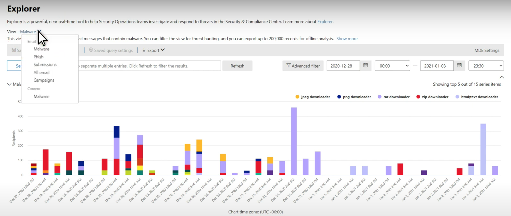

Once a security operations (Sec Ops) person selects the data they want to see, whether the scope is narrow view like user **Submissions**, or a wider view, like **All email**, they can use the **Sender** button to further filter. Remember to select Refresh to complete your filtering actions.

> [!div class="mx-imgBorder"]
> 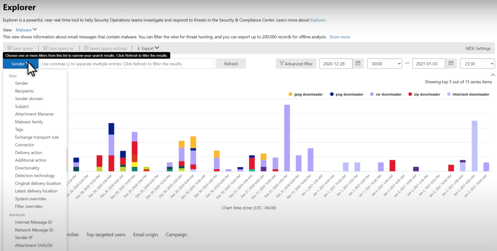

Refining focus in Explorer or Real-time detection can be thought of in layers. The first is **View**. The second can be thought of as a *filtered focus*. For example, you can retrace the steps you took in finding a threat by recording your decisions like this: To find the issue in Explorer, **I chose the Malware View with a Recipient filter focus**. This makes retracing your steps easier.

> [!TIP]
> If Sec Ops uses **Tags** to mark accounts they consider high valued targets, they can make selections like *Phish View with a Tags filter focus (include a date range if used)*. This will show them any phishing attempts directed at their high value user targets during a time-range (like dates when certain phishing attacks are happening a lot for their industry). 

Refinements can be made on date ranges by using the date range controls. Here you can see Explorer in **Malware** view, with a **Detection Technology** filter focus. But it’s the **Advanced filter** button that lets Sec Ops teams dig deep. 

> [!div class="mx-imgBorder"]
> 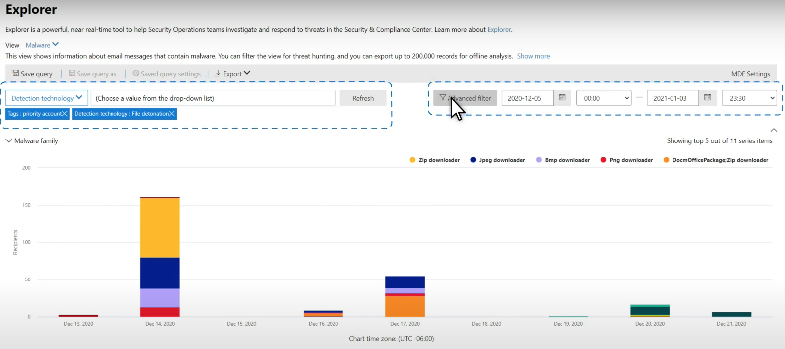

Clicking the **Advanced filter** pops a panel that will let Sec Ops hunters build queries themselves, letting them include or exclude the information they need to see. Both the chart and table on the Explorer page will reflect their results. 

> [!div class="mx-imgBorder"]
> 

Use the **Column options** button to get the kind of information on the table that would be most helpful: 

> [!div class="mx-imgBorder"]
> 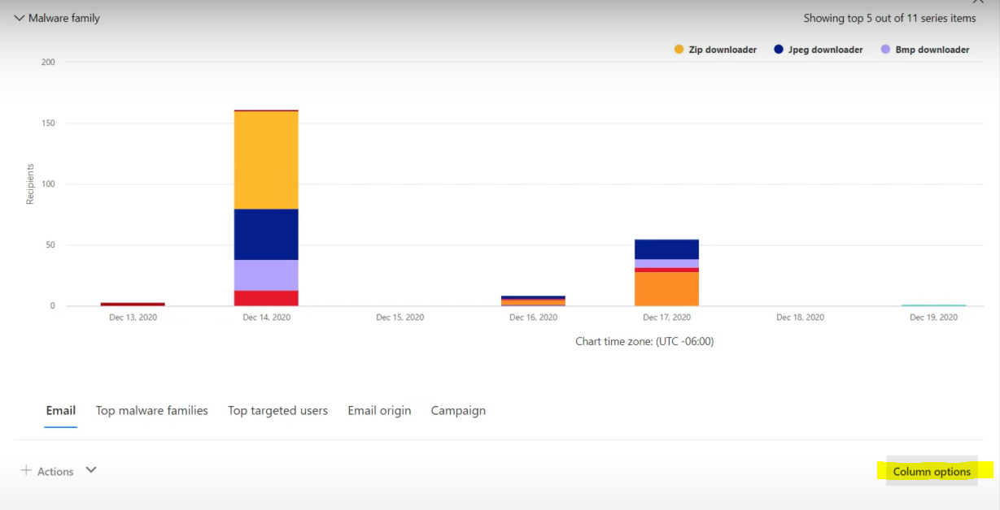

> [!div class="mx-imgBorder"]
> 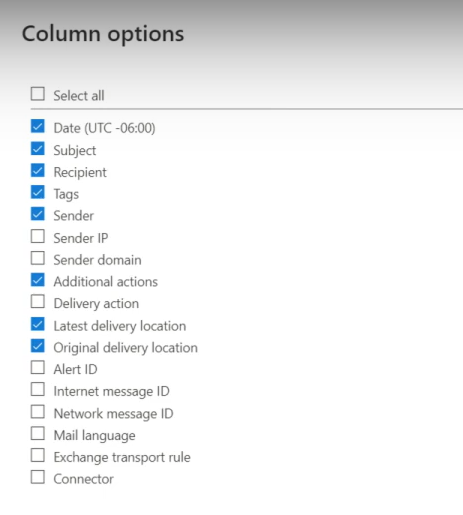

In the same mien, make sure to test your display options. Different audiences will react well to different presentations of the same data. For some viewers, the **Email Origins** map can show that a threat is widespread or discreet more quickly than the **Campaign display** option right next to it. Sec Ops can make use of these displays to best make points that underscore the need for security and protection, or for later comparison, to demonstrate the effectiveness of their actions. 

> [!div class="mx-imgBorder"]
> 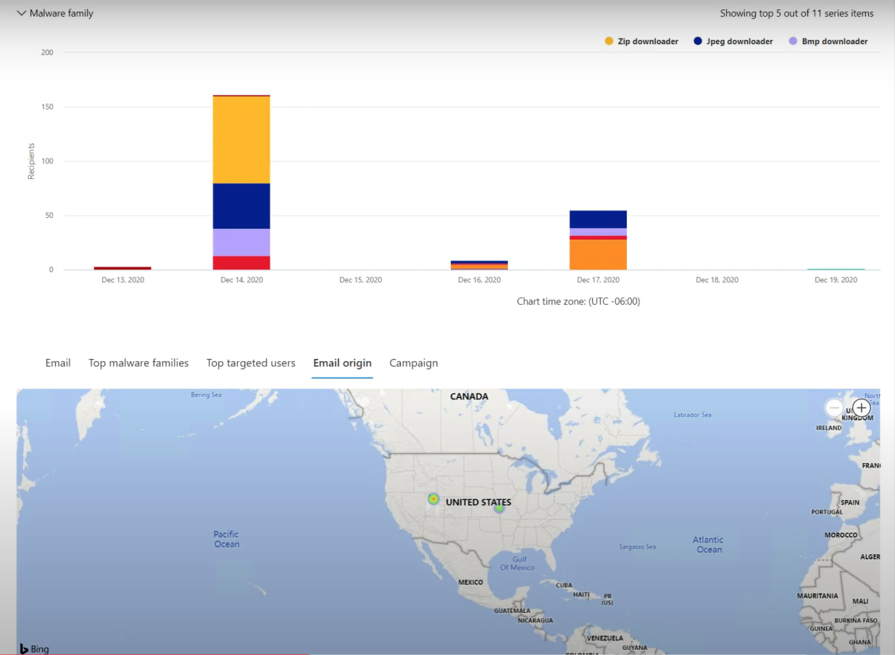

> [!div class="mx-imgBorder"]
> 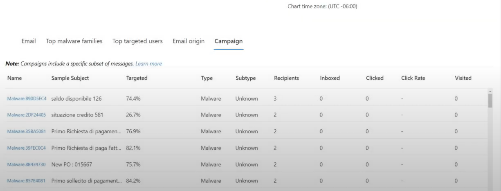

### Email investigation

When you see a suspicious email, click the name to expand the flyout on the right. Here, the banner that lets Sec Ops see the [email entity page](mdo-email-entity-page.md) is available.

The email entity page pulls together contents that can be found under **Details**, **Attachments**, **Devices**, but includes more organized data. This includes things like DMARC results, plain text display of the email header with a copy option, verdict information on attachments that were securely detonated, and files those detonations dropped (can include IP addresses that were contacted and screenshots of pages or files). URLs and their verdicts are also listed with similar details reported. 

When you reach this stage, the email entity page will be critical to the final step—*remediation*. 

> [!div class="mx-imgBorder"]
> 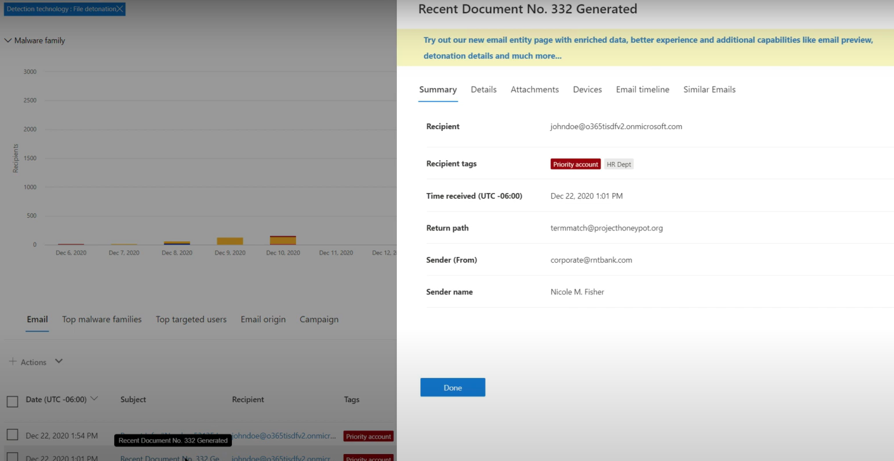

> [!TIP]
> To learn more about the rich email entity page (seen below on the **Analysis** tab), including the results of detonated Attachments, findings for included URLs, and safe Email preview, click [here](mdo-email-entity-page.md).

> [!div class="mx-imgBorder"]
> 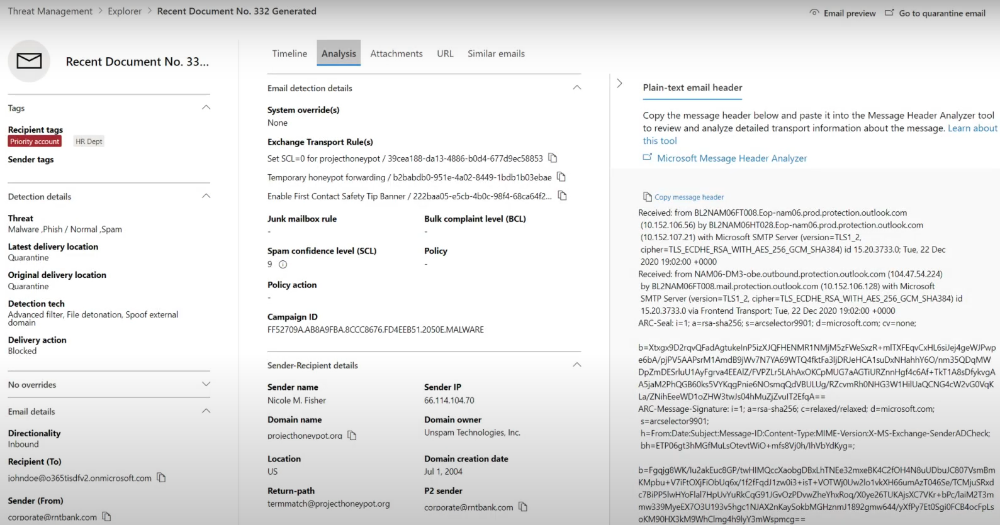

### Email remediation

Once a Sec Ops person determines that an email is a threat, the next Explorer or Real-time detection step is dealing with the threat and remediating it. This can be done by returning to Threat Explorer, selecting the checkbox for the problem email, and using the **Actions** button.

> [!div class="mx-imgBorder"]
> 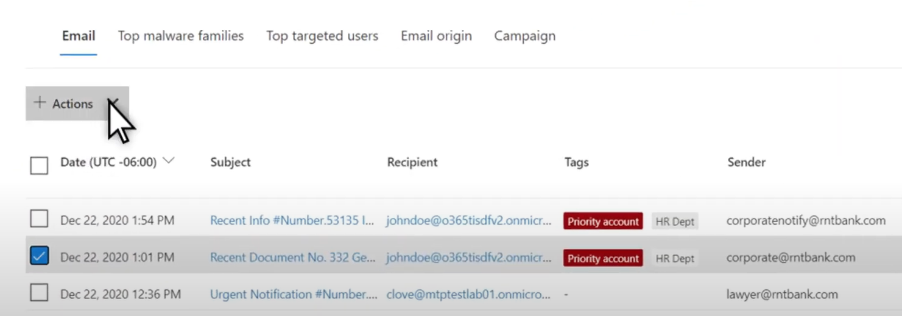

Here, the analyst can take actions like reporting the mail as Spam, Phishing, or Malware, contacting recipients, or further investigations that can include triggering Automated Investigation and Response (or AIR) playbooks (if you have Plan 2). Or, the mail can also be reported as clean.

> [!div class="mx-imgBorder"]
> 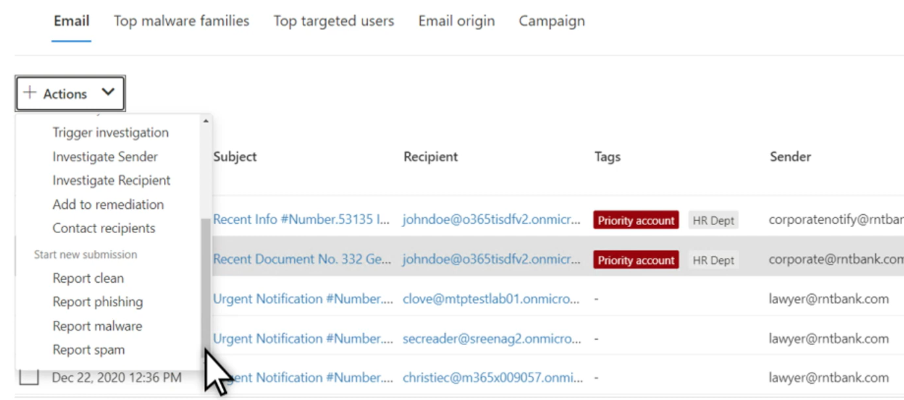

## Improvements to threat hunting experience

### Alert ID

When navigating from an alert into Threat Explorer, the **View** will be filtered by **Alert ID**. This also applies in Real-time detection. Messages relevant to the specific alert, and an email total (a count) are shown. You will be able to see if a message was part of an alert, as well as navigate from that message to the related alert.

Finally, alert ID is included in the URL, for example: `https://protection.office.com/viewalerts?id=372c9b5b-a6c3-5847-fa00-08d8abb04ef1`

> [!div class="mx-imgBorder"]
> 

> [!div class="mx-imgBorder"]
> 

### Extending Explorer (and Real-time detections) data retention and search limit for trial tenants 

As part of this change, analysts will be able to search for, and filter email data across 30 days (increased from seven days) in Threat Explorer and Real-time detections for both Defender for Office P1 and P2 trial tenants. This doesn’t impact any production tenants for both P1 and P2 E5 customers, where the retention default is already 30 days.

### Updated Export limit 

The number of Emails records that can be exported from Threat Explorer is now 200,000 (was 9990). The set of columns that can be exported is unchanged. 

### Tags in Threat Explorer

> [!NOTE]
> The user tags feature is in Preview and may not be available to everyone. Also, Previews are subject to change. For information about the release schedule, check out the Microsoft 365 roadmap.

User tags identify specific groups of users in Microsoft Defender for Office 365. For more information about tags, including licensing and configuration, see [User tags](user-tags.md).

In Threat Explorer, you can see information about user tags in the following experiences.

#### Email grid view

When analysts look at the **Tags** column the email grid, they are seeing all tags that have been applied to sender or recipient mailboxes. By default, system tags like *priority accounts* are shown first.

> [!div class="mx-imgBorder"]
> 

#### Filtering

Tags can be used as filters. Hunt among priority accounts only, or use specific user tags scenarios this way. You can also exclude results that have certain tags. Combine Tags with other filters and date ranges to narrow your scope of investigation. 

> [!div class="mx-imgBorder"]
> 

#### Email detail flyout

To view the individual tags for sender and recipient, select an email to open the message details flyout. On the **Summary** tab, the sender and recipient tags are shown separately. The information about individual tags for sender and recipient can be exported as CSV data. 

> [!div class="mx-imgBorder"]
> 

Tags information is also shown in the URL clicks flyout. To see it, go to Phish or All Email view > **URLs** or **URL Clicks** tab. Select an individual URL flyout to see additional details about clicks for that URL, including any Tags associated with that click.

### Updated Timeline View

> [!div class="mx-imgBorder"]
> 
>
Learn more by watching [this video](https://www.youtube.com/watch?v=UoVzN0lYbfY&list=PL3ZTgFEc7LystRja2GnDeUFqk44k7-KXf&index=4).

## Extended capabilities

### Top targeted users

Top Malware Families shows the **top targeted users** in the Malware section. Top targeted users will be extended through Phish and All Email views too. Analysts will be able to see the top-five targeted users, along with the number of attempts for each user in each view. 

Security operations people be able to export the list of targeted users, up to a limit of 3,000, along with the number of attempts made, for offline analysis for each email view. Also, selecting the number of attempts (for example, 13 attempts in the image below) will open a filtered view in Threat Explorer, so you can see more details across emails, and threats for that user.  

> [!div class="mx-imgBorder"]
> 

### Exchange transport rules

The security operations team will be able to see all the Exchange transport rules (or Mail flow rules) applied to a message, in the Email grid view. Select **Column options** in the grid and then **Add Exchange Transport Rule** from the column options. The Exchange transport rules option is also visible on the **Details** flyout in the email. 

Names and GUIDs of the transport rules applied to the message appear. Analysts will be able to search for messages by using the name of the transport rule. This is a CONTAINS search, which means you can do partial searches as well. 

> [!IMPORTANT]
> Exchange transport rule search and name availability depend on the specific role assigned to you. You need to have one of the following roles or permissions to view the transport rule names and search. However, even without the roles or permissions below, an analyst may see the transport rule label and GUID information in the Email Details. Other record-viewing experiences in Email Grids, Email flyouts, Filters, and Export are not affected.
>
> - Exchange Online Only - Data Loss Prevention: All
> - Exchange Online Only - O365SupportViewConfig: All
> - Microsoft Azure Active Directory or Exchange Online - Security Admin: All
> - Azure Active Directory or Exchange Online - Security Reader: All
> - Exchange Online Only - Transport Rules: All
> - Exchange Online Only - View-Only Configuration: All
>
> Within the email grid, Details flyout, and Exported CSV, the ETRs are presented with a Name/GUID as shown below.
>
> > [!div class="mx-imgBorder"]
> > 

### Inbound connectors

Connectors are a collection of instructions that customize how your email flows to and from your Microsoft 365 or Office 365 organization. They enable you to apply any security restrictions or controls. In Threat Explorer, you can view the connectors that are related to an email and search for emails using connector names. 

The search for connectors is a CONTAINS query, which means partial keyword searches can work: 

> [!div class="mx-imgBorder"]
> 

## Required licenses and permissions

You must have [Microsoft Defender for Office 365](defender-for-office-365.md) to use Explorer or Real-time detections.

- Explorer is included in Defender for Office 365 Plan 2.
- The Real-time detections report is included in Defender for Office 365 Plan 1.
- Plan to assign licenses for all users who should be protected by Defender for Office 365. Explorer and Real-time detections show detection data for licensed users.

To view and use Explorer or Real-time detections, you must have the following:

- For the Security & Compliance Center:

  - Organization Management
  - Security Administrator (this can be assigned in the Azure Active Directory admin center (<https://aad.portal.azure.com>)
  - Security Reader

- For Exchange Online:

  - Organization Management
  - View-Only Organization Management
  - View-Only Recipients
  - Compliance Management

To learn more about roles and permissions, see the following resources:

- [Permissions in the Security & Compliance Center](permissions-in-the-security-and-compliance-center.md)
- [Feature permissions in Exchange Online](/exchange/permissions-exo/feature-permissions)
- [Exchange Online PowerShell](/powershell/exchange/exchange-online-powershell)

## More information

- [Find and investigate malicious email that was delivered](investigate-malicious-email-that-was-delivered.md) 
- [View malicious files detected in SharePoint Online, OneDrive, and Microsoft Teams](mdo-for-spo-odb-and-teams.md) 
- [Get an overview of the views in Threat Explorer (and Real-time detections)](threat-explorer-views.md) 
- [Threat protection status report](view-email-security-reports.md#threat-protection-status-report) 
- [Automated investigation and response in Microsoft Threat Protection](automated-investigation-response-office.md) 
- [Investigate emails with the Email Entity Page](mdo-email-entity-page.md)