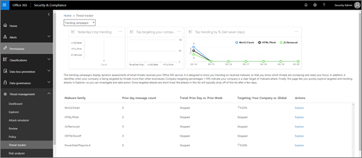
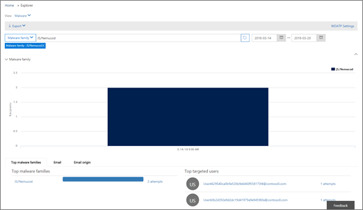
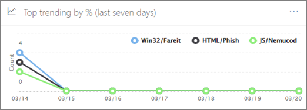
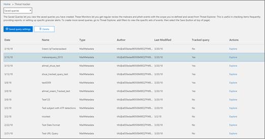
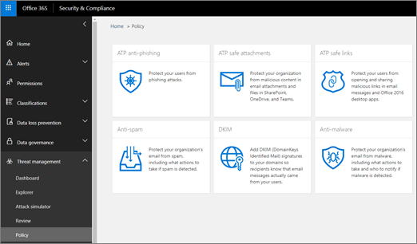

# Threat Trackers - New and Noteworthy

[!INCLUDE [Microsoft 365 Defender rebranding](../includes/microsoft-defender-for-office.md)]

**Applies to**
- [Microsoft Defender for Office 365 plan 2](defender-for-office-365.md)
- [Microsoft 365 Defender](../mtp/microsoft-threat-protection.md)

[Office 365 Threat Investigation and Response](office-365-ti.md) capabilities enable your organization's security team to discover and take action against cybersecurity threats. Office 365 Threat Investigation and Response capabilities include Threat Tracker features, including Noteworthy trackers. Read this article to get an overview of these new features and next steps.

> [!IMPORTANT]
> Office 365 Threat Intelligence is now Microsoft Defender for Office 365 Plan 2, along with additional threat protection capabilities. To learn more, see [Microsoft Defender for Office 365 plans and pricing](https://products.office.com/exchange/advance-threat-protection) and the [Microsoft Defender for Office 365 Service Description](https://docs.microsoft.com/office365/servicedescriptions/office-365-advanced-threat-protection-service-description).

## What are Threat Trackers?

Threat Trackers are informative widgets and views that provide you with intelligence on different cybersecurity issues that might impact your company. For example, you can view information about trending malware campaigns using Threat Trackers.

Most tracker pages include trending numbers that are updated periodically, widgets to help you understand which issues are the biggest or have grown the most, and a quick link in the **Actions** column that takes you to Explorer, where you can view more detailed information.

Trackers are just a few of the many great features you get with [Microsoft Defender for Office 365 Plan 2](office-365-ti.md). Threat Trackers include [Noteworth trackers](#noteworthy-trackers), [Trending trackers](#trending-trackers), [Tracked queries](#tracked-queries), and [Saved queries](#saved-queries).

To view and use your Threat Trackers for your organization, go to the Security & Compliance Center (<https://protection.office.com>) and choose **Threat management** \> **Threat tracker**.

> [!NOTE]
> To use Threat Trackers, you must be a global administrator, security administrator, or security reader. See [Permissions in the Security & Compliance Center](permissions-in-the-security-and-compliance-center.md).

### Noteworthy trackers

Noteworthy trackers are where you'll find big and smaller threats and risks that we think you should know about. Noteworthy trackers help you find whether these issues exist in your Microsoft 365 environment, plus link to articles (like this one) that give you more details on what is happening, and how they'll impact your organization's use of Office 365. Whether it's a big new threat (e.g. Wannacry, Petya) or an existing threat that might create some new challenges (like our other inaugural Noteworthy item - Nemucod), this is where you'll find important new items you and your security team should review and examine periodically.

Typically Noteworthy trackers will be posted for just a couple of weeks when we identify new threats and think you might need the extra visibility that this feature provides. Once the biggest risk for a threat has passed, we'll remove that Noteworthy item. This way, we can keep the list fresh and up to date with other relevant new items.

### Trending trackers

Trending trackers (formerly called Campaigns) highlight new threats received in your organization's email in the past week.

Trending trackers give you an idea of new threats you should review to ensure your broader corporate environment is prepared against attacks.

### Tracked queries

Tracked queries leverage your saved queries to periodically assess Microsoft 365 activity in your organization. This gives you event trending, with more to come in the coming months. Tracked queries run automatically, giving you up-to-date information without having to remember to re-run your queries.

### Saved queries

Saved queries are also found in the Trackers section. You can use Saved queries to store the common Explorer searches that you want to get back to quicker and repeatedly, without having to re-create the search every time.

You can always save a Noteworthy tracker query or any of your own Explorer queries using the **Save query** button at the top of the Explorer page. Anything saved there will show up in the **Saved queries** list on the Tracker page.

## Trackers and Explorer

Whether you're reviewing email, content, or Office activities (coming soon), Explorer and Trackers work together to help you investigate and track security risks and threats. All together, Trackers provide you with information to protect your users by highlighting new, notable, and frequently searched issues - ensuring your business is better protected as it moves to the cloud.

And remember that you can always provide us feedback on this or other Microsoft 365 security features by clicking on the **Feedback** button in the lower right corner of the [Overview of the Security & Compliance Center](https://support.microsoft.com/office/a5f2fd18-b029-4257-b5a8-ae83e7768c85).

## Trackers and Microsoft Defender for Office 365

With our inaugural Noteworthy threat, we're highlighting advanced malware threats detected by [Safe Attachments](safe-attachments.md). If you're an Office 365 Enterprise E5 customer and you're not using [Microsoft Defender for Office 365](defender-for-office-365.md), you should be - it's included in your subscription. Defender for Office 365 provides value even if you have other security tools filtering email flow with your Office 365 services. However, anti-spam and [Safe Links](safe-links.md) features work best when your main email security solution is through Office 365.

In today's threat-riddled world, running only traditional anti-malware scans means you are not protected well enough against attacks. Today's more sophisticated attackers use commonly available tools to create new, obfuscated, or delayed attacks that won't be recognized by traditional signature-based anti-malware engines. The Safe Attachments feature takes email attachments and detonates them in a virtual environment to determine whether they're safe or malicious. This detonation process opens each file in a virtual computer environment, then watches what happens after the file is opened. Whether it's a PDF, and compressed file, or an Office document, malicious code can be hidden in a file, activating only once the victim opens it on their computer. By detonating and analyzing the file in the email flow, Defender for Office 365 capabilities finds these threats based on behaviors, file reputation, and a number of heuristic rules.

The new Noteworthy threat filter highlights items that were recently detected through Safe Attachments. These detections represent items that are new malicious files, not previously found by Microsoft 365 in either your email flow or other customers' email. Pay attention to the items in the Noteworthy Threat Tracker, see who was targeted by them, and review the detonation details shown on the Advanced Analysis tab (found by clicking on the subject of the email in Explorer). Note you'll only find this tab on emails detected by the Safe Attachments capability - this Noteworthy tracker includes that filter, but you can also use that filter for other searches in Explorer.

## Next steps

- If your organization doesn't already have these Office 365 Threat Investigation and Response capabilities, see [How do we get Office 365 Threat Investigation and Response capabilities?](office-365-ti.md).

- Make sure that your security team has the correct roles and permissions assigned. You must be a global administrator, or have the Security Administrator or Search and Purge role assigned in the Security & Compliance Center. See [Permissions in the Security & Compliance Center](permissions-in-the-security-and-compliance-center.md).

- Watch for the new Trackers to show up in your Microsoft 365 environment. When available, you'll find your Trackers [here](https://protection.office.com/). Go to **Threat management** \> **Threat trackers**.

- If you haven't already done so, learn more about and configure [Microsoft Defender for Office 365](defender-for-office-365.md) for your organization, including [Safe links](safe-links.md) and [Safe Attachments](safe-attachments.md).
