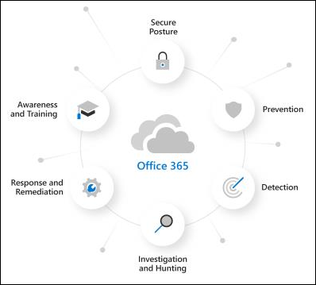

# About the Microsoft Defender for Office 365 trial

> [!NOTE]
> The features described in this article are currently in Preview, aren't available to everyone, and are subject to change without notice.

The new Microsoft Defender for Office 365 trial is the easiest way to try the capabilities of Microsoft Defender for Office 365, and setting it up only takes a couple of clicks. After the trial setup is complete, all Microsoft Defender for Office 365 Plan 1 and Plan 2 capabilities are available in the organization for up to 90 days.

## Set up a Defender for Office 365 trial

A trial allows organizations to easily set up and configure the Defender for Office 365 capabilities. During setup, policies that are exclusive to Defender for Office 365 (specifically, [Safe Attachments](atp-safe-attachments.md), [Safe Links](atp-safe-links.md), and [impersonation protection in anti-spam policies](set-up-anti-phishing-policies.md#impersonation-settings-in-anti-phishing-policies-in-microsoft-defender-for-office-365)) are applied using the Standard template for [preset security polices](preset-security-policies.md). By default, these policies are scoped for all users in the organization, although admins can customize the policies during or after setup to apply them to specific users.

During setup, MDO response functionality (found in MDO P2 or equivalent) is also setup for the entire organization. No policy scoping is required.

## Licensing

As part of the trial setup, the Defender for Office 365 licenses are automatically applied to the organization. The licenses are free of charge for the first 90 days.

## Permissions

To start or end the trial, you need to be a member of the **Global Administrator** or **Security Administrator** roles in Azure Active Directory. For details, see [About admin roles](https://docs.microsoft.com/microsoft-365/admin/add-users/about-admin-roles).

## Additional information

After you enroll in the trial, it might take up to 2 hours for the changes and updates to be available. And, admins must log out and log back in to see the changes.

Admins can disable the trial at any point by going to the <> card.

## Availability

The Defender for Office 365 trial feature is currently in Public Preview. It's available to exiting Microsoft 365 organizations that meet all of the following requirements:

- Have managed account teams.
- Have Exchange Online mailboxes in Canadian datacenters.
- Don't have existing Defender for Office 365 Plan 1 or Plan 2 licenses (included in the subscription or as an add-on).

## Learn more about Defender for Office 365

Defender for Office 365 helps organizations secure their enterprise by offering a comprehensive slate of capabilities.

### Prevention

A robust filtering stack prevents a wide variety of volume-based and targeted attacks including business email compromise, credential phishing, ransomware, and advanced malware.

- [Anti-phishing policies: Exclusive settings in Defender for Office 365](set-up-anti-phishing-policies.md#exclusive-settings-in-anti-phishing-policies-in-microsoft-defender-for-office-365)
- [Safe Attachments](atp-safe-attachments.md)
- [Safe Links](atp-safe-links.md)
- [ATP for SharePoint, OneDrive, and Microsoft Teams](atp-for-spo-odb-and-teams.md)

### Detection

Industry-leading AI detects malicious and suspicious content and correlates attack patterns to identify campaigns designed to evade protection.

- [Campaign Views in Microsoft Defender for Office 365](campaigns.md)

### Investigation and hunting

Powerful experiences help identify, prioritize, and investigate threats, with advanced hunting capabilities to track attacks across Office 365.

- [Threat Explorer and Real-time detections](threat-explorer.md)
- [Real-time reports in Defender for Office 365](view-reports-for-atp.md)
- [Threat Trackers - New and Noteworthy](threat-trackers.md)
- Integration with [Microsoft 365 Defender](https://docs.microsoft.com/microsoft-365/security/mtp/microsoft-threat-protection)

### Response and remediation

Extensive incident response and automation capabilities amplify your security team’s effectiveness and efficiency.

- [Automated investigation and response (AIR) in Microsoft Defender for Office 365](office-365-air.md)

### Awareness and training

Rich simulation and training capabilities along with integrated experiences within client applications build user awareness.

- [Get started using Attack simulation training](attack-simulation-training-get-started.md)

### Secure posture

Recommended templates and configuration insights help customers get and stay secure.

- [Preset security policies in EOP and Microsoft Defender for Office 365](preset-security-policies.md)
- [Configuration analyzer for protection policies in EOP and Microsoft Defender for Office 365](configuration-analyzer-for-security-policies.md).

## Terms and conditions

<Link>

## Give feedback

Your feedback helps us get better at protecting your environment from advanced attacks. Share your experience and impressions of product capabilities and trial results.
