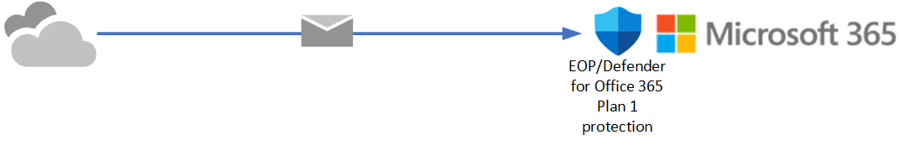

# Try Microsoft Defender for Office 365 using evaluations or trials

The unified **Trials** portal in the Microsoft 365 Defender portal provides a single point of entry for existing Microsoft 365 customers for the trial and evaluation experiences for Microsoft Defender for Office 365. The intent is to allow you to try the features of Defender for Office 365 Plan 2 for 30 days before you fully commit to it. But, there are differences in eligibility for an evaluation vs. a trial of Defender for Office 365 based on the nature of your Microsoft 365 organization:

- **Evaluation**: You already have Microsoft 365 mailboxes, but you're currently using a third-party service or device for email protection. Mail from the internet flows through the protection service before delivery into your Microsoft 365 organization, and Microsoft 365 protection is as low as possible (it's never completely off; for example, malware protection is always enforced).

  

  You don't need to change your mail flow (MX records) for an evaluation.

- **Trial**: You already have a Microsoft 365 organization. Mail from the internet flows directly Microsoft 365, but your current subscription offers only [Exchange Online Protection (EOP)](exchange-online-protection-overview.md) or [Defender for Office 365 Plan 1](overview.md#microsoft-defender-for-office-365-plan-1-vs-plan-2-cheat-sheet).

  

The rest of this article explains the details of evaluations and trials.

## Overview of Defender for Office 365

Microsoft Defender for Office 365 safeguards your organization against malicious threats that are posed by email messages, links (URLs), and collaboration tools. Defender for Office 365 includes:

- **Threat protection policies**: Define threat-protection policies to set the appropriate level of protection for your organization.
- **Reports**: View real-time reports to monitor Defender for Office 365 performance in your organization.
- **Threat investigation and response capabilities**: Use leading-edge tools to investigate, understand, simulate, and prevent threats.
- **Automated investigation and response capabilities**: Save time and effort investigating and mitigating threats.

These high level capabilities are described in the following table:

 

****

|Feature|Description|
|---|---|
|[Exclusive settings in anti-phishing policies](set-up-anti-phishing-policies.md#exclusive-settings-in-anti-phishing-policies-in-microsoft-defender-for-office-365)|Get user impersonation protection, domain impersonation protection, mailbox intelligence, and advanced phishing thresholds.|
|[Safe Attachments](safe-attachments.md)|Inspect email attachments and other files in a controlled detonation environment to catch new and evasive malware.|
|[Safe Links](safe-links.md)|Perform time-of-click checks to ensure URLs that might have passed initial inspection have not been weaponized.|
|[Threat Trackers](threat-trackers.md)\*|Use informative widgets and views to identify cybersecurity issues that might impact your organization.|
|[Threat Explorer](threat-explorer.md)\*|Hunt with near real-time information about threats in your Office 365 email.|
|[Automated investigation and response (AIR)](office-365-air.md)\*|Automatically locate and remediate threat objects as alerts are triggered.|
|[Attack simulation training](attack-simulation-training.md)\*|Train your users to identify phishing attacks and respond appropriately.|
|[Campaign Views](campaigns.md)\*|Investigate and respond to large-scale malicious email activity.|
|[Reports using Defender for Office 365 capabilities](view-reports-for-mdo.md)|View reports including threat protection status, URL threat protection, mail latency, and more.|
|[Priority account protection](/microsoft-365/admin/setup/priority-accounts)\*|Users that you identify as Priority accounts are tagged in alerts, reports, and investigations so they stand out. You can also use the Priority tag in filters.|
|

\* This feature is exclusive to Defender for Office 365 Plan 2.

## Policies in evaluations and trials

For both evaluations and trials, policies that are exclusive to Defender for Office 365 are configured during setup:

- [Safe Attachments for email messages](safe-attachments.md)
- [Safe Links for email messages and Microsoft Teams](safe-links.md)
- [Impersonation protection in anti-phishing policies](set-up-anti-phishing-policies.md#impersonation-settings-in-anti-phishing-policies-in-microsoft-defender-for-office-365)

But, the nature of these policies are different:

- **Evaluations**: Regular policies are created, but the policies are in *non-blocking* mode. Defender for Office 365 will *detect* harmful messages for reporting, but the messages won't be acted upon (for example, detected messages aren't quarantined).
- **Trials**: Policies are created using the Standard template for [preset security policies](preset-security-policies.md). The policies are in *blocking* mode. Defender for Office 365 will *detect* and *act upon* harmful messages (for example, detected messages are quarantined).

By default, these policies are scoped to all users in the organization, but during or after setup, you can change the policy assignment to specific users.

## Set up an evaluation

1. Click **Start evaluation**.

2. On the **Routing settings** page, select **I'm using a third party or on-premises service provider**, and then click **Next**.

3. On the **Third party or on-premises settings** page, the **Select a third party service provider** value determines the rest of the settings that are available on the page.:

   - If you select one of the following values:

     - **Barracuda**
     - **IronPort**
     - **Mimecast**
     - **Proofpoint**
     - **Sophos**
     - **Symantec**
     - **Trend Micro**

     the only other setting on the page is **The connector to apply this evaluation to** where you select the connector.

   - If you select the value **Other**, the following settings are available:

     - **The connector to apply this evaluation to**
     - **List each gateway IP address your messages pass through**

   When you're finished, click **Next**.

4. On the **Exchange mail flow rules** page, decide if you need to configure an SCL=1 mail flow rule (also known as a transport rule) that skips spam filtering for incoming messages.

   If you need to configure an SCL=1 mail flow rule

   When you're finished, click **Next**.

## Set up a trial
