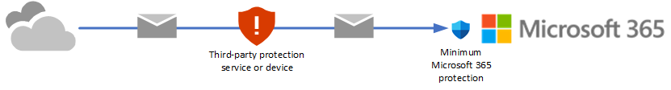
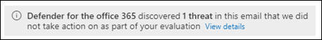

# Try Microsoft Defender for Office 365

As an existing Microsoft 365 customer, the **Trials** and **Evaluation** pages in the Microsoft 365 Defender portal at <https://security.microsoft.com> allow you to try the features of Microsoft Defender for Office 365 Plan 2 before you buy.

Before you try Defender for Office 365 Plan 2, there are some key questions that you need to ask yourself:

- Do I want to passively observe what Defender for Office 365 Plan 2 can do for me (*audit*), or do I want Defender for Office 365 Plan 2 to take direct action on issues that it finds (*block*)?
- Either way, how can I tell what Defender for Office 365 Plan 2 is doing for me?
- How long do I have before I need to make the decision to keep Defender for Office 365 Plan 2?

This article will help you answer those questions so you can try Defender for Office 365 Plan 2 in a way that best meets the needs of your organization.

For a companion guide for how to use your trial, see [Trial User Guide: Microsoft Defender for Office 365](trial-user-guide-defender-for-office-365.md).

## Overview of Defender for Office 365

Defender for Office 365 helps organizations secure their enterprise by offering a comprehensive slate of capabilities. For more information, see [Microsoft Defender for Office 365](defender-for-office-365.md).

You can also learn more about Defender for Office 365 at this [interactive guide](https://aka.ms/MS365D.InteractiveGuide).


Watch this short video to learn more about how you can get more done in less time with Microsoft Defender for Office 365.

> [!VIDEO https://www.microsoft.com/videoplayer/embed/RWMmIe]

## How trials and evaluations work for Defender for Office 365

### Policies

Defender for Office 365 includes the features of Exchange Online Protection (EOP), which are present in all Microsoft 365 organizations with Exchange Online mailboxes, and features that are exclusive to Defender for Office 365.

The protection features of EOP and Defender for Office 365 are implemented using policies. **Policies that are exclusive to Defender for Office 365 are created for you as needed**:

- [Impersonation protection in anti-phishing policies](set-up-anti-phishing-policies.md#impersonation-settings-in-anti-phishing-policies-in-microsoft-defender-for-office-365)
- [Safe Attachments for email messages](safe-attachments.md)
- [Safe Links for email messages and Microsoft Teams](safe-links.md)
  - Safe Links detonates URLs during mail flow. To prevent specific URLs from being detonated, use allow entries for URLs in the Tenant Allow/Block List. For more information, see [Manage the Tenant Allow/Block List](manage-tenant-allow-block-list.md).
  - Safe Links doesn't wrap URL links in email message bodies.

Your eligibility for an evaluation or trial means you already have EOP. **No new or special EOP policies are created for your evaluation or trial of Defender for Office 365 Plan 2**. Existing EOP policies in your Microsoft 365 organization are able to act on messages (for example, send messages to the Junk Email folder or to quarantine):

- [Anti-malware policies](anti-malware-protection.md)
- [Inbound anti-spam protection](anti-spam-protection.md)
- [Anti-spoofing protection in anti-phishing policies](set-up-anti-phishing-policies.md#spoof-settings)

The default policies for these EOP features are always on, apply to all recipients, and are always applied last after any custom policies.

### Audit mode vs. blocking mode for Defender for Office 365

Do you want your Defender for Office 365 experience to be active or passive? These are the two modes that you can select from:

- **Audit mode**: Special *evaluation policies* are created for anti-phishing (which includes impersonation protection), Safe Attachments, and Safe Links. These evaluation policies are configured to *detect* threats only. Defender for Office 365 detects harmful messages for reporting, but the messages aren't acted upon (for example, detected messages aren't quarantined). The settings of these evaluation policies are described in the [Policies in audit mode](#policies-in-audit-mode) section later in this article.

  Audit mode provides access to customized reports for threats detected by Defender for Office 365 on the **Evaluation mode** page at <https://security.microsoft.com/atpEvaluation>.

- **Blocking mode**: The Standard template for [preset security policies](preset-security-policies.md) is turned on and used for the trial, and the users you specify to include in the trial are added to the Standard preset security policy. Defender for Office 365 *detects* and *takes action on* harmful messages (for example, detected messages are quarantined).

  The default and recommended selection is to scope these Defender for Office 365 policies to all users in the organization. But during or after the setup of your trial, you can change the policy assignment to specific users, groups, or email domains in the Microsoft 365 Defender portal or in [Exchange Online PowerShell](#policy-settings-associated-with-defender-for-office-365-trials).

  Blocking mode does not provide customized reports for threats detected by Defender for Office 365. Instead, the information is available in the regular reports and investigation features of Defender for Office 365 Plan 2.

A key factor in audit mode vs. blocking mode is how email is delivered to your Microsoft 365 organization:

- Mail from the internet flows directly Microsoft 365, but your current subscription has only [Exchange Online Protection (EOP)](exchange-online-protection-overview.md) or [Defender for Office 365 Plan 1](overview.md#microsoft-defender-for-office-365-plan-1-vs-plan-2-cheat-sheet).

  

  In these environments, you can select **audit mode** or **blocking mode**.

- You're currently using a third-party service or device for email protection of your Microsoft 365 mailboxes. Mail from the internet flows through the protection service before delivery into your Microsoft 365 organization. Microsoft 365 protection is as low as possible (it's never completely off; for example, malware protection is always enforced).

  

  In these environments, you can select **audit mode** only. You don't need to change your mail flow (MX records).

### Evaluation vs. trial for Defender for Office 365

What's the difference between an evaluation and a trial of Defender for Office 365 Plan 2? Aren't they the same thing? Well, yes and no. Here's what you need to know:

- If you don't already have Defender for Office 365 Plan 2 licenses (for example, standalone EOP, Microsoft 365 E3, Microsoft 365 Business Premium, or Defender for Office 365 Plan 1), you can start your trial from the **Microsoft 365 trials** page at <https://security.microsoft.com/trialHorizontalHub> or the **Evaluation mode** page at <https://security.microsoft.com/atpEvaluation> in the Microsoft 365 Defender portal. At either location, you can select **allow mode** (Standard preset security policy) or **blocking mode** (evaluation policies) as previously described.

  Regardless of which location you use, we'll automatically provision the required Defender for Office 365 Plan 2 trial licenses for you when you enroll. Manual or outside steps for getting and assigning Plan 2 licenses in the Microsoft 365 admin center are no longer required. The trial licenses are good for 90 days:

  - For organizations without Defender for Office 365 (for example, standalone EOP or Microsoft 365 E3) the features (in particular, the policies) of Defender for Office 365 are available to you during the trial period.

  - Organizations with Defender for Office 365 Plan 1 (for example Microsoft 365 Business Premium or add-on subscriptions) have exactly the same policies as organizations with Defender for Office 365 Plan 2 (impersonation protection in anti-phishing policies, Safe Attachments policies, and Safe Links policies). The security policies from **allow mode** (Standard preset security policy) or **blocking mode** (evaluation policies) don't expire or stop working after 90 days. What ends after 90 days for these organizations are the [automation, investigation, remediation, and education capabilities](defender-for-office-365.md#microsoft-defender-for-office-365-plan-1-and-plan-2) of Plan 2 that aren't present in Plan 1.

- If you already have Defender for Office 365 Plan 2 (for example, as part of a Microsoft 365 E5 subscription), you'll never see **Defender for Office 365** on the **Microsoft 365 trials** page at <https://security.microsoft.com/trialHorizontalHub>. Instead, you start your evaluation of Defender for Office 365 Plan to on the **Evaluation mode** page at <https://security.microsoft.com/atpEvaluation> in **allow mode** (Standard preset security policy) or **blocking mode** (evaluation policies).

  By definition, these organizations don't require trial licenses of Defender for Office 365 Plan 2, so their evaluations are unlimited in duration.

The information from the previous list is summarized in the following table:

|Organization|Available modes|Enroll from the<br/>Evaluation page?|Enroll from the<br/>Trials page?|Evaluation<br/>period|
|---|---|:---:|:---:|---|
|Standalone EOP<br/>(no Exchange Online mailboxes) <br/><br/> Microsoft 365 E3|Audit mode <br/> Blocking mode|Yes|Yes|90 days|
|Defender for Office 365 Plan 1 <br/><br/> Microsoft 365 Business Premium|Audit mode <br/> Blocking mode|Yes|Yes|Unlimited<sup>\*</sup>|
|Microsoft 365 E5|Audit mode <br/> Blocking mode|Yes|No|Unlimited|

<sup>\*</sup> The security policies from **allow mode** (Standard preset security policy) or **blocking mode** (evaluation policies) don't expire or stop working after 90 days. Only the [automation, investigation, remediation, and education capabilities](defender-for-office-365.md#microsoft-defender-for-office-365-plan-1-and-plan-2) that are exclusive to Defender for Office 365 Plan 2 stop working after 90 days.

## Set up an evaluation or trial in audit mode

Remember, when you evaluate Defender for Office 365 in audit mode, special evaluation policies are created so Defender for Office 365 can detect threats. The settings of these evaluation policies are described in the [Policies in audit mode](#policies-in-audit-mode) section later in this article.

1. Start the evaluation in any of the available locations in the Microsoft 365 Defender portal at <https://security.microsoft.com>. For example:
   - On the banner at the top of any Defender for Office 365 feature page, click **Start free trial**.
   - On the **Microsoft 365 trials** page at <https://security.microsoft.com/trialHorizontalHub>, find and select **Defender for Office 365**.
   - On the **Evaluation mode** page at <https://security.microsoft.com/atpEvaluation>, click **Start evaluation**.

2. In the **Turn on protection** dialog, select **No, I only want reporting**, and then click **Continue**.

3. In the **Select the users you want to include** dialog, configure the following settings:

   - **All users**: This is the default and recommended option.
   - **Select users**: If you select this option, you need to select the internal recipients that the evaluation applies to:
     - **Users**: The specified mailboxes, mail users, or mail contacts.
     - **Groups**:
       - Members of the specified distribution groups or mail-enabled security groups.
       - The specified Microsoft 365 Groups.
       - **Domains**: All recipients in the specified [accepted domains](/exchange/mail-flow-best-practices/manage-accepted-domains/manage-accepted-domains) in your organization.

     Click in the appropriate box, start typing a value, and select the value that you want from the results. Repeat this process as many times as necessary. To remove an existing value, click remove  next to the value.

     For users or groups, you can use most identifiers (name, display name, alias, email address, account name, etc.), but the corresponding display name is shown in the results. For users, enter an asterisk (\*) by itself to see all available values.

   > [!NOTE]
   > You can change these selections after you finish setting up the trial as described in the [Manage your trial](#manage-your-evaluation-or-trial-of-defender-for-office-365) section.
   >
   > Multiple different types of conditions or exceptions are not additive; they're inclusive. The evaluation or trial is applied *only* to those recipients that match *all* of the specified recipient filters. For example, you configure a condition with the following values:
   >
   > - **Users**: romain@contoso.com
   > - **Groups**: Executives
   >
   > The evaluation or trial is applied to romain@contoso.com *only* if he's also a member of the Executives group. If he's not a member of the group, then the evaluation or trial is not applied to him.
   >
   > Likewise, if you use the same recipient filter as an exception, the evaluation or trial is not applied to romain@contoso.com *only* if he's also a member of the Executives group. If he's not a member of the group, then the evaluation or trial still applies to him.

   When you're finished, click **Continue**.

4. In the **Help us understand your mail flow** dialog, configure the following options:

   - One of the following options is automatically selected based on our detection of the MX record for your domain:

     - **I'm using a third-party and/or on-premises service provider**: The MX record for your domain points somewhere other than Microsoft 365. This selection requires the following additional settings after you click **Next**:

       1. In the **Third party or on-premises settings** dialog, configure the following settings:

          - **Select a third party service provider**: Select one of the following values:
            - **Barracuda**
            - **IronPort**
            - **Mimecast**
            - **Proofpoint**
            - **Sophos**
            - **Symantec**
            - **Trend Micro**
            - **Other**

          - **The connector to apply this evaluation to**: Select the connector that's used for mail flow into Microsoft 365.

            [Enhanced Filtering for Connectors](/exchange/mail-flow-best-practices/use-connectors-to-configure-mail-flow/enhanced-filtering-for-connectors) (also known as *skip listing*) is automatically configured on the connector that you specify.

            When a third-party service or device sits in front of email flowing into Microsoft 365, Enhanced Filtering for Connectors correctly identifies the source of internet messages and greatly improves the accuracy of the Microsoft filtering stack (especially [spoof intelligence](anti-spoofing-protection.md), as well as post-breach capabilities in [Threat Explorer](threat-explorer.md) and [Automated Investigation & Response (AIR)](automated-investigation-response-office.md).

          - **List each gateway IP address your messages pass through**: This setting is available only if you selected **Other** for **Select a third party service provider**. Enter a comma-separated list of the IP addresses that are used by the third-party protection service or device to send mail into Microsoft 365.

          When you're finished, click **Next**.

       2. In the **Exchange mail flow rules** dialog, decide if you need an Exchange Online mail flow rule (also known as a transport rule) that skips spam filtering for incoming messages from the third-party protection service or device.

          It's likely that you already have an SCL=-1 mail flow rule in Exchange Online that allows all inbound mail from the protection service to bypass (most) Microsoft 365 filtering. Many protection services encourage this spam confidence level (SCL) mail flow rule method for Microsoft 365 customers who use their services.

          As explained in the previous step, Enhanced Filtering for Connectors is automatically configured on the connector that you specify as the source of mail from the protection service.

          Turning on Enhanced Filtering for Connectors without an SCL=-1 rule for incoming mail from the protection service will vastly improve the detection capabilities of EOP protection features like [spoof intelligence](anti-spoofing-protection.md), and could impact the delivery of those newly detected messages (for example, move to the Junk Email folder or to quarantine). This impact is limited to EOP policies; as previously explained, Defender for Office 365 policies are created in audit mode.

          To create an SCL=-1 mail flow rule or to review your existing rules, click the **Go to Exchange admin center** button on the page. For more information, see [Use mail flow rules to set the spam confidence level (SCL) in messages in Exchange Online](/exchange/security-and-compliance/mail-flow-rules/use-rules-to-set-scl).

          When you're finished, click **Finish**.

     - **I'm only using Microsoft Exchange Online**: The MX records for your domain point to Microsoft 365. There's nothing left to configure, so click **Finish**.

   - **Share data with Microsoft**: This option isn't selected by default, but you can select the check box if you like.

5. A progress dialog appears as your evaluation is set up. When set up is complete, click **Done**.

## Set up an evaluation or trial in blocking mode

Remember, when you try Defender for Office 365 in blocking mode, the Standard preset security is turned on and the specified users (some or everyone) are included in the Standard preset security policy. For more information about the Standard preset security policy, see [Preset security policies](preset-security-policies.md).

1. Start the trial in any of the available locations in the Microsoft 365 Defender portal at <https://security.microsoft.com>. For example:
   - On the banner at the top of any Defender for Office 365 feature page, click **Start free trial**.
   - On the **Microsoft 365 trials** page at <https://security.microsoft.com/trialHorizontalHub>, find and select **Defender for Office 365**.
   - On the **Evaluation mode** page at <https://security.microsoft.com/atpEvaluation>, click **Start evaluation**.

2. In the **Turn on protection** dialog, select **Yes, protect my organization by blocking threats**, and then click **Continue**.

3. In the **Select the users you want to include** dialog, configure the following settings:

   - **All users**: This is the default and recommended option.
   - **Select users**: If you select this option, you need to select the internal recipients that the trial applies to:
     - **Users**: The specified mailboxes, mail users, or mail contacts.
     - **Groups**:
       - Members of the specified distribution groups or mail-enabled security groups.
       - The specified Microsoft 365 Groups.
     - **Domains**: All recipients in the specified [accepted domains](/exchange/mail-flow-best-practices/manage-accepted-domains/manage-accepted-domains) in your organization.

     Click in the appropriate box, start typing a value, and select the value that you want from the results. Repeat this process as many times as necessary. To remove an existing value, click remove  next to the value.

     For users or groups, you can use most identifiers (name, display name, alias, email address, account name, etc.), but the corresponding display name is shown in the results. For users, enter an asterisk (\*) by itself to see all available values.

   > [!NOTE]
   > You can change these selections after you finish setting up the trial as described in the [Manage your trial](#manage-your-evaluation-or-trial-of-defender-for-office-365) section.
   >
   > Multiple different types of conditions or exceptions are not additive; they're inclusive. The evaluation or trial is applied *only* to those recipients that match *all* of the specified recipient filters. For example, you configure a condition with the following values:
   >
   > - **Users**: romain@contoso.com
   > - **Groups**: Executives
   >
   > The evaluation or trial is applied to romain@contoso.com *only* if he's also a member of the Executives group. If he's not a member of the group, then the evaluation or trial is not applied to him.
   >
   > Likewise, if you use the same recipient filter as an exception, the evaluation or trial is not applied to romain@contoso.com *only* if he's also a member of the Executives group. If he's not a member of the group, then the evaluation or trial still applies to him.

   When you're finished, click **Continue**.

4. A progress dialog appears as your evaluation is set up. When setup is complete, click **Done**.

## Manage your evaluation or trial of Defender for Office 365

After you set up your evaluation or trial in audit mode or blocking mode, the **Evaluation mode** page at <https://security.microsoft.com/atpEvaluation> is your central location for information about trying Defender for Office 365 Plan 2.

1. In the Microsoft 365 Defender portal at <https://security.microsoft.com>, go to **Email & collaboration** \> **Policies & rules** \> **Threat policies** \> select **Evaluation mode** in the **Others** section. Or, to go directly to the **Microsoft Defender for Office 365 evaluation** page, use <https://security.microsoft.com/atpEvaluation>.

2. On the **Microsoft Defender for Office 365 evaluation** page, you can do the following tasks:

   - Click **Buy a paid subscription** to buy Defender for Office 365 Plan 2.

   - Click **Manage**. In the **Microsoft Defender for Office 365 evaluation** flyout that appears, you can do the following tasks:

     - Change who the evaluation or trial applies to as described earlier in the [Set up an evaluation or trial in audit mode](#set-up-an-evaluation-or-trial-in-audit-mode) and [Set up an evaluation or trial in blocking mode](#set-up-an-evaluation-or-trial-in-blocking-mode).

     - To switch from **audit mode** (evaluation policies) to blocking mode (Standard preset security policy), click **Convert to standard protection**, and then click **Continue** in the dialog that appears to be taken to the **Apply standard protection** wizard on the **Preset security policies** page. The existing included and excluded recipients are copied over. For more information, see [Use the Microsoft 365 Defender portal to assign Standard and Strict preset security policies to users](preset-security-policies.md#use-the-microsoft-365-defender-portal-to-assign-standard-and-strict-preset-security-policies-to-users).

       **Notes**:

       - The policies in the Standard preset security policy have a higher priority than the evaluation policies, which means the policies in the Standard preset security are always applied *before* the evaluation policies, even if both are present and turned on. To turn off the evaluation policies, use the **Turn off** button.
       - There's no automatic way to go from **blocking mode** to **audit mode**. The manual steps are:
         1. Turn off the Standard preset security policy on the **Preset security policies** page.
         2. After clicking **Manage** on the **Microsoft Defender for Office 365 evaluation** page, verify the presence of the **Turn off** button, which indicates the evaluation policies are turned on. If you see the **Turn on** button, click it to turn on the evaluation policies.
         3. Verify the users that the evaluation applies to.

     - To turn off the evaluation policies, click **Turn off**. To turn them back on, click **Turn on**.

     When you're finished in the flyout, click **Save**.

## Reports for your evaluation or trial of Defender for Office 365

This section describes the reports that are available in audit mode and blocking mode.

### Reports for blocking mode

In **blocking mode**, the following reports show detections by Defender for Office 365:

- The [Mailflow view for the Mailflow status report](view-email-security-reports.md#mailflow-view-for-the-mailflow-status-report):

  - Messages detected as user impersonation or domain impersonation by anti-phishing policies appear in **Impersonation block**.
  - Messages detected during file or URL detonation by Safe Attachments policies or Safe Links policies appear in **Detonation block**.

- The [Threat protection status report](view-email-security-reports.md#threat-protection-status-report):

  - [View data by Overview](view-email-security-reports.md#view-data-by-overview):

    You can filter most views by the **Protected by** value **MDO** to see the effects of Defender for Office 365.

  - [View data by Email \> Phish and Chart breakdown by Detection Technology](view-email-security-reports.md#view-data-by-email--phish-and-chart-breakdown-by-detection-technology)

    - Messages detected by [campaigns](campaigns.md) appear in **Campaign**.
    - Messages detected by Safe Attachments appear in **File detonation** and **File detonation reputation**.
    - Messages detected by user impersonation protection in anti-phishing policies appear in **Impersonation domain**, **Impersonation user**, and **Mailbox intelligence impersonation**.
    - Messages detected by Safe Links appear in **URL detonation** and **URL detonation reputation**.

  - [View data by Email \> Malware and Chart breakdown by Detection Technology](view-email-security-reports.md#view-data-by-email--malware-and-chart-breakdown-by-detection-technology)

    - Messages detected by [campaigns](campaigns.md) appear in **Campaign**.
    - Messages detected by Safe Attachments appear in **File detonation** and **File detonation reputation**.
    - Messages detected by Safe Links appear in **URL detonation** and **URL detonation reputation**.

  - [View data by Email \> Spam and Chart breakdown by Detection Technology](view-email-security-reports.md#view-data-by-email--spam-and-chart-breakdown-by-detection-technology)

    Messages detected by Safe Links appear in **URL malicious reputation**.

  - [Chart breakdown by Policy type](view-email-security-reports.md#chart-breakdown-by-policy-type)

    Messages detected by Safe Attachments appear in **Safe Attachments**

  - [View data by Content \> Malware](view-email-security-reports.md#view-data-by-content--malware)

    Malicious files detected by [Safe Attachments for SharePoint, OneDrive, and Microsoft Teams](turn-on-mdo-for-spo-odb-and-teams.md) appear in **MDO detonation**.

  - The [Top senders and recipients report](view-email-security-reports.md#top-senders-and-recipients-report)

    **Show data for Top malware recipients (MDO)** and **Show data for Top phish recipients (MDO)**.

  - The [URL protection report](view-reports-for-mdo.md#url-protection-report)

### Reports for audit mode

In **audit mode**, the following reports show detections by Defender for Office 365:

- The [Threat protection status report](view-email-security-reports.md#threat-protection-status-report) has **Evaluation: Yes/No** as a filterable property in the following views:
  - [View data by Email \> Phish and Chart breakdown by Detection Technology](view-email-security-reports.md#view-data-by-email--phish-and-chart-breakdown-by-detection-technology)
  - [View data by Email \> Malware and Chart breakdown by Detection Technology](view-email-security-reports.md#view-data-by-email--malware-and-chart-breakdown-by-detection-technology)
  - [View data by Email \> Spam and Chart breakdown by Detection Technology](view-email-security-reports.md#view-data-by-email--spam-and-chart-breakdown-by-detection-technology)

- [Threat Explorer](threat-explorer.md) shows the following banner in message detection details on the **Analysis** tab for **Bad attachment**, **spam url + malware**, **Phish url**, and **impersonation** messages that were detected by the Defender for Office 365 evaluation show the following banner in the details of the entry:

  

The **Microsoft Defender for Office 365 evaluation** page at <https://security.microsoft.com/atpEvaluation> consolidates the reporting for the policies in the evaluation:

- Safe Links
- Safe Attachments
- Impersonation protection in anti-phishing policies

By default, the charts show data for the last 30 days, but you can filter the date range by clicking  **30 days** and selecting from following additional values that are less than 30 days:

- 24 hours
- 7 days
- 14 days
- Custom date range

You can click  **Download** to download the chart data to a .csv file.

## Required permissions

The following permissions are required in **Azure AD** to set up an evaluation or trial of Defender for Microsoft 365:

- **Create, modify or delete an evaluation or trial**: Security Administrator or Global Administrator.
- **View evaluation policies and reports in audit mode**: Security Administrator or Security Reader.

For more information about Azure AD permissions in the Microsoft 365 Defender portal, see [Azure AD roles in the Microsoft 365 Defender portal](permissions-microsoft-365-security-center.md#azure-ad-roles-in-the-microsoft-365-defender-portal)

## Frequently asked questions

### Q: Do I need to manually get or activate trial licenses?

A: No. The trial automatically provisions Defender for Office 365 Plan 2 licenses if you need them as previously described.

### Q: How do I extend the trial?

A: See [Extend your trial](/microsoft-365/commerce/try-or-buy-microsoft-365#extend-your-trial).

### Q: What happens to my data after the trial expires?

A: After your trial expires, you'll have access to your trial data (data from features in Defender for Office 365 that you didn't have previously) for 30 days. After this 30 day period, all policies and data that were associated with the Defender for Office 365 trial will be deleted.

### Q: How many times can I use the Defender for Office 365 trial in my organization?

A: A maximum of 2 times. If your first trial expires, you need to wait at least 30 days after the expiration date before you can enroll in the Defender for Office 365 trial again. After your second trial, you can't enroll in another trial.

### Q: In audit mode, are there scenarios where Defender for Office 365 will act on messages?

A: Yes. No one in any program or SKU can turn off or bypass taking action on messages that are classified as malware or high confidence phishing by the service.

In audit mode, [anti-spoofing protection in EOP](set-up-anti-phishing-policies.md#spoof-settings) also takes action on messages. To prevent anti-spoofing protection from acting on messages, create an Exchange mail flow rule (also known as a transport rule) where inbound email bypasses all types of filtering that can be bypassed (including anti-spoofing protection). For instructions, see [Use mail flow rules to set the spam confidence level (SCL) in messages in Exchange Online](/exchange/security-and-compliance/mail-flow-rules/use-rules-to-set-scl).

### Q: In what order are policies evaluated?

A: See [Order of precedence for preset security policies and other policies](preset-security-policies.md#order-of-precedence-for-preset-security-policies-and-other-policies).

## Reference

### Policy settings associated with Defender for Office 365 trials

#### Policies in audit mode

> [!WARNING]
> Do not attempt to create, modify, or remove the individual security policies that are associated with the evaluation of Defender for Office 365. The only supported method for creating the individual security policies for the evaluation is to start the evaluation or trial in audit mode in the Microsoft 365 Defender portal for the first time.

[As previously described](#audit-mode-vs-blocking-mode-for-defender-for-office-365), when you choose audit mode for your evaluation or trial, evaluation policies with the required settings to observe but not take action on messages are automatically created.

To see these policies and their settings, run the following command in [Exchange Online PowerShell](/powershell/exchange/connect-to-exchange-online-powershell):

```powershell
Write-Output -InputObject ("`r`n"*3),"Evaluation anti-phishing policy",("-"*79);Get-AntiPhishPolicy | Where-Object -Property RecommendedPolicyType -eq -Value "Evaluation"; Write-Output -InputObject ("`r`n"*3),"Evaluation Safe Attachments policy",("-"*79);Get-SafeAttachmentPolicy | Where-Object -Property RecommendedPolicyType -eq -Value "Evaluation"; Write-Output -InputObject ("`r`n"*3),"Evaluation Safe Links policy",("-"*79);Get-SafeLinksPolicy | Where-Object -Property RecommendedPolicyType -eq -Value "Evaluation"
```

The settings are also described in the following tables.

##### Anti-phishing evaluation policy settings

|Setting|Value|
|---|---|
|Name|Evaluation Policy|
|AdminDisplayName|Evaluation Policy|
|AuthenticationFailAction|MoveToJmf|
|Enabled|True|
|EnableFirstContactSafetyTips|False|
|EnableMailboxIntelligence|True|
|EnableMailboxIntelligenceProtection|True|
|EnableOrganizationDomainsProtection|False|
|EnableSimilarDomainsSafetyTips|False|
|EnableSimilarUsersSafetyTips|False|
|EnableSpoofIntelligence|True|
|EnableSuspiciousSafetyTip|False|
|EnableTargetedDomainsProtection|False|
|EnableTargetedUserProtection|False|
|EnableUnauthenticatedSender|True|
|EnableUnusualCharactersSafetyTips|False|
|EnableViaTag|True|
|ExcludedDomains|{}|
|ExcludedSenders|{}|
|ImpersonationProtectionState|Manual|
|IsDefault|False|
|MailboxIntelligenceProtectionAction|NoAction|
|MailboxIntelligenceProtectionActionRecipients|{}|
|MailboxIntelligenceQuarantineTag|DefaultFullAccessPolicy|
|PhishThresholdLevel|1|
|PolicyTag|blank|
|RecommendedPolicyType|Evaluation|
|SpoofQuarantineTag|DefaultFullAccessPolicy|
|TargetedDomainActionRecipients|{}|
|TargetedDomainProtectionAction|NoAction|
|TargetedDomainQuarantineTag|DefaultFullAccessPolicy|
|TargetedDomainsToProtect|{}|
|TargetedUserActionRecipients|{}|
|TargetedUserProtectionAction|NoAction|
|TargetedUserQuarantineTag|DefaultFullAccessPolicy|
|TargetedUsersToProtect|{}|

##### Safe Attachments evaluation policy settings

|Setting|Value|
|---|---|
|Name|Evaluation Policy|
|Action|Allow|
|ActionOnError|True|
|AdminDisplayName|Evaluation Policy|
|ConfidenceLevelThreshold|80|
|Enable|True|
|EnableOrganizationBranding|False|
|IsBuiltInProtection|False|
|IsDefault|False|
|OperationMode|Delay|
|QuarantineTag|AdminOnlyAccessPolicy|
|RecommendedPolicyType|Evaluation|
|Redirect|False|
|RedirectAddress|blank|
|ScanTimeout|30|

##### Safe Links evaluation policy settings

|Setting|Value|
|---|---|
|Name|Evaluation Policy|
|AdminDisplayName|Evaluation Policy|
|AllowClickThrough|True|
|CustomNotificationText|blank|
|DeliverMessageAfterScan|True|
|DisableUrlRewrite|True|
|DoNotRewriteUrls|{}|
|EnableForInternalSenders|False|
|EnableOrganizationBranding|False|
|EnableSafeLinksForEmail|True|
|EnableSafeLinksForOffice|False|
|EnableSafeLinksForTeams|False|
|IsBuiltInProtection|False|
|LocalizedNotificationTextList|{}|
|RecommendedPolicyType|Evaluation|
|ScanUrls|True|
|TrackClicks|True|

##### Use PowerShell to configure recipient conditions and exceptions to the evaluation in audit mode

A rule that's associated with the Defender for Office 365 evaluation policies controls the recipient conditions and exceptions to the evaluation.

To view the rule that's associated with the evaluation, run the following command in Exchange Online PowerShell:

```powershell
Get-ATPEvaluationRule
```

To use Exchange Online PowerShell to modify who the evaluation applies to, use the following syntax:

```powershell
Set-ATPEvaluationRule -Identity "Evaluation Rule" -SentTo <"user1","user2",... | $null> -ExceptIfSentTo <"user1","user2",... | $null> -SentToMemberOf <"group1","group2",... | $null> -ExceptIfSentToMemberOf <"group1","group2",... | $null> -RecipientDomainIs <"domain1","domain2",... | $null> -ExceptIfRecipientDomainIs <"domain1","domain2",... | $null>
```

This example configures exceptions from the evaluation for the specified security operations (SecOps) mailboxes.

```powershell
Set-ATPEvaluationRule -Identity "Evaluation Rule" -ExceptIfSentTo "SecOps1","SecOps2"
```

##### Use PowerShell to turn on or turn off the evaluation in audit mode

To turn on or turn off the evaluation in audit mode, you enable or disable the rule that's associated with the evaluation. The State property value of the evaluation rule shows whether the rule is Enabled or Disabled.

Run the following command to determine whether the evaluation is currently enabled or disabled:

```powershell
Get-ATPEvaluationRule -Identity "Evaluation Rule" | Format-Table Name,State
```

Run the following command to turn off the evaluation if it's turned on:

```powershell
Disable-ATPEvaluationRule -Identity "Evaluation Rule"
```

Run the following command to turn on the evaluation if it's turned off:

```powershell
Enable-ATPEvaluationRule -Identity "Evaluation Rule"
```

#### Policies and rules in block mode

[As previously described](#audit-mode-vs-blocking-mode-for-defender-for-office-365), when you choose blocking mode for your trial, policies are created using the Standard template for [preset security policies](preset-security-policies.md).

To use Exchange Online PowerShell to view the individual security policies that are associated with the Standard preset security policy, and to use Exchange Online PowerShell to view and configure the recipient conditions and exceptions for the preset security policy, see [Preset security policies in Exchange Online PowerShell](preset-security-policies.md#preset-security-policies-in-exchange-online-powershell).
