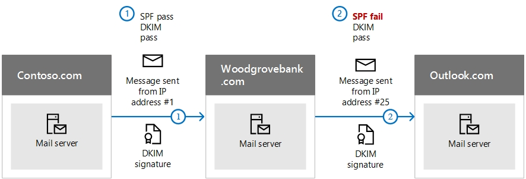

# Use DKIM to validate outbound email sent from your custom domain

[!INCLUDE [Microsoft 365 Defender rebranding](../includes/microsoft-defender-for-office.md)]

**Applies to**
- [Exchange Online Protection](exchange-online-protection-overview.md)
- [Microsoft Defender for Office 365 plan 1 and plan 2](defender-for-office-365.md)
- [Microsoft 365 Defender](../defender/microsoft-365-defender.md)

 **Summary:** This article describes how you use DomainKeys Identified Mail (DKIM) with Microsoft 365 to ensure that destination email systems trust messages sent outbound from your custom domain.

You should use DKIM in addition to SPF and DMARC to help prevent spoofers from sending messages that look like they are coming from your domain. DKIM lets you add a digital signature to outbound email messages in the message header. It may sound complicated, but it's really not. When you configure DKIM, you authorize your domain to associate, or sign, its name to an email message by using cryptographic authentication. Email systems that receive email from your domain can use this digital signature to help determine if incoming email that they receive is legitimate.

Basically, you use a private key to encrypt the header in your domain's outgoing email. You publish a public key to your domain's DNS records that receiving servers can then use to decode the signature. They use the public key to verify that the messages are really coming from you and not coming from someone *spoofing* your domain.

Microsoft 365 automatically sets up DKIM for its initial 'onmicrosoft.com' domains. That means you don't need to do anything to set up DKIM for any initial domain names (for example, litware.onmicrosoft.com). For more information about domains, see [Domains FAQ](../../admin/setup/domains-faq.yml#why-do-i-have-an--onmicrosoft-com--domain).

You can choose to do nothing about DKIM for your custom domain too. If you don't set up DKIM for your custom domain, Microsoft 365 creates a private and public key pair, enables DKIM signing, and then configures the Microsoft 365 default policy for your custom domain. While this is sufficient coverage for most customers, you should manually configure DKIM for your custom domain in the following circumstances:

- You have more than one custom domain in Microsoft 365

- You're going to set up DMARC too (recommended)

- You want control over your private key

- You want to customize your CNAME records

- You want to set up DKIM keys for email originating out of a third-party domain, for example, if you use a third-party bulk mailer.

In this article:

- [How DKIM works better than SPF alone to prevent malicious spoofing](use-dkim-to-validate-outbound-email.md#HowDKIMWorks)

- [Steps to manually upgrade your 1024-bit keys to 2048-bit DKIM encryption keys](use-dkim-to-validate-outbound-email.md#1024to2048DKIM)

- [Steps you need to do to manually set up DKIM](use-dkim-to-validate-outbound-email.md#SetUpDKIMO365)

- [To configure DKIM for more than one custom domain](use-dkim-to-validate-outbound-email.md#DKIMMultiDomain)

- [Disabling the DKIM signing policy for a custom domain](use-dkim-to-validate-outbound-email.md#DisableDKIMSigningPolicy)

- [Default behavior for DKIM and Microsoft 365](use-dkim-to-validate-outbound-email.md#DefaultDKIMbehavior)

- [Set up DKIM so that a third-party service can send, or spoof, email on behalf of your custom domain](use-dkim-to-validate-outbound-email.md#SetUp3rdPartyspoof)

- [Next steps: After you set up DKIM for Microsoft 365](use-dkim-to-validate-outbound-email.md#DKIMNextSteps)

## How DKIM works better than SPF alone to prevent malicious spoofing
<a name="HowDKIMWorks"> </a>

SPF adds information to a message envelope but DKIM actually encrypts a signature within the message header. When you forward a message, portions of that message's envelope can be stripped away by the forwarding server. Since the digital signature stays with the email message because it's part of the email header, DKIM works even when a message has been forwarded as shown in the following example.



In this example, if you had only published an SPF TXT record for your domain, the recipient's mail server could have marked your email as spam and generated a false positive result. The addition of DKIM in this scenario reduces false positive spam reporting. Because DKIM relies on public key cryptography to authenticate and not just IP addresses, DKIM is considered a much stronger form of authentication than SPF. We recommend using both SPF and DKIM, as well as DMARC in your deployment.

The nitty gritty: DKIM uses a private key to insert an encrypted signature into the message headers. The signing domain, or outbound domain, is inserted as the value of the **d=** field in the header. The verifying domain, or recipient's domain, then use the **d=** field to look up the public key from DNS and authenticate the message. If the message is verified, the DKIM check passes.

## Steps to manually upgrade your 1024-bit keys to 2048-bit DKIM encryption keys
<a name="1024to2048DKIM"> </a>

Since both 1024 and 2048 bitness are supported for DKIM keys, these directions will tell you how to upgrade your 1024-bit key to 2048 in [Exchange Online PowerShell](/powershell/exchange/connect-to-exchange-online-powershell). The steps below are for two use-cases, please choose the one that best fits your configuration.

- When you **already have DKIM configured**, you rotate bitness by running the following command:

  ```powershell
  Rotate-DkimSigningConfig -KeySize 2048 -Identity {Guid of the existing Signing Config}
  ```

  **or**

- For a **new implementation of DKIM**, run the following command:

  ```powershell
  New-DkimSigningConfig -DomainName <Domain for which config is to be created> -KeySize 2048 -Enabled $true
  ```

Stay connected to Exchange Online PowerShell to *verify* the configuration by running the following command:

```powershell
Get-DkimSigningConfig -Identity <Domain for which the configuration was set> | Format-List
```

> [!TIP]
> This new 2048-bit key takes effect on the RotateOnDate, and will send emails with the 1024-bit key in the interim. After four days, you can test again with the 2048-bit key (that is, once the rotation takes effect to the second selector).

If you want to rotate to the second selector, your options are a) let the Microsoft 365 service rotate the selector and upgrade to 2048-bitness within the next 6 months, or b) after 4 days and confirming that 2048-bitness is in use, manually rotate the second selector key by using the appropriate cmdlet listed above.

For detailed syntax and parameter information, see the following articles: [Rotate-DkimSigningConfig](/powershell/module/exchange/rotate-dkimsigningconfig), [New-DkimSigningConfig](/powershell/module/exchange/new-dkimsigningconfig), and [Get-DkimSigningConfig](/powershell/module/exchange/get-dkimsigningconfig).

## Steps you need to do to manually set up DKIM
<a name="SetUpDKIMO365"> </a>

To configure DKIM, you will complete these steps:

- [Publish two CNAME records for your custom domain in DNS](use-dkim-to-validate-outbound-email.md#Publish2CNAME)

- [Enable DKIM signing for your custom domain](use-dkim-to-validate-outbound-email.md#EnableDKIMinO365)

### Publish two CNAME records for your custom domain in DNS
<a name="Publish2CNAME"> </a>

For each domain for which you want to add a DKIM signature in DNS, you need to publish two CNAME records.

> [!NOTE]
> If you haven't read the full article, you may have missed this time-saving PowerShell connection information: [Connect to Exchange Online PowerShell](/powershell/exchange/connect-to-exchange-online-powershell).

Run the following commands in Exchange Online PowerShell to create the selector records:

```powershell
New-DkimSigningConfig -DomainName <domain> -Enabled $false
Get-DkimSigningConfig -Identity <domain> | Format-List Selector1CNAME, Selector2CNAME
```

If you have provisioned custom domains in addition to the initial domain in Microsoft 365, you must publish two CNAME records for each additional domain. So, if you have two domains, you must publish two additional CNAME records, and so on.

Use the following format for the CNAME records.

> [!IMPORTANT]
> If you are one of our GCC High customers, we calculate _domainGuid_ differently! Instead of looking up the MX record for your _initialDomain_ to calculate _domainGuid_, instead we calculate it directly from the customized domain. For example, if your customized domain is "contoso.com" your domainGuid becomes "contoso-com", any periods are replaced with a dash. So, regardless of what MX record your initialDomain points to, you'll always use the above method to calculate the domainGuid to use in your CNAME records.

```console
Host name:            selector1._domainkey
Points to address or value:    selector1-<domainGUID>._domainkey.<initialDomain>
TTL:                3600

Host name:            selector2._domainkey
Points to address or value:    selector2-<domainGUID>._domainkey.<initialDomain>
TTL:                3600
```

Where:

- For Microsoft 365, the selectors will always be "selector1" or "selector2".

- _domainGUID_ is the same as the _domainGUID_ in the customized MX record for your custom domain that appears before mail.protection.outlook.com. For example, in the following MX record for the domain contoso.com, the _domainGUID_ is contoso-com:

  > contoso.com.  3600  IN  MX   5 contoso-com.mail.protection.outlook.com

- _initialDomain_ is the domain that you used when you signed up for Microsoft 365. Initial domains always end in onmicrosoft.com. For information about determining your initial domain, see [Domains FAQ](../../admin/setup/domains-faq.yml#why-do-i-have-an--onmicrosoft-com--domain).

For example, if you have an initial domain of cohovineyardandwinery.onmicrosoft.com, and two custom domains cohovineyard.com and cohowinery.com, you would need to set up two CNAME records for each additional domain, for a total of four CNAME records.

```console
Host name:            selector1._domainkey
Points to address or value:    selector1-cohovineyard-com._domainkey.cohovineyardandwinery.onmicrosoft.com
TTL:                3600

Host name:            selector2._domainkey
Points to address or value:    selector2-cohovineyard-com._domainkey.cohovineyardandwinery.onmicrosoft.com
TTL:                3600

Host name:            selector1._domainkey
Points to address or value:    selector1-cohowinery-com._domainkey.cohovineyardandwinery.onmicrosoft.com
TTL:                3600

Host name:            selector2._domainkey
Points to address or value:    selector2-cohowinery-com._domainkey.cohovineyardandwinery.onmicrosoft.com
TTL:                3600
```

> [!NOTE]
> It's important to create the second record, but only one of the selectors may be available at the time of creation. In essence, the second selector might point to an address that hasn't been created yet. We still recommended that you create the second CNAME record, because your key rotation will be seamless.


### Steps to enable DKIM signing for your custom domain
<a name="EnableDKIMinO365"> </a>

Once you have published the CNAME records in DNS, you are ready to enable DKIM signing through Microsoft 365. You can do this either through the Microsoft 365 admin center or by using PowerShell.

#### To enable DKIM signing for your custom domain through the admin center

1. [Sign in to Microsoft 365](https://support.microsoft.com/office/e9eb7d51-5430-4929-91ab-6157c5a050b4) with your work or school account.

2. Go to [protection.office.com](https://protection.office.com) or [security.microsoft.com](https://security.microsoft.com) depending on which portal you use, and follow the path below.

|protection.office.com  |security.microsoft.com  |
|---------|---------|
| Threat Management > Policy > Additional Policies > DKIM     | Email & Collaboration > Policies & rules > Threat policies > Additional policies > DKIM        | 

3. Select the domain for which you want to enable DKIM and then, for **Sign messages for this domain with DKIM signatures**, choose **Enable**. Repeat this step for each custom domain.

#### To enable DKIM signing for your custom domain by using PowerShell

> [!IMPORTANT]
>:::image type="content" source="../../media/DKIMNoKeysSavedForThisDomain.PNG" alt-text="The 'No DKIM keys saved for this domain.' error.":::
> If you are configuring DKIM for the first time and see the error 'No DKIM keys saved for this domain.' complete the command in step 2, below (for example, *Set-DkimSigningConfig -Identity contoso.com -Enabled $true*) to see the key.

1. [Connect to Exchange Online PowerShell](/powershell/exchange/connect-to-exchange-online-powershell).

2. Run the following command:

   ```powershell
   Set-DkimSigningConfig -Identity <domain> -Enabled $true
   ```

   Where _domain_ is the name of the custom domain that you want to enable DKIM signing for.

   For example, for the domain contoso.com:

   ```powershell
   Set-DkimSigningConfig -Identity contoso.com -Enabled $true
   ```

#### To Confirm DKIM signing is configured properly for Microsoft 365

Wait a few minutes before you follow these steps to confirm that you have properly configured DKIM. This allows time for the DKIM information about the domain to be spread throughout the network.

- Send a message from an account within your Microsoft 365 DKIM-enabled domain to another email account such as outlook.com or Hotmail.com.

- Do not use an aol.com account for testing purposes. AOL may skip the DKIM check if the SPF check passes. This will nullify your test.

- Open the message and look at the header. Instructions for viewing the header for the message will vary depending on your messaging client. For instructions on viewing message headers in Outlook, see [View internet message headers in Outlook](https://support.microsoft.com/office/cd039382-dc6e-4264-ac74-c048563d212c).

  The DKIM-signed message will contain the host name and domain you defined when you published the CNAME entries. The message will look something like this example:

  ```console
    From: Example User <example@contoso.com>
    DKIM-Signature: v=1; a=rsa-sha256; q=dns/txt; c=relaxed/relaxed;
        s=selector1; d=contoso.com; t=1429912795;
        h=From:To:Message-ID:Subject:MIME-Version:Content-Type;
        bh=<body hash>;
        b=<signed field>;
  ```

- Look for the Authentication-Results header. While each receiving service uses a slightly different format to stamp the incoming mail, the result should include something like **DKIM=pass** or **DKIM=OK**.

## To configure DKIM for more than one custom domain
<a name="DKIMMultiDomain"> </a>

If at some point in the future you decide to add another custom domain and you want to enable DKIM for the new domain, you must complete the steps in this article for each domain. Specifically, complete all steps in [What you need to do to manually set up DKIM](use-dkim-to-validate-outbound-email.md#SetUpDKIMO365).

## Disabling the DKIM signing policy for a custom domain
<a name="DisableDKIMSigningPolicy"> </a>

Disabling the signing policy does not completely disable DKIM. After a period of time, Microsoft 365 will automatically apply the default policy for your domain. For more information, see [Default behavior for DKIM and Microsoft 365](use-dkim-to-validate-outbound-email.md#DefaultDKIMbehavior).

### To disable the DKIM signing policy by using Windows PowerShell

1. [Connect to Exchange Online PowerShell](/powershell/exchange/connect-to-exchange-online-powershell).

2. Run one of the following commands for each domain for which you want to disable DKIM signing.

   ```powershell
   $p = Get-DkimSigningConfig -Identity <domain>
   $p[0] | Set-DkimSigningConfig -Enabled $false
   ```

   For example:

   ```powershell
   $p = Get-DkimSigningConfig -Identity contoso.com
   $p[0] | Set-DkimSigningConfig -Enabled $false
   ```

   Or

   ```powershell
   Set-DkimSigningConfig -Identity $p[<number>].Identity -Enabled $false
   ```

   Where _number_ is the index of the policy. For example:

   ```powershell
   Set-DkimSigningConfig -Identity $p[0].Identity -Enabled $false
   ```

## Default behavior for DKIM and Microsoft 365
<a name="DefaultDKIMbehavior"> </a>

If you do not enable DKIM, Microsoft 365 automatically creates a 1024-bit DKIM public key for your default domain and the associated private key which we store internally in our datacenter. By default, Microsoft 365 uses a default signing configuration for domains that do not have a policy in place. This means that if you do not set up DKIM yourself, Microsoft 365 will use its default policy and keys it creates to enable DKIM for your domain.

Also, if you disable DKIM signing after enabling it, after a period of time, Microsoft 365 will automatically apply the default policy for your domain.

In the following example, suppose that DKIM for fabrikam.com was enabled by Microsoft 365, not by the administrator of the domain. This means that the required CNAMEs do not exist in DNS. DKIM signatures for email from this domain will look something like this:

```console
From: Second Example <second.example@fabrikam.com>
DKIM-Signature: v=1; a=rsa-sha256; q=dns/txt; c=relaxed/relaxed;
    s=selector1-fabrikam-com; d=contoso.onmicrosoft.com; t=1429912795;
    h=From:To:Message-ID:Subject:MIME-Version:Content-Type;
    bh=<body hash>;
    b=<signed field>;
```

In this example, the host name and domain contain the values to which the CNAME would point if DKIM-signing for fabrikam.com had been enabled by the domain administrator. Eventually, every single message sent from Microsoft 365 will be DKIM-signed. If you enable DKIM yourself, the domain will be the same as the domain in the From: address, in this case fabrikam.com. If you don't, it will not align and instead will use your organization's initial domain. For information about determining your initial domain, see [Domains FAQ](../../admin/setup/domains-faq.yml#why-do-i-have-an--onmicrosoft-com--domain).

## Set up DKIM so that a third-party service can send, or spoof, email on behalf of your custom domain
<a name="SetUp3rdPartyspoof"> </a>

Some bulk email service providers, or software-as-a-service providers, let you set up DKIM keys for email that originates from their service. This requires coordination between yourself and the third-party in order to set up the necessary DNS records. Some third-party servers can have their own CNAME records with different selectors. No two organizations do it exactly the same way. Instead, the process depends entirely on the organization.

An example message showing a properly configured DKIM for contoso.com and bulkemailprovider.com might look like this:

```console
Return-Path: <communication@bulkemailprovider.com>
 From: <sender@contoso.com>
 DKIM-Signature: s=s1024; d=contoso.com
 Subject: Here is a message from Bulk Email Provider's infrastructure, but with a DKIM signature authorized by contoso.com
```

In this example, in order to achieve this result:

1. Bulk Email Provider gave Contoso a public DKIM key.

2. Contoso published the DKIM key to its DNS record.

3. When sending email, Bulk Email Provider signs the key with the corresponding private key. By doing so, Bulk Email Provider attached the DKIM signature to the message header.

4. Receiving email systems perform a DKIM check by authenticating the DKIM-Signature d=\<domain\> value against the domain in the From: (5322.From) address of the message. In this example, the values match:

   > sender@**contoso.com**

   > d=**contoso.com**

## Identify domains that do not send email

Organizations should explicitly state if a domain does not send email by specifying `v=DKIM1; p=` in the DKIM record for those domains. This advises receiving email servers that there are no valid public keys for the domain, and any email claiming to be from that domain should be rejected. You should do this for each domain and subdomain using a wildcard DKIM.

For example, the DKIM record would look like this:

```console
*._domainkey.SubDomainThatShouldntSendMail.contoso.com. TXT "v=DKIM1; p="
```

## Next steps: After you set up DKIM for Microsoft 365
<a name="DKIMNextSteps"> </a>

Although DKIM is designed to help prevent spoofing, DKIM works better with SPF and DMARC. Once you have set up DKIM, if you have not already set up SPF you should do so. For a quick introduction to SPF and to get it configured quickly, see [Set up SPF in Microsoft 365 to help prevent spoofing](set-up-spf-in-office-365-to-help-prevent-spoofing.md). For a more in-depth understanding of how Microsoft 365 uses SPF, or for troubleshooting or non-standard deployments such as hybrid deployments, start with [How Microsoft 365 uses Sender Policy Framework (SPF) to prevent spoofing](how-office-365-uses-spf-to-prevent-spoofing.md). Next, see [Use DMARC to validate email](use-dmarc-to-validate-email.md). [Anti-spam message headers](anti-spam-message-headers.md) includes the syntax and header fields used by Microsoft 365 for DKIM checks.

## More information

Key rotation via PowerShell
[Rotate-DkimSigningConfig](/powershell/module/exchange/rotate-dkimsigningconfig)