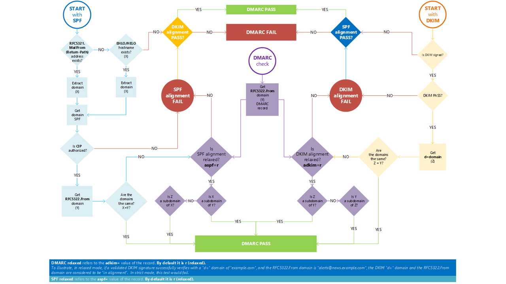

# Use DMARC to validate email

[!INCLUDE [Microsoft 365 Defender rebranding](../includes/microsoft-defender-for-office.md)]

**Applies to**
- [Exchange Online Protection](exchange-online-protection-overview.md)
- [Microsoft Defender for Office 365 plan 1 and plan 2](office-365-atp.md)
- [Microsoft 365 Defender](../mtp/microsoft-threat-protection.md)

Domain-based Message Authentication, Reporting, and Conformance ([DMARC](https://dmarc.org)) works with Sender Policy Framework (SPF) and DomainKeys Identified Mail (DKIM) to authenticate mail senders and ensure that destination email systems trust messages sent from your domain. Implementing DMARC with SPF and DKIM provides additional protection against spoofing and phishing email. DMARC helps receiving mail systems determine what to do with messages sent from your domain that fail SPF or DKIM checks.

> [!TIP]
> Visit the [Microsoft Intelligent Security Association (MISA)](https://www.microsoft.com/misapartnercatalog) catalog to view third-party vendors offering DMARC reporting for Microsoft 365.

## How do SPF and DMARC work together to protect email in Microsoft 365?

 An email message may contain multiple originator or sender addresses. These addresses are used for different purposes. For example, consider these addresses:

- **"Mail From" address**: Identifies the sender and specifies where to send return notices if any problems occur with the delivery of the message, such as non-delivery notices. This appears in the envelope portion of an email message and is not usually displayed by your email application. This is sometimes called the 5321.MailFrom address or the reverse-path address.

- **"From" address**: The address displayed as the From address by your mail application. This address identifies the author of the email. That is, the mailbox of the person or system responsible for writing the message. This is sometimes called the 5322.From address.

SPF uses a DNS TXT record to provide a list of authorized sending IP addresses for a given domain. Normally, SPF checks are only performed against the 5321.MailFrom address. This means that the 5322.From address is not authenticated when you use SPF by itself. This allows for a scenario where a user can receive a message which passes an SPF check but has a spoofed 5322.From sender address. For example, consider this SMTP transcript:

```console
S: Helo woodgrovebank.com
S: Mail from: phish@phishing.contoso.com
S: Rcpt to: astobes@tailspintoys.com
S: data
S: To: "Andrew Stobes" <astobes@tailspintoys.com>
S: From: "Woodgrove Bank Security" <security@woodgrovebank.com>
S: Subject: Woodgrove Bank - Action required
S:
S: Greetings User,
S:
S: We need to verify your banking details.
S: Please click the following link to verify that we have the right information for your account.
S:
S: https://short.url/woodgrovebank/updateaccount/12-121.aspx
S:
S: Thank you,
S: Woodgrove Bank
S: .
```

In this transcript, the sender addresses are as follows:

- Mail from address (5321.MailFrom): phish@phishing.contoso.com

- From address (5322.From): security@woodgrovebank.com

If you configured SPF, then the receiving server performs a check against the Mail from address phish@phishing.contoso.com. If the message came from a valid source for the domain phishing.contoso.com then the SPF check passes. Since the email client only displays the From address, the user sees that this message came from security@woodgrovebank.com. With SPF alone, the validity of woodgrovebank.com was never authenticated.

When you use DMARC, the receiving server also performs a check against the From address. In the example above, if there is a DMARC TXT record in place for woodgrovebank.com, then the check against the From address fails.

## What is a DMARC TXT record?

Like the DNS records for SPF, the record for DMARC is a DNS text (TXT) record that helps prevent spoofing and phishing. You publish DMARC TXT records in DNS. DMARC TXT records validate the origin of email messages by verifying the IP address of an email's author against the alleged owner of the sending domain. The DMARC TXT record identifies authorized outbound email servers. Destination email systems can then verify that messages they receive originate from authorized outbound email servers.

Microsoft's DMARC TXT record looks something like this:

```console
_dmarc.microsoft.com.   3600    IN      TXT     "v=DMARC1; p=none; pct=100; rua=mailto:d@rua.agari.com; ruf=mailto:d@ruf.agari.com; fo=1"
```

Microsoft sends its DMARC reports to [Agari](https://agari.com), a third party. Agari collects and analyzes DMARC reports. Please visit the [MISA catalog](https://www.microsoft.com/misapartnercatalog) to view more third-party vendors offering DMARC reporting for Microsoft 365.

## Implement DMARC for inbound mail

You don't have to do a thing to set up DMARC for mail that you receive in Microsoft 365. We've taken care of everything for you. If you want to learn what happens to mail that fails to pass our DMARC checks, see [How Microsoft 365 handles inbound email that fails DMARC](#how-microsoft-365-handles-inbound-email-that-fails-dmarc).

## Implement DMARC for outbound mail from Microsoft 365

If you use Microsoft 365 but you aren't using a custom domain, that is, you use onmicrosoft.com, you don't need to do anything else to configure or implement DMARC for your organization. SPF is already set up for you and Microsoft 365 automatically generates a DKIM signature for your outgoing mail. For more information about this signature, see [Default behavior for DKIM and Microsoft 365](use-dkim-to-validate-outbound-email.md#DefaultDKIMbehavior).

 If you have a custom domain or you are using on-premises Exchange servers in addition to Microsoft 365, you need to manually implement DMARC for your outbound mail. Implementing DMARC for your custom domain includes these steps:

- [Step 1: Identify valid sources of mail for your domain](#step-1-identify-valid-sources-of-mail-for-your-domain)

- [Step 2: Set up SPF for your domain](#step-2-set-up-spf-for-your-domain)

- [Step 3: Set up DKIM for your custom domain](#step-3-set-up-dkim-for-your-custom-domain)

- [Step 4: Form the DMARC TXT record for your domain](#step-4-form-the-dmarc-txt-record-for-your-domain)

### Step 1: Identify valid sources of mail for your domain

If you have already set up SPF then you have already gone through this exercise. However, for DMARC, there are additional considerations. When identifying sources of mail for your domain there are two questions you need to answer:

- What IP addresses send messages from my domain?

- For mail sent from third parties on my behalf, will the 5321.MailFrom and 5322.From domains match?

### Step 2: Set up SPF for your domain

Now that you have a list of all your valid senders you can follow the steps to [Set up SPF to help prevent spoofing](set-up-spf-in-office-365-to-help-prevent-spoofing.md).

For example, assuming contoso.com sends mail from Exchange Online, an on-premises Exchange server whose IP address is 192.168.0.1, and a web application whose IP address is 192.168.100.100, the SPF TXT record would look like this:

```console
contoso.com  IN  TXT  " v=spf1 ip4:192.168.0.1 ip4:192.168.100.100 include:spf.protection.outlook.com -all"
```

As a best practice, ensure that your SPF TXT record takes into account third-party senders.

### Step 3: Set up DKIM for your custom domain

Once you have set up SPF, you need to set up DKIM. DKIM lets you add a digital signature to email messages in the message header. If you do not set up DKIM and instead allow Microsoft 365 to use the default DKIM configuration for your domain, DMARC may fail. This is because the default DKIM configuration uses your initial onmicrosoft.com domain as the 5322.From address, not your custom domain. This forces a mismatch between the 5321.MailFrom and the 5322.From addresses in all email sent from your domain.

If you have third-party senders that send mail on your behalf and the mail they send has mismatched 5321.MailFrom and 5322.From addresses, DMARC will fail for that email. To avoid this, you need to set up DKIM for your domain specifically with that third-party sender. This allows Microsoft 365 to authenticate email from this 3rd-party service. However, it also allows others, for example, Yahoo, Gmail, and Comcast, to verify email sent to them by the third-party as if it was email sent by you. This is beneficial because it allows your customers to build trust with your domain no matter where their mailbox is located, and at the same time Microsoft 365 won't mark a message as spam due to spoofing because it passes authentication checks for your domain.

For instructions on setting up DKIM for your domain, including how to set up DKIM for third-party senders so they can spoof your domain, see [Use DKIM to validate outbound email sent from your custom domain](use-dkim-to-validate-outbound-email.md).

### Step 4: Form the DMARC TXT record for your domain

Although there are other syntax options that are not mentioned here, these are the most commonly used options for Microsoft 365. Form the DMARC TXT record for your domain in the format:

```console
_dmarc.domain  TTL  IN  TXT  "v=DMARC1; p=policy; pct=100"
```

where:

- *domain* is the domain you want to protect. By default, the record protects mail from the domain and all subdomains. For example, if you specify \_dmarc.contoso.com, then DMARC protects mail from the domain and all subdomains, such as housewares.contoso.com or plumbing.contoso.com.

- *TTL* should always be the equivalent of one hour. The unit used for TTL, either hours (1 hour), minutes (60 minutes), or seconds (3600 seconds), will vary depending on the registrar for your domain.

- *pct=100* indicates that this rule should be used for 100% of email.

- *policy* specifies what policy you want the receiving server to follow if DMARC fails. You can set the policy to none, quarantine, or reject.

For information about which options to use, become familiar with the concepts in [Best practices for implementing DMARC in Microsoft 365](#best-practices-for-implementing-dmarc-in-microsoft-365).

Examples:

- Policy set to none

    ```console
    _dmarc.contoso.com 3600 IN  TXT  "v=DMARC1; p=none"
    ```

- Policy set to quarantine

    ```console
    _dmarc.contoso.com 3600 IN  TXT  "v=DMARC1; p=quarantine"
    ```

- Policy set to reject

    ```console
    _dmarc.contoso.com  3600 IN  TXT  "v=DMARC1; p=reject"
    ```

Once you have formed your record, you need to update the record at your domain registrar. For instructions on adding the DMARC TXT record to your DNS records for Microsoft 365, see [Create DNS records for Microsoft 365 when you manage your DNS records](../../admin/get-help-with-domains/create-dns-records-at-any-dns-hosting-provider.md).

## Best practices for implementing DMARC in Microsoft 365

You can implement DMARC gradually without impacting the rest of your mail flow. Create and implement a roll-out plan that follows these steps. Do each of these steps first with a sub-domain, then other sub-domains, and finally with the top-level domain in your organization before moving on to the next step.

1. Monitor the impact of implementing DMARC

    Start with a simple monitoring-mode record for a sub-domain or domain that requests that DMARC receivers send you statistics about messages that they see using that domain. A monitoring-mode record is a DMARC TXT record that has its policy set to none (p=none). Many companies publish a DMARC TXT record with p=none because they are unsure about how much email they may lose by publishing a more restrictive DMARC policy.

    You can do this even before you've implemented SPF or DKIM in your messaging infrastructure. However, you won't be able to effectively quarantine or reject mail by using DMARC until you also implement SPF and DKIM. As you introduce SPF and DKIM, the reports generated through DMARC will provide the numbers and sources of messages that pass these checks, and those that don't. You can easily see how much of your legitimate traffic is or isn't covered by them, and troubleshoot any problems. You'll also begin to see how many fraudulent messages are being sent, and from where.

2. Request that external mail systems quarantine mail that fails DMARC

    When you believe that all or most of your legitimate traffic is protected by SPF and DKIM, and you understand the impact of implementing DMARC, you can implement a quarantine policy. A quarantine policy is a DMARC TXT record that has its policy set to quarantine (p=quarantine). By doing this, you are asking DMARC receivers to put messages from your domain that fail DMARC into the local equivalent of a spam folder instead of your customers' inboxes.

3. Request that external mail systems not accept messages that fail DMARC

    The final step is implementing a reject policy. A reject policy is a DMARC TXT record that has its policy set to reject (p=reject). When you do this, you're asking DMARC receivers not to accept messages that fail the DMARC checks.

4. How to set up DMARC for subdomain?

   DMARC is implemented by publishing a policy as a TXT record in DNS and is hierarchical (e.g. a policy published for contoso.com will apply to sub.domain.contonos.com unless a different policy is explicitly defined for the subdomain). This is useful as organizations may be able to specify a smaller number of high-level DMARC records for wider coverage. Care should be taken to configure explicit subdomain DMARC records where you do not want the subdomains to inherit the top-level domain's DMARC record.

   Also, you can add a wildcard-type policy for DMARC when subdomains shouldn't be sending email, by adding the `sp=reject` value. For example:

   ```text
   _dmarc.contoso.com. TXT "v=DMARC1; p=reject; sp=reject; ruf=mailto:authfail@contoso.com; rua=mailto:aggrep@contoso.com"
   ```

## How Microsoft 365 handles outbound email that fails DMARC

If a message is outbound from Microsoft 365 and fails DMARC, and you have set the policy to p=quarantine or p=reject, the message is routed through the [High-risk delivery pool for outbound messages](high-risk-delivery-pool-for-outbound-messages.md). There is no override for outbound email.

If you publish a DMARC reject policy (p=reject), no other customer in Microsoft 365 can spoof your domain because messages will not be able to pass SPF or DKIM for your domain when relaying a message outbound through the service. However, if you do publish a DMARC reject policy but don't have all of your email authenticated through Microsoft 365, some of it may be marked as spam for inbound email (as described above), or it will be rejected if you do not publish SPF and try to relay it outbound through the service. This happens, for example, if you forget to include some of the IP addresses for servers and apps that send mail on behalf of your domain when you form your DMARC TXT record.

## How Microsoft 365 handles inbound email that fails DMARC

If the DMARC policy of the sending server is `p=reject`, [Exchange Online Protection](exchange-online-protection-overview.md) (EOP) marks the message as spoof instead of rejecting it. In other words, for inbound email, Microsoft 365 treats `p=reject` and `p=quarantine` the same way. Admins can define the action to take on messages classified as spoof within the [anti-phishing policy](set-up-anti-phishing-policies.md).

Microsoft 365 is configured like this because some legitimate email may fail DMARC. For example, a message might fail DMARC if it is sent to a mailing list that then relays the message to all list participants. If Microsoft 365 rejected these messages, people could lose legitimate email and have no way to retrieve it. Instead, these messages will still fail DMARC but they will be marked as spam and not rejected. If desired, users can still get these messages in their inbox through these methods:

- Users add safe senders individually by using their email client.

- Admins can use the [spoof intelligence insight](learn-about-spoof-intelligence.md) or the [Tenant Allow/Block List](tenant-allow-block-list.md) to allow messages from the spoofed sender.

- Admins create an Exchange mail flow rule (also known as a transport rule) for all users that allows messages for those particular senders.

For more information, see [Create safe sender lists](create-safe-sender-lists-in-office-365.md).

## How Microsoft 365 utilizes Authenticated Received Chain (ARC)

All hosted mailboxes in Microsoft 365 will now gain the benefit of ARC with improved deliverability of messages and enhanced anti-spoofing protection. ARC preserves the email authentication results from all participating intermediaries, or hops, when an email is routed from the originating server to the recipient mailbox. Before ARC, modifications performed by intermediaries in email routing, like forwarding rules or automatic signatures, could cause DMARC failures by the time the email reached the recipient mailbox. With ARC, the cryptographic preservation of the authentication results allows Microsoft 365 to verify the authenticity of an email's sender.

Microsoft 365 currently utilizes ARC to verify authentication results when Microsoft is the ARC Sealer, but plan to add support for third-party ARC sealers in the future.

## Troubleshooting your DMARC implementation

If you have configured your domain's MX records where EOP is not the first entry, DMARC failures will not be enforced for your domain.

If you're a customer, and your domain's primary MX record does not point to EOP, you will not get the benefits of DMARC. For example, DMARC won't work if you point the MX record to your on-premises mail server and then route email to EOP by using a connector. In this scenario, the receiving domain is one of your Accepted-Domains but EOP is not the primary MX. For example, suppose contoso.com points its MX at itself and uses EOP as a secondary MX record, contoso.com's MX record looks like the following:

```console
contoso.com     3600   IN  MX  0  mail.contoso.com
contoso.com     3600   IN  MX  10 contoso-com.mail.protection.outlook.com
```

All, or most, email will first be routed to mail.contoso.com since it's the primary MX, and then mail will get routed to EOP. In some cases, you might not even list EOP as an MX record at all and simply hook up connectors to route your email. EOP does not have to be the first entry for DMARC validation to be done. It just ensures the validation, as we cannot be certain that all on-premise/non-O365 servers will do DMARC checks.  DMARC is eligible to be enforced for a customer's domain (not server) when you set up the DMARC TXT record, but it is up to the receiving server to actually do the enforcement.  If you set up EOP as the receiving server, then EOP does the DMARC enforcement.



## For more information

Want more information about DMARC? These resources can help.

- [Anti-spam message headers](anti-spam-message-headers.md) includes the syntax and header fields used by Microsoft 365 for DMARC checks.

- Take the [DMARC Training Series](https://www.m3aawg.org/activities/training/dmarc-training-series) from M<sup>3</sup>AAWG (Messaging, Malware, Mobile Anti-Abuse Working Group).

- Use the checklist at [dmarcian](https://space.dmarcian.com/deployment/).

- Go directly to the source at [DMARC.org](https://dmarc.org).

## See also

[How Microsoft 365 uses Sender Policy Framework (SPF) to prevent spoofing](how-office-365-uses-spf-to-prevent-spoofing.md)

[Set up SPF in Microsoft 365 to help prevent spoofing](set-up-spf-in-office-365-to-help-prevent-spoofing.md)

[Use DKIM to validate outbound email sent from your custom domain in Microsoft 365](use-dkim-to-validate-outbound-email.md)
