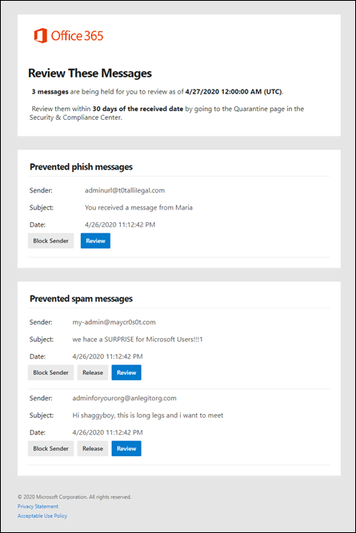

# Use user spam notifications to release and report quarantined messages

Quarantine holds potentially dangerous or unwanted messages in Office 365 organizations with mailboxes in Exchange Online or standalone Exchange Online Protection (EOP) organizations without Exchange Online mailboxes. For more information, see [Quarantine in Office 365](quarantine-email-messages.md).

By default, end-user spam notifications are disabled in anti-spam policies. When an admin [enables end-user spam notifications](configure-your-spam-filter-policies.md), message recipients will receive periodic notifications about their messages that were quarantined as spam, bulk email, or (as of April, 2020) phishing.

> [!NOTE]
> In October 2019, we removed the ability to release quarantined messages directly from end-user spam notifications. Instead, users can now go to the Office 365 Security & Compliance Center to release their quarantined messages (either directly, or by clicking **Review** in the notification). For more information, see [Find and release quarantined messages as a user in Office 365](find-and-release-quarantined-messages-as-a-user.md).    Messages that were quarantined as high confidence phishing, malware, or by mail flow rules (also known as transport rules) are only available to admins. For more information, see [Find and release quarantined messages as an admin in Office 365](find-and-release-quarantined-messages-as-an-administrator.md).

An end-user spam notification contains the following information for each quarantined message:

- **Sender**: The send name and email address of the quarantined message.

- **Subject**: The subject line text of the quarantined message.

- **Date**: The date and time (in UTC) that the message was quarantined.

- **Block Sender**: Click this link to add the sender to your Blocked Senders list.

- **Review**: Click this link to go the the Quarantine in the Security & Compliance Center, where you can release, delete or report your quarantined messages.

