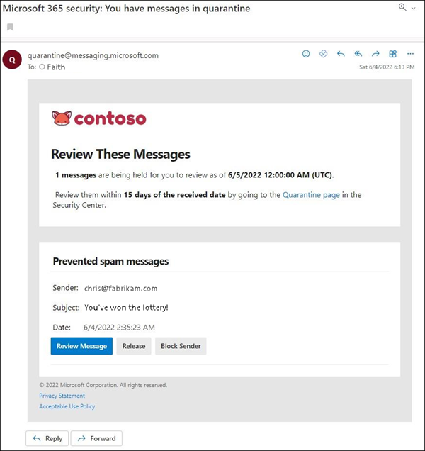

# End-user spam notifications in Office 365

Quarantine holds potentially dangerous or unwanted messages in Office 365 organizations with mailboxes in Exchange Online or standalone Exchange Online Protection (EOP) organizations without Exchange Online mailboxes. For more information, see [Quarantine in Office 365](quarantine-email-messages.md).

By default, end-user spam notifications are disabled in anti-spam policies. When an admin [enables end-user spam notifications](configure-your-spam-filter-policies.md#configure-end-user-spam-notifications), recipients will receive periodic notifications about their messages that were quarantined as spam, bulk email, or (as of April, 2020) phishing.

> [!NOTE]
> Messages that were quarantined as high confidence phishing, malware, or by mail flow rules (also known as transport rules) are only available to admins. For more information, see [Manage quarantined messages and files as an admin in Office 365](manage-quarantined-messages-and-files.md).

An end-user spam notification contains the following information for each quarantined message:

- **Sender**: The send name and email address of the quarantined message.

- **Subject**: The subject line text of the quarantined message.

- **Date**: The date and time (in UTC) that the message was quarantined.

- **Block Sender**: Click this link to add the sender to your Blocked Senders list. For more information, see [Block a mail sender in Outlook](https://support.office.com/article/b29fd867-cac9-40d8-aed1-659e06a706e4).

- **Release**: For spam (not phish) messages, you can release the message here without going to Quarantine the Security & Compliance Center.

- **Review**: Click this link to go to Quarantine in the Security & Compliance Center, where you can release, delete or report your quarantined messages. For more information, see [Find and release quarantined messages as a user in Office 365](find-and-release-quarantined-messages-as-a-user.md).

