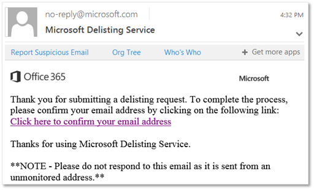

# Use the delist portal to remove yourself from the blocked senders list

[!INCLUDE [Microsoft 365 Defender rebranding](../includes/microsoft-defender-for-office.md)]

Are you getting an error message when you try to send an email to a recipient whose email address is in Microsoft 365? If you think you should not be receiving the error message, you can use the delist portal to remove yourself from the blocked senders list.

## What is the blocked senders list?

Microsoft uses the blocked senders list to protect its customers from spam, spoofing, and phishing attacks. Your mail server's IP address, that is, the address your mail server uses to identify itself on the Internet, was tagged as a potential threat to Microsoft 365 for one of a variety of reasons. When Microsoft 365 adds the IP address to the list, it prevents all further communication between the IP address and any of our customers through our datacenters.

You will know you have been added to the list when you receive a response to a mail message that includes an error that looks something like this:

> 550 5.7.606-649 Access denied, banned sending IP [_IP address_]; To request removal from this list please visit <https://sender.office.com/> and follow the directions. For more information see [Email non-delivery reports in Exchange Online](https://docs.microsoft.com/Exchange/mail-flow-best-practices/non-delivery-reports-in-exchange-online/non-delivery-reports-in-exchange-online).

where  _IP address_ is the IP address of the computer on which the mail server runs.

### To use delist portal to remove yourself from the blocked senders list

1. In a web browser, go to <https://sender.office.com>.

2. Follow the instructions on the page. Ensure that you use the email address to which the error message was sent, and the IP address that is specified in the error message. You can only enter one email address and one IP address per visit.

3. Click **Submit**.

    The portal sends an email to the email address that you supply. The email will look something like the following:
    

4. Click the confirmation link in the email sent to you by the delisting portal.

    This brings you back to the delist portal.

5. In the delist portal, click **Delist IP**.

    After the IP address is removed from the blocked senders list, email messages from that IP address will be delivered to recipients who use Microsoft 365. So, make sure you're confident that email sent from that IP address won't be abusive or malicious; otherwise, the IP address might be blocked again.

    > [!NOTE]
    > It may take up to 24 hours or results can vary widely before restrictions are removed.

See [Create safe sender lists in EOP](create-safe-sender-lists-in-office-365.md) and [Outbound spam protection in EOP](outbound-spam-controls.md) to prevent an IP from being blocked.
