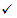

# User tags in Microsoft Defender for Office 365

> [!NOTE]
> The user tags feature is in Preview, isn't available to everyone, and is subject to change. For information about the release schedule, check out the [Microsoft 365 roadmap](https://www.microsoft.com/microsoft-365/roadmap).

User tags are identifiers for specific groups of users in [Microsoft Defender for Office 365](office-365-atp.md). There are two types of user tags:

- **System tags**: Currently, [Priority accounts](https://docs.microsoft.com/microsoft-365/admin/setup/priority-accounts) is the only type of system tag.
- **Custom tags**: You create these user tags yourself.

If your organization has Defender for Office 365 Plan 2 (included in your subscription or as an add-on), you can create custom user tags in addition to using the priority accounts tag.

After you apply system tags or custom tags to users, you can use those tags as filters in alerts, reports, and investigations:

- [Alerts in the Security & Compliance Center](alerts.md)
- [Threat Explorer and real-time detections](threat-explorer.md)
- [Threat protection status report](view-email-security-reports.md#threat-protection-status-report)
- [Campaign Views](campaigns.md)
- For priority accounts, you can use the [Email issues for priority accounts report](https://docs.microsoft.com/exchange/monitoring/mail-flow-reports/mfr-email-issues-for-priority-accounts-report) in the Exchange admin center (EAC).

This article explains how to configure user tags in the Security & Compliance Center. There are no cmdlets in Security & Compliance Center to manage user tags.

## What do you need to know before you begin?

- You open the Security & Compliance Center at <https://protection.office.com/>. To go directly to the **User tags** page, open <https://protection.office.com/userTags>.

- Permissions to manage user tags are controlled by the following AzureAD permissions:
  - TagManager: Create, modify, and delete tags.
  - TagContributor: Add and remove users from existing tags.
  - TagReader: View tag information in both the management experience and in filtered experiences across reports.

  The role groups in the Security & Compliance Center that have these permissions assigned are described in the following table:

  |Security & Compliance   Center role group|TagManager|TagContributor|TagReader|
  |---|:--:|:---:|:---:|
  |Organization Management||||
  |Security Administrator|||
  |Security Operator||||
  |Security Reader||||
  |

  For more information, see [Permissions in the Security & Compliance Center](permissions-in-the-security-and-compliance-center.md).

- To configure priority accounts (system tags), you need to be a [Global administrator](https://docs.microsoft.com/azure/active-directory/users-groups-roles/directory-assign-admin-roles#global-administrator--company-administrator) or an [Exchange Administrator](https://docs.microsoft.com/azure/active-directory/users-groups-roles/directory-assign-admin-roles#exchange-administrator).

  You can also manage and monitor priority accounts in the Microsoft 365 admin center. For instructions, see [Manage and monitor priority accounts](https://docs.microsoft.com/microsoft-365/admin/setup/priority-accounts).

## Use the Security Center to create user tags

1. In the Security Center, go to **Threat management** \> **User tags**.

2. On the **User tags** page that opens, click **Create tag**.

3. The **Create tag** wizard opens in a new fly out. On the **Define tag** page, configure the following settings:
   - **Name**: Enter a unique, descriptive name for the tag. This is the value that you'll see and use.
   - **Description**: Enter an optional description for the tag.

   When you're finished, click **Next**.

4. On the **Assign users** page, do either of the following steps:

   - Click **Add users**. In the fly out that appears, do any of the following steps to add individual users or groups:
     - Click in the box and scroll through the list to select a user or group.
     - Click in the box and start typing to filter the list and select a user or group.
     - To add additional values, click in an empty area in the box.
     - To remove individual entries from the box, click **Remove**  on the user or group in the box.
     - To remove existing entries from the list below the box, click **Remove**  the entry.

     When you're finished, click **Add**.

   - Click **Import** to select a text file that contains the email addresses of the users or groups. Be sure the text file contains one entry per line.

   When you're finished, click **Next**.

5. On the **Review tag** page, review your settings. You can click **Edit** in the specific section to make changes.

   When you're finished, click **Submit**.

## Use the Security Center to view user tags

1. In the Security Center, go to **Threat management** \> **User tags**.

2. On the **User tags** page that opens, select the user tag that you want to view (don't click on the checkbox).

3. In the read-only details fly out that appears, review the settings.

   When you're finished, click **Close**.

## Use the Security Center to modify user tags

1. In the Security Center, go to **Threat management** \> **User tags**.

2. On the **User tags** page that opens, select the user tag that you want to view, and then click **Edit tag**.

3. The policy wizard opens in an **Edit tag** fly out. Click **Next** to review and modify the settings.

   When you're finished, click **Submit**.

## Use the Security Center to remove user tags

**Note**: You can't remove the built-in **Priority account** tag.

1. In the Security Center, go to **Threat management** \> **User tags**.

2. On the **User tags** page that opens, select the user tag that you want to remove, click **Delete tag**, and then select **Yes, remove** in the warning that appears.
