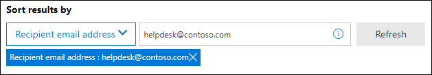
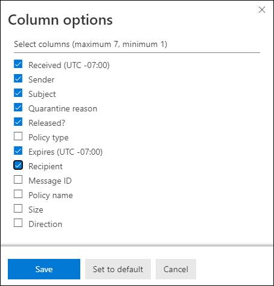

# View and release quarantined messages from shared mailboxes

> [!NOTE]
> The features that are described in this article are currently in Preview, aren't available to everyone, and are subject to change.

Users can manage quarantined messages where they are one of the recipients as described in [Find and release quarantined messages as a user in EOP](find-and-release-quarantined-messages-as-a-user.md). But what about shared mailboxes where the user has Full Access and Send As or Send on Behalf permissions to the mailbox as described in [Shared mailboxes in Exchange Online](/exchange/collaboration-exo/shared-mailboxes)?

Previously, the ability for users to manage quarantined messages sent to a shared mailbox required admins to leave automapping enabled for the shared mailbox (it's enabled by default when an admin gives a user access to another mailbox). However, depending on the size and number of mailboxes that the user has access to, performance can suffer as Outlooks tries to open *all* mailboxes that the user has access to. For this reason, many admins choose to [remove automapping for shared mailboxes](/outlook/troubleshoot/profiles-and-accounts/remove-automapping-for-shared-mailbox).

Now, automapping is no longer required for users to manage quarantined messages that were sent to shared mailboxes. It just works. There are two different methods to access quarantined messages that were sent to a shared mailbox:

- If the admin has [enabled end-user spam notifications](configure-your-spam-filter-policies.md) in anti-spam policies, any user that has access to the end-user spam notifications in the shared mailbox can click the **Review** button in the notification to go to quarantine in the Security & Compliance Center. Note that this method only allows users to manage quarantined messages that were sent to the shared mailbox. Users can't manage their own quarantine messages in this context.

- The user can [go to the quarantine in the Security & Compliance Center](find-and-release-quarantined-messages-as-a-user.md). By default, only messages that were sent to the user are shown. However, the user can change the **Sort results** (the **Message ID button** by default) to **Recipient email address**, enter the shared mailbox email address, and then click **Refresh** to see the quarantined messages that were sent to the shared mailbox.

  

Regardless of the method, users can avoid confusion by including the **Recipient** column for quarantined messages. The maximum number of columns to display is 7, so the user will need to click **Modify columns**, remove an existing column (for example, **Policy type**), select **Recipient**, and then click **Save** or **Save as default**.

  

## Things to keep in mind

- The first user to act on the quarantined message decides the fate of the message for everyone who uses the shared mailbox. For example, if a shared mailbox is accessed by 10 users, and a user decides to delete the quarantine message, the message is deleted for all 10 users. Likewise, if a user decides to release the message, it's released to the shared mailbox and is accessible by all other users of the shared mailbox.

- Currently, the **Block sender** button is not available in the **Details** flyout for quarantined messages that were sent to the shared mailbox.

- To manage quarantined messages for the shared mailbox in [Exchange Online PowerShell](/powershell/exchange/connect-to-exchange-online-powershell), the end-user will need to use the [Get-QuarantineMessage](/powershell/module/exchange/get-quarantinemessage) cmdlet with shared mailbox email address for the value of the _RecipientAddress_ parameter to identify the messages. For example:

  ```powershell
  Get-QuarantinedMessage -RecipientAddress officeparty@contoso.com
  ```

  Then, the end-user can select a quarantined message from the list to view or take action on.

  This example shows all of the quarantined messages that were sent to the shared mailbox, and then releases the first message in the list from quarantine (the first message in the list is 0, the second is 1, and so on).

  ```powershell
  $SharedMessages = Get-QuarantinedMessage -RecipientAddress officeparty@contoso.com | select -ExpandProperty Identity
  $SharedMessages
  Release-QuarantinedMessage -Identity $SharedMessages[0]
  ```

  For detailed syntax and parameter information, see the following topics:

  - [Get-QuarantineMessage](/powershell/module/exchange/get-quarantinemessage)
  - [Get-QuarantineMessageHeader](/powershell/module/exchange/get-quarantinemessageheader)
  - [Preview-QuarantineMessage](/powershell/module/exchange/preview-quarantinemessage)
  - [Release-QuarantineMessage](/powershell/module/exchange/release-quarantinemessage)