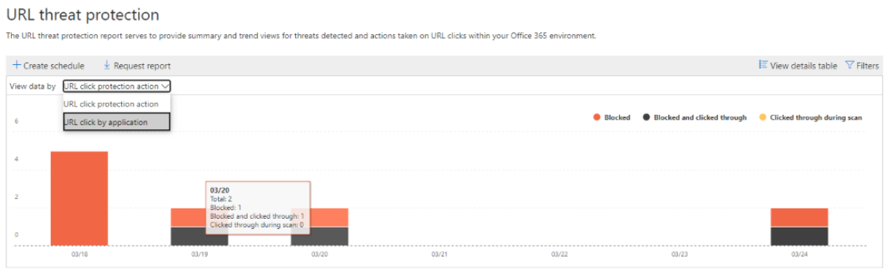

# View email security reports in the Security & Compliance Center

A variety of reports are available in the [Security & Compliance Center](https://protection.office.com) to help you see how email security features, such as anti-spam, anti-malware, and encryption features in Microsoft 365 are protecting your organization. If you have the [necessary permissions](#what-permissions-are-needed-to-view-these-reports), you can view these reports in the Security & Compliance Center by going to **Reports** \> **Dashboard**. To go directly to the reports dashboard, open <https://protection.office.com/insightdashboard>.

## URL threat protection report

The widget for this report is named **URL protection report** on the reports dashboard, and is only available in Office 365 Advanced Threat Protection (ATP). Specifically:

- A Microsoft 365 E5 subscription.
- An Advanced Threat Protection add-on (Plan 1 *or* Plan 2) to any other subscription that includes Exchange Online Protection (EOP).

To go directly to the **URL threat protection** report, open <https://protection.office.com/reportv2?id=URLProtectionActionReport>.

> [!NOTE]
> This report will not have click data from users where the Safe Links policy applied has the **Do not track user clicks** option selected.

### Report view for the URL threat protection report

The **URL threat protection** report has two aggregated views that are refreshed once every four hours:

- **URL click protection action**: Shows the number of URL clicks by users in the organization and the results of the click:

  - **Blocked**
  - **Blocked and clicked through**
  - **Clicked through during scan**

  A click indicates that the user has clicked through the block page to the malicious website (admins can disable click through in Safe Links policies).

  If you click **Filters**, you can modify the report with the following filters:

  - A **Start date** and **End date**.
  - The available click protection actions, plus  the value **Allowed** to see information for all URL clicks (not just blocked clicks).

- **URL click by application**: Shows the number of URL clicks by applications that support Office 365 ATP Safe Links:

  - **Email client**
  - **PowerPoint**
  - **Word**
  - **Excel**
  - **OneNote**
  - **Visio**
  - **Teams**
  - **Other**

  If you click **Filters**, you can modify the report with the following filters:

  - A **Start date** and **End date**.
  - The available applications.

### Details table view for the threat protection report

If you click **View details table**, the report provides a near-real-time view of all clicks that happen within the organization with the following details:

- **Click time**
- **User**
- **URL**
- **Action**
- **App**

If you click **Filters** in the details table view, you can filter by the same criteria as in the report view, and also by **Domains** or **Recipients** separated by commas.

To get back to the report screen, click **View report**.

## Compromised users report

The **Compromised users** report is available in EOP (subscriptions with mailboxes in Exchange Online or standalone EOP without Exchange Online mailboxes).

To go directly to the **Compromised users** report, open <https://protection.office.com/reportv2?id=CompromisedUsers>.

This report shows shows the number of user accounts that were marked as **Suspicious** or **Restricted** within the last 7 days. Accounts in either of these states are problematic or even compromised.

You can filter both the report and the details table by:

- A **Start date** and **End date**.
- **Suspicious**
- **Restricted**

If you click **View details table**, you can see the following details:

- **Creation time**
- **User ID**
- **Action**

With frequent use, you can use the report to spot spikes, and even trends, in suspicious or restricted accounts.

## Encryption report

The **Encryption report** is available in EOP (subscriptions with mailboxes in Exchange Online or standalone EOP without Exchange Online mailboxes).

To go directly to the **Encryption report**, open <https://protection.office.com/reportv2?id=EncryptionReport>.

Your organization's security team can use information in this report to identify patterns and proactively apply or adjust policies for sensitive email messages. For example:

- If you see a high number of email messages encrypted by users, you might want to add an encryption policy to automate encryption for certain use cases. For more information, see [Define mail flow rules to encrypt email messages in Microsoft 365](../../compliance/define-mail-flow-rules-to-encrypt-email.md).

- If you have a number of encryption templates available but no one is using them, you might explore whether users need feature training.

To learn more about encryption, see [Email encryption in Microsoft 365](../../compliance/email-encryption.md).

### Report view for the Encryption report

You can filter the data with the following criteria:

- **View data by: Message Encryption Report** and **Break down by: Encryption method**: The following encryption methods are available:

  - **Encryption by user**
  - **Encryption by policy**

  If you click **Filters**, you can modify the report with the following filters:

  - A **Start date** and **End date**.
  - Encryption method.
  - Encryption template:
  
    - **Do not forward**
    - **Encrypt only**
    - **OME previous**
    - **Custom**

- **View data by: Message Encryption Report** and **Break down by: Encryption template**: The following encryption methods are available:

  - **Do not forward**
  - **Encrypt only**
  - **OME previous**
  - **Custom**

  If you click **Filters**, you can modify the report with the following filters:

  - A **Start date** and **End date**.
  - Encryption method:

    - **Encryption by user**
    - **Encryption by policy**

  - Encryption template

- **View data by: Top 5 recipient domains**: This view shows a pie chart with sent message counts for the top 5 recipient domains.

  If you click **Filters**, you can select a **Start date** and **End date**.

### Details table view for the Encryption report

If you click **View details table**, you'll see the following information:

- **Break down by: Encryption method** or **Break down by: Encryption template**: The following information is shown:

  - **Date**
  - **Sender address**
  - **Encryption template**
  - **Encryption method**
  - **Recipient address**
  - **Subject**

- **View data by: Top 5 recipient domains**:

  - **Date**
  - **Recipient domain**
  - **Message count**
  
If you click **Filters** in the details table view, you can filter by the same criteria as in the report view.

To get back to the report screen, click **View report**.

## Threat protection status report

The **Threat protection status** report is available in both EOP and Office 365 ATP; however, the reports contain contain different data. For example, EOP customers can view information about malware detected in email, but not information about [malicious files detected in SharePoint Online, OneDrive, or Microsoft Teams](atp-for-spo-odb-and-teams.md). [Learn more about ATP reports](view-reports-for-atp.md).

To go directly to the **Threat protection status** report, open <https://protection.office.com/reportv2?id=TPSAggregateReportATP>

This is a smart report that shows malicious email that was detected and blocked. This report is useful for viewing email identified as malware or a phishing attempt over time (up to 90 days), and it enables security admins to identify trends or determine whether organization policies need adjustment.

By default, the report shows data for the past 7 days. If you click **Filters**, you can select a 90 day date range (trial subscriptions might be limited to 30 days).

The following views are available:

- **View data by: Overview**: The following detection information is shown:

  - **Email malware**
  - **Email phish**
  - **Content malware**

  If you click **Filters**, you can modify the report with the following filters:

  - A **Start date** and **End date**. A 90 days range is available 
  - Detection
  - Protected by (ATP only):
  
    - **ATP**
    - **EOP**

  - Encryption template:
  
    - **Do not forward**
    - **Encrypt only**
    - **OME previous**
    - **Custom**

- **View data by: Email \> Phish** and **Break down by: Detection technology**: The following information is shown:

  - **ATP-Generated URL Reputation**\*
  - **Advanced phish filter**\*
  - **Anti-spoof: DMARC failure**
  - **Anti-spoof: Intra-org**
  - **Anti-spoof: external domain**
  - **Brand impersonation**\*
  - **Domain impersonation**\*
  - **EOP URL reputation**
  - **General phish filter**
  - **Others**
  - **Phish ZAP**\*\*
  - **URL detonation**\*\*
  - **User Impersonation**\*

    \* ATP only

    \*\*Zero-hour auto purge (ZAP) isn't available in standalone EOP (it only works in Exchange Online mailboxes).

- **View data by: Email \> Malware**:
- **View data by: Content \> Malware**: ATP only.

; however, you can click **Filters** and change the date range for up to 90 days of detail. (If you are using a trial subscription, you might be limited to 30 days' of data.)

You can also choose whether to view data for email identified as malicious, email identified as a phishing attempts, or email identified as containing malware.

## Malware Detections report

The **Malware Detections** report shows how many incoming and outgoing messages were detected as containing malware for your organization.

To view this report, in the [Security & Compliance Center](https://protection.office.com), go to **Reports** \> **Dashboard** \> **Malware Detections**.

Similar to other reports, like the [Threat Protection Status report](#threat-protection-status-report), the report displays data for the past seven days by default. However, you can choose **Filters** to change the date range.

## Top Malware report

The **Top Malware** report shows the various kinds of malware that was detected by [EOP](eop-features.md).

To view this report, in the [Security & Compliance Center](https://protection.office.com), go to **Reports** \> **Dashboard** \> **Top Malware**.

When you hover over a wedge in the pie chart, you can see the name of a kind of malware and how many messages were detected as having that malware.

Click (or tap) the report to open it in a new browser window, where you can get a more detailed view of the report.

Below the chart, you'll see a list of detected malware and how many messages were detected as having that malware.

## Spoof Detections report

The **Spoof Detections** report shows how many spoof mail messages were detected, and of those, which ones were considered "good" (spoof mail done for legitimate business reasons).

To view this report, in the [Security & Compliance Center](https://protection.office.com), go to **Reports** \> **Dashboard** \> **Spoof Mail**.

When you hover over a day in the chart, you can see how many spoof mail messages came through.

Click (or tap) the report to open it in a new browser window, where you can get a more detailed view of the report. To learn more about anti-spoof protection, see [Anti-spoofing protection in Microsoft 365](anti-spoofing-protection.md).

## Spam Detections report

The **Spam Detections** report shows all the spam content blocked by Exchange Online. Messages are counted per message, and not per recipient. For example, if an email message was sent to 100 recipients in your organization, it is counted as one message.

To view this report, in the [Security & Compliance Center](https://protection.office.com), go to **Reports** \> **Dashboard** \> **Spam Detections**.

When you hover over a day in the chart, you can see how many items were blocked that day, as well as how those items are categorized. For example, you can see how many spam messages were filtered, and how many items came from a blocked Internet Protocol (IP) address.

Click (or tap) the report to open it in a new browser window, where you can get a more detailed view of the report.

Below the chart, you'll see a list of spam items that were detected. Select an item to view additional information, such as whether the spam item was inbound or outbound, its message ID, and its recipient. To learn more about anti-spam protection, see [Office 365 email anti-spam protection](https://docs.microsoft.com/microsoft-365/security/office-365-security/anti-spam-and-anti-malware-protection).

## Sent and received email report

The **Sent and received email** report contains information about malware, spam, mail flow rules(also known as transport rule), and advanced malware detections after email enters the service. For more information, see [Sent and received email report](view-mail-flow-reports.md#sent-and-received-email-report).

## User-reported messages report

The **User-reported messages** report shows information about email messages that users have reported as junk, phishing attempts, or good mail by using the [Report Message add-in](https://docs.microsoft.com/microsoft-365/security/office-365-security/enable-the-report-message-add-in).

Details are available for each message, including the delivery reason, such a spam policy exception or mail flow rule configured for your organization. To view details, select an item in the user-reports list, and then view the information on the **Summary** and **Details** tabs.

To view this report, in the [Security & Compliance Center](https://protection.office.com), do one of the following:

- Go to **Threat management** \> **Dashboard** \> **User-reported messages**.

- Go to **Threat management** \> **Review** \> **User-reported messages**.

> [!IMPORTANT]
> In order for the User-reported messages report to work correctly, **audit logging must be turned on** for your Office 365 environment. This is typically done by someone who has the Audit Logs role assigned in Exchange Online. For more information, see [Turn Microsoft 365 audit log search on or off](https://docs.microsoft.com/microsoft-365/compliance/turn-audit-log-search-on-or-off).

## What permissions are needed to view these reports?

To view and use the reports, you need to be a member of the specified role group in the Security & Compliance Center **and** in Exchange Online.

- In the Security & Compliance Center, you need to be a member of one of the following role groups:

  -Organization Management
  -Security Administrator (you can also do this in the [Azure Active Directory admin center](https://aad.portal.azure.com)
  -Security Reader

  For more information, see [Permissions in the Security & Compliance Center](https://docs.microsoft.com/microsoft-365/security/office-365-security/permissions-in-the-security-and-compliance-center).

- In Exchange Online, you need to be a member of one of the following role groups:

  -Organization Management
  -View-only Organization Management
  -View-Only Recipients
  -Compliance Management

For more information, see [Permissions in Exchange Online](https://docs.microsoft.com/Exchange/permissions-exo/permissions-exo) and [Manage role groups in Exchange Online](https://docs.microsoft.com/Exchange/permissions-exo/role-groups).

## What if the reports aren't showing data?

If you are not seeing data in your reports, double-check that your policies are set up correctly. To learn more, see [Protect against threats](protect-against-threats.md).

## Related topics

[Anti-spam and anti-malware protection in EOP](anti-spam-and-anti-malware-protection.md)

[Smart reports and insights in the Security & Compliance Center](reports-and-insights-in-security-and-compliance.md)
