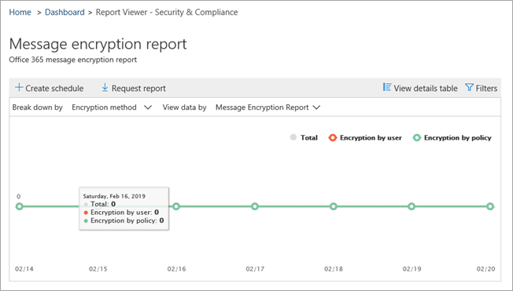
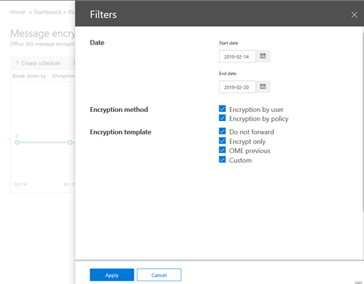
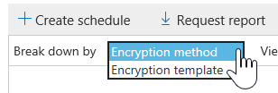
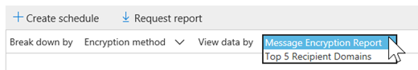
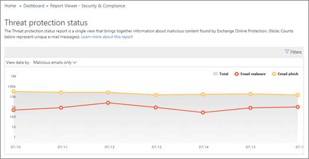
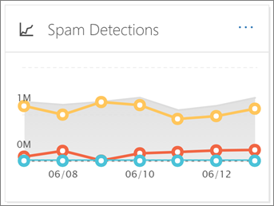
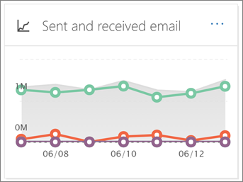
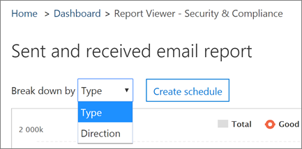
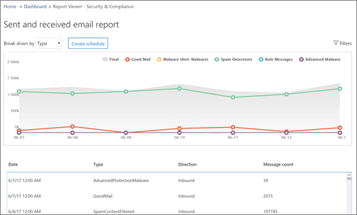

# View email security reports in the Security &amp; Compliance Center

A variety of reports are available in the [Security &amp; Compliance Center](https://protection.office.com) to help you see how email security features, such as anti-spam, anti-malware, and encryption features are protecting your organization. If you have the [necessary permissions](#what-permissions-are-needed-to-view-these-reports), you can view these reports in the Security &amp; Compliance Center by going to **Reports** \> **Dashboard**.
  

  
Your email security reports include the following:
- [Compromised Users report (**NEW!**)](#compromised-users-report-new)
- [Encryption report](#encryption-report)
- [Threat Protection Status report](#threat-protection-status-report) 
- [Malware Detections report](#malware-detections-report) 
- [Top Malware report](#top-malware-report)
- [Top Senders and Recipients report](#top-senders-and-recipients-report)
- [Spoof Detections report](#spoof-detections-report)
- [Spam Detections report](#spam-detections-report)
- [Sent and received email report](#sent-and-received-email-report)
- [User-reported messages report](#user-reported-messages-report)

## Compromised Users report (**NEW!**) 

This report, available to anyone with Exchange Online Protection, shows the number of user accounts marked as Suspicious or Restricted users, data particularly useful as accounts enter either of the states that indicate the user account may be problematic, or even compromised. With frequent use, the Compromised User report can spot spikes, and even trends, in accounts marked in suspicious or restricted states, giving evidence there could be an issue with security and the wellness of your tenant.

## Encryption report

The **Encryption report** shows information about email messages that were encrypted, either through your organization's policies, or through end-user controls. Your organization's security team can use information in this report to identify patterns and proactively apply or adjust policies for sensitive email messages.

To view this report, in the Security & Compliance Center, go to **Reports** \> **Dashboard** \> **Encryption report**.

 

When the report first opens, you'll see data about encryption methods used on email messages for the past seven (7) days. You can change the date range and the details that are displayed in the report by clicking **Filters** in the upper right corner of the screen.

   

You can also use the **Break down by** menu to view data by encryption template (or method).

And, you can use the **View data by** menu to change the view to see counts of encrypted messages to the top five recipient domains.

With the flexibility of the new Encryption report, you can view trends and take appropriate actions. For example, if you see a high number of email messages encrypted by users, you might want to add an encryption policy to automate encryption for certain use cases. (To get help with that, see [Define mail flow rules to encrypt email messages in Microsoft 365](../../compliance/define-mail-flow-rules-to-encrypt-email.md).) As another example, if you have a number of encryption templates available but no one is using them, you might explore whether users need training for that feature. 

Use this report enables your organization's security and compliance team to monitor how message encryption is being used, and whether further actions are needed. To learn more about encryption, see [Email encryption in Microsoft 365](../../compliance/email-encryption.md).

## Threat Protection Status report

The **Threat Protection Status** report is a smart report that shows malicious email that was detected and blocked by Exchange Online Protection. This report is useful for viewing email identified as malware or a phishing attempt over time (up to 90 days), and it enables security administrators to identify trends or determine whether policies need adjustments.

> [!NOTE]
> A Threat Protection Status report is available to customers who have either [Office 365 ATP](https://docs.microsoft.com/microsoft-365/security/office-365-security/office-365-atp) or [Exchange Online Protection](https://docs.microsoft.com/microsoft-365/security/office-365-security/what-is-eop) (EOP); however, the information that is displayed in the Threat Protection Status report for ATP customers will likely contain different data than what EOP customers might see. For example, EOP customers can view information about malware detected in email, but not information about [malicious files detected in SharePoint Online, OneDrive, or Microsoft Teams](https://docs.microsoft.com/microsoft-365/security/office-365-security/atp-for-spo-odb-and-teams), an ATP-specific capability. ([Learn more about ATP reports](https://docs.microsoft.com/microsoft-365/security/office-365-security/view-reports-for-atp).)
  
To view this report, in the [Security &amp; Compliance Center](https://protection.office.com), go to **Reports** \> **Dashboard** \> **Threat Protection Status**.
  

  
When you first open the Threat Protection Status report, the report shows data for the past seven days by default; however, you can click **Filters** and change the date range for up to 90 days of detail. (If you are using a trial subscription, you might be limited to 30 days' of data.)

This report is useful for viewing the effectiveness and impact of your organization's [Exchange Online Protection features](https://docs.microsoft.com/microsoft-365/security/office-365-security/eop-features), and for longer-term trending. 
  

  
You can also choose whether to view data for email identified as malicious, email identified as a phishing attempts, or email identified as containing malware.
  

  
## Malware Detections report

The **Malware Detections** report shows how many incoming and outgoing messages were detected as containing malware for your organization. 
  
To view this report, in the [Security &amp; Compliance Center](https://protection.office.com), go to **Reports** \> **Dashboard** \> **Malware Detections**.
  

  
Similar to other reports, like the [Threat Protection Status report](#threat-protection-status-report), the report displays data for the past seven days by default. However, you can choose **Filters** to change the date range. 
  
## Top Malware report

The **Top Malware** report shows the various kinds of malware that was detected by [Exchange Online](https://docs.microsoft.com/microsoft-365/security/office-365-security/eop-features). 
  
To view this report, in the [Security &amp; Compliance Center](https://protection.office.com), go to **Reports** \> **Dashboard** \> **Top Malware**.
  

  
When you hover over a wedge in the pie chart, you can see the name of a kind of malware and how many messages were detected as having that malware.
  
Click (or tap) the report to open it in a new browser window, where you can get a more detailed view of the report.
  

  
Below the chart, you'll see a list of detected malware and how many messages were detected as having that malware.
  
## Top Senders and Recipients report

The **Top Senders and Recipients** report is a pie chart showing your top email senders. 
  
To view this report, in the [Security &amp; Compliance Center](https://protection.office.com), go to **Reports** \> **Dashboard** \> **Top Senders and Recipients**.
  

  
When you hover over a wedge in the pie chart, you can see a count of messages sent or received.
  
Click (or tap) the report to open it in a new browser window, where you can get a more detailed view of the report.
  
Use the **Show data for** list to choose whether to view data for top senders, receivers, spam recipients, and malware recipients. You can also see who received malware that was detected by [Exchange Online Protection](https://docs.microsoft.com/microsoft-365/security/office-365-security/what-is-eop). 
  

  
Below the chart, you'll see who the top email senders or recipients were, along with a count of messages sent or received for the given time period.
  
## Spoof Detections report

The **Spoof Detections** report shows how many spoof mail messages were detected, and of those, which ones were considered "good" (spoof mail done for legitimate business reasons). 
  
To view this report, in the [Security &amp; Compliance Center](https://protection.office.com), go to **Reports** \> **Dashboard** \> **Spoof Mail**.
  

  
When you hover over a day in the chart, you can see how many spoof mail messages came through.
  
Click (or tap) the report to open it in a new browser window, where you can get a more detailed view of the report. To learn more about anti-spoof protection, see [Anti-spoofing protection in Office 365](https://docs.microsoft.com/microsoft-365/security/office-365-security/anti-spoofing-protection).
  
## Spam Detections report

The **Spam Detections** report shows all the spam content blocked by Exchange Online. Messages are counted per message, and not per recipient. For example, if an email message was sent to 100 recipients in your organization, it is counted as one message.
  
To view this report, in the [Security &amp; Compliance Center](https://protection.office.com), go to **Reports** \> **Dashboard** \> **Spam Detections**.
  

  
When you hover over a day in the chart, you can see how many items were blocked that day, as well as how those items are categorized. For example, you can see how many spam messages were filtered, and how many items came from a blocked Internet Protocol (IP) address.
  
Click (or tap) the report to open it in a new browser window, where you can get a more detailed view of the report.
  

  
Below the chart, you'll see a list of spam items that were detected. Select an item to view additional information, such as whether the spam item was inbound or outbound, its message ID, and its recipient. To learn more about anti-spam protection, see [Microsoft email anti-spam protection](https://docs.microsoft.com/microsoft-365/security/office-365-security/anti-spam-and-anti-malware-protection).
  
## Sent and received email report

The **Sent and received email** report is a smart report that shows information about incoming and outgoing email, including spam detections, malware, and email identified as "good." 
  
To view this report, in the [Security &amp; Compliance Center](https://protection.office.com), go to **Reports** \> **Dashboard** \> **Sent and received email**.
  

  
When you hover over a day in the chart, you can see how many messages came in, and how those messages are categorized. For example, you can see how many messages were detected as containing malware, and how many were identified as spam.
  
Click (or tap) the report to open it in a new browser window, where you can get a more detailed view of the report.
  
You can use the **Break down by** list to view information by type or by direction (incoming and outgoing). 
  

  
Below the chart, you'll see a list of email categories, such as **GoodMail**, **SpamContentFiltered**, and so on. Select a category to view additional information, such as actions that were taken for malware, and whether email was incoming or outgoing.
  

To learn more about email intelligence, see [Mail flow intelligence in Microsoft 365](https://docs.microsoft.com/microsoft-365/security/office-365-security/mail-flow-intelligence-in-office-365).
  
## User-reported messages report

The **User-reported messages** report shows information about email messages that users have reported as junk, phishing attempts, or good mail by using the [Report Message add-in](https://docs.microsoft.com/microsoft-365/security/office-365-security/enable-the-report-message-add-in).
  
Details are available for each message, including the delivery reason, such a spam policy exception or mail flow rule configured for your organization. To view details, select an item in the user-reports list, and then view the information on the **Summary** and **Details** tabs. 
  

  
To view this report, in the [Security &amp; Compliance Center](https://protection.office.com), do one of the following:
  
- Go to **Threat management** \> **Dashboard** \> **User-reported messages**.
    
- Go to **Threat management** \> **Review** \> **User-reported messages**.
    

  
> [!IMPORTANT]
> In order for the User-reported messages report to work correctly, **audit logging must be turned on** for your Microsoft 365 environment. This is typically done by someone who has the Audit Logs role assigned in Exchange Online. For more information, see [Turn audit log search on or off](https://docs.microsoft.com/microsoft-365/compliance/turn-audit-log-search-on-or-off). 
  
## What permissions are needed to view these reports?

In order to view and use the reports described in this article, **you must have an appropriate role assigned for both the Security &amp; Compliance Center and the Exchange admin center**.

- For the Security &amp; Compliance Center, you must have one of the following roles assigned:
    - Organization Management
    - Security Administrator (this can be assigned in the Azure Active Directory admin center ([https://aad.portal.azure.com](https://aad.portal.azure.com))
    - Security Reader

- For Exchange Online, you must have one of the following roles assigned in either the Exchange admin center ([https://outlook.office365.com/ecp](https://outlook.office365.com/ecp)) or with PowerShell cmdlets (See [Exchange Online PowerShell](https://docs.microsoft.com/powershell/exchange/exchange-online/exchange-online-powershell?view=exchange-ps)):
    - Organization Management
    - View-only Organization Management
    - View-Only Recipients role
    - Compliance Management

To learn more, see the following resources:

- [Permissions in the Office 365 Security &amp; Compliance Center](https://docs.microsoft.com/microsoft-365/security/office-365-security/permissions-in-the-security-and-compliance-center)

- [Feature permissions in Exchange Online](https://docs.microsoft.com/exchange/permissions-exo/feature-permissions)
   
   
## What if the reports aren't showing data?

If you are not seeing data in your reports, double-check that your policies are set up correctly. To learn more, see [Protect against threats in Microsoft 365](https://docs.microsoft.com/microsoft-365/security/office-365-security/protect-against-threats).
  
## Related topics

[Microsoft Email Anti-Spam Protection](https://docs.microsoft.com/microsoft-365/security/office-365-security/anti-spam-and-anti-malware-protection)
  
[Reports and insights in the Office 365 Security &amp; Compliance Center](https://docs.microsoft.com/microsoft-365/security/office-365-security/reports-and-insights-in-security-and-compliance)
  
[Create a schedule for a report in the Security &amp; Compliance Center](https://docs.microsoft.com/microsoft-365/security/office-365-security/create-a-schedule-for-a-report)
  
[Set up and download a custom report in the Security &amp; Compliance Center](https://docs.microsoft.com/microsoft-365/security/office-365-security/set-up-and-download-a-custom-report)
  

