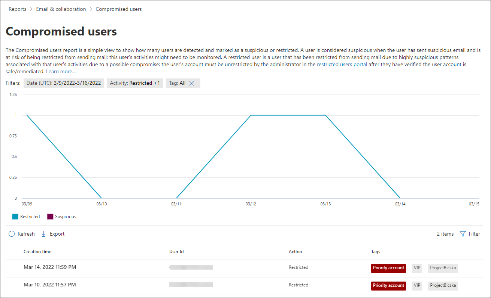
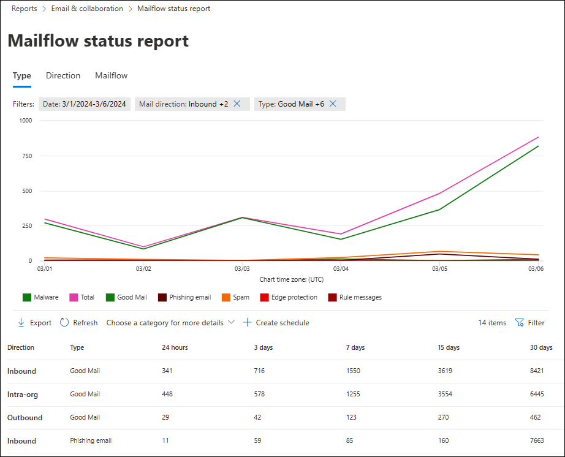
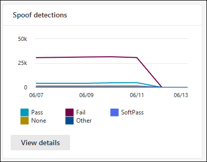
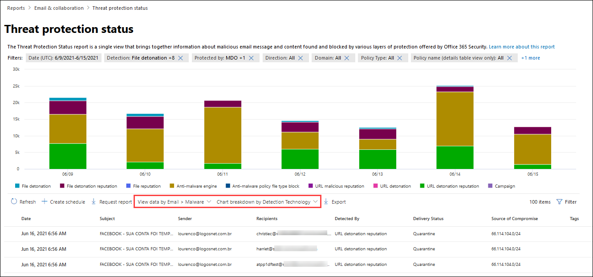

# View email security reports in the Microsoft 365 Defender portal

[!INCLUDE [Microsoft 365 Defender rebranding](../includes/microsoft-defender-for-office.md)]

**Applies to**
- [Exchange Online Protection](exchange-online-protection-overview.md)
- [Microsoft Defender for Office 365 plan 1 and plan 2](defender-for-office-365.md)
- [Microsoft 365 Defender](../defender/microsoft-365-defender.md)

A variety of reports are available in the Microsoft 365 Defender portal at <https://security.microsoft.com> to help you see how email security features, such as anti-spam, anti-malware, and encryption features in Microsoft 365 are protecting your organization. If you have the [necessary permissions](#what-permissions-are-needed-to-view-these-reports), you can view these reports in the Microsoft 365 Defender portal by going to **Reports** \> **Email & collaboration** \> **Email & collaboration reports**. To go directly to the **Email & collaboration reports** page, open <https://security.microsoft.com/emailandcollabreport>.

> [!NOTE]
>
> Some of the reports on the **Email & collaboration reports** page require Microsoft Defender for Office 365. For information about these reports, see [View Defender for Office 365 reports in the Microsoft 365 Defender portal](view-reports-for-mdo.md).
>
> Reports that are related to mail flow are now in the Exchange admin center (EAC). For more information about these reports, see [Mail flow reports in the new Exchange admin center](/exchange/monitoring/mail-flow-reports/mail-flow-reports).

## Compromised users report

> [!NOTE]
> This report is available in Microsoft 365 organizations with Exchange Online mailboxes. It's not available in standalone Exchange Online Protection (EOP) organizations.

The **Compromised users** report shows shows the number of user accounts that were marked as **Suspicious** or **Restricted** within the last 7 days. Accounts in either of these states are problematic or even compromised. With frequent use, you can use the report to spot spikes, and even trends, in suspicious or restricted accounts. For more information about compromised users, see [Responding to a compromised email account](responding-to-a-compromised-email-account.md).

The aggregate view shows data for the last 90 days and the detail view shows data for the last 30 days.

To view the report in the Microsoft 365 Defender portal, go to **Reports** \> **Email & collaboration** \> **Email & collaboration reports**. On the **Email & collaboration reports** page, find **Compromised users** and then click **View details**. To go directly to the report, open <https://security.microsoft.com/reports/CompromisedUsers>.

On the **Compromised users** page, you can filter both the chart and the details table by clicking **Filter** and selecting one or more of the following values in the flyout that appears:

- **Date (UTC)**: **Start date** and **End date**.
- **Activity**:
  - **Suspicious**: The user account has sent suspicious email and is at risk of being restricted from sending email.
  - **Restricted**: The user account has been restricted from sending email due to highly suspicious patterns.

When you're finished configuring the filters, click **Apply**, **Cancel**, or **Clear filters**.

In the details table below the graph, you can see the following details:

- **Creation time**
- **User ID**
- **Action**

## Exchange transport rule report

The **Exchange transport rule** report shows the effect of mail flow rules (also known as transport rules) on incoming and outgoing messages in your organization.

To view the report in the Microsoft 365 Defender portal, go to **Reports** \> **Email & collaboration** \> **Email & collaboration reports**. On the **Email & collaboration reports** page, find **Exchange transport rule** and then click **View details**. To go directly to the report, open <https://security.microsoft.com/reports/ETRRuleReport>.

On the **Exchange transport rule report** page, the available charts and data are described in the following sections.

### Chart breakdown by Direction

If you select **Chart breakdown by Direction**, the follow charts are available:

- **View data by Exchange transport rules**: The number of **Inbound** and **Outbound** messages that were affected by mail flow rules.
- **View data by DLP Exchange transport rules**: The number of **Inbound** and **Outbound** messages that were affected by data loss prevention (DLP) mail flow rules.

The following information is shown in the details table below the graph:

- **Date**
- **DLP policy** (**View data by DLP Exchange transport rules** only)
- **Transport rule**
- **Subject**
- **Sender address**
- **Recipient address**
- **Severity**
- **Direction**

You can filter both the chart and the details table by clicking **Filter** and selecting one or more of the following values in the flyout that appears:

- **Date (UTC)** **Start date** and **End date**
- **Direction**: **Outbound** and **Inbound**
- **Severity**: **High severity**, **Medium severity**, and **Low severity**

When you're finished configuring the filters, click **Apply**, **Cancel**, or **Clear filters**.

### Chart breakdown by Severity

If you select **Chart breakdown by Severity**, the follow charts are available:

- **View data by Exchange transport rules**: The number of **High severity**, **Medium severity**, and **Low severity** messages. You set the severity level as an action in the rule (**Audit this rule with severity level** or _SetAuditSeverity_). For more information, see [Mail flow rule actions in Exchange Online](/Exchange/security-and-compliance/mail-flow-rules/mail-flow-rule-actions).

- **View data by DLP Exchange transport rules**: The number of **High severity**, **Medium severity**, and **Low severity** messages that were affected by DLP mail flow rules.

The following information is shown in the details table below the graph:

- **Date**
- **DLP policy** (**View data by DLP Exchange transport rules** only)
- **Transport rule**
- **Subject**
- **Sender address**
- **Recipient address**
- **Severity**
- **Direction**

You can filter both the chart and the details table by clicking **Filter** and selecting one or more of the following values in the flyout that appears:

- **Date (UTC)** **Start date** and **End date**
- **Direction**: **Outbound** and **Inbound**
- **Severity**: **High severity**, **Medium severity**, and **Low severity**

When you're finished configuring the filters, click **Apply**, **Cancel**, or **Clear filters**.

## Forwarding report

> [!NOTE]
> The **Forwarding report** is now available in the EAC. For more information, see [Auto forwarded messages report in the new EAC](/exchange/monitoring/mail-flow-reports/mfr-auto-forwarded-messages-report).

## Mailflow status report

The **Mailflow status report** is a smart report that shows information about incoming and outgoing email, spam detections, malware, email identified as "good", and information about email allowed or blocked on the edge. This is the only report that contains edge protection information, and shows just how much email is blocked before being allowed into the service for evaluation by Exchange Online Protection (EOP). It's important to understand that if a message is sent to five recipients we count it as five different messages and not one message.

To view the report in the Microsoft 365 Defender portal, go to **Reports** \> **Email & collaboration** \> **Email & collaboration reports**. On the **Email & collaboration reports** page, find **Mailflow status summary** and then click **View details**. To go directly to the report, open <https://security.microsoft.com/reports/mailflowStatusReport>.

### Type view for the Mailflow status report

When you open the report, the **Type** tab is selected by default. By default, this view contains a chart and a details table that's configured with the following filters:

- **Date (UTC)** The last 7 days.
- **Mail direction**:
  - **Inbound**
  - **Outbound**
  - **Intra-org**: this count is for messages within a tenant i.e sender abc@domain.com sends to recipient xyz@domain.com  (counted separately from **Inbound** and **Outbound**)
- **Type**:
  - **Good mail**
  - **Malware**
  - **Spam**
  - **Edge protection**
  - **Rule messages**
  - **Phishing email**
- **Domain**: **All**

The chart is organized by the **Type** values.

You can change these filters by clicking **Filter** or by clicking a value in the chart legend.

The following information is shown in the details table below the graph:

- **Direction**
- **Type**
- **24 hours**
- **3 days**
- **7 days**
- **15 days**
- **30 days**

If you click **Choose a category for more details**, you can select from the following values:

- **Phishing email**: This selection takes you to the [Threat protection status report](view-email-security-reports.md#threat-protection-status-report).
- **Malware in email**: This selection takes you to the [Threat protection status report](view-email-security-reports.md#threat-protection-status-report).
- **Spam detections**: This selection takes you to the [Spam Detections report](view-email-security-reports.md#spam-detections-report).
- **Edge blocked spam**: This selection takes you to the [Spam Detections report](view-email-security-reports.md#spam-detections-report).

#### Export from Type view

For the detail view, you can only export data for one day. So, if you want to export data for 7 days, you need to do 7 different export actions.

Each exported .csv file is limited to 150,000 rows. If the data for that day contains more than 150,000 rows, then multiple .csv files will be created.

### Direction view for the Mailflow status report

If you click the **Direction** tab, the same default filters from the **Type** view are used.

The chart is organized by **Direction** values.

You can change these filters by clicking **Filter**. The same filters from the **Type** view are used.

The details table contains same information from the **Type** view.

The **Choose a category for more details** available selections and behavior are the same as the **Type** view.

#### Export from Direction view

For the detail view, you can only export data for one day. So, if you want to export data for 7 days, you need to do 7 different export actions.

Each exported .csv file is limited to 150,000 rows. If the data for that day contains more than 150,000 rows, then multiple .csv files will be created.

### Funnel view for the Mailflow status report

The **Funnel** view shows you how Microsoft's email threat protection features filter incoming and outgoing email in your organization. It provides details on the total email count, and how the configured threat protection features, including edge protection, anti-malware, anti-phishing, anti-spam, and anti-spoofing affect this count.

If you click the **Funnel** tab, by default, this view contains a chart and a details table that's configured with the following filters:

- **Date**: The last 7 days.

- **Direction**:
  - **Inbound**
  - **Outbound**
  - **Intra-org**: This count is for messages sent within a tenant; i.e, sender abc@domain.com sends to recipient xyz@domain.com (counted separately from Inbound and Outbound).

The aggregate view and details table view allow for 90 days of filtering.

You can change these filters by clicking **Filter**. The same filters from the **Type** view are used.

This chart shows the email count organized by:

- **Total email**
- **Email after edge protection**
- **Email after transport rule** (mail flow rule)
- **Email after anti-malware, file reputation, file type block**
- **Email after anti-phish, URL reputation, brand impersonation, anti-spoof**
- **Email after anti-spam, bulk mail filtering**
- **Email after user and domain impersonation**\*
- **Email after file and URL detonation**\*
- **Email detected as benign after post-delivery protection (URL click time protection)**

\* Defender for Office 365 only

To view the email filtered by EOP or Defender for Office 365 separately, click on the value in the chart legend.

The details table contains the following information, shown in descending date order:

- **Date**
- **Total email**
- **Edge protection**
- **Anti-malware, file reputation, file type block**:
  - **File reputation**: Messages filtered due to identification of an attached file by other Microsoft customers.
  - **File type block**: Messages filtered due to the type of malicious file identified in the message.
- **Anti-phish, URL reputation, Brand impersonation, anti-spoof**:
  - **URL reputation**: Messages filtered due to the identification of the URL by other Microsoft customers.
  - **Brand impersonation**: Messages filtered due to the message coming from well-known brand impersonating senders.
  - **Anti-spoof**: Messages filtered due to the message attempting to spoof a domain that the recipient belongs to, or a domain that the message sender doesn't own.
- **Anti-spam, bulk mail filtering**:
  - **Bulk mail filtering**: Messages filtered based on the bulk complain level (BCL) threshold in an anti-spam policy.
- **User and domain impersonation (Defender for Office 365)**:
  - **User impersonation**: Messages filtered due to an attempt to impersonate a user (message sender) that's defined in the impersonation protection settings of an anti-phishing policy.
  - **Domain impersonation**: Messages filtered due to an attempt to impersonate a domain that's defined in the impersonation protection settings of an anti-phishing policy.
- **File and URL detonation (Defender for Office 365)**:
  - **File detonation**: Messages filtered by a Safe Attachments policy.
  - **URL detonation**: Message filtered by a Safe Links policy.
- **Post-delivery protection and ZAP (ATP), or ZAP (EOP)**: Zero-hour auto purge (ZAP) for malware, spam, and phishing.

If you select a row in the details table, a further breakdown of the email counts are shown in the flyout.

#### Export from Funnel view

After you click **Export** under **Options**, you can select one of the following values:

- **Summary (with data for last 90 days at most)**
- **Details (with data for last 30 days at most)**

Under **Date**, choose a range, and then click **Apply**. Data for the current filters will be exported to a .csv file.

Each exported .csv file is limited to 150,000 rows. If the data contains more than 150,000 rows, then multiple .csv files will be created.

### Tech view for the Mailflow status report

The **Tech view** is similar to the **Funnel** view, providing more granular details for the configured threat protections features. From the chart, you can see how messages are categorized at the different stages of threat protection.

If you click the **Tech view** tab, by default, this view contains a chart and a details table that's configured with the following filters:

- **Date**: The last 7 days.

- **Direction**:
  - **Inbound**
  - **Outbound**
  - **Intra-org**: this count is for messages within a tenant i.e sender abc@domain.com sends to recipient xyz@domain.com (counted separately from Inbound and Outbound)

The aggregate view and details table view allow for 90 days of filtering.

You can change these filters by clicking **Filter**. The same filters from the **Type** view are used.

This chart shows messages organized into the following categories:

- **Total email**
- **Edge allow** and **Edge filtered**
- **Transport rule allow** and **Transport rule filtered** (mail flow rules)
- **Not malware**, **Safe Attachments detection**\*, and **Anti-malware engine detection**
- **Not phish**, **DMARC failure**, **Impersonation detection**\*, **Spoof detection**, and **Phish detection**
- **No detection with URL detonation** and **URL detonation detection**\*
- **Not spam** and  **Spam**
- **Non-malicious email**, **Safe Links detection**\*, and **ZAP**

\* Defender for Office 365

When you hover over a category in the chart, you can see the number of messages in that category.

The details table contains the following information, shown in descending date order:

- **Date (UTC)**
- **Total email**
- **Edge filtered**
- **Rule messages**: Messages filtered due to  mail flow rules (also known as transport rules).
- **Anti-malware engine**, **Safe Attachments**\*:
- **DMARC, impersonation**\*, **spoof**, **phish filtered**:
  - **DMARC**: Messages filtered due to the message failing its DMARC authentication check.
- **URL detonation detection**\*
- **Anti-spam filtered**
- **ZAP removed**
- **Detection by Safe Links**\*

\* Defender for Office 365

If you select a row in the details table, a further breakdown of the email counts are shown in the flyout.

#### Export from Tech view

On clicking **Export**, under **Options** you can select one of the following values:

- **Summary (with data for last 90 days at most)**
- **Details (with data for last 30 days at most)**

Under **Date**, choose a range, and then click **Apply**. Data for the current filters will be exported to a .csv file.

Each exported .csv file is limited to 150,000 rows. If the data contains more than 150,000 rows, then multiple .csv files will be created.

## Malware detections report

The **Malware detections report** report shows information about malware detections in incoming and outgoing email messages (malware detected by Exchange Online Protection or EOP). For more information about malware protection in EOP, see [Anti-malware protection in EOP](anti-malware-protection.md).

The aggregate view filter allows for 90 days, while the details table filter only allows for 10 days.

To view the report in the Microsoft 365 Defender portal, go to **Reports** \> **Email & collaboration** \> **Email & collaboration reports**. On the **Email & collaboration reports** page, find **Malware detected in email** and then click **View details**. To go directly to the report, open <https://security.microsoft.com/reports/MalwareDetections>.

On the **Malware detections report** page, you can filter both the chart and the details table by clicking **Filter** and selecting one of the following values:

- **Date (UTC)** **Start date** and **End date**
- **Direction**: **Inbound** and **Outbound**

In the details table below the graph, you can see the following details:

- **Date**
- **Sender address**
- **Recipient address**
- **Message ID**: Available in the **Message-ID** header field in the message header and should be unique. An example value is `<08f1e0f6806a47b4ac103961109ae6ef@server.domain>` (note the angle brackets).
- **Subject**
- **Filename**
- **Malware name**

## Mail latency report

The **Mail latency report** in Defender for Office 365 contains information on the mail delivery and detonation latency experienced within your organization. For more information, see [Mail latency report](view-reports-for-mdo.md#mail-latency-report).

## Spam detections report

> [!NOTE]
> The **Spam detections report** will eventually go away. The same information is available in the [Threat protection status report](#threat-protection-status-report).

## Spoof detections report

> [!NOTE]
> The improved Spoof detections report as described in this article is in Preview, is subject to change, and is not available in all organizations. The older version of the report shows only **Good mail** and **Caught as spam**.

The **Spoof detections** report shows information about messages that were blocked or allowed due to spoofing. For more information about spoofing, see [Anti-spoofing protection in EOP](anti-spoofing-protection.md).

The aggregate view of the report allows for 45 days of filtering\*, while the detail view only allows for ten days of filtering.

\* Eventually, you'll be able to use up to 90 days of filtering.

To view the report in the Microsoft 365 Defender portal, go to **Reports** \> **Email & collaboration** \> **Email & collaboration reports**. On the **Email & collaboration reports** page, find **Spoof detections** and then click **View details**. To go directly to the report, open <https://security.microsoft.com/reports/SpoofMailReportV2>.

The chart shows the following information:

- **Pass**
- **Fail**
- **SoftPass**
- **None**
- **Other**

When you hover over a day (data point) in the chart, you can see how many spoofed messages were detected and why.

On the **Spoof mail report** page, you can filter both the chart and the details table by clicking **Filter** and selecting one or more of the following values:

- **Date (UTC)** **Start date** and **End date**
- **Result**:
  - **Pass**
  - **Fail**
  - **SoftPass**
  - **None**
  - **Other**
- **Spoof type**: **Internal** and **External**

In the details table below the graph, you can see the following details:

- **Date**
- **Spoofed user**
- **Sending infrastructure**
- **Spoof type**
- **Result**
- **Result code**
- **SPF**
- **DKIM**
- **DMARC**
- **Message count**

For more information about composite authentication result codes, see [Anti-spam message headers in Microsoft 365](anti-spam-message-headers.md).

## Submissions report

The **Submissions** report shows information about items that admins have reported to Microsoft for analysis. For more information, see [Use Admin Submission to submit suspected spam, phish, URLs, and files to Microsoft](admin-submission.md).

To view the report in the Microsoft 365 Defender portal, go to **Reports** \> **Email & collaboration** \> **Email & collaboration reports**. On the **Email & collaboration reports** page, find **Submissions** and then click **View details**. To go directly to the report, open <https://security.microsoft.com/adminSubmissionReport>. To go to [admin submissions in the Microsoft 365 Defender portal](admin-submission.md), click **Go to Submissions**.

The chart shows the following information:

- **Pending**
- **Completed**

On the **Submissions** page, you can filter both the chart and the details table by clicking **Filter** and selecting one or more of the following values:

- **Date reported**: **Start time** and **End time**
- **Submission type**: **Email**, **URL**, or **File**
- **Submission ID**
- **Network Message ID**
- **Sender**
- **Name**
- **Submitted by**
- **Reason for submitting**: **Not junk**, **Phish**, **Malware**, or **Spam**
- **Rescan status**: **Pending** or **Completed**

The details table below the graph shows the same information and has the same **Group** or **Customize columns** options as on the **Submitted for analysis** tab at **Email & collaboration** \> **Submissions**. For more information, see [View admin submissions to Microsoft](admin-submission.md#view-admin-submissions-to-microsoft).

## Threat protection status report

The **Threat protection status** report is available in both EOP and Defender for Office 365; however, the reports contain different data. For example, EOP customers can view information about malware detected in email, but not information about malicious files detected by [Safe Attachments for SharePoint, OneDrive, and Microsoft Teams](mdo-for-spo-odb-and-teams.md).

The report provides the count of email messages with malicious content, such as files or website addresses (URLs) that were blocked by the anti-malware engine, [zero-hour auto purge (ZAP)](zero-hour-auto-purge.md), and Defender for Office 365 features like [Safe Links](safe-links.md), [Safe Attachments](safe-attachments.md), and [impersonation protection features in anti-phishing policies](set-up-anti-phishing-policies.md#exclusive-settings-in-anti-phishing-policies-in-microsoft-defender-for-office-365). You can use this information to identify trends or determine whether organization policies need adjustment.

**Note**: It's important to understand that if a message is sent to five recipients we count it as five different messages and not one message.

To view the report in the Microsoft 365 Defender portal, go to **Reports** \> **Email & collaboration** \> **Email & collaboration reports**. On the **Email & collaboration reports** page, find **Threat protection status** and then click **View details**. To go directly to the report, open one of the following URLs:

- Defender for Office 365: <https://security.microsoft.com/reports/TPSAggregateReportATP>
- EOP: <https://security.microsoft.com/reports/TPSAggregateReport>

By default, the chart shows data for the past 7 days. If you click **Filter** on the **Threat protection status report** page, you can select a 90 day date range (trial subscriptions might be limited to 30 days). The details table allows filtering for 30 days.

The available views are described in the following sections.

### View data by Overview

In the **View data by Overview** view, the following detection information is shown in the chart:

- **Email malware**
- **Email phish**
- **Content malware**

No details table is available below the chart.

If you click **Filter**, the following filters are available:

- **Date (UTC)** **Start date** and **End date**
- **Detection**: **Email malware**, **Email phish**, or **Content malware**
- **Protected by**: **MDO** (Defender for Office 365) or **EOP**
- **Tag**: Filter the results by users or groups that have had the specified user tag applied (including priority accounts). For more information about user tags, see [User tags](user-tags.md).
- **Direction**
- **Domain**
- **Policy type**

When you're finished configuring the filters, click **Apply**, **Cancel**, or **Clear filters**.

### View data by Email \> Phish and Chart breakdown by Detection Technology

In the **View data by Email \> Phish** and **Chart breakdown by Detection Technology** view, the following information is shown in the chart:

- **URL malicious reputation**\*: Malicious URL reputation generated from Defender for Office 365 detonations in other Microsoft 365 customers.
- **Advanced filter**: Phishing signals based on machine learning.
- **General filter**: Phishing signals based on analyst rules.
- **Spoof intra-org**: Sender is trying to spoof the recipient domain.
- **Spoof external domain**: Sender is trying to spoof some other domain.
- **Spoof DMARC**: DMARC authentication failure on messages.
- **Impersonation brand**: Impersonation of well-known brands based on senders.
- **Mixed analysis detection**
- **File reputation**
- **Fingerprint matching**
- **URL detonation reputation**\*
- **URL detonation**\*
- **Impersonation user**\*
- **Impersonation domain**\*: Impersonation of domains that the customer owns or defines.
- **Mailbox intelligence impersonation**\*: Impersonation of users defined by admin or learned through mailbox intelligence.
- **File detonation**\*
- **Campaign**\*

In the details table below the chart, the following information is available:

- **Date**
- **Subject**
- **Sender**
- **Recipients**
- **Detected by**
- **Delivery Status**
- **Source of Compromise**
- **Tags**

If you click **Filter**, the following filters are available:

- **Date (UTC)** **Start date** and **End date**
- **Detection**
- **Protected by**: **MDO** (Defender for Office 365) or **EOP**
- **Direction**
- **Tag**: Filter the results by users or groups that have had the specified user tag applied (including priority accounts). For more information about user tags, see [User tags](user-tags.md).
- **Domain**
- **Policy type**
- **Policy name** (details table only)
- **Recipients**

When you're finished configuring the filters, click **Apply**, **Cancel**, or **Clear filters**.

### View data by Email \> Malware and Chart breakdown by Detection Technology

In the **View data by Email \> Malware** and **Chart breakdown by Detection Technology** view, the following information is shown in the chart:

- **File detonation**\*: Detection by Safe Attachments.
- **File detonation reputation**\*: All malicious file reputation generated by Defender for Office 365 detonations.
- **File reputation**
- **Anti-malware engine**\*: Detection from anti-malware engines.
- **Anti-malware policy file type block**: These are email messages filtered out due to the type of malicious file identified in the message.
- **URL malicious reputation**
- **URL detonation**
- **URL detonation reputation**
- **Campaign**

In the details table below the chart, the following information is available:

- **Date**
- **Subject**
- **Sender**
- **Recipients**
- **Detected by**
- **Delivery Status**
- **Source of Compromise**
- **Tags**

If you click **Filter**, the following filters are available:

- **Date (UTC)** **Start date** and **End date**
- **Detection**
- **Protected by**: **MDO** (Defender for Office 365) or **EOP**
- **Direction**
- **Tag**: Filter the results by users or groups that have had the specified user tag applied (including priority accounts). For more information about user tags, see [User tags](user-tags.md).
- **Domain**
- **Policy type**
- **Policy name** (details table only)
- **Recipients**

When you're finished configuring the filters, click **Apply**, **Cancel**, or **Clear filters**.

### Chart breakdown by Policy type and View data by Email \> Phish or View data by Email \> Malware

In the **Chart breakdown by Policy type** and **View data by Email \> Phish** or **View data by Email \> Malware** views, the following information is shown in the charts:

- **Anti-malware**
- **Safe Attachments**\*
- **Anti-phish**
- **Anti-spam**
- **Mail flow rule** (also known as a transport rule)
- **Others**

In the details table below the chart, the following information is available:

- **Date**
- **Subject**
- **Sender**
- **Recipients**
- **Detected by**
- **Delivery Status**
- **Source of Compromise**
- **Tags**

If you click **Filter**, the following filters are available:

- **Date (UTC)** **Start date** and **End date**
- **Detection**
- **Protected by**: **MDO** (Defender for Office 365) or **EOP**
- **Direction**
- **Tag**: Filter the results by users or groups that have had the specified user tag applied (including priority accounts). For more information about user tags, see [User tags](user-tags.md).
- **Domain**
- **Policy type**
- **Policy name** (details table only)
- **Recipients**

When you're finished configuring the filters, click **Apply**, **Cancel**, or **Clear filters**.

### Chart breakdown by Delivery status and View data by Email \> Phish or View data by Email \> Malware

In the **Chart breakdown by Delivery status** and **View data by Email \> Phish** or **View data by Email \> Malware** views, the following information is shown in the charts:

- **Hosted mailbox: Inbox**
- **Hosted mailbox: Junk**
- **Hosted mailbox: Custom folder**
- **Hosted mailbox: Deleted items**
- **Forwarded**
- **On-premises server: Delivered**
- **Quarantine**
- **Delivery failed**
- **Dropped**

In the details table below the chart, the following information is available:

- **Date**
- **Subject**
- **Sender**
- **Recipients**
- **Detected by**
- **Delivery Status**
- **Source of Compromise**
- **Tags**

If you click **Filter**, the following filters are available:

- **Date (UTC)** **Start date** and **End date**
- **Detection**
- **Protected by**: **MDO** (Defender for Office 365) or **EOP**
- **Direction**
- **Tag**: Filter the results by users or groups that have had the specified user tag applied (including priority accounts). For more information about user tags, see [User tags](user-tags.md).
- **Domain**
- **Policy type**
- **Policy name** (details table only)
- **Recipients**

When you're finished configuring the filters, click **Apply**, **Cancel**, or **Clear filters**.

### View data by Content \> Malware

In the **View data by Content \> Malware** view, the following information is shown in the chart for Microsoft Defender for Office 365 organizations:

- **Anti-malware engine**: Malicious files detected in Sharepoint, OneDrive, and Microsoft Teams by the [built-in virus detection in Microsoft 365](virus-detection-in-spo.md).
- **File detonation**: Malicious files detected by [Safe Attachments for SharePoint, OneDrive, and Microsoft Teams](mdo-for-spo-odb-and-teams.md).

In the details table below the chart, the following information is available:

- **Date (UTC)** **Start date** and **End date**
- **Location**
- **Detected by**
- **Malware name**

If you click **Filter**, the following filters are available:

- **Date (UTC)** **Start date** and **End date**
- **Detection**: **Anti-malware engine** or **File detonation**

When you're finished configuring the filters, click **Apply**, **Cancel**, or **Clear filters**.

### View data by System override

In the **View data by System override** view, the following override reason information is shown in the chart:

- **On-premises skip**
- **IP allow**
- **Exchange mail transport rule** (mail flow rule)
- **Organization allowed senders**
- **Organization allowed domains**
- **ZAP not enabled**
- **Junk Mail folder not enabled**
- **User Safe Sender**
- **User Safe Domain**

In the details table below the chart, the following information is available:

- **Date**
- **Subject**
- **Sender**
- **Recipients**
- **Detected by**
- **Delivery Status**
- **Source of Compromise**
- **Tags**

If you click **Filter**, the following filters are available:

- **Date (UTC)** **Start date** and **End date**
- **Detection**
- **Protected by**: **MDO** (Defender for Office 365) or **EOP**
- **Direction**
- **Tag**: Filter the results by users or groups that have had the specified user tag applied (including priority accounts). For more information about user tags, see [User tags](user-tags.md).
- **Domain**
- **Policy type**
- **Policy name** (details table only)
- **Recipients**

When you're finished configuring the filters, click **Apply**, **Cancel**, or **Clear filters**.

\* Defender for Office 365 only

## Top malware report

The **Top malware** report shows the various kinds of malware that was detected by [anti-malware protection in EOP](anti-malware-protection.md).

To view the report in the Microsoft 365 Defender portal, go to **Reports** \> **Email & collaboration** \> **Email & collaboration reports**. On the **Email & collaboration reports** page, find **Top malware** and then click **View details**. To go directly to the report, open <https://security.microsoft.com/reports/TopMalware>.

When you hover over a wedge in the pie chart, you can see the name of a kind of malware and how many messages were detected as having that malware.

On the **Top malware report** page, a larger version of the pie chart is displayed on the report page.The details table below the chart shows the following information:

- **Top malware**
- **Count**

If you click **Filter**, you can specify a date range with **Start date** and **End date**.

## URL threat protection report

The **URL threat protection report** is available in Microsoft Defender for Office 365. For more information, see [URL threat protection report](view-reports-for-mdo.md#url-threat-protection-report).

## User reported messages report

> [!IMPORTANT]
> In order for the **User reported messages** report to work correctly, **audit logging must be turned on** for your Microsoft 365 environment. This is typically done by someone who has the Audit Logs role assigned in Exchange Online. For more information, see [Turn Microsoft 365 audit log search on or off](../../compliance/turn-audit-log-search-on-or-off.md).

The **User reported messages** report shows information about email messages that users have reported as junk, phishing attempts, or good mail by using the [Report Message add-in](enable-the-report-message-add-in.md) or the [Report Phishing add-in](enable-the-report-phish-add-in.md).

To view the report in the Microsoft 365 Defender portal, go to **Reports** \> **Email & collaboration** \> **Email & collaboration reports**. On the **Email & collaboration reports** page, find **User reported messages** and then click **View details**. To go directly to the report, open <https://security.microsoft.com/reports/userSubmissionReport>. To go to [admin submissions in the Microsoft 365 Defender portal](admin-submission.md), click **Go to Submissions**.

On the **User reported messages** page, you can filter both the chart and the details table by clicking **Filter** and selecting one or more of the following values in the flyout that appears:

- **Date reported**: **Start time** and **End time**
- **Reported by**
- **Email subject**
- **Message reported ID**
- **Network Message ID**
- **Sender**
- **Reported reason**
  - **Not junk**
  - **Phish**
  - **Spam**
- **Phish simulation**: **Yes** or **No**

When you're finished configuring the filters, click **Apply**, **Cancel**, or **Clear filters**.

To group the entries, click **Group** and select one of the following values from the drop down list:

- **None**
- **Reason**
- **Sender**
- **Reported by**
- **Rescan result**
- **Phish simulation**

In the details table below the graph, you can see the following details:

- **Email subject**
- **Reported by**
- **Date reported**
- **Sender**
- **Reported reason**
- **Rescan result**
- **Tags**

To submit a message to Microsoft for analysis, select the message entry from the table, click **Submit to Microsoft for analysis** and then select one of the following values from the drop down list:

- **Report clean**
- **Report phishing**
- **Report malware**
- **Report spam**'
- **Trigger investigation** (Defender for Office 365)

## What permissions are needed to view these reports?

In order to view and use the reports described in this article, you need to be a member of one of the following role groups in the Microsoft 365 Defender portal:

- **Organization Management**
- **Security Administrator**
- **Security Reader**
- **Global Reader**

For more information, see [Permissions in the Microsoft 365 Defender portal](permissions-in-the-security-and-compliance-center.md).

**Note**: Adding users to the corresponding Azure Active Directory role in the Microsoft 365 admin center gives users the required permissions in the Microsoft 365 Defender portal _and_ permissions for other features in Microsoft 365. For more information, see [About admin roles](../../admin/add-users/about-admin-roles.md).

## What if the reports aren't showing data?

If you are not seeing data in your reports, double-check that your policies are set up correctly. To learn more, see [Protect against threats](protect-against-threats.md).

## Related topics

[Anti-spam and anti-malware protection in EOP](anti-spam-and-anti-malware-protection.md)

[Smart reports and insights in the Microsoft 365 Defender portal](reports-and-insights-in-security-and-compliance.md)

[View mail flow reports in the Microsoft 365 Defender portal](view-mail-flow-reports.md)

[View reports for Defender for Office 365](view-reports-for-mdo.md)
