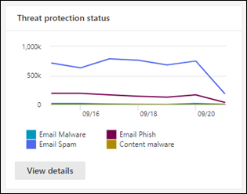
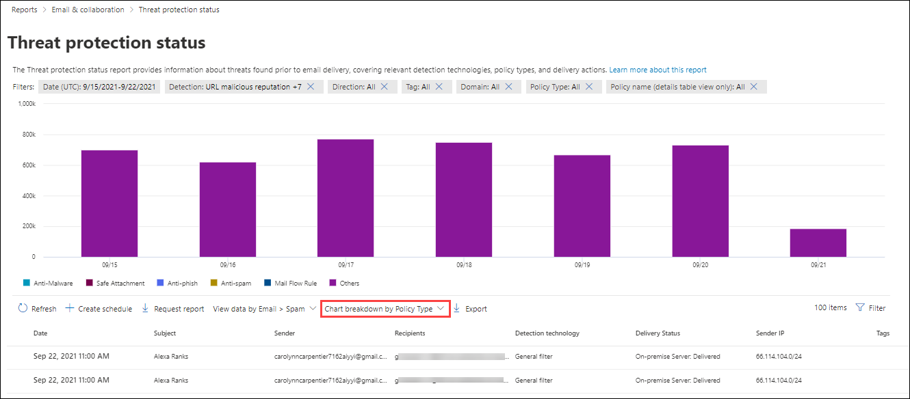

# View email security reports in the Security & Compliance Center

[!INCLUDE [Microsoft 365 Defender rebranding](../includes/microsoft-defender-for-office.md)]

**Applies to**
- [Exchange Online Protection](exchange-online-protection-overview.md)
- [Microsoft Defender for Office 365 plan 1 and plan 2](defender-for-office-365.md)
- [Microsoft 365 Defender](../defender/microsoft-365-defender.md)

A variety of reports are available in the [Security & Compliance Center](https://protection.office.com) to help you see how email security features, such as anti-spam, anti-malware, and encryption features in Microsoft 365 are protecting your organization. If you have the [necessary permissions](#what-permissions-are-needed-to-view-these-reports), you can view these reports in the Security & Compliance Center by going to **Reports** \> **Dashboard**. To go directly to the Reports dashboard, open <https://protection.office.com/insightdashboard>.

## Compromised users report

> [!NOTE]
> This report is available in Microsoft 365 organizations with Exchange Online mailboxes. It's not available in standalone Exchange Online Protection (EOP) organizations.

The **Compromised users** report shows shows the number of user accounts that were marked as **Suspicious** or **Restricted** within the last 7 days. Accounts in either of these states are problematic or even compromised. With frequent use, you can use the report to spot spikes, and even trends, in suspicious or restricted accounts. For more information about compromised users, see [Responding to a compromised email account](responding-to-a-compromised-email-account.md).

The aggregate view shows data for the last 90 days and the detail view shows data for the last 30 days.

To view the report, open the [Security & Compliance Center](https://protection.office.com), go to **Reports** \> **Dashboard** and select **Compromised users**. To go directly to the report, open <https://protection.office.com/reportv2?id=CompromisedUsers>.

You can filter both the chart and the details table by clicking **Filters** and selecting one or more of the following values:

- **Start date** and **End date**

- **Suspicious**: The user account has sent suspicious email and is at risk of being restricted from sending email.

- **Restricted**: The user account has been restricted from sending email due to highly suspicious patterns.

If you click **View details table**, you can see the following details:

- **Creation time**
- **User ID**
- **Action**

To go back to the report view, click **View report**.

## Encryption report

The **Encryption report** is available in EOP (subscriptions with mailboxes in Exchange Online or standalone EOP without Exchange Online mailboxes). Your organization's security team can use information in this report to identify patterns and proactively apply or adjust policies for sensitive email messages. For example:

- If you see a high number of email messages encrypted by users, you might want to add an encryption policy to automate encryption for certain use cases. For more information, see [Define mail flow rules to encrypt email messages in Microsoft 365](../../compliance/define-mail-flow-rules-to-encrypt-email.md).

- If you have a number of encryption templates available but no one is using them, you might explore whether users need feature training.

The aggregate view allows filtering for the last 90 days, while the detail view allows filtering for 10 days.

To view the report, open the [Security & Compliance Center](https://protection.office.com), go to **Reports** \> **Dashboard** and select **Encryption report**. To go directly to the report, open <https://protection.office.com/reportv2?id=EncryptionReport>.

To learn more about encryption, see [Email encryption in Microsoft 365](../../compliance/email-encryption.md).

### Report view for the Encryption report

You can use the following filters on the chart:

- **View data by: Message Encryption Report** and **Break down by: Encryption method**: The following encryption methods are available:

  - **Encryption by user**
  - **Encryption by policy**

  If you click **Filters**, you can modify the chart with the following filters:

  - **Start date** and **End date**
  - Encryption method.
  - Encryption template.

- **View data by: Message Encryption Report** and **Break down by: Encryption template**: The following encryption methods are available:

  - **Do not forward**
  - **Encrypt only**
  - **OME previous**
  - **Custom**

  If you click **Filters**, you can modify the chart with the following filters:

  - **Start date** and **End date**
  - Encryption method
  - Encryption template

- **View data by: Top 5 recipient domains**: This view shows a pie chart with sent message counts for the top 5 recipient domains.

  If you click **Filters**, you can select a **Start date** and **End date**.

### Details table view for the Encryption report

If you click **View details table**, the information that's shown depends on the chart you were looking at:

- **Break down by: Encryption method** or **Break down by: Encryption template**: The following information is shown:

  - **Date**
  - **Sender address**
  - **Encryption template**
  - **Encryption method**
  - **Recipient address**
  - **Subject**

- **View data by: Top 5 recipient domains**:

  - **Date**
  - **Recipient domain**
  - **Message count**

If you click **Filters** in a details table view, you can modify the results with the following filters:

- **Start date** and **End date**
- Encryption method
- Encryption template

To go back to the report view, click **View report**.

## Mailflow status report

The **Mailflow status report** contains information about malware, spam, phishing and edge blocked messages. For more details, see [Mailflow status report](view-mail-flow-reports.md#mailflow-status-report).

## Malware detections in email report

The **Malware detections in email** report shows information about malware detections in incoming and outgoing email messages (malware detected by Exchange Online Protection or EOP). For more information about malware protection in EOP, see [Anti-malware protection in EOP](anti-malware-protection.md).

 The aggregate view filter allows for 90 days, while the details table filter only allows for 10 days.

To view the report, open the [Security & Compliance Center](https://protection.office.com), go to **Reports** \> **Dashboard** and select **Malware detections in email**. To go directly to the report, open <https://protection.office.com/reportv2?id=MalwareDetections>.

You can filter both the chart and the details table by clicking **Filters** and selecting:

- **Start date** and **End date**
- **Inbound**
- **Outbound**

If you click **View details table**, you can see the following details:

- **Date**
- **Sender address**
- **Recipient address**
- **Message ID**: Available in the **Message-ID** header field in the message header and should be unique. An example value is `<08f1e0f6806a47b4ac103961109ae6ef@server.domain>` (note the angle brackets).
- **Subject**
- **Filename**
- **Malware name**

To go back to the report view, click **View report**.

## Mail latency report

The **Mail latency report** contains information on the mail delivery and detonation latency experienced within your organization. For more information, see [Mail latency report](view-reports-for-mdo.md#mail-latency-report).

## Sent and received email report

The **Sent and received email** report contains information about malware, spam, mail flow rules (also known as transport rules), and advanced malware detections after email enters the service. For more information, see [Sent and received email report](view-mail-flow-reports.md#sent-and-received-email-report).

## Spam detections report

The **Spam detections** report shows spam email messages that were blocked by EOP. Messages are counted individually, not per recipient. For example, if the same spam message was sent to 100 recipients in your organization, it counts as one message.

The aggregate view allows for 90 days filtering, while the details table allows for 10 days filtering.

To view the report, open the [Security & Compliance Center](https://protection.office.com), go to **Reports** \> **Dashboard** and select **Spam detections**. To go directly to the report, open <https://protection.office.com/reportv2?id=SpamDetections>.

For more information about anti-spam protection, see [Anti-spam protection in EOP](anti-spam-protection.md).

### Report view for the Spam detections report

The following charts are available in the report view:

- **Break down by: Action**: The following event types are shown:

  - **Spam content filtered**
  - **Spam IP block**
  - **Spam envelope block**
  - **Spam DBEB filter**: Directory based edge blocking (DBEB)

  When you hover over a day (data point) in the chart, you can see how many items were blocked that day, as well as how those items are categorized.

  

- **Break down by: Direction**: The following directions are shown:

  - **Inbound**
  - **Outbound**

  

If you click **Filters** in a report view, you can modify the results with the following filters:

- **Start date** and **End date**
- Direction values
- Event type values

### Details table view for the Spam detections report

If you click **View details table** in any report view, the following information is shown:

- **Date**
- **Sender address**
- **Recipient address**
- **Event type**
- **Action**
- **Subject**

If you click **Filters** in a details table, you can modify the results with the following filters:

- **Start date** and **End date**
- Direction values
- Event type values

To go back to the report view, click **View report**.

## Spoof detections report

> [!NOTE]
> The improved Spoof detections report as described in this article is in Preview, is subject to change, and is not available in all organizations. The older version of the report showed only **Good mail** and **Caught as spam**.

The **Spoof detections** report shows information about messages that were blocked or allowed due to spoofing. For more information about spoofing, see [Anti-spoofing protection in EOP](anti-spoofing-protection.md).

The aggregate view of the report allows for 45 days of filtering\*, while the detail view only allows for ten days of filtering.

\* Eventually, you'll be able to use up to 90 days of filtering.

To view the report, open the [Security & Compliance Center](https://protection.office.com), go to **Reports** \> **Dashboard** and select **Spoof detections**. To go directly to the report, open <https://protection.office.com/reportv2?id=SpoofMailReport>.

When you hover over a day (data point) in the chart, you can see how many spoofed messages were detected and why.

You can filter both the chart and the details table by clicking **Filters** and selecting one or more of the following values:

- **Start date** and **End date**

- **Result**
  - **Pass**
  - **Fail**
  - **SoftPass**
  - **None**
  - **Other**

- **Spoof type**: **Internal** and **External**

If you click **View details table**, you can see the following details:

- **Date**
- **Spoofed user**
- **Sending infrastructure**
- **Spoof type**
- **Result**
- **Result code**
- **SPF**
- **DKIM**
- **DMARC**
- **Message count**

To go back to the report view, click **View report**.

For more information about composite authentication result codes, see [Anti-spam message headers in Microsoft 365](anti-spam-message-headers.md).

## Threat protection status report

The **Threat protection status** report is available in both EOP and Microsoft Defender for Office 365; however, the reports contain different data. For example, EOP customers can view information about malware detected in email, but not information about malicious files detected by [Safe Attachments for SharePoint, OneDrive, and Microsoft Teams](mdo-for-spo-odb-and-teams.md).

The report provides the count of email messages with malicious content, such as files or website addresses (URLs) that were blocked by the anti-malware engine, [zero-hour auto purge (ZAP)](zero-hour-auto-purge.md), and Defender for Office 365 features like [Safe Links](safe-links.md), [Safe Attachments](safe-attachments.md), and [Anti-phishing](set-up-anti-phishing-policies.md). You can use this information to identify trends or determine whether organization policies need adjustment.

**Note**: It's important to understand that if a message is sent to five recipients we count it as five different messages and not one message.

To view the report, open the [Security & Compliance Center](https://protection.office.com), go to **Reports** \> **Dashboard** and select **Threat protection status**. To go directly to the report, open one of the following URLs:

- Microsoft Defender for Office 365: <https://protection.office.com/reportv2?id=TPSAggregateReportATP>
- EOP: <https://protection.office.com/reportv2?id=TPSAggregateReport>

By default, the chart shows data for the past 7 days. If you click **Filters**, you can select a 90 day date range (trial subscriptions might be limited to 30 days). The details table view allows filtering for 30 days.

### Report view for the Threat protection status report

The following views are available:

- **View data by: Overview**: The following detection information is shown:

  - **Email malware**
  - **Email phish**
  - **Content malware**

  

- **View data by: Content \> Malware**1: The following information is shown for Microsoft Defender for Office 365 organizations:

  - **Anti-malware engine**: Malicious files detected in Sharepoint, OneDrive, and Microsoft Teams by the [built-in virus detection in Microsoft 365](virus-detection-in-spo.md).
  - **File detonation**: Malicious files detected by [Safe Attachments for SharePoint, OneDrive, and Microsoft Teams](mdo-for-spo-odb-and-teams.md).

  

- **View data by: Message Override**: The following override reason information is shown:

  - **On-premises skip**
  - **IP Allow**
  - **Mail flow rule**
  - **Sender allow**
  - **Domain allow**
  - **ZAP not enabled**
  - **Junk Mail folder not enabled**
  - **User Safe Sender**
  - **User Safe Domain**

  

- **Break down by: Detection technology** and **View data by: Email \> Phish**: The following information is shown:

  - **ATP-generated URL reputation**1: Malicious URL reputation generated from Defender for Office 365 detonations in other Microsoft 365 customers.
  - **Advanced phish filter**: Phishing signals based on machine learning.
  - **Anti-spoof - DMARC failure**: DMARC authentication failure on messages.
  - **Anti-spoof - intra-org**: Sender is trying to spoof the recipient domain.
  - **Anti-spoof - external domain**: Sender is trying to spoof some other domain.
  - **Brand impersonation**: Impersonation of well-known brands based on senders.
  - **Domain impersonation**1: Impersonation of domains that the customer owns or defines.
  - **EOP URL reputation**: Malicious URL reputation.
  - **General phish filter**: Phishing signals based on analyst rules.
  - **Others**
  - **Phish ZAP**2: Zero hour auto purge of phishing messages.
  - **URL detonation**1
  - **User impersonation**1: Impersonation of users defined by admin or learned through mailbox intelligence.

  

- **Break down by: Detection technology** and **View data by: Email \> Malware**: The following information is shown:

  - **ATP-generated file reputation**1: All malicious file reputation generated by Defender for Office 365 detonations.
  - **Anti-malware engine**1: Detection from anti-malware engines.
  - **Anti-malware policy file type block**: These are email messages filtered out due to the type of malicious file identified in the message.
  - **File detonation**1: Detection by Safe Attachments.
  - **Malicious file reputation**
  - **Malware ZAP**2
  - **Others**

  

- **Break down by: Policy type** and **View data by: Email \> Phish** or **View data by: Email \> Malware**: The following information is shown:

  - **Anti-malware**
  - **Safe Attachments**1
  - **Anti-phish**
  - **Anti-spam**
  - **Mail flow rule** (also known as a transport rule)
  - **Others**

  

- **Break down by: Delivery status** and **View data by: Email \> Phish** or **View data by: Email \> Malware**: The following information is shown:

  - **Delivery failed**
  - **Dropped**
  - **Forwarded**
  - **Hosted mailbox: Custom folder**
  - **Hosted mailbox: Deleted items**
  - **Hosted mailbox: Inbox**
  - **Hosted mailbox: Junk**
  - **On-premises server: Delivered**
  - **Quarantine**

  

1 Defender for Office 365 only

2 Zero-hour auto purge (ZAP) isn't available in standalone EOP (it only works in Exchange Online mailboxes).

If you click **Filters**, the filters available depends on the chart you were looking at:

- For **View data by: Content \> Malware**, you can modify the report by **Start date** and **End date**, and the **Detection** value.

- For **View data by: Message Override**, you can modify the report with the following filters:

  - **Start date** and **End date**
  - **Override Reason**
  - **Tag**: Filter the results by users or groups that have had the specified user tag applied (including priority accounts). For more information about user tags, see [User tags](user-tags.md).
  - **Domain**

- For all other views, you can modify the report with the following filters:

  - **Start date** and **End date**
  - **Detection**
  - **Protected by**: **ATP** or **EOP**
  - **Tag**: Filter the results by users or groups that have had the specified user tag applied (including priority accounts). For more information about user tags, see [User tags](user-tags.md).
  - **Domain**

### Details table view for the Threat protection status report

If you click **View details table**, the information that's shown depends on the chart you were looking at:

- **View data by: Overview**: No **View details table** button is available.

- **View data by: Content \> Malware**:

  - **Date**
  - **Location**
  - **Directed by**
  - **Malware name**

  If you click **Filters** in this view, you can modify the report by **Start date** and **End date**, and the **Detection** value.

- **View data by: Message Override**:

  - **Date**
  - **Subject**
  - **Sender**
  - **Recipients**
  - **Detected by**
  - **Override Reason**
  - **Source of Compromise**
  - **Tags**

  If you click **Filters** in this view, you can modify the report with the following filters:

  - **Start date** and **End date**
  - **Override Reason**
  - **Tag**: Filter the results by users or groups that have had the specified user tag applied (including priority accounts). For more information about user tags, see [User tags](user-tags.md).
  - **Domain**
  - **Recipients** (Note that this filterable property is only available in the details table view)

- All other charts:

  - **Date**
  - **Subject**
  - **Sender**
  - **Recipients**
  - **Detected by**
  - **Delivery Status**
  - **Source of Compromise**
  - **Tags**

  If you click **Filters**, you can modify the report with the following filters:

  - **Start date** and **End date**
  - **Detection**
  - **Protected by**: **Defender for Office 365** or **EOP**
  - **Tag**: Filter the results by users or groups that have had the specified user tag applied (including priority accounts). For more information about user tags, see [User tags](user-tags.md).
  - **Domain**
  - **Recipients** (Note that this filterable property is only available in the details table view)

## Top malware report

The **Top malware** report shows the various kinds of malware that was detected by [anti-malware protection in EOP](anti-malware-protection.md).

To view the report, open the [Security & Compliance Center](https://protection.office.com), go to **Reports** \> **Dashboard** and select **Top malware**. To go directly to the report, open <https://protection.office.com/reportv2?id=TopMalware>.

When you hover over a wedge in the pie chart, you can see the name of a kind of malware and how many messages were detected as having that malware.

If you click **View details table**, you can see the following details:

- **Top malware**
- **Count**

If you click **Filters** in the report view or details table view, you can specify a date range with **Start date** and **End date**.

## URL threat protection report

The **URL threat protection report** is available in Microsoft Defender for Office 365. For more information, see [URL threat protection report](view-reports-for-mdo.md#url-threat-protection-report).

## User-reported messages report

The **User-reported messages** report shows information about email messages that users have reported as junk, phishing attempts, or good mail by using the [Report Message add-in](enable-the-report-message-add-in.md) or [The Report Phishing add-in](enable-the-report-phish-add-in.md).

Details are available for each message, including the delivery reason, such a spam policy exception or mail flow rule configured for your organization. To view details, select an item in the user-reports list, and then view the information on the **Summary** and **Details** tabs.

To view this report, in the [Security & Compliance Center](https://protection.office.com), do one of the following:

- Go to **Threat management** \> **Dashboard** \> **User-reported messages**.

- Go to **Threat management** \> **Review** \> **User-reported messages**.

> [!IMPORTANT]
> In order for the User-reported messages report to work correctly, **audit logging must be turned on** for your Office 365 environment. This is typically done by someone who has the Audit Logs role assigned in Exchange Online. For more information, see [Turn Microsoft 365 audit log search on or off](../../compliance/turn-audit-log-search-on-or-off.md).

## What permissions are needed to view these reports?

In order to view and use the reports described in this article, you need to be a member of one of the following role groups in the Security & Compliance Center:

- **Organization Management**
- **Security Administrator**
- **Security Reader**
- **Global Reader**

For more information, see [Permissions in the Security & Compliance Center](permissions-in-the-security-and-compliance-center.md).

**Note**: Adding users to the corresponding Azure Active Directory role in the Microsoft 365 admin center gives users the required permissions in the Security & Compliance Center _and_ permissions for other features in Microsoft 365. For more information, see [About admin roles](../../admin/add-users/about-admin-roles.md).

## What if the reports aren't showing data?

If you are not seeing data in your reports, double-check that your policies are set up correctly. To learn more, see [Protect against threats](protect-against-threats.md).

## Related topics

[Anti-spam and anti-malware protection in EOP](anti-spam-and-anti-malware-protection.md)

[Smart reports and insights in the Security & Compliance Center](reports-and-insights-in-security-and-compliance.md)

[View mail flow reports in the Security & Compliance Center](view-mail-flow-reports.md)

[View reports for Defender for Office 365](view-reports-for-mdo.md)
