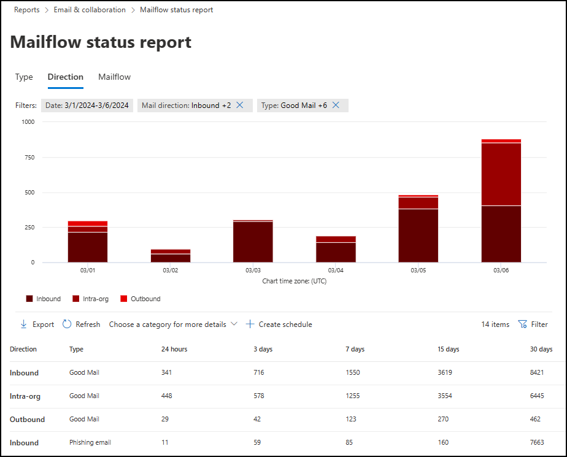
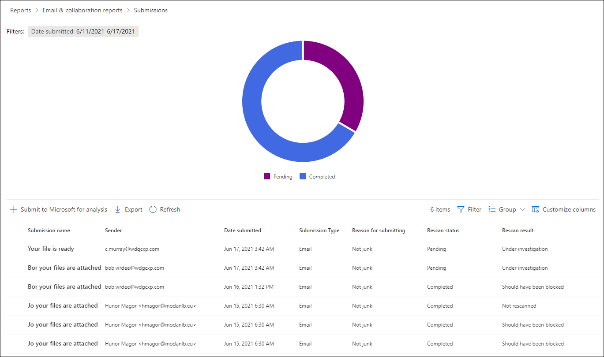
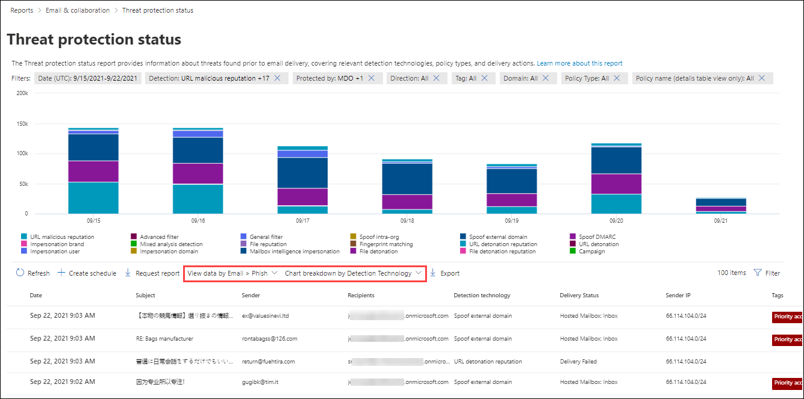
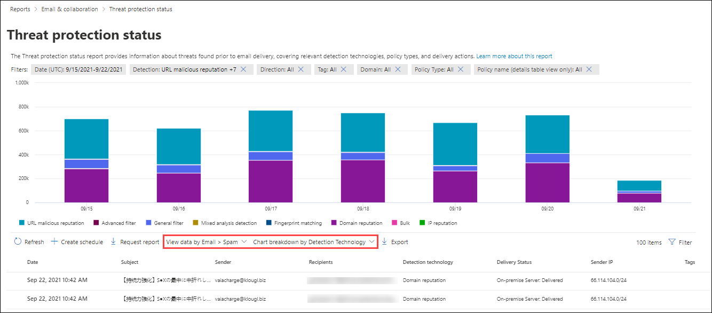
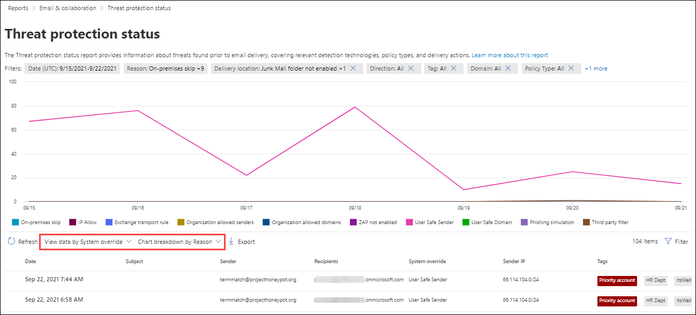
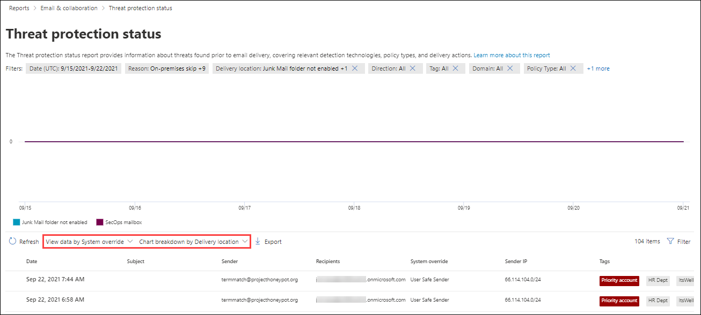

# View email security reports in the Microsoft 365 Defender portal

[!INCLUDE [Microsoft 365 Defender rebranding](../includes/microsoft-defender-for-office.md)]

**Applies to**
- [Exchange Online Protection](exchange-online-protection-overview.md)
- [Microsoft Defender for Office 365 plan 1 and plan 2](defender-for-office-365.md)
- [Microsoft 365 Defender](../defender/microsoft-365-defender.md)

A variety of reports are available in the Microsoft 365 Defender portal at <https://security.microsoft.com> to help you see how email security features, such as anti-spam, anti-malware, and encryption features in Microsoft 365 are protecting your organization. If you have the [necessary permissions](#what-permissions-are-needed-to-view-these-reports), you can view and download these reports as described in this article.

> [!NOTE]
>
> Some of the reports on the **Email & collaboration reports** page require Microsoft Defender for Office 365. For information about these reports, see [View Defender for Office 365 reports in the Microsoft 365 Defender portal](view-reports-for-mdo.md).
>
> Reports that are related to mail flow are now in the Exchange admin center (EAC). For more information about these reports, see [Mail flow reports in the new Exchange admin center](/exchange/monitoring/mail-flow-reports/mail-flow-reports).

## View and download reports

### View reports

1. In the Microsoft 365 defender portal, go to **Reports** \> **Email & collaboration** \> **Email & collaboration reports**.

   To go directly to the **Email & collaboration reports** page, open <https://security.microsoft.com/emailandcollabreport>.

2. Find the report that you want, and then click **View details**.

### Schedule reports

1. On the main page of the report, click **Create schedule**.
2. The **Create scheduled report** wizard opens. On the **Name scheduled report** page, review or customize the **Name** value, and then click **Next**.
3. On the **Set preferences** page, configure the following settings:
   - **Frequency**: Select one of the following values:
     - **Weekly** (default)
     - **Monthly**
   - **Start date**: When generation of the report begins. The default value is today.
   - **Expiry date**: When generation of the report ends. The default value is one year from today.

   When you're finished, click **Next**.

4. On the **Recipients** page, choose recipients for the report. The default value is your email address, but you can add others.

   When you're finished, click **Next**.

5. On the **Review** page, review your selections. You can click the **Back** button or the **Edit** link in the respective sections to make changes.

   When you're finished, click **Submit**.

#### Managed existing scheduled reports

To manage scheduled reports that you've already created, do the following steps:

1. In the Microsoft 365 Defender portal, go to **Reports** \> expand **Email & collaboration** \> select **Manage schedules**.

   To go directly to the **Manage schedules** page, use <https://security.microsoft.com/ManageSubscription>.

2. On the **Manage schedules** page, the following details for scheduled reports are shown:
   - **Schedule start date**
   - **Schedule name**
   - **Report type**
   - **Frequency**
   - **Last sent**

   Find the existing scheduled report that you want to modify.

3. After you select the scheduled report do any of the following actions in the details flyout that opens:
   - **Edit name**: Click this button, change the name of the report in the flyout that appears, and then click **Save**.
   - **Delete schedule**: Click this button, read the warning that appears (previous reports will no longer be available for download), and then click **Save**.
   - **Schedule details** section: Click **Edit preferences** to change the following settings:
     - **Frequency**: **Weekly** or **Monthly**
     - **Start date**
     - **Expiry date**

     When you're finished, click **Save**.

   - **Recipients** section: Click **Edit recipients** to add or remove recipients for the scheduled report. When you're finished, click **Save**

   When you're finished, click **Close**.

### Download reports

1. In the Microsoft 365 Defender portal, go to **Reports** \> expand **Email & collaboration** \> select **Manage schedules**.

   To go directly to the **Managed schedules** page, use <https://security.microsoft.com/ReportsForDownload>.

2. On the **Reports for download** page, find and select the report you want to download.

## Compromised users report

> [!NOTE]
> This report is available in Microsoft 365 organizations with Exchange Online mailboxes. It's not available in standalone Exchange Online Protection (EOP) organizations.

The **Compromised users** report shows shows the number of user accounts that were marked as **Suspicious** or **Restricted** within the last 7 days. Accounts in either of these states are problematic or even compromised. With frequent use, you can use the report to spot spikes, and even trends, in suspicious or restricted accounts. For more information about compromised users, see [Responding to a compromised email account](responding-to-a-compromised-email-account.md).

The aggregate view shows data for the last 90 days and the detail view shows data for the last 30 days.

To view the report in the Microsoft 365 Defender portal, go to **Reports** \> **Email & collaboration** \> **Email & collaboration reports**. On the **Email & collaboration reports** page, find **Compromised users** and then click **View details**. To go directly to the report, open <https://security.microsoft.com/reports/CompromisedUsers>.

On the **Compromised users** page, the chart shows the following information for the specified date range:

- **Restricted**: The user account has been restricted from sending email due to highly suspicious patterns.
- **Suspicious**: The user account has sent suspicious email and is at risk of being restricted from sending email.

The details table below the graph shows the following information:

- **Creation time**
- **User ID**
- **Action**

You can filter both the chart and the details table by clicking **Filter** and selecting one or more of the following values in the flyout that appears:

- **Date (UTC)**: **Start date** and **End date**.
- **Activity**: **Restricted** or **Suspicious**

When you're finished configuring the filters, click **Apply**, **Cancel**, or **Clear filters**.

## Exchange transport rule report

The **Exchange transport rule** report shows the effect of mail flow rules (also known as transport rules) on incoming and outgoing messages in your organization.

To view the report in the Microsoft 365 Defender portal, go to **Reports** \> **Email & collaboration** \> **Email & collaboration reports**. On the **Email & collaboration reports** page, find **Exchange transport rule** and then click **View details**. To go directly to the report, open <https://security.microsoft.com/reports/ETRRuleReport>.

On the **Exchange transport rule report** page, the available charts and data are described in the following sections.

### Chart breakdown by Direction

If you select **Chart breakdown by Direction**, the follow charts are available:

- **View data by Exchange transport rules**: The number of **Inbound** and **Outbound** messages that were affected by mail flow rules.
- **View data by DLP Exchange transport rules**: The number of **Inbound** and **Outbound** messages that were affected by data loss prevention (DLP) mail flow rules.

The following information is shown in the details table below the graph:

- **Date**
- **DLP policy** (**View data by DLP Exchange transport rules** only)
- **Transport rule**
- **Subject**
- **Sender address**
- **Recipient address**
- **Severity**
- **Direction**

You can filter both the chart and the details table by clicking **Filter** and selecting one or more of the following values in the flyout that appears:

- **Date (UTC)** **Start date** and **End date**.
- **Direction**: **Outbound** and **Inbound**.
- **Severity**: **High severity**, **Medium severity**, and **Low severity**

When you're finished configuring the filters, click **Apply**, **Cancel**, or **Clear filters**.

### Chart breakdown by Severity

If you select **Chart breakdown by Severity**, the follow charts are available:

- **View data by Exchange transport rules**: The number of **High severity**, **Medium severity**, and **Low severity** messages. You set the severity level as an action in the rule (**Audit this rule with severity level** or _SetAuditSeverity_). For more information, see [Mail flow rule actions in Exchange Online](/Exchange/security-and-compliance/mail-flow-rules/mail-flow-rule-actions).

- **View data by DLP Exchange transport rules**: The number of **High severity**, **Medium severity**, and **Low severity** messages that were affected by DLP mail flow rules.

The following information is shown in the details table below the graph:

- **Date**
- **DLP policy** (**View data by DLP Exchange transport rules** only)
- **Transport rule**
- **Subject**
- **Sender address**
- **Recipient address**
- **Severity**
- **Direction**

You can filter both the chart and the details table by clicking **Filter** and selecting one or more of the following values in the flyout that appears:

- **Date (UTC)** **Start date** and **End date**
- **Direction**: **Outbound** and **Inbound**
- **Severity**: **High severity**, **Medium severity**, and **Low severity**

When you're finished configuring the filters, click **Apply**, **Cancel**, or **Clear filters**.

## Forwarding report

> [!NOTE]
> This report is now available in the EAC. For more information, see [Auto forwarded messages report in the new EAC](/exchange/monitoring/mail-flow-reports/mfr-auto-forwarded-messages-report).

## Mailflow status report

The **Mailflow status report** is a smart report that shows information about incoming and outgoing email, spam detections, malware, email identified as "good", and information about email allowed or blocked on the edge. This is the only report that contains edge protection information, and shows just how much email is blocked before being allowed into the service for evaluation by Exchange Online Protection (EOP). It's important to understand that if a message is sent to five recipients we count it as five different messages and not one message.

To view the report in the Microsoft 365 Defender portal, go to **Reports** \> **Email & collaboration** \> **Email & collaboration reports**. On the **Email & collaboration reports** page, find **Mailflow status summary** and then click **View details**. To go directly to the report, open <https://security.microsoft.com/reports/mailflowStatusReport>.

### Type view for the Mailflow status report

On the **Mailflow status report** page, the **Type** tab is selected by default. The chart shows the following information for the specified date range:

- **Good mail**
- **Total**
- **Malware**
- **Phishing email**
- **Spam**
- **Edge protection**
- **Rule messages**

The details table below the graph shows the following information:

- **Direction**
- **Type**
- **24 hours**
- **3 days**
- **7 days**
- **15 days**
- **30 days**

You can filter both the chart and the details table by clicking **Filter** and selecting one or more of the following values in the flyout that appears:

- **Date (UTC)**: **Start date** and **End date**.
- **Mail direction**: **Inbound** and **Outbound**.
- **Type**:
  - **Good mail**
  - **Malware**
  - **Spam**
  - **Edge protection**
  - **Rule messages**
  - **Phishing email**

When you're finished configuring the filters, click **Apply**, **Cancel**, or **Clear filters**.

Back on the main report page, if you click **Choose a category for more details**, you can select from the following values:

- **Phishing email**: This selection takes you to the [Threat protection status report](view-email-security-reports.md#threat-protection-status-report).
- **Malware in email**: This selection takes you to the [Threat protection status report](view-email-security-reports.md#threat-protection-status-report).
- **Spam detections**: This selection takes you to the [Spam Detections report](view-email-security-reports.md#spam-detections-report).
- **Edge blocked spam**: This selection takes you to the [Spam Detections report](view-email-security-reports.md#spam-detections-report).

#### Export from Type view

For the detail view, you can only export data for one day. So, if you want to export data for 7 days, you need to do 7 different export actions.

Each exported .csv file is limited to 150,000 rows. If the data for that day contains more than 150,000 rows, then multiple .csv files will be created.

### Direction view for the Mailflow status report

If you click the **Direction** tab, the chart shows the following information for the specified date range:

- **Inbound**
- **Outbound**

You can filter both the chart and the details table by clicking **Filter** and selecting one or more of the following values in the flyout that appears:

- **Date (UTC)**: **Start date** and **End date**.
- **Mail direction**: **Inbound** and **Outbound**.
- **Type**:
  - **Good mail**
  - **Malware**
  - **Spam**
  - **Edge protection**
  - **Rule messages**
  - **Phishing email**

When you're finished configuring the filters, click **Apply**, **Cancel**, or **Clear filters**.

Back on the main report page, if you click **Choose a category for more details**, you can select from the following values:

- **Phishing email**: This selection takes you to the [Threat protection status report](view-email-security-reports.md#threat-protection-status-report).
- **Malware in email**: This selection takes you to the [Threat protection status report](view-email-security-reports.md#threat-protection-status-report).
- **Spam detections**: This selection takes you to the [Spam Detections report](view-email-security-reports.md#spam-detections-report).
- **Edge blocked spam**: This selection takes you to the [Spam Detections report](view-email-security-reports.md#spam-detections-report).

#### Export from Direction view

For the detail view, you can only export data for one day. So, if you want to export data for 7 days, you need to do 7 different export actions.

Each exported .csv file is limited to 150,000 rows. If the data for that day contains more than 150,000 rows, then multiple .csv files will be created.

### Mailflow view for the Mailflow status report

The **Mailflow** view shows you how Microsoft's email threat protection features filter incoming and outgoing email in your organization. This view uses a a horizontal flow diagram (known as a _Sankey_ diagram) to provide details on the total email count, and how the configured threat protection features, including edge protection, anti-malware, anti-phishing, anti-spam, and anti-spoofing affect this count.

The aggregate view and details table view allow for 90 days of filtering.

The information in the diagram is color-coded by **EOP** or **Defender for Office 365** technologies.

The diagram is organized into the following horizontal bands:

- **Total email** band: This value is always shown first.
- **Edge block** and **Processed** band:
  - **Edge block**: Messages that are filtered at the edge and identified as Edge Protection.
  - **Processed**: Messages that are handled by the filtering stack.
- Outcomes band:
  - **Rule Block**: Messages that are processed by Exchange mail flow rules (transport rules).
  - **Malware block**: Messages that are identified as malware by various filters.\*
  - **Phish block**: Messages identified as phish during processing by various filters.\*
  - **Spam block**: Messages identified as spam during processing by various filters.\*
  - **Impersonation block**: Messages detected as user impersonation or domain impersonation in Defender for Office 365.\*
  - **Detonation block**: Messages detected during file or URL detonation by Safe Attachments policies or Safe Links policies in Defender for Office 365.\*
  - **ZAP removed**: Messages that are removed by zero-hour auto purge (ZAP).\*
  - **Delivered**: Messages delivered to users due to an allow.\*

If you hover over a horizontal band in the diagram, you'll see the number of related messages.

\* If you click on this element, the diagram is expanded to show further details. For a description of each element in the expanded nodes, see [Detection technologies](/office/office-365-management-api/office-365-management-activity-api-schema#detection-technologies).

The details table below the diagram shows the following information:

- **Date**
- **Total email**
- **Edge filtered**
- **Rule messages**
- **Anti-malware engine, Safe Attachments, rule filtered**
- **DMARC impersonation, spoof, phish filtered**
- **Detonation detection**
- **Anti-spam filtered**
- **ZAP removed**
- **Messages where not threats were detected**

If you select a row in the details table, a further breakdown of the email counts is shown in the details flyout that appears.

You can filter both the chart and the details table by clicking **Filter** and selecting one or more of the following values in the flyout that appears:

- **Date (UTC)** **Start date** and **End date**.
- **Direction**: **Outbound** and **Inbound**.

When you're finished configuring the filters, click **Apply**, **Cancel**, or **Clear filters**.

Back on the main report page, you can click **Show trends** to see trend graphs in the **Mailflow trends** flyout that appears.

#### Export from Mailflow view

If you click **Export** on the main report page, an **Export conditions** flyout appears where you can configure the following settings:

- **Options**: Select one of the following values:
  - **Summary (with data for the last 90 days at most)**
  - **Details (with data for the last 30 days)**
- **Date (UTC)**: **Start time** and **End time** (dates).

When you're finished configuring the filters, click **Apply**. In the dialog that opens, you can choose to open the file, save the file, or remember the selection from now on.

Each exported .csv file is limited to 150,000 rows. If the data contains more than 150,000 rows, multiple .csv files are created.

## Malware detections report

> [!NOTE]
> This report has been deprecated. The same information is available in the [Threat protection status report](#threat-protection-status-report).

## Mail latency report

The **Mail latency report** in Defender for Office 365 contains information on the mail delivery and detonation latency experienced within your organization. For more information, see [Mail latency report](view-reports-for-mdo.md#mail-latency-report).

## Spam detections report

> [!NOTE]
> This report has been deprecated. The same information is available in the [Threat protection status report](#threat-protection-status-report).

## Spoof detections report

The **Spoof detections** report shows information about messages that were blocked or allowed due to spoofing. For more information about spoofing, see [Anti-spoofing protection in EOP](anti-spoofing-protection.md).

The aggregate view of the report allows for 45 days of filtering\*, while the detail view only allows for ten days of filtering.

\* Eventually, you'll be able to use up to 90 days of filtering.

To view the report in the Microsoft 365 Defender portal, go to **Reports** \> **Email & collaboration** \> **Email & collaboration reports**. On the **Email & collaboration reports** page, find **Spoof detections** and then click **View details**. To go directly to the report, open <https://security.microsoft.com/reports/SpoofMailReportV2>.

The chart shows the following information:

- **Pass**
- **Fail**
- **SoftPass**
- **None**
- **Other**

When you hover over a day (data point) in the chart, you can see how many spoofed messages were detected and why.

You can filter both the chart and the details table by clicking **Filter** and selecting one or more of the following values in the flyout that appears:

- **Date (UTC)** **Start date** and **End date**
- **Result**:
  - **Pass**
  - **Fail**
  - **SoftPass**
  - **None**
  - **Other**
- **Spoof type**: **Internal** and **External**

The details table below the graph shows the following information:

- **Date**
- **Spoofed user**
- **Sending infrastructure**
- **Spoof type**
- **Result**
- **Result code**
- **SPF**
- **DKIM**
- **DMARC**
- **Message count**

For more information about composite authentication result codes, see [Anti-spam message headers in Microsoft 365](anti-spam-message-headers.md).

## Submissions report

The **Submissions** report shows information about items that admins have reported to Microsoft for analysis. For more information, see [Use Admin Submission to submit suspected spam, phish, URLs, and files to Microsoft](admin-submission.md).

To view the report in the Microsoft 365 Defender portal, go to **Reports** \> **Email & collaboration** \> **Email & collaboration reports**. On the **Email & collaboration reports** page, find **Submissions** and then click **View details**. To go directly to the report, open <https://security.microsoft.com/adminSubmissionReport>. To go to [admin submissions in the Microsoft 365 Defender portal](admin-submission.md), click **Go to Submissions**. Admins will be able to view the report for last 30 days.

The chart shows the following information:

- **Pending**
- **Completed**

You can filter both the chart and the details table by clicking **Filter** and selecting one or more of the following values in the flyout that appears:

- **Date reported**: **Start time** and **End time**
- **Submission type**:
  - **Email**
  - **URL**
  - **File**
- **Submission ID**
- **Network Message ID**
- **Sender**
- **Name**
- **Submitted by**
- **Reason for submitting**:
  - **Not junk**
  - **Phish**
  - **Malware**
  - **Spam**
- **Rescan status**:
  - **Pending**
  - **Completed**

The details table below the graph shows the same information and has the same **Group** or **Customize columns** options as on the **Submitted for analysis** tab at **Email & collaboration** \> **Submissions**. For more information, see [View admin submissions to Microsoft](admin-submission.md#view-admin-submissions-to-microsoft).

## Threat protection status report

The **Threat protection status** report is available in both EOP and Defender for Office 365; however, the reports contain different data. For example, EOP customers can view information about malware detected in email, but not information about malicious files detected by [Safe Attachments for SharePoint, OneDrive, and Microsoft Teams](mdo-for-spo-odb-and-teams.md).

The report provides the count of email messages with malicious content, such as files or website addresses (URLs) that were blocked by the anti-malware engine, [zero-hour auto purge (ZAP)](zero-hour-auto-purge.md), and Defender for Office 365 features like [Safe Links](safe-links.md), [Safe Attachments](safe-attachments.md), and [impersonation protection features in anti-phishing policies](set-up-anti-phishing-policies.md#exclusive-settings-in-anti-phishing-policies-in-microsoft-defender-for-office-365). You can use this information to identify trends or determine whether organization policies need adjustment.

**Note**: It's important to understand that if a message is sent to five recipients we count it as five different messages and not one message.

To view the report in the Microsoft 365 Defender portal, go to **Reports** \> **Email & collaboration** \> **Email & collaboration reports**. On the **Email & collaboration reports** page, find **Threat protection status** and then click **View details**. To go directly to the report, open one of the following URLs:

- Defender for Office 365: <https://security.microsoft.com/reports/TPSAggregateReportATP>
- EOP: <https://security.microsoft.com/reports/TPSAggregateReport>

By default, the chart shows data for the past 7 days. If you click **Filter** on the **Threat protection status report** page, you can select a 90 day date range (trial subscriptions might be limited to 30 days). The details table allows filtering for 30 days.

The available views are described in the following sections.

### View data by Overview

In the **View data by Overview** view, the following detection information is shown in the chart:

- **Email malware**
- **Email phish**
- **Email spam**
- **Content malware**

No details table is available below the chart.

If you click **Filter**, the following filters are available:

- **Date (UTC)** **Start date** and **End date**.
- **Detection**:
  - **Email malware**
  - **Email phish**
  - **Email spam**
  - **Content malware**
- **Protected by**: **MDO** (Defender for Office 365) and **EOP**.
- **Tag**: **All** or the specified user tag (including priority accounts). For more information about user tags, see [User tags](user-tags.md).
- **Direction**:
  - **All**
  - **Inbound**
  - **Outbound**
- **Domain**: **All** or an [accepted domain](/exchange/mail-flow-best-practices/manage-accepted-domains/manage-accepted-domains).
- **Policy type**:
  - **All**
  - **Anti-malware**
  - **Safe Attachments**
  - **Anti-phish**
  - **Anti-spam**
  - **Mail flow rule** (transport rule)
  - **Others**

When you're finished configuring the filters, click **Apply**, **Cancel**, or **Clear filters**.

### View data by Email \> Phish and Chart breakdown by Detection Technology

In the **View data by Email \> Phish** and **Chart breakdown by Detection Technology** view, the following information is shown in the chart:

- **URL malicious reputation**\*: Malicious URL reputation generated from Defender for Office 365 detonations in other Microsoft 365 customers.
- **Advanced filter**: Phishing signals based on machine learning.
- **General filter**: Phishing signals based on analyst rules.
- **Spoof intra-org**: Sender is trying to spoof the recipient domain.
- **Spoof external domain**: Sender is trying to spoof some other domain.
- **Spoof DMARC**: DMARC authentication failure on messages.
- **Impersonation brand**: Impersonation of well-known brands based on senders.
- **Mixed analysis detection**
- **File reputation**
- **Fingerprint matching**
- **URL detonation reputation**\*
- **URL detonation**\*
- **Impersonation user**\*
- **Impersonation domain**\*: Impersonation of domains that the customer owns or defines.
- **Mailbox intelligence impersonation**\*: Impersonation of users defined by admin or learned through mailbox intelligence.
- **File detonation**\*
- **File detonation reputation**\*
- **Campaign**\*

\* Defender for Office 365 only

In the details table below the chart, the following information is available:

- **Date**
- **Subject**
- **Sender**
- **Recipients**
- **Detection technology**
- **Delivery status**
- **Sender IP**
- **Tags**

If you click **Filter**, the following filters are available:

- **Date (UTC)** **Start date** and **End date**
- **Detection**: The same values as in the chart.
- **Protected by**: **MDO** (Defender for Office 365) or **EOP**
- **Direction**:
  - **All**
  - **Inbound**
  - **Outbound**
- **Tag**: **All** or the specified user tag (including priority accounts). For more information about user tags, see [User tags](user-tags.md).
- **Domain**: **All** or an [accepted domain](/exchange/mail-flow-best-practices/manage-accepted-domains/manage-accepted-domains).
- **Policy type**:
  - **All**
  - **Anti-malware**
  - **Safe Attachments**
  - **Anti-phish**
  - **Anti-spam**
  - **Mail flow rule** (transport rule)
  - **Others**
- **Policy name (details table view only)**: **All** or the specified policy.
- **Recipients**

When you're finished configuring the filters, click **Apply**, **Cancel**, or **Clear filters**.

### View data by Email \> Spam and Chart breakdown by Detection Technology

In the **View data by Email \> Spam** and **Chart breakdown by Detection Technology** view, the following information is shown in the chart:

- **URL malicious reputation**
- **Advanced filter**
- **General filter**
- **Mixed analysis detection**
- **Fingerprint matching**
- **Domain reputation**
- **Bulk**
- **IP reputation**

In the details table below the chart, the following information is available:

- **Date**
- **Subject**
- **Sender**
- **Recipients**
- **Detection technology**
- **Delivery status**
- **Sender IP**
- **Tags**

If you click **Filter**, the following filters are available:

- **Date (UTC)** **Start date** and **End date**
- **Detection**: The same values as in the chart.
- **Direction**:
  - **All**
  - **Inbound**
  - **Outbound**
- **Tag**: **All** or the specified user tag (including priority accounts). For more information about user tags, see [User tags](user-tags.md).
- **Domain**: **All** or an [accepted domain](/exchange/mail-flow-best-practices/manage-accepted-domains/manage-accepted-domains).
- **Policy type**:
  - **All**
  - **Anti-malware**
  - **Safe Attachments**
  - **Anti-phish**
  - **Anti-spam**
  - **Mail flow rule** (transport rule)
  - **Others**
- **Policy name (details table view only)**: **All** or the specified policy.
- **Recipients**

When you're finished configuring the filters, click **Apply**, **Cancel**, or **Clear filters**.

### View data by Email \> Malware and Chart breakdown by Detection Technology

In the **View data by Email \> Malware** and **Chart breakdown by Detection Technology** view, the following information is shown in the chart:

- **File detonation**\*: Detection by Safe Attachments.
- **File detonation reputation**\*: All malicious file reputation generated by Defender for Office 365 detonations.
- **File reputation**
- **Anti-malware engine**\*: Detection from anti-malware engines.
- **Anti-malware policy file type block**: These are email messages filtered out due to the type of malicious file identified in the message.
- **URL malicious reputation**\*
- **URL detonation**\*
- **URL detonation reputation**\*
- **Campaign**\*

In the details table below the chart, the following information is available:

- **Date**
- **Subject**
- **Sender**
- **Recipients**
- **Detection tecchnology**
- **Delivery Status**
- **Sender IP**
- **Tags**

If you click **Filter**, the following filters are available:

- **Date (UTC)** **Start date** and **End date**
- **Detection**: The same values as in the chart.
- **Protected by**: **MDO** (Defender for Office 365) or **EOP**
- **Direction**:
  - **All**
  - **Inbound**
  - **Outbound**
- **Tag**: **All** or the specified user tag (including priority accounts). For more information about user tags, see [User tags](user-tags.md).
- **Domain**: **All** or an [accepted domain](/exchange/mail-flow-best-practices/manage-accepted-domains/manage-accepted-domains).
- **Policy type**:
  - **All**
  - **Anti-malware**
  - **Safe Attachments**
  - **Anti-phish**
  - **Anti-spam**
  - **Mail flow rule** (transport rule)
  - **Others**
- **Policy name (details table view only)**: **All** or the specified policy.
- **Recipients**

When you're finished configuring the filters, click **Apply**, **Cancel**, or **Clear filters**.

### Chart breakdown by Policy type

In the **View data by Email \> Phish**, **View data by Email \> Spam**, or **View data by Email \> Malware** views, selecting **Chart breakdown by Policy type** shows the following information in the chart:

- **Anti-malware**
- **Safe Attachments**\*
- **Anti-phish**
- **Anti-spam**
- **Mail flow rule** (also known as a transport rule)
- **Others**

In the details table below the chart, the following information is available:

- **Date**
- **Subject**
- **Sender**
- **Recipients**
- **Detection technology**
- **Delivery status**
- **Sender IP**
- **Tags**

If you click **Filter**, the following filters are available:

- **Date (UTC)** **Start date** and **End date**
- **Detection**:
  - **URL malicious reputation**\*: Malicious URL reputation generated from Defender for Office 365 detonations in other Microsoft 365 customers.
  - **Advanced filter**: Phishing signals based on machine learning.
  - **General filter**: Phishing signals based on analyst rules.
  - **Spoof intra-org**: Sender is trying to spoof the recipient domain.
  - **Spoof external domain**: Sender is trying to spoof some other domain.
  - **Spoof DMARC**: DMARC authentication failure on messages.
  - **Impersonation brand**: Impersonation of well-known brands based on senders.
  - **Mixed analysis detection**
  - **File reputation**
  - **Fingerprint matching**
  - **URL detonation reputation**\*
  - **URL detonation**\*
  - **Impersonation user**\*
  - **Impersonation domain**\*: Impersonation of domains that the customer owns or defines.
  - **Mailbox intelligence impersonation**\*: Impersonation of users defined by admin or learned through mailbox intelligence.
  - **File detonation**\*
  - **File detonation reputation**\*
  - **Campaign**\*
- **Protected by**: **MDO** (Defender for Office 365) or **EOP**
- **Direction**:
  - **All**
  - **Inbound**
  - **Outbound**
- **Tag**: **All** or the specified user tag (including priority accounts). For more information about user tags, see [User tags](user-tags.md).
- **Domain**: **All** or an [accepted domain](/exchange/mail-flow-best-practices/manage-accepted-domains/manage-accepted-domains).
- **Policy type**:
  - **All**
  - **Anti-malware**
  - **Safe Attachments**
  - **Anti-phish**
  - **Anti-spam**
  - **Mail flow rule** (transport rule)
  - **Others**
- **Policy name (details table view only)**: **All** or the specified policy.
- **Recipients**

\* Defender for Office 365 only

When you're finished configuring the filters, click **Apply**, **Cancel**, or **Clear filters**.

### Chart breakdown by Delivery status

In the **View data by Email \> Phish**, **View data by Email \> Spam**, or **View data by Email \> Malware** views, selecting **Chart breakdown by Delivery status** shows the following information in the chart:

- **Hosted mailbox: Inbox**
- **Hosted mailbox: Junk**
- **Hosted mailbox: Custom folder**
- **Hosted mailbox: Deleted Items**
- **Forwarded**
- **On-premises server: Delivered**
- **Quarantine**
- **Delivery failed**
- **Dropped**

In the details table below the chart, the following information is available:

- **Date**
- **Subject**
- **Sender**
- **Recipients**
- **Detection technology**
- **Delivery status**
- **Sender IP**
- **Tags**

If you click **Filter**, the following filters are available:

- **Date (UTC)** **Start date** and **End date**
- **Detection**:
  - **URL malicious reputation**\*: Malicious URL reputation generated from Defender for Office 365 detonations in other Microsoft 365 customers.
  - **Advanced filter**: Phishing signals based on machine learning.
  - **General filter**: Phishing signals based on analyst rules.
  - **Spoof intra-org**: Sender is trying to spoof the recipient domain.
  - **Spoof external domain**: Sender is trying to spoof some other domain.
  - **Spoof DMARC**: DMARC authentication failure on messages.
  - **Impersonation brand**: Impersonation of well-known brands based on senders.
  - **Mixed analysis detection**
  - **File reputation**
  - **Fingerprint matching**
  - **URL detonation reputation**\*
  - **URL detonation**\*
  - **Impersonation user**\*
  - **Impersonation domain**\*: Impersonation of domains that the customer owns or defines.
  - **Mailbox intelligence impersonation**\*: Impersonation of users defined by admin or learned through mailbox intelligence.
  - **File detonation**\*
  - **File detonation reputation**\*
  - **Campaign**\*
- **Protected by**: **MDO** (Defender for Office 365) or **EOP**
- **Direction**:
  - **All**
  - **Inbound**
  - **Outbound**
- **Tag**: **All** or the specified user tag (including priority accounts). For more information about user tags, see [User tags](user-tags.md).
- **Domain**: **All** or an [accepted domain](/exchange/mail-flow-best-practices/manage-accepted-domains/manage-accepted-domains).
- **Policy type**:
  - **All**
  - **Anti-malware**
  - **Safe Attachments**
  - **Anti-phish**
  - **Anti-spam**
  - **Mail flow rule** (transport rule)
  - **Others**
- **Policy name (details table view only)**: **All** or the specified policy.
- **Recipients**

\* Defender for Office 365 only

When you're finished configuring the filters, click **Apply**, **Cancel**, or **Clear filters**.

### View data by Content \> Malware

In the **View data by Content \> Malware** view, the following information is shown in the chart for Microsoft Defender for Office 365 organizations:

- **Anti-malware engine**: Malicious files detected in SharePoint, OneDrive, and Microsoft Teams by the [built-in virus detection in Microsoft 365](virus-detection-in-spo.md).
- **File detonation**: Malicious files detected by [Safe Attachments for SharePoint, OneDrive, and Microsoft Teams](mdo-for-spo-odb-and-teams.md).

In the details table below the chart, the following information is available:

- **Date (UTC)** **Start date** and **End date**
- **Location**
- **Detection technology**
- **Malware name**

If you click **Filter**, the following filters are available:

- **Date (UTC)** **Start date** and **End date**
- **Detection**: **Anti-malware engine** or **File detonation**

When you're finished configuring the filters, click **Apply**, **Cancel**, or **Clear filters**.

### View data by System override and Chart breakdown by Reason

In the **View data by System override** and **Chart breakdown by Reason** view, the following override reason information is shown in the chart:

- **On-premises skip**
- **IP allow**
- **Exchange transport rule** (mail flow rule)
- **Organization allowed senders**
- **Organization allowed domains**
- **ZAP not enabled**
- **User Safe Sender**
- **User Safe Domain**
- **Phishing simulation**: For more information, see [Configure the delivery of third-party phishing simulations to users and unfiltered messages to SecOps mailboxes](configure-advanced-delivery.md).
- **Third party filter**

In the details table below the chart, the following information is available:

- **Date**
- **Subject**
- **Sender**
- **Recipients**
- **System override**
- **Sender IP**
- **Tags**

If you click **Filter**, the following filters are available:

- **Date (UTC)** **Start date** and **End date**
- **Reason**: The same values as the chart.
- **Delivery Location**: **Junk Mail folder not enabled** or **SecOps mailbox**.
- **Direction**:
  - **All**
  - **Inbound**
  - **Outbound**
- **Tag**: **All** or the specified user tag (including priority accounts). For more information about user tags, see [User tags](user-tags.md).
- **Domain**: **All** or an [accepted domain](/exchange/mail-flow-best-practices/manage-accepted-domains/manage-accepted-domains).
- **Policy type**: **All**
- **Policy name (details table view only)**: **All**
- **Recipients**

When you're finished configuring the filters, click **Apply**, **Cancel**, or **Clear filters**.

### View data by System override and Chart breakdown by Delivery location

In the **View data by System override** and **Chart breakdown by Delivery location** view, the following override reason information is shown in the chart:

- **Junk Mail folder not enabled**
- **SecOps mailbox**: For more information, see [Configure the delivery of third-party phishing simulations to users and unfiltered messages to SecOps mailboxes](configure-advanced-delivery.md).

In the details table below the chart, the following information is available:

- **Date**
- **Subject**
- **Sender**
- **Recipients**
- **System override**
- **Sender IP**
- **Tags**

If you click **Filter**, the following filters are available:

- **Date (UTC)** **Start date** and **End date**
- **Reason**
  - **On-premises skip**
  - **IP allow**
  - **Exchange transport rule** (mail flow rule)
  - **Organization allowed senders**
  - **Organization allowed domains**
  - **ZAP not enabled**
  - **User Safe Sender**
  - **User Safe Domain**
  - **Phishing simulation**: For more information, see [Configure the delivery of third-party phishing simulations to users and unfiltered messages to SecOps mailboxes](configure-advanced-delivery.md).
  - **Third party filter**
- **Delivery Location**: **Junk Mail folder not enabled** or **SecOps mailbox**.
- **Direction**:
  - **All**
  - **Inbound**
  - **Outbound**
- **Tag**: **All** or the specified user tag (including priority accounts). For more information about user tags, see [User tags](user-tags.md).
- **Domain**: **All** or an [accepted domain](/exchange/mail-flow-best-practices/manage-accepted-domains/manage-accepted-domains).
- **Policy type**:
  - **All**
  - **Anti-malware**
  - **Safe Attachments**\*
  - **Anti-phish**
  - **Anti-spam**
  - **Mail flow rule** (transport rule)
  - **Others**
- **Policy name (details table view only)**: **All**
- **Recipients**

\* Defender for Office 365 only

When you're finished configuring the filters, click **Apply**, **Cancel**, or **Clear filters**.

## Top malware report

The **Top malware** report shows the various kinds of malware that was detected by [anti-malware protection in EOP](anti-malware-protection.md).

To view the report in the Microsoft 365 Defender portal, go to **Reports** \> **Email & collaboration** \> **Email & collaboration reports**. On the **Email & collaboration reports** page, find **Top malware** and then click **View details**. To go directly to the report, open <https://security.microsoft.com/reports/TopMalware>.

When you hover over a wedge in the pie chart, you can see the name of a kind of malware and how many messages were detected as having that malware.

On the **Top malware report** page, a larger version of the pie chart is displayed on the report page.The details table below the chart shows the following information:

- **Top malware**
- **Count**

If you click **Filter**, you can specify a date range with **Start date** and **End date**.

## URL protection report

The **URL protection report** is available only in Microsoft Defender for Office 365. For more information, see [URL protection report](view-reports-for-mdo.md#url-protection-report).

## User reported messages report

> [!IMPORTANT]
> In order for the **User reported messages** report to work correctly, **audit logging must be turned on** for your Microsoft 365 environment. This is typically done by someone who has the Audit Logs role assigned in Exchange Online. For more information, see [Turn Microsoft 365 audit log search on or off](../../compliance/turn-audit-log-search-on-or-off.md).

The **User reported messages** report shows information about email messages that users have reported as junk, phishing attempts, or good mail by using the [Report Message add-in](enable-the-report-message-add-in.md) or the [Report Phishing add-in](enable-the-report-phish-add-in.md).

To view the report in the Microsoft 365 Defender portal, go to **Reports** \> **Email & collaboration** \> **Email & collaboration reports**. On the **Email & collaboration reports** page, find **User reported messages** and then click **View details**. To go directly to the report, open <https://security.microsoft.com/reports/userSubmissionReport>. To go to [admin submissions in the Microsoft 365 Defender portal](admin-submission.md), click **Go to Submissions**.

You can filter both the chart and the details table by clicking **Filter** and selecting one or more of the following values in the flyout that appears:

- **Date reported**: **Start time** and **End time**
- **Reported by**
- **Email subject**
- **Message reported ID**
- **Network Message ID**
- **Sender**
- **Reported reason**
  - **Not junk**
  - **Phish**
  - **Spam**
- **Phish simulation**: **Yes** or **No**

When you're finished configuring the filters, click **Apply**, **Cancel**, or **Clear filters**.

To group the entries, click **Group** and select one of the following values from the drop down list:

- **None**
- **Reason**
- **Sender**
- **Reported by**
- **Rescan result**
- **Phish simulation**

The details table below the graph shows the following information:

- **Email subject**
- **Reported by**
- **Date reported**
- **Sender**
- **Reported reason**
- **Rescan result**
- **Tags**

To submit a message to Microsoft for analysis, select the message entry from the table, click **Submit to Microsoft for analysis** and then select one of the following values from the drop down list:

- **Report clean**
- **Report phishing**
- **Report malware**
- **Report spam**'
- **Trigger investigation** (Defender for Office 365)

## What permissions are needed to view these reports?

In order to view and use the reports described in this article, you need to be a member of one of the following role groups in the Microsoft 365 Defender portal:

- **Organization Management**
- **Security Administrator**
- **Security Reader**
- **Global Reader**

For more information, see [Permissions in the Microsoft 365 Defender portal](permissions-microsoft-365-security-center.md).

**Note**: Adding users to the corresponding Azure Active Directory role in the Microsoft 365 admin center gives users the required permissions in the Microsoft 365 Defender portal _and_ permissions for other features in Microsoft 365. For more information, see [About admin roles](../../admin/add-users/about-admin-roles.md).

## What if the reports aren't showing data?

If you are not seeing data in your reports, double-check that your policies are set up correctly. To learn more, see [Protect against threats](protect-against-threats.md).

## Related topics

[Anti-spam and anti-malware protection in EOP](anti-spam-and-anti-malware-protection.md)

[Smart reports and insights in the Microsoft 365 Defender portal](reports-and-insights-in-security-and-compliance.md)

[View mail flow reports in the Microsoft 365 Defender portal](view-mail-flow-reports.md)

[View reports for Defender for Office 365](view-reports-for-mdo.md)
