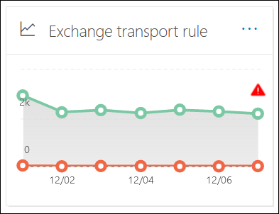
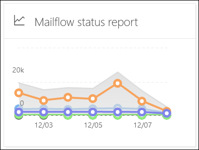

# View mail flow reports in the Reports dashboard in Security & Compliance Center

[!INCLUDE [Microsoft 365 Defender rebranding](../includes/microsoft-defender-for-office.md)]

**Applies to**
- [Exchange Online Protection](exchange-online-protection-overview.md)
- [Microsoft Defender for Office 365 plan 1 and plan 2](defender-for-office-365.md)
- [Microsoft 365 Defender](../defender/microsoft-365-defender.md)

> [!NOTE]
>
> Most of the reports in this article are also available in the Microsoft 365 Defender portal or the Exchange admin center (EAC). For more information, see the following topics:
>
> - [Mail flow reports in the new Exchange admin center](/exchange/monitoring/mail-flow-reports/mail-flow-reports)
> - [View email security reports in the Microsoft 365 Defender portal](view-email-security-reports.md)

In addition to the mail flow reports that are available in the [Mail flow dashboard](mail-flow-insights-v2.md) in the Security & Compliance Center, a variety of additional mail flow reports are available in the Reports dashboard to help you monitor your Microsoft 365 organization.

If you have the [necessary permissions](#what-permissions-are-needed-to-view-these-reports), you can view these reports in the Security & Compliance Center at <https://protection.office.com> by going to **Reports** \> **Dashboard**. To go directly to the Reports dashboard, open <https://protection.office.com/insightdashboard>.

## Connector report

> [!NOTE]
> This report has been replaced by the **Inbound messages report** and the **Outbound messages report** in the EAC. For more information, see [Inbound messages and Outbound messages reports in the new EAC](/exchange/monitoring/mail-flow-reports/mfr-inbound-messages-and-outbound-messages-reports).

## Exchange transport rule report

The **Exchange transport rule report** shows the effect of mail flow rules (also known as transport rules) on incoming and outgoing messages in your organization.

To view the report, open the Security & Compliance Center at <https://protection.office.com>, go to **Reports** \> **Dashboard** and select **Exchange Transport rule**. To go directly to the report, open <https://security.microsoft.com/reports/ETRRuleReport>.

> [!NOTE]
> Clicking on the widget for this report in the Security & Compliance Center (protection.office.com) now takes you to the full report in the Microsoft 365 Defender portal (security.microsoft.com). For details about the report, see [Exchange transport rule report](view-email-security-reports.md#exchange-transport-rule-report).

## Forwarding report

> [!NOTE]
> The **Forwarding report** is now available in the EAC. For more information, see [Auto forwarded messages report in the new EAC](/exchange/monitoring/mail-flow-reports/mfr-auto-forwarded-messages-report).

## Mailflow status report

The **Mailflow status report** is similar to the [Sent and received email report](#sent-and-received-email-report), with additional information about email allowed or blocked on the edge. This is the only report that contains edge protection information, and shows just how much email is blocked before being allowed into the service for evaluation by Exchange Online Protection (EOP). It's important to understand that if a message is sent to five recipients we count it as five different messages and not one message.

To view the report, open the [Security & Compliance Center](https://protection.office.com), go to **Reports** \> **Dashboard** and select **Mailflow status report**. To go directly to the **Mail flow status report**, open <https://security.microsoft.com/reports/mailflowStatusReport>.

> [!NOTE]
> Clicking on the widget for this report in the Security & Compliance Center (protection.office.com) now takes you to the full report in the Microsoft 365 Defender portal (security.microsoft.com). For details about the report, see [Mailflow status report](view-email-security-reports.md#mailflow-status-report).

## Sent and received email report

> [!NOTE]
> This report has been replaced by the [Mailflow status report](#mailflow-status-report).

## Top senders and recipients report

The **Top senders and recipients** report is a pie chart showing your top email senders and recipients.

To view the report, open the [Security & Compliance Center](https://protection.office.com), go to **Reports** \> **Dashboard** and select **Top senders and recipients**. To go directly to the report, open <https://protection.office.com/reportv2?id=TopSenderRecipientsATP>.

### Report view for the Top senders and recipient report

The following charts are available in the report view:

- **Show data for \> Top mail senders**
- **Show data for \> Top mail recipients**
- **Show data for \> Top spam recipients**
- **Show data for \> Top malware recipients** (EOP)
- **Show data for \> Top malware recipients (Defender for Office 365)**

The composition of the pie chart changes based on these selections.

When you hover over a wedge in the pie chart, you can see a count of messages sent or received.

If you click **Filters** in a report view, you can specify a date range with **Start date** and **End date**.

### Details table view for the Top senders and recipient report

If you click **View details table**, the information that's shown depends on the chart you were looking at:

- **Show data for \> Top mail senders**

  - **Top mail senders**
  - **Count**

- **Show data for \> Top mail recipients**

  - **Top mail recipients**
  - **Count**

- **Show data for \> Top spam recipients**

  - **Top spam recipients**
  - **Count**

- **Show data for \> Top malware recipients** (EOP)

  - **Top malware recipients**
  - **Count**

- **Show data for \> Top malware recipients (Defender for Office 365)**

  - **Top malware recipients (Defender for Office 365)**
  - **Count**

If you click **Filters** in a details table view, you can specify a date range with **Start date** and **End date**.

To go back to the report view, click **View report**.

## What permissions are needed to view these reports?

In order to view and use the reports described in this article, you need to be a member of one of the following role groups in the Security & Compliance Center:

- **Organization Management**
- **Security Administrator**
- **Security Reader**
- **Global Reader**

For more information, see [Permissions in the Security & Compliance Center](permissions-in-the-security-and-compliance-center.md).

> [!NOTE]
> Adding users to the corresponding Azure Active Directory role in the Microsoft 365 admin center gives users the required permissions in the Security & Compliance Center _and_ permissions for other features in Microsoft 365. For more information, see [About admin roles](../../admin/add-users/about-admin-roles.md).

## Related topics

[Smart reports and insights in the Security & Compliance Center](reports-and-insights-in-security-and-compliance.md)

[Mail flow insights in the Security & Compliance Center](mail-flow-insights-v2.md)

[View email security reports in the Security & Compliance Center](view-email-security-reports.md)

[View reports for Microsoft Defender for Office 365](view-reports-for-mdo.md)
