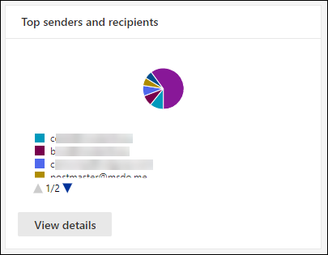

# View mail flow reports in the Reports dashboard in Security & Compliance Center

[!INCLUDE [Microsoft 365 Defender rebranding](../includes/microsoft-defender-for-office.md)]

**Applies to**
- [Exchange Online Protection](exchange-online-protection-overview.md)
- [Microsoft Defender for Office 365 plan 1 and plan 2](office-365-atp.md)
- [Microsoft 365 Defender](../mtp/microsoft-threat-protection.md)

In addition to the mail flow reports that are available in the [Mail flow dashboard](mail-flow-insights-v2.md) in the Security & Compliance Center, a variety of additional mail flow reports are available in the Reports dashboard to help you monitor your Microsoft 365 organization.

If you have the [necessary permissions](#what-permissions-are-needed-to-view-these-reports), you can view these reports in the [Security & Compliance Center](https://protection.office.com) by going to **Reports** \> **Dashboard**. To go directly to the Reports dashboard, open <https://protection.office.com/insightdashboard>.

## Connector report

The **Connector report** shows mail flow activity on the [inbound and outbound connectors](/Exchange/mail-flow-best-practices/use-connectors-to-configure-mail-flow/use-connectors-to-configure-mail-flow) that are configured for your organization.

To view the report, open the [Security & Compliance Center](https://protection.office.com), go to **Reports** \> **Dashboard** and select **Connector report**. To go directly to the report, open <https://protection.office.com/reportv2?id=ConnectorReport>.

### Report view for the Connector report

The following charts are available in report view:

- **View data by: Mail flow**: This chart shows the number of inbound and outbound messages organized by:

  - **Total**
  - **From the internet without a connector**
  - **To the internet without a connector**
  - A specific connector that you've configured.

  To isolate the data in the chart, use the **Show data for** control to select one of these options or **All mail flow**.

  

- **View data by: TLS usage**: This chart shows the percentage of Transport Layer Security (TLS) version usage for mail flow.

  To isolate the data in the chart, use the **Show data for** control to select one of the following options:

  - **All mail flow**
  - **From the internet without a connector**
  - **To the internet without a connector**
  - A specific connector that you've configured.

  

If you click **Filters** in a report view, you can specify a date range with **Start date** and **End date**.

### Details table view for the Connector report

If you click **View details table** in a report view, the following information is shown:

- **Date**
- **Connector direction and name**
- **Connector type**
- **Forced TLS?**: The value **True** or **False**.
- **No TLS** (percentage)
- **TLS 1.0** (percentage)
- **TLS 1.1** (percentage)
- **TLS 1.2** (percentage)
- **Volume**: The number of messages.

If you click **Filters** in a details table view, you can specify a date range with **Start date** and **End date**.

To go back to the report view, click **View report**.

## Exchange transport rule report

The **Exchange transport rule report** shows the effect of mail flow rules (also known as transport rules) on incoming and outgoing messages in your organization.

To view the report, open the [Security & Compliance Center](https://protection.office.com), go to **Reports** \> **Dashboard** and select **Exchange Transport rule**. To go directly to the report, open <https://protection.office.com/reportv2?id=ETRRuleReport>.

### Report view for the Exchange transport rule report

The following charts are available in report view:

- **View data by: Exchange transport rules** \> **Break down by: Direction**: This chart shows the number of **Inbound** and **Outbound** messages that were affected by transport rules.

- **View data by: Exchange transport rules** \> **Break down by: Severity**: This chart shows the number of **High severity** and **Medium severity**, and **Low severity** messages. You set the severity level as an action in the rule (**Audit this rule with severity level** or _SetAuditSeverity_). For more information, see [Mail flow rule actions in Exchange Online](//Exchange/security-and-compliance/mail-flow-rules/mail-flow-rule-actions).

- **View data by: DLP Exchange transport rules** \> **Break down by: Direction**: This chart shows the number of **Inbound** and **Outbound** messages that were affected by data loss prevention (DLP) transport rules. You can further refine the chart by selecting on of the following options:

  - **Show data for: All DLP transport rules**
  - **Show data for: Compromised users**
  - **Show data for: Low volume of content detected U.S. Patriot Act**

- **View data by: DLP Exchange transport rules** \> **Break down by: Direction**: This view shows the number of **High severity** and **Medium severity**, and **Low severity** messages that were affected by DLP transport rules. You can further refine the chart by selecting on of the following options:

  - **Show data for: All DLP transport rules**
  - **Show data for: Compromised users**
  - **Show data for: Low volume of content detected U.S. Patriot Act**

If you click **Filters** in a report view, you can modify the results with the following filters::

- **Start date** and **End date**
- Direction values
- Severity values

### Details table view for the Exchange transport rule report

If you click **View details table**, the information that's shown depends on the chart you were looking at:

- **View data by: Exchange Transport rules**:

  - **Date**
  - **Transport rule**
  - **Subject**
  - **Sender address**
  - **Recipient address**
  - **Severity**
  - **Direction**

- **View data by: DLP Exchange transport rules**:

  - **Date**
  - **DLP policy**
  - **Transport rule**
  - **Subject**
  - **Sender address**
  - **Recipient address**
  - **Severity**
  - **Direction**

If you click **Filters** in a details table view, you can modify the results with the following filters:

- **Start date** and **End date**
- Direction values
- Severity values

To go back to the report view, click **View report**.

## Forwarding report

The **Forwarding report** shows your organization's automatically forwarded messages to external domains from Exchange Online mailboxes. Forwarded messages can pose a security or compliance risk, and might indicate a compromised account.

To view the report, open the [Security & Compliance Center](https://protection.office.com), go to **Reports** \> **Dashboard** and select **Forwarding report**. To go directly to the report, open <https://protection.office.com/reportv2?id=MailFlowForwarding>.

### Report view for the Forwarding report

The following charts are available in the report view:

- **Show data for: Forwarding methods**: The following methods are shown:

  - **Transport rule**: Also known as [mail flow rules](/Exchange/security-and-compliance/mail-flow-rules/mail-flow-rules).
  - **Mailbox rule**: Also known as [Inbox rules](https://support.microsoft.com/office/c24f5dea-9465-4df4-ad17-a50704d66c59).

  

- **Show data for: Forwarding domains**: This view shows the recipient domains that are the destinations for forwarding.

  

- **Show data for: Forwarders**: The following forwarders are shown:

  - **Transport rule**
  - The mailbox that contains the forwarding Inbox rule.

  

If you click **Filters** in a report view, you can specify a date range with **Start date** and **End date**.

### Details table view for the Forwarding report

If you click **View details table** in a report view, the following information is shown:

- **Forwarders**: The value **Transport rule** or the mailbox that contains the forwarding Inbox rule.
- **Forwarding type**: The value **Mailbox rule** or **Transport rule**.
- **Recipient name**
- **Recipient domain**
- **Details**: This is the GUID value of the mail flow rule, or the RuleIdentity value of the Inbox rule.
- **Count**
- **First forward date**

If you click **Filters** in a details table view, you can specify a date range with **Start date** and **End date**.

To go back to the reports view, click **View report**.

## Mailflow status report

The **Mailflow status report** is similar to the [Sent and received email report](#sent-and-received-email-report), with additional information about email allowed or blocked on the edge. This is the only report that contains edge protection information, and shows just how much email is blocked before being allowed into the service for evaluation by Exchange Online Protection (EOP). It's important to understand that if a message is sent to five recipients we count it as five different messages and not one message.
To view the report, open the [Security & Compliance Center](https://protection.office.com), go to **Reports** \> **Dashboard** and select **Mailflow status report**. To go directly to the **Mail flow status report**, open <https://protection.office.com/mailflowStatusReport>.

### Type view for the Mailflow status report

When you open the report, the **Type** tab is selected by default. By default, this view contains a chart and a data table that's configured with the following filters:

- **Date**: The last 7 days.
- **Direction**:

  - **Inbound**
  - **Outbound**
  - **Intra-org**: this count is for messages within a tenant i.e sender abc@domain.com sends to recipient xyz@domain.com  (counted separately from **Inbound** and **Outbound**)

- **Type**:

  - **Good mail**
  - **Malware**
  - **Spam**
  - **Edge protection**
  - **Rule messages**
  - **Phishing email**

The chart is organized by the **Type** values.

You can change these filters by clicking **Filter** or by clicking a value in the chart legend.

The data table contains the following information:

- **Direction**
- **Type**
- **24 hours**
- **3 days**
- **7 days**
- **15 days**
- **30 days**

If you click **Choose a category for more details**, you can select from the following values:

- **Phishing email**: This selection takes you to the [Threat protection status report](view-email-security-reports.md#threat-protection-status-report).
- **Malware in email**: This selection takes you to the [Threat protection status report](view-email-security-reports.md#threat-protection-status-report).
- **Spam detections**: This selection takes you to the [Spam Detections report](view-email-security-reports.md#spam-detections-report).
- **Edge blocked spam**: This selection takes you to the [Spam Detections report](view-email-security-reports.md#spam-detections-report).

**Export**:

For the detail view, you can only export data for one day. So, if you want to export data for 7 days, you need to do 7 different export actions.

Each exported .csv file is limited to 150,000 rows. If the data for that day contains more than 150,000 rows, then multiple .csv files will be created.

### Direction view for the Mailflow status report

If you click the **Direction** tab, the same default filters from the **Type** view are used.

The chart is organized by **Direction** values.

You can change these filters by clicking **Filter** or by clicking a value in the chart legend. The same filters from the **Type** view are used.

The data table contains same information from the **Type** view.

The **Choose a category for more details** available selections and behavior are the same as the **Type** view.

**Export**:

For the detail view, you can only export data for one day. So, if you want to export data for 7 days, you need to do 7 different export actions.

Each exported .csv file is limited to 150,000 rows. If the data for that day contains more than 150,000 rows, then multiple .csv files will be created.

### Funnel view for the Mailflow status report

The **Funnel** view shows you how Microsoft's email threat protection features filter incoming and outgoing email in your organization. It provides details on the total email count, and how the configured threat protection features, including edge protection, anti-malware, anti-phishing, anti-spam, and anti-spoofing affect this count.

If you click the **Funnel** tab, by default, this view contains a chart and a data table that's configured with the following filters:

- **Date**: The last 7 days.

- **Direction**:

  - **Inbound**
  - **Outbound**
  - **Intra-org**: This count is for messages sent within a tenant; i.e, sender abc@domain.com sends to recipient xyz@domain.com (counted separately from Inbound and Outbound).

The aggregate view and data table view allow for 90 days of filtering.

If you click **Filter**, you can filter both the chart and the data table.

This chart shows the email count organized by:

- **Total email**
- **Email after edge protection**
- **Email after anti-malware, file reputation, file type block**
- **Email after anti-phish, URL reputation, brand impersonation, anti-spoof**
- **Email after anti-spam, bulk mail filtering**
- **Email after user and domain impersonation**1
- **Email after file and URL detonation**1
- **Email detected as benign after post-delivery protection (URL click time protection)**

1 Defender for Office 365 only

To view the email filtered by EOP or Defender for Office 365 separately, click on the value in the chart legend.

The data table contains the following information, shown in descending date order:

- **Date**
- **Total email**
- **Edge protection**
- **Anti-malware, file reputation, file type block**:
  - **File reputation**: Messages filtered due to identification of an attached file by other Microsoft customers.
  - **File type block**: Messages filtered due to the type of malicious file identified in the message.
- **Anti-phish, URL reputation, Brand impersonation, anti-spoof**:
  - **URL reputation**: Messages filtered due to the identification of the URL by other Microsoft customers.
  - **Brand impersonation**: Messages filtered due to the message coming from well-known brand impersonating senders.
  - **Anti-spoof**: Messages filtered due to the message attempting to spoof a domain that the recipient belongs to, or a domain that the message sender doesn't own.
- **Anti-spam, bulk mail filtering**:
  - **Bulk mail filtering**: Messages filtered due to an attempt to deliver bulk mail to its recipients.
- **User and domain impersonation (Defender for Office 365)**:
  - **User impersonation**: Messages filtered due to an attempt to impersonate a user (message sender) that's defined in the impersonation protection settings of an anti-phishing policy.
  - **Domain impersonation**: Messages filtered due to an attempt to impersonate a domain that's defined in the impersonation protection settings of an anti-phishing policy.
- **File and URL detonation (Defender for Office 365)**:
  - **File detonation**: Messages filtered by a Safe Attachments policy.
  - **URL detonation**: Message filtered by a Safe Links policy.
- **Post-delivery protection and ZAP (ATP), or ZAP (EOP)**: ZAP indicates zero hour auto-purge.

If you select a row in the data table, a further breakdown of the email counts are shown in the flyout.

**Export**:

After you click **Export** under **Options**, you can select one of the following values:

- **Summary (with data for last 90 days at most)**
- **Details (with data for last 30 days at most)**

Under **Date**, choose a range, and then click **Apply**. Data for the current filters will be exported to a .csv file.

Each exported .csv file is limited to 150,000 rows. If the data contains more than 150,000 rows, then multiple .csv files will be created.

 

### Tech view for the Mailflow status report

The **Tech view** is similar to the **Funnel** view, providing more granular details for the configured threat protections features. From the chart, you can see how messages are categorized at the different stages of threat protection.

If you click the **Tech view** tab, by default, this view contains a chart and a data table that's configured with the following filters:

- **Date**: The last 7 days.

- **Direction**:

  - **Inbound**
  - **Outbound**
  - **Intra-org**: this count is for messages within a tenant i.e sender abc@domain.com sends to recipient xyz@domain.com (counted separately from Inbound and Outbound)

The aggregate view and data table view allow for 90 days of filtering.

If you click **Filter**, you can filter both the chart and the data table.

This chart shows messages organized into the following categories:

- **Total email**
- **Edge allow** and **Edge filtered**
- **Not malware**, **Safe Attachments detection**\*, **Anti-malware engine detection**, and **Rule messages**
- **Not phish**, **DMARC failure**, **Impersonation detection**, **Spoof detection**, and **Phish detection**
- **No detection with URL detonation** and **URL detonation detection**\*
- **Not spam** and  **Spam**
- **Non-malicious email**, **Safe Links detection**\*, and **ZAP**

\* Defender for Office 365

When you hover over a category in the chart, you can see the number of messages in that category.

The data table contains the following information, shown in descending date order:

- **Date**
- **Total email**
- **Edge filtered**
- **Anti-malware engine, Safe Attachments, rule filtered**:
  - **Rule filtered**: Messages filtered due to  mail flow rules (also known as transport rules).
- **DMARC, impersonation, spoof, phish filtered**:
  - **DMARC**: Messages filtered due to the message failing its DMARC authentication check.
- **URL detonation detection**
- **Anti-spam filtered**
- **ZAP removed**
- **Detection by Safe Links**

If you select a row in the data table, a further breakdown of the email counts are shown in the flyout.

**Export**:

On clicking **Export**, under **Options** you can select one of the following values:

- **Summary (with data for last 90 days at most)**
- **Details (with data for last 30 days at most)**

Under **Date**, choose a range, and then click **Apply**. Data for the current filters will be exported to a .csv file.

Each exported .csv file is limited to 150,000 rows. If the data contains more than 150,000 rows, then multiple .csv files will be created.

 

## Sent and received email report

The **Sent and received email** report is a smart report that shows information about incoming and outgoing email, including spam detections, malware, and email identified as "good." The difference between this report and the [Mailflow status report](#mailflow-status-report) is: this report doesn't include data about messages blocked by edge protection.It's important to understand that if a message is sent to five recipients we count it as one message.

The aggregate view and the detail view of the report allow for 90 days of filtering.

To view the report, open the [Security & Compliance Center](https://protection.office.com), go to **Reports** \> **Dashboard** and select **Sent and received email**. To go directly to the report, open <https://protection.office.com/reportv2?id=SentAndReceivedMailATP>.

### Report view for the Sent and received email report

The following charts are available in the report view:

- **Break down by: Type**: The chart shows all available categories:

  - **Total**
  - **Good mail**
  - **Malware (anti-malware)** (EOP)
  - **Spam detections**
  - **Rule messages**
  - **Advanced malware** (Microsoft Defender for Office 365)

  When you hover over a day (data point) in the chart, you can see details for that day.

  

- **Break down by: Direction**: The chart shows **Total**, **Inbound**, and **Outbound** data. When you hover over a day (data point) in the chart, you can see details for that day.

  

- **Drill down by** \> **Malware (anti-malware)**: This selection takes you to the [Malware detections in email report](view-email-security-reports.md#malware-detections-in-email-report).

- **Drill down by** \> **Spam detections)**: This selection takes you to the [Spam Detections report](view-email-security-reports.md#spam-detections-report).

If you click **Filters** in a report view, you can modify the results with the following filters:

- **Start date** and **End date**
- Direction values
- Type values

To go back to the report view, click **View report**.

### Details table view for the Sent and received email report

If you click **View details table** in the **Break down by: Direction** or **Break down by: Direction** view, the following information is shown:

- **Date (UTC)**
- **Type**
- **Direction**
- **Message count**

If you click **Filters** in a details table view, you can modify the results with the following filters:

- **Start date** and **End date**
- Direction values
- Type values

To go back to the report view, click **View report**.

## Top senders and recipients report

The **Top senders and recipients** report is a pie chart showing your top email senders and recipients.

To view the report, open the [Security & Compliance Center](https://protection.office.com), go to **Reports** \> **Dashboard** and select **Top senders and recipients**. To go directly to the report, open <https://protection.office.com/reportv2?id=TopSenderRecipientsATP>.

### Report view for the Top senders and recipient report

The following charts are available in the report view:

- **Show data for \> Top mail senders**
- **Show data for \> Top mail recipients**
- **Show data for \> Top spam recipients**
- **Show data for \> Top malware recipients** (EOP)
- **Show data for \> Top malware recipients (Defender for Office 365)**

The composition of the pie chart changes based on these selections.

When you hover over a wedge in the pie chart, you can see a count of messages sent or received.

If you click **Filters** in a report view, you can specify a date range with **Start date** and **End date**.

### Details table view for the Top senders and recipient report

If you click **View details table**, the information that's shown depends on the chart you were looking at:

- **Show data for \> Top mail senders**

  - **Top mail senders**
  - **Count**

- **Show data for \> Top mail recipients**

  - **Top mail recipients**
  - **Count**

- **Show data for \> Top spam recipients**

  - **Top spam recipients**
  - **Count**

- **Show data for \> Top malware recipients** (EOP)

  - **Top malware recipients**
  - **Count**

- **Show data for \> Top malware recipients (Defender for Office 365)**

  - **Top malware recipients (Defender for Office 365)**
  - **Count**

If you click **Filters** in a details table view, you can specify a date range with **Start date** and **End date**.

To go back to the report view, click **View report**.

## What permissions are needed to view these reports?

In order to view and use the reports described in this article, you need to be a member of one of the following role groups in the Security & Compliance Center:

- **Organization Management**
- **Security Administrator**
- **Security Reader**
- **Global Reader**

For more information, see [Permissions in the Security & Compliance Center](permissions-in-the-security-and-compliance-center.md).

> [!NOTE]
> Adding users to the corresponding Azure Active Directory role in the Microsoft 365 admin center gives users the required permissions in the Security & Compliance Center _and_ permissions for other features in Microsoft 365. For more information, see [About admin roles](../../admin/add-users/about-admin-roles.md).

## Related topics

[Smart reports and insights in the Security & Compliance Center](reports-and-insights-in-security-and-compliance.md)

[Mail flow insights in the Security & Compliance Center](mail-flow-insights-v2.md)

[View email security reports in the Security & Compliance Center](view-email-security-reports.md)

[View reports for Microsoft Defender for Office 365](view-reports-for-atp.md)