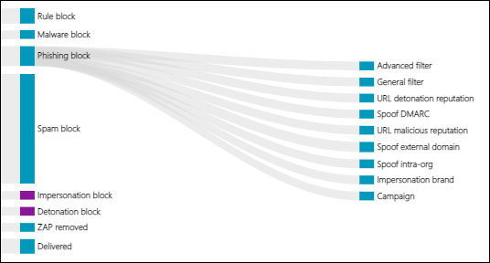
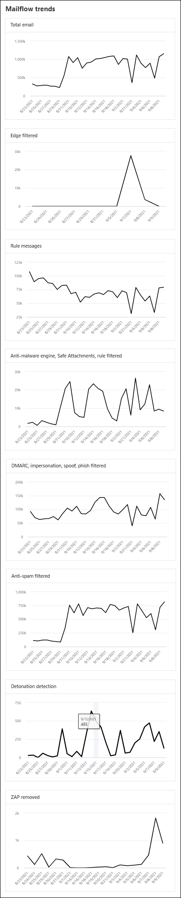
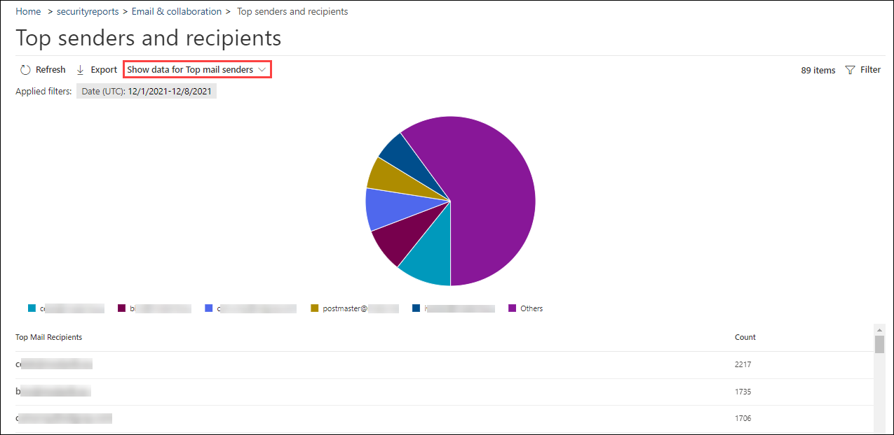

# View mail flow reports in the Reports dashboard in Security & Compliance Center

[!INCLUDE [Microsoft 365 Defender rebranding](../includes/microsoft-defender-for-office.md)]

**Applies to**
- [Exchange Online Protection](exchange-online-protection-overview.md)
- [Microsoft Defender for Office 365 plan 1 and plan 2](defender-for-office-365.md)
- [Microsoft 365 Defender](../defender/microsoft-365-defender.md)

> [!NOTE]
>
> Most of the reports in this article are also available in the Microsoft 365 Defender portal or the Exchange admin center (EAC). For more information, see the following topics:
>
> - [Mail flow reports in the new Exchange admin center](/exchange/monitoring/mail-flow-reports/mail-flow-reports)
> - [View email security reports in the Microsoft 365 Defender portal](view-email-security-reports.md)

In addition to the mail flow reports that are available in the [Mail flow dashboard](mail-flow-insights-v2.md) in the Security & Compliance Center, a variety of additional mail flow reports are available in the Reports dashboard to help you monitor your Microsoft 365 organization.

If you have the [necessary permissions](#what-permissions-are-needed-to-view-these-reports), you can view these reports in the Security & Compliance Center at <https://protection.office.com> by going to **Reports** \> **Dashboard**. To go directly to the Reports dashboard, open <https://protection.office.com/insightdashboard>.

## Connector report

> [!NOTE]
> This report has been replaced by the **Inbound messages report** and the **Outbound messages report** in the EAC. For more information, see [Inbound messages and Outbound messages reports in the new EAC](/exchange/monitoring/mail-flow-reports/mfr-inbound-messages-and-outbound-messages-reports).

## Exchange transport rule report

The **Exchange transport rule report** shows the effect of mail flow rules (also known as transport rules) on incoming and outgoing messages in your organization.

To view the report, open the Security & Compliance Center at <https://protection.office.com>, go to **Reports** \> **Dashboard** and select **Exchange Transport rule**. To go directly to the report, open <https://security.microsoft.com/reports/ETRRuleReport>.

> [!NOTE]
> Clicking on the widget for this report in the Security & Compliance Center (protection.office.com) now takes you to the full report in the Microsoft 365 Defender portal (security.microsoft.com).

On the **Exchange transport rule report** page, the available charts and data are described in the following sections.

### Chart breakdown by Direction

If you select **Chart breakdown by Direction**, the follow charts are available:

- **View data by Exchange transport rules**: The number of **Inbound** and **Outbound** messages that were affected by mail flow rules.
- **View data by DLP Exchange transport rules**: The number of **Inbound** and **Outbound** messages that were affected by data loss prevention (DLP) mail flow rules.

The following information is shown in the details table below the graph:

- **Date**
- **DLP policy** (**View data by DLP Exchange transport rules** only)
- **Transport rule**
- **Subject**
- **Sender address**
- **Recipient address**
- **Severity**
- **Direction**

You can filter both the chart and the details table by clicking **Filter** and selecting one or more of the following values in the flyout that appears:

- **Date (UTC)** **Start date** and **End date**.
- **Direction**: **Outbound** and **Inbound**.
- **Severity**: **High severity**, **Medium severity**, and **Low severity**

When you're finished configuring the filters, click **Apply**, **Cancel**, or **Clear filters**.

On the main report page, the  **[Create schedule](#schedule-report)**,  **[Request report](#request-report)**, and  **[Export](#export-report)** buttons are available.

### Chart breakdown by Severity

If you select **Chart breakdown by Severity**, the follow charts are available:

- **View data by Exchange transport rules**: The number of **High severity**, **Medium severity**, and **Low severity** messages. You set the severity level as an action in the rule (**Audit this rule with severity level** or _SetAuditSeverity_). For more information, see [Mail flow rule actions in Exchange Online](/Exchange/security-and-compliance/mail-flow-rules/mail-flow-rule-actions).

- **View data by DLP Exchange transport rules**: The number of **High severity**, **Medium severity**, and **Low severity** messages that were affected by DLP mail flow rules.

The following information is shown in the details table below the graph:

- **Date**
- **DLP policy** (**View data by DLP Exchange transport rules** only)
- **Transport rule**
- **Subject**
- **Sender address**
- **Recipient address**
- **Severity**
- **Direction**

You can filter both the chart and the details table by clicking **Filter** and selecting one or more of the following values in the flyout that appears:

- **Date (UTC)** **Start date** and **End date**
- **Direction**: **Outbound** and **Inbound**
- **Severity**: **High severity**, **Medium severity**, and **Low severity**

When you're finished configuring the filters, click **Apply**, **Cancel**, or **Clear filters**.

## Forwarding report

> [!NOTE]
> The **Forwarding report** is now available in the EAC. For more information, see [Auto forwarded messages report in the new EAC](/exchange/monitoring/mail-flow-reports/mfr-auto-forwarded-messages-report).

## Mailflow status report

The **Mailflow status report** is similar to the [Sent and received email report](#sent-and-received-email-report), with additional information about email allowed or blocked on the edge. This is the only report that contains edge protection information, and shows just how much email is blocked before being allowed into the service for evaluation by Exchange Online Protection (EOP). It's important to understand that if a message is sent to five recipients we count it as five different messages and not one message.

To view the report, open the [Security & Compliance Center](https://protection.office.com), go to **Reports** \> **Dashboard** and select **Mailflow status report**. To go directly to the **Mail flow status report**, open <https://security.microsoft.com/reports/mailflowStatusReport>.

> [!NOTE]
> Clicking on the widget for this report in the Security & Compliance Center (protection.office.com) now takes you to the full report in the Microsoft 365 Defender portal (security.microsoft.com).

### Type view for the Mailflow status report

On the **Mailflow status report** page, the **Type** tab is selected by default. The chart shows the following information for the specified date range:

- **Good mail**
- **Total**
- **Malware**
- **Phishing email**
- **Spam**
- **Edge protection**
- **Rule messages**

The details table below the graph shows the following information:

- **Direction**
- **Type**
- **24 hours**
- **3 days**
- **7 days**
- **15 days**
- **30 days**

You can filter both the chart and the details table by clicking **Filter** and selecting one or more of the following values in the flyout that appears:

- **Date (UTC)**: **Start date** and **End date**.
- **Mail direction**: **Inbound** and **Outbound**.
- **Type**:
  - **Good mail**
  - **Malware**
  - **Spam**
  - **Edge protection**
  - **Rule messages**
  - **Phishing email**

When you're finished configuring the filters, click **Apply**, **Cancel**, or **Clear filters**.

Back on the main report page, if you click **Choose a category for more details**, you can select from the following values:

- **Phishing email**: This selection takes you to the [Threat protection status report](view-email-security-reports.md#threat-protection-status-report).
- **Malware in email**: This selection takes you to the [Threat protection status report](view-email-security-reports.md#threat-protection-status-report).
- **Spam detections**: This selection takes you to the [Spam Detections report](view-email-security-reports.md#spam-detections-report).
- **Edge blocked spam**: This selection takes you to the [Spam Detections report](view-email-security-reports.md#spam-detections-report).

On the main report page, the  **[Create schedule](#schedule-report)** and  **[Export](#export-report)** buttons are available.

### Direction view for the Mailflow status report

If you click the **Direction** tab, the chart shows the following information for the specified date range:

- **Inbound**
- **Outbound**

You can filter both the chart and the details table by clicking **Filter** and selecting one or more of the following values in the flyout that appears:

- **Date (UTC)**: **Start date** and **End date**.
- **Mail direction**: **Inbound** and **Outbound**.
- **Type**:
  - **Good mail**
  - **Malware**
  - **Spam**
  - **Edge protection**
  - **Rule messages**
  - **Phishing email**

When you're finished configuring the filters, click **Apply**, **Cancel**, or **Clear filters**.

Back on the main report page, if you click **Choose a category for more details**, you can select from the following values:

- **Phishing email**: This selection takes you to the [Threat protection status report](view-email-security-reports.md#threat-protection-status-report).
- **Malware in email**: This selection takes you to the [Threat protection status report](view-email-security-reports.md#threat-protection-status-report).
- **Spam detections**: This selection takes you to the [Spam Detections report](view-email-security-reports.md#spam-detections-report).
- **Edge blocked spam**: This selection takes you to the [Spam Detections report](view-email-security-reports.md#spam-detections-report).

On the main report page, the  **Create schedule** and  **Export** buttons are available.

### Mailflow view for the Mailflow status report

The **Mailflow** view shows you how Microsoft's email threat protection features filter incoming and outgoing email in your organization. This view uses a a horizontal flow diagram (known as a _Sankey_ diagram) to provide details on the total email count, and how the configured threat protection features, including edge protection, anti-malware, anti-phishing, anti-spam, and anti-spoofing affect this count.

The aggregate view and details table view allow for 90 days of filtering.

The information in the diagram is color-coded by **EOP** or **Defender for Office 365** technologies.

The diagram is organized into the following horizontal bands:

- **Total email** band: This value is always shown first.
- **Edge block** and **Processed** band:
  - **Edge block**: Messages that are filtered at the edge and identified as Edge Protection.
  - **Processed**: Messages that are handled by the filtering stack.
- Outcomes band:
  - **Rule Block**: Messages that are processed by Exchange mail flow rules (transport rules).
  - **Malware block**: Messages that are identified as malware by various filters.\*
  - **Phish block**: Messages identified as phish during processing by various filters.\*
  - **Spam block**: Messages identified as spam during processing by various filters.\*
  - **Impersonation block**: Messages detected as user impersonation or domain impersonation in Defender for Office 365.\*
  - **Detonation block**: Messages detected during file or URL detonation by Safe Attachments policies or Safe Links policies in Defender for Office 365.\*
  - **ZAP removed**: Messages that are removed by zero-hour auto purge (ZAP).\*
  - **Delivered**: Messages delivered to users due to an allow.\*

If you hover over a horizontal band in the diagram, you'll see the number of related messages.

\* If you click on this element, the diagram is expanded to show further details. For a description of each element in the expanded nodes, see [Detection technologies](/office/office-365-management-api/office-365-management-activity-api-schema#detection-technologies).

The details table below the diagram shows the following information:

- **Date**
- **Total email**
- **Edge filtered**
- **Rule messages**
- **Anti-malware engine, Safe Attachments, rule filtered**
- **DMARC impersonation, spoof, phish filtered**
- **Detonation detection**
- **Anti-spam filtered**
- **ZAP removed**
- **Messages where not threats were detected**

If you select a row in the details table, a further breakdown of the email counts is shown in the details flyout that appears.

You can filter both the chart and the details table by clicking **Filter** and selecting one or more of the following values in the flyout that appears:

- **Date (UTC)** **Start date** and **End date**.
- **Direction**: **Outbound** and **Inbound**.

When you're finished configuring the filters, click **Apply**, **Cancel**, or **Clear filters**.

Back on the main report page, you can click **Show trends** to see trend graphs in the **Mailflow trends** flyout that appears.

On the main report page, the  **Export** button is available.

## Sent and received email report

> [!NOTE]
> This report has been replaced by the [Mailflow status report](#mailflow-status-report).

## Top senders and recipients report

The **Top senders and recipients** report is a pie chart showing your top email senders and recipients.

To view the report, open the [Security & Compliance Center](https://protection.office.com), go to **Reports** \> **Dashboard** and select **Top senders and recipients**. To go directly to the report, open <https://protection.office.com/reportv2?id=TopSenderRecipientsATP>.

### Report view for the Top senders and recipient report

The following charts are available in the report view:

- **Show data for \> Top mail senders**
- **Show data for \> Top mail recipients**
- **Show data for \> Top spam recipients**
- **Show data for \> Top malware recipients** (EOP)
- **Show data for \> Top malware recipients (Defender for Office 365)**

The composition of the pie chart changes based on these selections.

When you hover over a wedge in the pie chart, you can see a count of messages sent or received.

If you click **Filters** in a report view, you can specify a date range with **Start date** and **End date**.

### Details table view for the Top senders and recipient report

If you click **View details table**, the information that's shown depends on the chart you were looking at:

- **Show data for \> Top mail senders**

  - **Top mail senders**
  - **Count**

- **Show data for \> Top mail recipients**

  - **Top mail recipients**
  - **Count**

- **Show data for \> Top spam recipients**

  - **Top spam recipients**
  - **Count**

- **Show data for \> Top malware recipients** (EOP)

  - **Top malware recipients**
  - **Count**

- **Show data for \> Top malware recipients (Defender for Office 365)**

  - **Top malware recipients (Defender for Office 365)**
  - **Count**

If you click **Filters** in a details table view, you can specify a date range with **Start date** and **End date**.

To go back to the report view, click **View report**.

## What permissions are needed to view these reports?

In order to view and use the reports described in this article, you need to be a member of one of the following role groups in the Security & Compliance Center:

- **Organization Management**
- **Security Administrator**
- **Security Reader**
- **Global Reader**

For more information, see [Permissions in the Security & Compliance Center](permissions-in-the-security-and-compliance-center.md).

> [!NOTE]
> Adding users to the corresponding Azure Active Directory role in the Microsoft 365 admin center gives users the required permissions in the Security & Compliance Center _and_ permissions for other features in Microsoft 365. For more information, see [About admin roles](../../admin/add-users/about-admin-roles.md).

## Related topics

[Smart reports and insights in the Security & Compliance Center](reports-and-insights-in-security-and-compliance.md)

[Mail flow insights in the Security & Compliance Center](mail-flow-insights-v2.md)

[View email security reports in the Security & Compliance Center](view-email-security-reports.md)

[View reports for Microsoft Defender for Office 365](view-reports-for-mdo.md)
