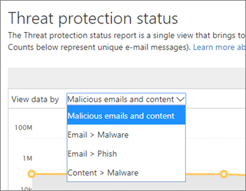
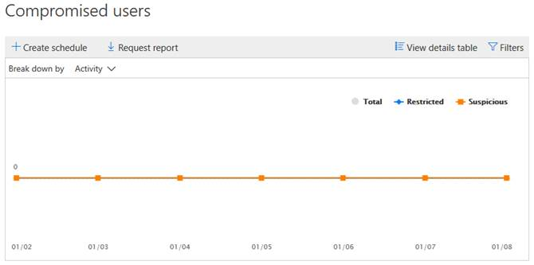

# View reports for Office 365 Advanced Threat Protection

If your organization has [Office 365 Advanced Threat Protection](office-365-atp.md) (ATP) and you have the [necessary permissions](#what-permissions-are-needed-to-view-the-atp-reports), you can use several ATP reports in the Security &amp; Compliance Center. (Go to **Reports** \> **Dashboard**.)
  

  
ATP reports include the following:
- [Threat Protection Status report](#threat-protection-status-report)
- [ATP File Types report](#atp-file-types-report)
- [ATP Message Disposition report](#atp-message-disposition-report)
- either [real-time detections or Explorer](threat-explorer.md) (depending on whether you have Office 365 ATP Plan 1 or 2)
- ... [and more](#additional-reports-to-view). 

Read this article to get an overview of ATP reports and how to use them.
  
## Threat Protection Status report

The **Threat Protection Status** report is a single view that brings together information about malicious content and malicious email detected and blocked by [Exchange Online Protection](exchange-online-protection-overview.md) (EOP) and [Office 365 ATP](office-365-atp.md). This report is useful for viewing detections over time (up to 90 days), and it enables security administrators to identify trends or determine whether policies need adjustments. 

The report provides an aggregated count of unique email messages with malicious content, such as files or website addresses (URLs) that were blocked by the anti-malware engine, [zero-hour auto purge (ZAP)](zero-hour-auto-purge.md), and ATP features like [ATP Safe Links](atp-safe-links.md), [ATP Safe Attachments](atp-safe-attachments.md), and [ATP anti-phishing capabilities](atp-anti-phishing.md). 

Filters and breakdowns of the information allow for more granular categorizations of the information in this report. Specifically, there is a 'break down by' menu included for *Email > Phish* and *Email > Malware views*. It will break down the data into:

| |  |
|---------|---------|
|By detection type    | What policy helped catch these threats?         |
|By detection technology     | What underlying Microsoft technology caught the threat?        |
|By delivery status     | What happened to the email messages detected as threats?         |
| | |

> [!TIP]
> Both the Email > Phish | Malware views have granular breakdowns for the detection technologies shown, with categories like *ATP-generated file reputation*, *File detonation*, *URL detonation*, *Anti-spoof: DMARC failure*, for example, helpful in pinpointing exactly which feature led your organization to catch threats.

These views give you the option to export, via a button click (in Email > Phish, Email > Malware, and Content > Malware views). The aggregated data exported to your computer can be opened in Excel.

The Overview and Emails views will display information within hours of processing rather than in 24 hours (demand re. increased speeds here has been a clear signal)!

> [!NOTE]
> A Threat Protection Status report is available to customers who have either [Office 365 ATP](office-365-atp.md) or [Exchange Online Protection](exchange-online-protection-eop.md) (EOP); however, the information that is displayed in the Threat Protection Status report for ATP customers will likely contain different data than what EOP customers might see. For example, the Threat Protection Status report for ATP customers will contain information about [malicious files detected in SharePoint Online, OneDrive, or Microsoft Teams](atp-for-spo-odb-and-teams.md). Such information is specific to ATP, so customers who have EOP but not ATP will not see those details in their Threat Protection Status report.
  
To view the Threat Protection Status report, in the [Security &amp; Compliance Center](https://protection.office.com), go to **Reports** \> **Dashboard** \> **Threat Protection Status**.
  

  
To get detailed status for a day, hover over the graph.
  

  
By default, the Threat Protection Status report shows data for the past seven days. However, you can choose **Filters** and change the date range to view data for up to 90 days. (If you are using a trial subscription, you might be limited to 30 days' of data.)
  

  
You can also use the **View data by** menu to change what information is displayed in the report. 
  

## URL Protection Status report

This report is based data collected, and threats detected, per click (whereas most other email threat related reports are per message data). This report is designed to show threats that come from hyperlinks in email messages and documents, per click. There are two views:

|  |  |
|---------|---------|
|URL click protection action   | See the number of URLs blocked, blocked but overridden with a click-through by a user, overridden with a click-through by a user, and allowed.        |
|URL click by application     | See the application from which the URL was clicked.        |
|  |  |

In the details table, you'll be able to see more information regarding click time and user information. Finally, keep in mind the URL Protection Status report shows the protection from ATP Safe Links feature, so only customers who have enabled ATP Safe Links will see data reflected on this report.

> [!NOTE]
> This is a *protection trend report*, meaning data represents trends in a larger dataset. Reporting isn't available in real time here. For real time URL click data, please continue to use URL Trace.

## Compromised Users report

This report, available to anyone with Exchange Online Protection, shows the number of user accounts marked as Suspicious or Restricted users, data particularly useful as accounts enter either of the states that indicate the user account may be problematic, or even compromised. With frequent use, the Compromised User report can spot spikes, and even trends, in accounts marked in suspicious or restricted states, giving evidence there could be an issue with security and the wellness of your tenant.

## ATP File Types report

The **ATP File Types** report shows you the type of files detected as malicious by [ATP Safe Attachments](atp-safe-attachments.md).
  
To view this report, in the [Security &amp; Compliance Center](https://protection.office.com), go to **Reports** \> **Dashboard** \> **ATP File Types**.
  

  
When you hover over a particular day, you can see the breakdown of types of malicious files that were detected by [ATP Safe Attachments](atp-safe-attachments.md) and [anti-spam &amp; anti-malware protection in Office 365](anti-spam-and-anti-malware-protection.md).
  

  
## ATP Message Disposition report

The **ATP Message Disposition** report shows you the actions that were taken for email messages that were detected as having malicious content. 
  
To view this report, in the [Security &amp; Compliance Center](https://protection.office.com), go to **Reports** \> **Dashboard** \> **ATP Message Disposition**.
  

  
When you hover over a bar in the chart, you can see what actions were taken for detected email for that day.
  

  
## Additional reports to view

In addition to the ATP reports described in this article, several other reports are available, as described in the following table:

|Report(s)  |Details  |
|---------|---------|
|**Explorer** or **real-time detections** (Office 365 ATP Plan 2 customers have Explorer; Office 365 ATP Plan 1 customers have real-time detections.)| [Threat Explorer (and real-time detections)](threat-explorer.md)       |
|**Email security reports**, such as a Top Senders and Recipients report, a Spoof Mail report, and a Spam Detections report. | [View email security reports in the Security &amp; Compliance Center](view-email-security-reports.md)        |
|**ATP Safe Links URL trace** (This is a report you generate by using PowerShell.) This report shows the results of ATP Safe Links actions over the past seven (7) days. |[Get-UrlTrace cmdlet reference](https://docs.microsoft.com/powershell/module/exchange/advanced-threat-protection/get-urltrace) |
|**EOP and ATP results** (This is a custom report you generate by using PowerShell). This report contains information, such as Domain, Date, Event Type, Direction, Action, and Message Count.  | [Get-MailTrafficATPReport cmdlet reference](https://docs.microsoft.com/powershell/module/exchange/advanced-threat-protection/get-mailtrafficatpreport) |
|**EOP and ATP detections** (This is a custom report you generate by using PowerShell). This report contains details about malicious files or URLs, phishing attempts, impersonation, and other potential threats in email or files.   | [Get-MailDetailATPReport cmdlet reference](https://docs.microsoft.com/powershell/module/exchange/advanced-threat-protection/get-maildetailatpreport)        |

  
## What permissions are needed to view the ATP reports?

In order to view and use the reports described in this article, **you must have an appropriate role assigned for both the Security &amp; Compliance Center and the Exchange admin center**.

- For the Security &amp; Compliance Center, you must have one of the following roles assigned:
    - Organization Management
    - Security Administrator (this can be assigned in the Azure Active Directory admin center ([https://aad.portal.azure.com](https://aad.portal.azure.com)))
    - Security Reader

- For Exchange Online, you must have one of the following roles assigned in either the Exchange admin center ([https://outlook.office365.com/ecp](https://outlook.office365.com/ecp)) or with PowerShell cmdlets (See [Exchange Online PowerShell](https://docs.microsoft.com/powershell/exchange/exchange-online/exchange-online-powershell)):
    - Organization Management
    - View-only Organization Management
    - View-Only Recipients role
    - Compliance Management

To learn more, see the following resources:

- [Permissions in the Office 365 Security &amp; Compliance Center](permissions-in-the-security-and-compliance-center.md)

- [Feature permissions in Exchange Online](https://docs.microsoft.com/exchange/permissions-exo/feature-permissions)
   
## What if the reports aren't showing data?

If you are not seeing data in your ATP reports, double-check that your policies are set up correctly. Your organization must have [ATP Safe Links policies](set-up-atp-safe-links-policies.md) and [ATP Safe Attachments policies](set-up-atp-safe-attachments-policies.md) defined in order for ATP protection to be in place. Also see [Anti-spam and anti-malware protection in Office 365](anti-spam-and-anti-malware-protection.md).
  
## Related topics

[Reports and insights in the Office 365 Security &amp; Compliance Center](reports-and-insights-in-security-and-compliance.md)
  
[Create a schedule for a report in the Security &amp; Compliance Center](create-a-schedule-for-a-report.md)
  
[Set up and download a custom report in the Security &amp; Compliance Center](set-up-and-download-a-custom-report.md)
  

