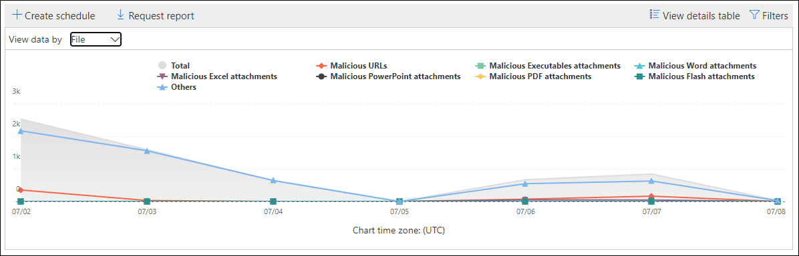
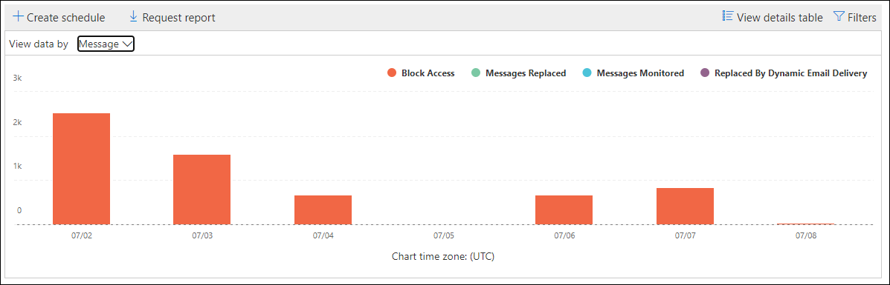

# View reports for Microsoft Defender for Office 365

[!INCLUDE [Microsoft 365 Defender rebranding](../includes/microsoft-defender-for-office.md)]

Microsoft Defender for Office 365 organizations (for example, Microsoft 365 E5 subscriptions or Microsoft Defender for Office 365 Plan 1 or Microsoft Defender for Office 365 Plan 2 add-ons) contain a variety of security-related reports. If you have the [necessary permissions](#what-permissions-are-needed-to-view-the-defender-for-office-365-reports), you can view these reports in the Security & Compliance Center by going to **Reports** \> **Dashboard**. To go directly to the Reports dashboard, open <https://protection.office.com/insightdashboard>.

## Defender for Office 365 file types report

The **Defender for Office 365 file types report** report shows you the type of files detected as malicious by [Safe Attachments](atp-safe-attachments.md).

 The aggregate view of the report allows for 90 days of filtering, while the detail view only allows for 10 days of filtering.

To view the report, open the [Security & Compliance Center](https://protection.office.com), go to **Reports** \> **Dashboard** and select **Defender for Office 365 file types**. To go directly to the report, open <https://protection.office.com/reportv2?id=ATPFileReport>.

> [!NOTE]
> The information in this report is also available in the [Defender for Office 365 message disposition report](#defender-for-office-365-message-disposition-report).

### Report view for the Defender for Office 365 file types report

The following views are available:

- **View data by: File**: The chart contains the following information:

  - **Malicious Excel attachments**
  - **Malicious Flash attachments**
  - **Malicious PDF attachments**
  - **Malicious PowerPoint attachments**
  - **Malicious URLs**
  - **Malicious Word attachments**
  - **Malicious executable attachments**
  - **Others**

  When you hover over a particular day (data point), you can see the breakdown of types of malicious files that were detected by [Safe Attachments](atp-safe-attachments.md) and [anti-malware protection in EOP](anti-malware-protection.md).

  

  If you click **Filters**, you can modify the report with the following filters:

  - **Start date** and **End date**
  - The same file type values that are visible in the chart.

- **View data by: Message**: The chart contains the following information:

  - **Block access**
  - **Messages replaced**
  - **Messages monitored**
  - **Replaced by Dynamic Email Delivery**: For more information, see [Dynamic Delivery in Safe Attachments policies](atp-safe-attachments.md#dynamic-delivery-in-safe-attachments-policies).

  

  If you click **Filters**, you can modify the report with the following filters:

  - **Start date** and **End date**
  - The same message disposition values that are available in the chart, and the additional **Messages passed** value.

### Details table view for the Defender for Office 365 file types report

If you click **View details table**, the report provides a near-real-time view of all clicks that happen within the organization for the last 10 days. The information that's shown depends on the chart you were looking at:

- **View data by: File**:

  - **Date**
  - **Recipient address**
  - **Sender address**
  - **Message ID**: Available in the **Message-ID** header field in the message header and should be unique. An example value is `<08f1e0f6806a47b4ac103961109ae6ef@server.domain>` (note the angle brackets).
  - **File**

  If you click **Filters**, you can modify the report with the following filters:

  - **Start date** and **End date**
  - The same file type values that are visible in the chart.

- **View data by: Message**:

  - **Date**
  - **Recipient address**
  - **Sender address**
  - **Message ID**
  - **File**
  - **Subject**

  If you click **Filters**, you can modify the results with the following filters:

  - **Start date** and **End date**
  - The same message disposition values that are available in the chart, and the additional **Messages passed** value.

To get back to the reports view, click **View report**.

## Defender for Office 365 message disposition report

The **ATP Message Disposition** report shows you the actions that were taken for email messages that were detected as having malicious content.

To view the report, open the [Security & Compliance Center](https://protection.office.com), go to **Reports** \> **Dashboard** and select **Defender for Office 365 message disposition**. To go directly to the report, open <https://protection.office.com/reportv2?id=ATPMessageReport>.

> [!NOTE]
> The information in this report is also available in the [Defender for Office 365 file types report](#defender-for-office-365-file-types-report).

### Report view for the Defender for Office 365 message disposition report

The following views are available:

- **View data by: Message**: The chart contains the following information:

  - **Block access**
  - **Messages replaced**
  - **Messages monitored**
  - **Replaced by Dynamic Email Delivery**: For more information, see [Dynamic Delivery in Safe Attachments policies](atp-safe-attachments.md#dynamic-delivery-in-safe-attachments-policies).

  

  If you click **Filters**, you can modify the report with the following filters:

  - **Start date** and **End date**
  - The same message disposition values that are available in the chart, and the additional **Messages passed** value.

- **View data by: File**: The chart contains the following information:

  - **Malicious Excel attachments**
  - **Malicious Flash attachments**
  - **Malicious PDF attachments**
  - **Malicious PowerPoint attachments**
  - **Malicious URLs**
  - **Malicious Word attachments**
  - **Malicious executable attachments**
  - **Others**

  When you hover over a particular day (data point), you can see the breakdown of types of malicious files that were detected by [Safe Attachments](atp-safe-attachments.md) and [anti-malware protection in EOP](anti-malware-protection.md).

  

  If you click **Filters**, you can modify the report with the following filters:

  - **Start date** and **End date**
  - The same file type values that are visible in the chart.

### Details table view for the Defender for Office 365 message disposition report

If you click **View details table**, the report provides a near-real-time view of all clicks that happen within the organization for the last 10 days. The information that's shown depends on the chart you were looking at:

- **View data by: Message**:

  - **Date**
  - **Recipient address**
  - **Sender address**
  - **Message ID**
  - **File**
  - **Subject**

  If you click **Filters**, you can modify the results with the following filters:

  - **Start date** and **End date**
  - The same message disposition values that are available in the chart, and the additional **Messages passed** value.

- **View data by: File**:

  - **Date**
  - **Recipient address**
  - **Sender address**
  - **Message ID**
  - **File**

  If you click **Filters**, you can modify the report with the following filters:

  - **Start date** and **End date**
  - The same file type values that are visible in the chart.

To get back to the reports view, click **View report**.

## Mail latency report

The **Mail latency report** shows you an aggregate view of the mail delivery and detonation latency experienced within your organization. Client side and network latency is not included.

To view the report, open the [Security & Compliance Center](https://protection.office.com), go to **Reports** \> **Dashboard** and select **Mail latency report**. To go directly to the report, open <https://protection.office.com/mailLatencyReport?viewid=P50>.

### Report view for the Mail latency report

When you open the report, the **50th percentiles** tab is selected by default.

By default, this view contains a chart that's configured with the following filters:

- **Date**: The last 7 days
- **Message View**:
  - Detonated messages

The 50th percentile show that half of all the messages delivered and detonated on that day experienced a latency either equal to or less than this value.

This chart shows messages organized into the following categories:

- **Mail delivery latency**
- **Detonation latency**

When you hover over a category in the chart, you can see a breakdown of the latency in each category.

If you click **Filter** in the report view, you can modify the results with the following filters:

- All messages
- Messages that contain attachments or URLs

If you click the **90th percentiles** tab or the **99th percentiles** tab, the same default filters from the **50th percentiles** view are used.

The 90th percentile shows that only 10% of all the messages delivered on that day experienced a latency above this value while the 99th percentile tab shows the longest latency experienced for that particular day.

### Details table view for the Mail latency report

The details table shows a list view of the percentile, total message count and overall latency values experienced for that day.

The following information is shown in the table view:

- **Date**
- **Percentiles**
- **Message count**
- **Overall latency**

The details table contains same information on each tab.

## Threat protection status report

The **Threat protection status** report is a single view that brings together information about malicious content and malicious email detected and blocked by [Exchange Online Protection](exchange-online-protection-overview.md) (EOP) and Microsoft Defender for Office 365. For more information, see [Threat protection status report](view-email-security-reports.md#threat-protection-status-report).

## URL threat protection report

The **URL threat protection report** provides summary and trend views for threats detected and actions taken on URL clicks as part of [Safe Links](atp-safe-links.md). This report will not have click data from users where the Safe Links policy applied has the **Do not track user clicks** option selected.

To view the report, open the [Security & Compliance Center](https://protection.office.com), go to **Reports** \> **Dashboard** and select **URL protection report**. To go directly to the report, open <https://protection.office.com/reportv2?id=URLProtectionActionReport>.

> [!NOTE]
> This is a *protection trend report*, meaning data represents trends in a larger dataset. As a result, the data in the aggregate view is not available in real time here, but the data in the details table view is, so you may see a slight discrepancy between the two views.

### Report view for the URL threat protection report

The **URL threat protection** report has two aggregated views that are refreshed once every four hours that shows data for the last 90 days:

- **URL click protection action**: Shows the number of URL clicks by users in the organization and the results of the click:

  - **Blocked** (the user was blocked from navigating to the URL)
  - **Blocked and clicked through**
  - **Clicked through during scan**

  A click indicates that the user has clicked through the block page to the malicious website (admins can disable click through in Safe Links policies).

  If you click **Filters**, you can modify the report with the following filters:

  - **Start date** and **End date**
  - The available click protection actions, plus the value **Allowed** (the user was allowed to navigate to the URL).

  

- **URL click by application**: Shows the number of URL clicks by applications that support Safe Links:

  - **Email client**
  - **PowerPoint**
  - **Word**
  - **Excel**
  - **OneNote**
  - **Visio**
  - **Teams**
  - **Other**

  If you click **Filters**, you can modify the report with the following filters:

  - **Start date** and **End date**
  - The available applications.

### Details table view for the URL threat protection report

If you click **View details table**, the report provides a near-real-time view of all clicks that happen within the organization for the last 7 days with the following details:

- **Click time**
- **User**
- **URL**
- **Action**
- **App**

If you click **Filters** in the details table view, you can filter by the same criteria as in the report view, and also by **Domains** or **Recipients** separated by commas.

To get back to the reports view, click **View report**.

## Additional reports to view

In addition to the reports described in this topic, several other reports are available, as described in the following table:

****

|Report|Topic|
|---|---|
|**Explorer** (Microsoft Defender for Office 365 Plan 2) or **real-time detections** (Microsoft Defender for Office 365 Plan 1)|[Threat Explorer (and real-time detections)](threat-explorer.md)|
|**Email security reports**, such as the Top senders and recipients report, the Spoof mail report, and the Spam detections report.|[View email security reports in the Security & Compliance Center](view-email-security-reports.md)|
|**Mail flow reports**, such as the Forwarding report, the Mailflow status report, and the Top senders and recipients report.|[View mail flow reports in the Security & Compliance Center](view-mail-flow-reports.md)|
|**URL trace for Safe Links** (PowerShell only). The output of this cmdlet shows you the results of Safe Links actions over the past seven days.|[Get-UrlTrace](https://docs.microsoft.com/powershell/module/exchange/get-urltrace)|
|**Mail traffic results for EOP and Microsoft Defender for Office 365** (PowerShell only). The output of this cmdlet contains information about Domain, Date, Event Type, Direction, Action, and Message Count.|[Get-MailTrafficATPReport](https://docs.microsoft.com/powershell/module/exchange/get-mailtrafficatpreport)|
|**Mail detail reports for EOP and Defender for Office 365 detections** (PowerShell only). The output of this cmdlet contains details about malicious files or URLs, phishing attempts, impersonation, and other potential threats in email or files.|[Get-MailDetailATPReport](https://docs.microsoft.com/powershell/module/exchange/get-maildetailatpreport)|
|

## What permissions are needed to view the Defender for Office 365 reports?

In order to view and use the reports described in this topic, **you must have an appropriate role assigned for both the Security &amp; Compliance Center and the Exchange admin center**.

- For the Security & Compliance Center, you must have one of the following roles assigned:

  - Organization Management
  - Security Administrator (this can be assigned in the Azure Active Directory admin center ([https://aad.portal.azure.com](https://aad.portal.azure.com)))
  - Security Operator (this can be assigned in the Azure Active Directory admin center ([https://aad.portal.azure.com](https://aad.portal.azure.com)))
  - Security Reader

- For Exchange Online, you must have one of the following roles assigned in either the Exchange admin center ([https://outlook.office365.com/ecp](https://outlook.office365.com/ecp)) or with PowerShell cmdlets (See [Exchange Online PowerShell](https://docs.microsoft.com/powershell/exchange/exchange-online-powershell)):

  - Organization Management
  - View-only Organization Management
  - View-Only Recipients role
  - Compliance Management

To learn more, see the following resources:

- [Permissions in the Security & Compliance Center](permissions-in-the-security-and-compliance-center.md)

- [Feature permissions in Exchange Online](https://docs.microsoft.com/exchange/permissions-exo/feature-permissions)

## What if the reports aren't showing data?

If you are not seeing data in your Defender for Office 365 reports, double-check that your policies are set up correctly. Your organization must have [Safe Links policies](set-up-atp-safe-links-policies.md) and [Safe Attachments policies](set-up-atp-safe-attachments-policies.md) defined in order for Defender for Office 365 protection to be in place. Also see [Anti-spam and anti-malware protection](anti-spam-and-anti-malware-protection.md).

## Related topics

[Smart reports and insights in the Security & Compliance Center](reports-and-insights-in-security-and-compliance.md)
  
[Role permissions (Azure Active Directory](https://docs.microsoft.com/azure/active-directory/users-groups-roles/directory-assign-admin-roles#role-permissions)
