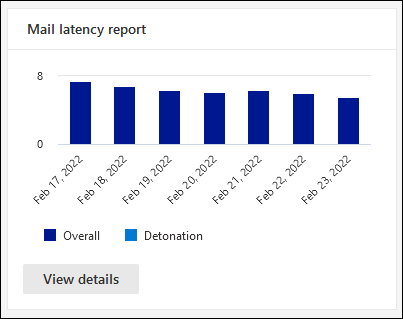
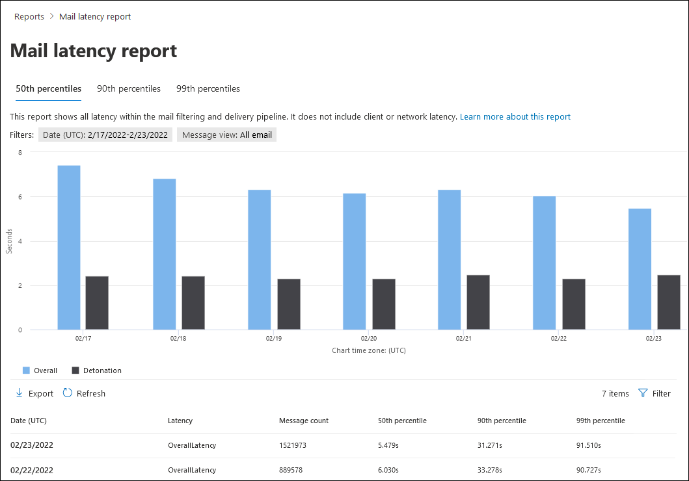
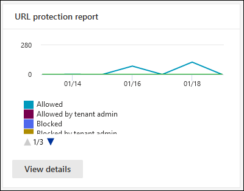
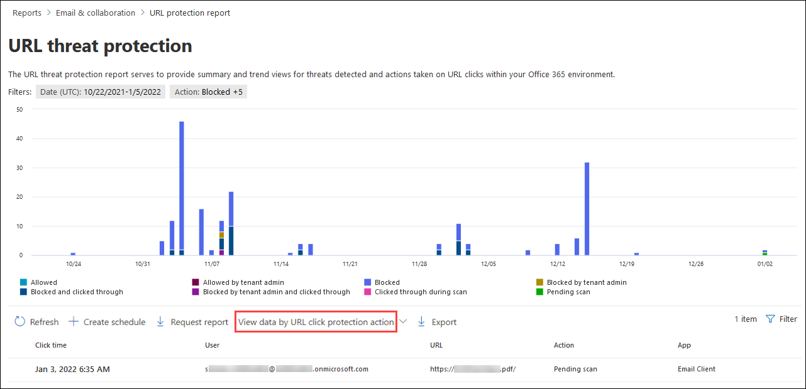
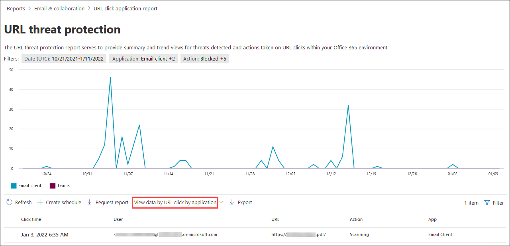

# View Defender for Office 365 reports in the Microsoft 365 Defender portal

[!INCLUDE [Microsoft 365 Defender rebranding](../includes/microsoft-defender-for-office.md)]

**Applies to**
- [Microsoft Defender for Office 365 plan 1 and plan 2](defender-for-office-365.md)
- [Microsoft 365 Defender](../defender/microsoft-365-defender.md)

Microsoft Defender for Office 365 organizations (for example, Microsoft 365 E5 subscriptions or Microsoft Defender for Office 365 Plan 1 or Microsoft Defender for Office 365 Plan 2 add-ons) contain a variety of security-related reports. If you have the [necessary permissions](#what-permissions-are-needed-to-view-the-defender-for-office-365-reports), you can view these reports in the Microsoft 365 Defender portal by going to **Reports** \> **Email & collaboration** \> **Email & collaboration reports**. To go directly to the **Email & collaboration reports** page, open <https://security.microsoft.com/emailandcollabreport>.

> [!NOTE]
>
> Email security reports that don't require Defender for Office 365 are described in [View email security reports in the Microsoft 365 Defender portal](view-email-security-reports.md).
>
> Reports that are related to mail flow are now in the Exchange admin center (EAC). For more information about these reports, see [Mail flow reports in the new Exchange admin center](/exchange/monitoring/mail-flow-reports/mail-flow-reports).

## Safe Attachments file types report

> [!NOTE]
> The **Safe Attachments file types report** will eventually go away. The same information is available in the [Threat protection status report](#threat-protection-status-report).

## Safe Attachments message disposition report

> [!NOTE]
> The **Safe Attachments message disposition report** will eventually go away. The same information is available in the [Threat protection status report](#threat-protection-status-report).

## Mail latency report

The **Mail latency report** shows you an aggregate view of the mail delivery and detonation latency experienced within your organization. Mail delivery times in the service are affected by a number of factors, and the absolute delivery time in seconds is often not a good indicator of success or a problem. A slow delivery time on one day might be considered an average delivery time on another day, or vice-versa. This tries to qualify message delivery based on statistical data about the observed delivery times of other messages.

Client side and network latency are not included.

To view the report, open the [Microsoft 365 Defender portal](https://security.microsoft.com), go to **Reports** \> **Email & collaboration** \> **Email & collaboration reports**. On the **Email & collaboration reports** page, find **Mail latency report** and then click **View details**. To go directly to the report, open <https://security.microsoft.com/mailLatencyReport>.

On the **Mail latency report** page, the following tabs are available on the **Mail latency report** page:

- **50th percentile**: This is the middle for message delivery times. You can consider this value as an average delivery time. This tab is selected by default.
- **90th percentile**: This indicates a high latency for message delivery. Only 10% of messages took longer than this value to deliver.
- **99th percentile**: This indicates the highest latency for message delivery.

Regardless of the tab you select, the chart shows messages organized into the following categories:

- **Mail delivery latency**
- **Detonations**

When you hover over a category in the chart, you can see a breakdown of the latency in each category.

If you click **Filter**, you can filter both the chart and the details table by the following values:

- **Date (UTC)**: **Start date** and **End date**
- **Message view**: One of the following values:
  - **All messages**
  - **Messages that contain attachments or URLs**
  - **Detonated messages**

When you're finished configuring the filters, click **Apply**, **Cancel**, or **Clear filters**.

In the details table below the chart, the following information is available:

- **Date (UTC)**
- **Percentiles**: **50**, **90**, or **99**
- **Message count**
- **Overall latency**

## Threat protection status report

The **Threat protection status** report is a single view that brings together information about malicious content and malicious email detected and blocked by [Exchange Online Protection](exchange-online-protection-overview.md) (EOP) and Microsoft Defender for Office 365. For more information, see [Threat protection status report](view-email-security-reports.md#threat-protection-status-report).

## URL threat protection report

The **URL threat protection report** provides summary and trend views for threats detected and actions taken on URL clicks as part of [Safe Links](safe-links.md). This report will not have click data from users where the Safe Links policy applied has the **Do not track user clicks** option selected.

To view the report, open the [Microsoft 365 Defender portal](https://security.microsoft.com), go to **Reports** \> **Email & collaboration** \> **Email & collaboration reports**. On the **Email & collaboration reports** page, find **URL protection page** and then click **View details**. To go directly to the report, open <https://security.microsoft.com/reports/URLProtectionActionReport>.

The available views on the **URL threat protection** report page are described in the following sections.

> [!NOTE]
> This is a *protection trend report*, meaning data represents trends in a larger dataset. As a result, the data in the charts is not available in real time here, but the data in the details table is, so you may see a slight discrepancy between the two. The charts are refreshed once every four hours and contain data for the last 90 days.

### View data by URL click protection action

The **View data by URL click protection action** view shows the number of URL clicks by users in the organization and the results of the click:

- **Allowed**: The user was allowed to navigate to the URL.
- **Blocked**: The user was blocked from navigating to the URL.
- **Blocked and clicked through**: The user has chosen to continue navigating to the URL.
- **Clicked through during scan**: The user has clicked on the link before the scan was complete.

A click indicates that the user has clicked through the block page to the malicious website (admins can disable click through in Safe Links policies).

If you click **Filters**, you can modify the report and the details table by selecting one or more of the following values in the flyout that appears:

- **Date (UTC)**: **Start date** and **End date**
- **Detection**:
  - **Allowed**
  - **Blocked**
  - **Blocked and clicked through**
  - **Clicked through during scan**
- **Domains**: The URL domains listed in the report results.
- **Recipients**

When you're finished configuring the filters, click **Apply**, **Cancel**, or **Clear filters**.

The details table below the chart provides the following near-real-time view of all clicks that happened within the organization for the last 7 days:

- **Click time**
- **User**
- **URL**
- **Action**
- **App**

### View data by URL click by application

The **View data by URL click by application** view shows the number of URL clicks by apps that support Safe Links:

- **Email client**
- **PowerPoint**
- **Word**
- **Excel**
- **OneNote**
- **Visio**
- **Teams**
- **Others**

If you click **Filters**, you can modify the report and the details table by selecting one or more of the following values in the flyout that appears:

- **Date (UTC)**: **Start date** and **End date**
- **Detection**: Available apps from the chart.
- **Domains**: The URL domains listed in the report results.
- **Recipients**

When you're finished configuring the filters, click **Apply**, **Cancel**, or **Clear filters**.

The details table below the chart provides the following near-real-time view of all clicks that happened within the organization for the last 7 days:

- **Click time**
- **User**
- **URL**
- **Action**
- **App**

## Additional reports to view

In addition to the reports described in this article, several other reports are available, as described in the following table:

 

****

|Report|Topic|
|---|---|
|**Explorer** (Microsoft Defender for Office 365 Plan 2) or **real-time detections** (Microsoft Defender for Office 365 Plan 1)|[Threat Explorer (and real-time detections)](threat-explorer.md)|
|Email security reports that don't require Defender for Office 365|[View email security reports in the Microsoft 365 Defender portal](view-email-security-reports.md)|
|Mail flow reports in the Exchange admin center (EAC)|[Mail flow reports in the new Exchange admin center](/exchange/monitoring/mail-flow-reports/mail-flow-reports)|
|

PowerShell reporting cmdlets:

 

****

|Report|Topic|
|---|---|
|Top senders and recipients|[Get-MailTrafficTopReport](/powershell/module/exchange/get-mailtraffictopreport) 
 [Get-MailTrafficSummaryReport](/powershell/module/exchange/get-mailtrafficsummaryreport)|
|Top malware|[Get-MailTrafficSummaryReport](/powershell/module/exchange/get-mailtrafficsummaryreport)|
|Mail traffic|[Get-MailTrafficATPReport](/powershell/module/exchange/get-mailtrafficatpreport) 
 [Get-MailDetailATPReport](/powershell/module/exchange/get-maildetailatpreport)|
|Safe Links|[Get-SafeLinksAggregateReport](/powershell/module/exchange/get-safelinksaggregatereport) 
 [Get-SafeLinksDetailReport](/powershell/module/exchange/get-safelinksdetailreport)|
|Compromised users|[Get-CompromisedUserAggregateReport](/powershell/module/exchange/get-compromiseduseraggregatereport) 
 [Get-CompromisedUserDetailReport](/powershell/module/exchange/get-compromiseduserdetailreport)|
|Mail flow status|[Get-MailflowStatusReport](/powershell/module/exchange/get-mailflowstatusreport)|
|

## What permissions are needed to view the Defender for Office 365 reports?

In order to view and use the reports described in this article, you need to be a member of one of the following role groups in the Microsoft 365 Defender portal:

- **Organization Management**
- **Security Administrator**
- **Security Reader**
- **Global Reader**

For more information, see [Permissions in the Microsoft 365 Defender portal](permissions-microsoft-365-security-center.md).

**Note**: Adding users to the corresponding Azure Active Directory role in the Microsoft 365 admin center gives users the required permissions in the Microsoft 365 Defender portal _and_ permissions for other features in Microsoft 365. For more information, see [About admin roles](../../admin/add-users/about-admin-roles.md).

## What if the reports aren't showing data?

If you are not seeing data in your Defender for Office 365 reports, double-check that your policies are set up correctly. Your organization must have [Safe Links policies](set-up-safe-links-policies.md) and [Safe Attachments policies](set-up-safe-attachments-policies.md) defined in order for Defender for Office 365 protection to be in place. Also see [Anti-spam and anti-malware protection](anti-spam-and-anti-malware-protection.md).

## Related topics

[Smart reports and insights in the Microsoft 365 Defender portal](reports-and-insights-in-security-and-compliance.md)

[Role permissions (Azure Active Directory](/azure/active-directory/users-groups-roles/directory-assign-admin-roles#role-permissions)
