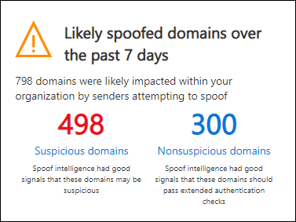
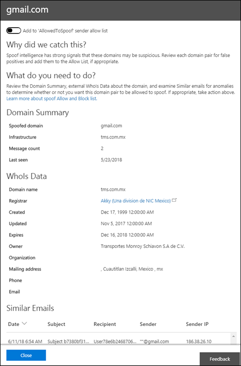

# Walkthrough - Spoof intelligence insight in Microsoft Defender for Office 365

[!INCLUDE [Microsoft 365 Defender rebranding](../includes/microsoft-defender-for-office.md)]

**Applies to**
- [Microsoft Defender for Office 365 plan 1 and plan 2](defender-for-office-365.md)
- [Microsoft 365 Defender](../defender/microsoft-365-defender.md)

In Microsoft 365 organizations with Defender for Office 365, you can use the Spoof intelligence insight to quickly determine which external senders are legitimately sending you unauthenticated email (messages from domains that don't pass SPF, DKIM, or DMARC checks).

By allowing known external senders to send spoofed messages from known locations, you can reduce false positives (good email marked as bad). By monitoring the allowed spoofed senders, you provide an additional layer of security to prevent unsafe messages from arriving in your organization.

For more information about reports and insights, see [Reports and insights in the Security & Compliance Center](reports-and-insights-in-security-and-compliance.md).

This walkthrough is one of several for the Security & Compliance Center. To about navigating reports and insights, see the walkthroughs in the [Related topics](#related-topics) section.

> [!NOTE]
> The spoof intelligence insight shows data from the last 7 days. The [spoof intelligence policy](learn-about-spoof-intelligence.md) and the corresponding [Get-PhishFilterPolicy](/powershell/module/exchange/get-phishfilterpolicy) cmdlet in Exchange Online PowerShell shows data from the last 30 days. The [Get-SpoofMailReport](/powershell/module/exchange/get-spoofmailreport) shows data for up to 90 days.

## What do you need to know before you begin?

- You open the Security & Compliance Center at <https://protection.office.com/>. To go directly to the **Security dashboard** page, use <https://protection.office.com/searchandinvestigation/dashboard>.

  You can view the Spoof intelligence insight from more than one dashboard in the Security & Compliance Center. Regardless of which dashboard you're looking at, the insight provides the same details and allows you to quickly do the same tasks.

- You need to be assigned permissions in the Security & Compliance Center before you can do the procedures in this article:
  - **Organization Management**
  - **Security Administrator**
  - **Security Reader**
  - **Global Reader**

  For more information, see [Permissions in the Security & Compliance Center](permissions-in-the-security-and-compliance-center.md).

  **Note**: Adding users to the corresponding Azure Active Directory role in the Microsoft 365 admin center gives users the required permissions in the Security & Compliance Center _and_ permissions for other features in Microsoft 365. For more information, see [About admin roles](../../admin/add-users/about-admin-roles.md).

- You enable and disable spoof intelligence in anti-phishing policies in Microsoft Defender for Office 365. Spoof intelligence is enabled by default. For more information, see [Configure anti-phishing policies in Microsoft Defender for Office 365](configure-atp-anti-phishing-policies.md).

- To use spoof intelligence to monitor and manage senders who are sending you unauthenticated messages, see [Configure spoof intelligence in Microsoft 365](learn-about-spoof-intelligence.md).

## Open the spoof intelligence insight in the Security & Compliance Center

1. In the Security & Compliance Center, go to **Threat Management** \> **Dashboard.**

2. In the **Insights** row, look for one of the following items:

   - **Likely spoofed domains over the past seven days**: This insight indicates that spoof intelligence is enabled (it's enabled by default).
   - **Enable Spoof Protection**: This insight indicates that spoof intelligence is disabled, and clicking on the insight allows you to enable spoof intelligence.

3. The insight on the dashboard shows you information like this:

   

   This insight has two modes:

   - **Insight mode**: If spoof intelligence is enabled, the insight shows you how many messages were impacted by our spoof intelligence capabilities over the past seven days.
   - **What if mode**: If spoof intelligence is disabled, then the insight shows you how many messages *would* have been impacted by our spoof intelligence capabilities over the past seven days.

   Either way, the spoofed domains displayed in the insight are separated into two categories: **Suspicious domains** and **Non-suspicious domains**.

   - **Suspicious domains** include:

     - High-confidence spoof: Based on the historical sending patterns and the reputation score of the domains, we're highly confident that the domains are spoofing, and messages from these domains are more likely to be malicious.

     - Moderate confidence spoof: Based on historical sending patterns and the reputation score of the domains, we're moderately confident that the domains are spoofing, and that messages sent from these domains are legitimate. False positives are more likely in this category than high-confidence spoof.

   **Non-suspicious domains**: The domain failed explicit email authentication checks [SPF](how-office-365-uses-spf-to-prevent-spoofing.md), [DKIM](use-dkim-to-validate-outbound-email.md), and [DMARC](use-dmarc-to-validate-email.md)). However, the domain passed our implicit email authentication checks ([composite authentication](email-validation-and-authentication.md#composite-authentication)). As a result, no anti-spoofing action was taken on the message.

### View detailed information about suspicious domains from the Spoof intelligence insight

1. On the Spoof intelligence insight, click **Suspicious domains** or **Non-suspicious domains** to go to the **Spoof intelligence insight** page. The **Spoof Intelligence insight** page contains the following information:

   - **Spoofed domain**: The domain of the spoofed user that's displayed in the **From** box in email clients. This address is also known as the `5322.From` address.
   - **Infrastructure**: Also known as the _sending infrastructure_. The domain found in a reverse DNS lookup (PTR record) of the source email server's IP address. If the source IP address has no PTR record, then the sending infrastructure is identified as \<source IP\>/24 (for example, 192.168.100.100/24).
   - **Message count**: The number of messages from the sending infrastructure to your organization that contain the specified spoofed domain within the last 7 days.
   - **Last seen**: The last date when a message was received from the sending infrastructure that contains the spoofed domain.
   - **Spoof type**: This value is **External**.
   - **Allowed to spoof?**: The values that you see here are:
     - **Yes**: Messages from the combination of spoofed user's domain and sending infrastructure are allowed and not treated as spoofed email.
     - **No**: Messages from the combination of spoofed user's domain and sending infrastructure are marked as spoofed. The action is controlled by the default anti-phishing policy or custom anti-phishing policies (the default value is **Move message to Junk Email folder**).

     For more information, see [Configure anti-phishing policies in Microsoft Defender for Office 365](configure-atp-anti-phishing-policies.md).

2. Select an item in the list to view details about the domain/sending infrastructure pair in a flyout. The information includes:
   - Why we caught this.
   - What you need to do.
   - A domain summary.
   - WhoIs data about the sender.
   - Similar messages we have seen in your tenant from the same sender.

   From here, you can also choose to add or remove the domain/sending infrastructure pair from the **Allowed to spoof** sender allow list. Simply set the toggle accordingly.

   

### Adding a domain to the Allowed to spoof list

Adding a domain to the Allowed to spoof list from the spoof intelligence insight only allows the combination of the spoofed domain *and* the sending infrastructure. It does not allow email from the spoofed domain from any source, nor does it allow email from the sending infrastructure for any domain.

For example, you allow the following domain to the Allowed to spoof list:

- **Domain**: gmail.com
- **Infrastructure**: tms.mx.com

Only email from that domain/sending infrastructure pair will be allowed to spoof. Other senders attempting to spoof gmail.com aren't allowed. Messages in other domains from tms.mx.com are checked by spoof intelligence.

## Related topics

[Anti-spoofing protection in Microsoft 365](anti-spoofing-protection.md)