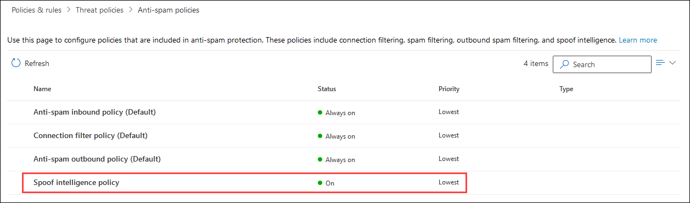
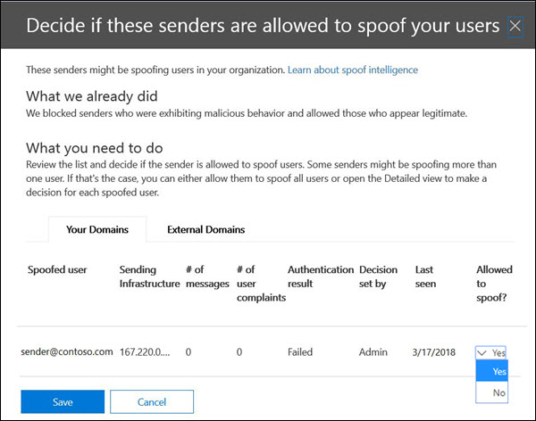

# Manage spoofed senders using the spoof intelligence policy and spoof intelligence insight in EOP

[!INCLUDE [Microsoft 365 Defender rebranding](../includes/microsoft-defender-for-office.md)]

**Applies to**
- [Microsoft Defender for Office 365 plan 1 and plan 2](defender-for-office-365.md)
- [Microsoft 365 Defender](../defender/microsoft-365-defender.md)

> [!NOTE]
> This article describes the older spoofed sender management experience that's being replaced. For more information about the new experience, see [Spoof intelligence insight in EOP](learn-about-spoof-intelligence.md)

In Microsoft 365 organizations with mailboxes in Exchange Online or standalone Exchange Online Protection (EOP) organizations without Exchange Online mailboxes, inbound email messages are automatically protected against spoofing by EOP as of October 2018. EOP uses **spoof intelligence** as part of your organization's overall defense against phishing. For more information, see [Anti-spoofing protection in EOP](anti-spoofing-protection.md).

The default (and only) **spoof intelligence policy** helps ensure that the spoofed email sent by legitimate senders doesn't get caught up in EOP spam filters while protecting your users from spam or phishing attacks. You can also use the **Spoof intelligence insight** to quickly determine which external senders are legitimately sending you unauthenticated email (messages from domains that don't pass SPF, DKIM, or DMARC checks).

You can manage spoof intelligence in the Security & Compliance Center, or in PowerShell (Exchange Online PowerShell for Microsoft 365 organizations with mailboxes in Exchange Online; standalone EOP PowerShell for organizations without Exchange Online mailboxes).

## What do you need to know before you begin?

- You open the Security & Compliance Center at <https://protection.office.com/>.
  - To go directly to the **Anti-spam settings** page for the spoof intelligence policy, use <https://protection.office.com/antispam>.
  - To go directly to the **Security dashboard** page for the spoof intelligence insight, use <https://protection.office.com/searchandinvestigation/dashboard>.

- To connect to Exchange Online PowerShell, see [Connect to Exchange Online PowerShell](/powershell/exchange/connect-to-exchange-online-powershell). To connect to standalone EOP PowerShell, see [Connect to Exchange Online Protection PowerShell](/powershell/exchange/connect-to-exchange-online-protection-powershell).

- You need to be assigned permissions in **Exchange Online** before you can do the procedures in this article:
  - To modify the spoof intelligence policy or enable or disable spoof intelligence, you need to be a member of the **Organization Management** or **Security Administrator** role groups.
  - For read-only access to the spoof intelligence policy, you need to be a member of the **Global Reader** or **Security Reader** role groups.

  For more information, see [Permissions in Exchange Online](/exchange/permissions-exo/permissions-exo).

  **Notes**:

  - Adding users to the corresponding Azure Active Directory role in the Microsoft 365 admin center gives users the required permissions _and_ permissions for other features in Microsoft 365. For more information, see [About admin roles](../../admin/add-users/about-admin-roles.md).
  - The **View-Only Organization Management** role group in [Exchange Online](/Exchange/permissions-exo/permissions-exo#role-groups) also gives read-only access to the feature.

- The options for spoof intelligence are described in [Spoof settings in anti-phishing policies](set-up-anti-phishing-policies.md#spoof-settings).

- You can enable, disable, and configure the spoof intelligence settings in anti-phishing policies. For instructions based on your subscription, see one of the following topics:

  - [Configure anti-phishing policies in EOP](configure-anti-phishing-policies-eop.md).
  - [Configure anti-phishing policies in Microsoft Defender for Office 365](configure-atp-anti-phishing-policies.md).

- For our recommended settings for spoof intelligence, see [EOP default anti-phishing policy settings](recommended-settings-for-eop-and-office365.md#eop-default-anti-phishing-policy-settings).

## Manage spoofed senders

There are two ways to allow and block spoofed senders:

- [Use the spoof intelligence policy](#manage-spoofed-senders-in-the-spoof-intelligence-policy)
- [Use the spoof intelligence insight](#manage-spoofed-senders-in-the-spoof-intelligence-insight)

### Manage spoofed senders in the spoof intelligence policy

1. In the Security & Compliance Center, go to **Threat management** \> **Policy** \> **Anti-spam**.

2. On the **Anti-spam settings** page, click  to expand **Spoof intelligence policy**.

   

3. Make one of the following selections:

   - **Review new senders**
   - **Show me senders I already reviewed**

4. In the **Decide if these senders are allowed to spoof your users** flyout that appears, select one of the following tabs:

   - **Your Domains**: Senders spoofing users in your internal domains.
   - **External Domains**: Senders spoofing users in external domains.

5. Click  in the **Allowed to spoof?** column. Choose **Yes** to allow the spoofed sender, or choose **No** to mark the message as spoofed. The action is controlled by the default anti-phishing policy or custom anti-phishing policies (the default value is **Move message to Junk Email folder**). For more information, see [Spoof settings in anti-phishing policies](set-up-anti-phishing-policies.md#spoof-settings).

   

   The columns and values that you see are explained in the following list:

   - **Spoofed user**: The user account that's being spoofed. This is the message sender in the From address (also known as the `5322.From` address) that's shown in email clients. The validity of this address is not checked by SPF.
     - On the **Your Domains** tab, the value contains a single email address, or if the source email server is spoofing multiple user accounts, it contains **More than one**.
     - On the **External Domains** tab, the value contains the domain of the spoofed user, not the full email address.

   - **Sending Infrastructure**: The domain found in a reverse DNS lookup (PTR record) of the source email server's IP address. If the source IP address has no PTR record, then the sending infrastructure is identified as \<source IP\>/24 (for example, 192.168.100.100/24).

     For more information about message sources and message senders, see [An overview of email message standards](how-office-365-validates-the-from-address.md#an-overview-of-email-message-standards).

   - **# of messages**: The number of messages from the sending infrastructure to your organization that contain the specified spoofed sender or senders within the last 30 days.

   - **# of user complaints**: Complaints filed by your users against this sender within the last 30 days. Complaints are usually in the form of junk submissions to Microsoft.

   - **Authentication result**: One of the following values:
      - **Passed**: The sender passed sender email authentication checks (SPF or DKIM).
      - **Failed**: The sender failed EOP sender authentication checks.
      - **Unknown**: The result of these checks isn't known.

   - **Decision set by**: Shows who determined if the sending infrastructure is allowed to spoof the user:
       - **Spoof intelligence policy** (automatic)
       - **Admin** (manual)

   - **Last seen**: The last date when a message was received from the sending infrastructure that contains the spoofed user.

   - **Allowed to spoof?**: The values that you see here are:
     - **Yes**: Messages from the combination of spoofed user and sending infrastructure are allowed and not treated as spoofed email.
     - **No**: Messages from the combination of spoofed user and sending infrastructure are marked as spoofed. The action is controlled by the default anti-phishing policy or custom anti-phishing policies (the default value is **Move message to Junk Email folder**). See the next section for more information.

     - **Some users** (**Your Domains** tab only): A sending infrastructure is spoofing multiple users, where some spoofed users are allowed and others are not. Use the **Detailed** tab to see the specific addresses.

6. At the bottom of the page, click **Save**.

#### Use PowerShell to manage spoofed senders

To view allowed and blocked senders in spoof intelligence, use the following syntax:

```powershell
Get-PhishFilterPolicy [-AllowedToSpoof <Yes | No | Partial>] [-ConfidenceLevel <Low | High>] [-DecisionBy <Admin | SpoofProtection>] [-Detailed] [-SpoofType <Internal | External>]
```

This example returns detailed information about all senders that are allowed to spoof users in your domains.

```powershell
Get-PhishFilterPolicy -AllowedToSpoof Yes -Detailed -SpoofType Internal
```

For detailed syntax and parameter information, see [Get-PhishFilterPolicy](/powershell/module/exchange/get-phishfilterpolicy).

To configure allowed and blocked senders in spoof intelligence, follow these steps:

1. Capture the current list of detected spoofed senders by writing the output of the **Get-PhishFilterPolicy** cmdlet to a CSV file:

   ```powershell
   Get-PhishFilterPolicy -Detailed | Export-CSV "C:\My Documents\Spoofed Senders.csv"
   ```

2. Edit the CSV file to add or modify the **SpoofedUser** (email address) and **AllowedToSpoof** (Yes or No) values. Save the file, read the file, and store the contents as a variable named `$UpdateSpoofedSenders`:

   ```powershell
   $UpdateSpoofedSenders = Get-Content -Raw "C:\My Documents\Spoofed Senders.csv"
   ```

3. Use the `$UpdateSpoofedSenders` variable to configure the spoof intelligence policy:

   ```powershell
   Set-PhishFilterPolicy -Identity Default -SpoofAllowBlockList $UpdateSpoofedSenders
   ```

For detailed syntax and parameter information, see [Set-PhishFilterPolicy](/powershell/module/exchange/set-phishfilterpolicy).

### Manage spoofed senders in the spoof intelligence insight

1. In the Security & Compliance Center, go to **Threat Management** \> **Dashboard**.

2. In the **Insights** row, look for one of the following items:

   - **Likely spoofed domains over the past seven days**: This insight indicates that spoof intelligence is enabled (it's enabled by default).
   - **Enable Spoof Protection**: This insight indicates that spoof intelligence is disabled, and clicking on the insight allows you to enable spoof intelligence.

3. The insight on the dashboard shows you information like this:

   

   This insight has two modes:

   - **Insight mode**: If spoof intelligence is enabled, the insight shows you how many messages were impacted by our spoof intelligence capabilities over the past seven days.
   - **What if mode**: If spoof intelligence is disabled, then the insight shows you how many messages *would* have been impacted by our spoof intelligence capabilities over the past seven days.

   Either way, the spoofed domains displayed in the insight are separated into two categories: **Suspicious domains** and **Non-suspicious domains**.

   - **Suspicious domains**:
     - **High-confidence spoof**: Based on the historical sending patterns and the reputation score of the domains, we're highly confident that the domains are spoofing, and messages from these domains are more likely to be malicious.
     - **Moderate confidence spoof**: Based on historical sending patterns and the reputation score of the domains, we're moderately confident that the domains are spoofing, and that messages sent from these domains are legitimate. False positives are more likely in this category than high-confidence spoof.
   - **Non-suspicious domains**: The domain failed explicit email authentication checks [SPF](how-office-365-uses-spf-to-prevent-spoofing.md), [DKIM](use-dkim-to-validate-outbound-email.md), and [DMARC](use-dmarc-to-validate-email.md)). However, the domain passed our implicit email authentication checks ([composite authentication](email-validation-and-authentication.md#composite-authentication)). As a result, no anti-spoofing action was taken on the message.

#### View detailed information about suspicious and nonsuspicious domains

1. On the Spoof intelligence insight, click **Suspicious domains** or **Non-suspicious domains** to go to the **Spoof intelligence insight** page. The **Spoof Intelligence insight** page contains the following information:

   - **Spoofed domain**: The domain of the spoofed user that's displayed in the **From** box in email clients. This address is also known as the `5322.From` address.
   - **Infrastructure**: Also known as the _sending infrastructure_. The domain found in a reverse DNS lookup (PTR record) of the source email server's IP address. If the source IP address has no PTR record, then the sending infrastructure is identified as \<source IP\>/24 (for example, 192.168.100.100/24).
   - **Message count**: The number of messages from the sending infrastructure to your organization that contain the specified spoofed domain within the last 7 days.
   - **Last seen**: The last date when a message was received from the sending infrastructure that contains the spoofed domain.
   - **Spoof type**: This value is **External**.
   - **Allowed to spoof?**: The values that you see here are:
     - **Yes**: Messages from the combination of spoofed user's domain and sending infrastructure are allowed and not treated as spoofed email.
     - **No**: Messages from the combination of spoofed user's domain and sending infrastructure are marked as spoofed. The action is controlled by the default anti-phishing policy or custom anti-phishing policies (the default value is **Move message to Junk Email folder**).

2. Select an item in the list to view details about the domain/sending infrastructure pair in a flyout. The information includes:
   - Why we caught this.
   - What you need to do.
   - A domain summary.
   - WhoIs data about the sender.
   - Similar messages we have seen in your tenant from the same sender.

   From here, you can also choose to add or remove the domain/sending infrastructure pair from the **Allowed to spoof** sender allow list. Simply set the toggle accordingly.

   

## How do you know these procedures worked?

To verify that you've configured spoof intelligence with senders who are allowed and not allowed to spoof, use any of the following steps:

- In the Security & Compliance Center, go to **Threat management** \> **Policy** \> **Anti-spam** \> expand **Spoof intelligence policy** \> select **Show me senders I already reviewed** \> select the **Your Domains** or **External Domains** tab, and verify the **Allowed to spoof?** value for the sender.

- In PowerShell, run the following commands to view the senders who are allowed and not allowed to spoof:

  ```powershell
  Get-PhishFilterPolicy -AllowedToSpoof Yes -SpoofType Internal
  Get-PhishFilterPolicy -AllowedToSpoof No -SpoofType Internal
  Get-PhishFilterPolicy -AllowedToSpoof Yes -SpoofType External
  Get-PhishFilterPolicy -AllowedToSpoof No -SpoofType External
  ```

- In PowerShell, run the following command to export the list of all spoofed senders to a CSV file:

   ```powershell
   Get-PhishFilterPolicy -Detailed | Export-CSV "C:\My Documents\Spoofed Senders.csv"
   ```
