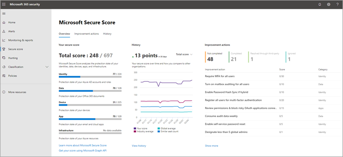
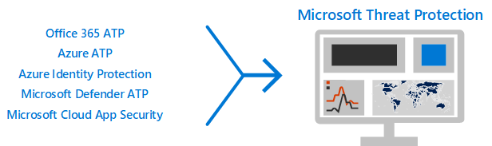

# Top 12 tasks for security teams to support working from home

If you are like [Microsoft](https://www.microsoft.com/microsoft-365/blog/2020/03/10/staying-productive-while-working-remotely-with-microsoft-teams/) and suddenly find yourself supporting a primarily home-based workforce, we want to help you ensure your organization is working as securely as possible. This article prioritizes tasks to help security teams implement the most important security capabilities as quickly as possible.

If you are a small or medium-size organization using one of Microsoft's business plans, see these resources instead:

- [Top 10 ways to secure Office 365 and Microsoft 365 for business plans](../admin/security-and-compliance/secure-your-business-data.md)
- [Microsoft 365 for Campaigns](../campaigns/index.md) (includes a recommended security configuration for Microsoft 365 Business)

For customers using our enterprise plans, Microsoft recommends you complete the tasks listed in the following table that apply to your service plan. If, instead of purchasing a Microsoft 365 enterprise plan, you are combining subscriptions, note the following:

- Microsoft 365 E3 includes Enterprise Mobility + Security (EMS) E3 and Azure AD P1
- Microsoft 365 E5 includes EMS E5 and Azure AD P2

****

|Step|Task|All Office 365 Enterprise plans|Microsoft 365 E3|Microsoft 365 E5|
|---|---|---|---|---|
|1|[Enable Azure AD Multi-Factor Authentication (MFA)](#1-enable-azure-ad-multi-factor-authentication-mfa)||||
|2|[Protect against threats](#2-protect-against-threats)||||
|3|[Configure Microsoft Defender for Office 365](#3-configure-microsoft-defender-for-office-365)||||
|4|[Configure Microsoft Defender for Identity](#4-configure-microsoft-defender-for-identity)||||
|5|[Turn on Microsoft 365 Defender](#5-turn-on-microsoft-365-defender)||||
|6|[Configure Intune mobile app protection for phones and tablets](#6-configure-intune-mobile-app-protection-for-phones-and-tablets)||||
|7|[Configure MFA and conditional access for guests, including Intune app protection](#7-configure-mfa-and-conditional-access-for-guests-including-intune-mobile-app-protection)||||
|8|[Enroll PCs into device management and require compliant PCs](#8-enroll-pcs-into-device-management-and-require-compliant-pcs)||||
|9|[Optimize your network for cloud connectivity](#9-optimize-your-network-for-cloud-connectivity)||||
|10|[Train users](#10-train-users)||||
|11|[Get started with Microsoft Cloud App Security](#11-get-started-with-microsoft-cloud-app-security)||||
|12|[Monitor for threats and take action](#12-monitor-for-threats-and-take-action)||||
|

Before you begin, check your [Microsoft 365 Secure Score](./defender/microsoft-secure-score.md) in the Microsoft 365 security center. From a centralized dashboard, you can monitor and improve the security for your Microsoft 365 identities, data, apps, devices, and infrastructure. You are given points for configuring recommended security features, performing security-related tasks (such as viewing reports), or addressing recommendations with a third-party application or software. The recommended tasks in this article will raise your score.

## 1: Enable Azure AD Multi-Factor Authentication (MFA)

The single best thing you can do to improve security for employees working from home is to turn on MFA. If you don't already have processes in place, treat this as an emergency pilot and make sure you have support folks ready to help employees who get stuck. As you probably can't distribute hardware security devices, use Windows Hello biometrics and smartphone authentication apps like Microsoft Authenticator.

Normally, Microsoft recommends you give users 14 days to register their device for Multi-Factor Authentication before requiring MFA. However, if your workforce is suddenly working from home, go ahead and require MFA as a security priority and be prepared to help users who need it.

Applying these policies will take only a few minutes, but be prepared to support your users over the next several days.

****

|Plan|Recommendation|
|---|---|
|Microsoft 365 plans (without Azure AD P1 or P2)|[Enable Security defaults in Azure AD](/azure/active-directory/fundamentals/concept-fundamentals-security-defaults). Security defaults in Azure AD include MFA for users and administrators.|
|Microsoft 365 E3 (with Azure AD P1)|Use [Common Conditional Access policies](/azure/active-directory/conditional-access/concept-conditional-access-policy-common) to configure the following policies:  - [Require MFA for administrators](/azure/active-directory/conditional-access/howto-conditional-access-policy-admin-mfa)  - [Require MFA for all users](/azure/active-directory/conditional-access/howto-conditional-access-policy-all-users-mfa)   - [Block legacy authentication](/azure/active-directory/conditional-access/howto-conditional-access-policy-block-legacy)|
|Microsoft 365 E5 (with Azure AD P2)|Taking advantage of Azure AD Identity Protection, begin to implement Microsoft's [recommended set of conditional access and related policies](./office-365-security/identity-access-policies.md) by creating these two policies:  - [Require MFA when sign-in risk is medium or high](./office-365-security/identity-access-policies.md#require-mfa-based-on-sign-in-risk)  - [Block clients that don't support modern authentication](./office-365-security/identity-access-policies.md#block-clients-that-dont-support-multi-factor) - [High risk users must change password](./office-365-security/identity-access-policies.md#high-risk-users-must-change-password)|
|

## 2: Protect against threats

All Microsoft 365 plans include a variety of threat protection features. Bumping up protection for these features takes just a few minutes.

- Anti-malware protection
- Protection from malicious URLs and files
- Anti-phishing protection
- Anti-spam protection

See [Protect against threats in Office 365](office-365-security/protect-against-threats.md) for guidance you can use as a starting point.

## 3: Configure Microsoft Defender for Office 365

Microsoft Defender for Office 365, included with Microsoft 365 E5 and Office 365 E5, safeguards your organization against malicious threats posed by email messages, links (URLs) and collaboration tools. This can take several hours to configure.

Microsoft Defender for Office 365:

- Protects your organization from unknown email threats in real-time by using intelligent systems that inspect attachments and links for malicious content. These automated systems include a robust detonation platform, heuristics, and machine learning models.
- Protects your organization when users collaborate and share files, by identifying and blocking malicious files in team sites and document libraries.
- Applies machine learning models and advanced impersonation-detection algorithms to avert phishing attacks.

For an overview, including a summary of plans, see [Defender for Office 365](./office-365-security/defender-for-office-365.md).

Your Global Administrator can configure these protections:

- [Set up Safe Links policies](office-365-security/set-up-safe-links-policies.md)
- [Configure global settings for Safe Links](office-365-security/configure-global-settings-for-safe-links.md)
- [Set up Safe Attachments policies](office-365-security/set-up-safe-attachments-policies.md)

You'll need to work with your Exchange Online administrator and SharePoint Online administrator to configure Defender for Office 365 for these workloads:

- [Microsoft Defender for Endpoint for SharePoint, OneDrive, and Microsoft Teams](office-365-security/mdo-for-spo-odb-and-teams.md)

## 4: Configure Microsoft Defender for Identity

[Microsoft Defender for Identity](/azure-advanced-threat-protection/what-is-atp) is a cloud-based security solution that leverages your on-premises Active Directory signals to identify, detect, and investigate advanced threats, compromised identities, and malicious insider actions directed at your organization. Focus on this next because it protects your on-prem and your cloud infrastructure, has no dependencies or prerequisites, and can provide immediate benefit.

- See [Microsoft Defender for Identity Quickstarts](/azure-advanced-threat-protection/install-atp-step1) to get setup quickly
- Watch [Video: Introduction to Microsoft Defender for Identity](https://www.youtube.com/watch?reload=9&v=EGY2m8yU_KE)
- Review the [three phases of Microsoft Defender for Identity deployment](/azure-advanced-threat-protection/what-is-atp#whats-next)

## 5: Turn on Microsoft 365 Defender

Now that you have Microsoft Defender for Office 365 and Microsoft Defender for Identity configured, you can view the combined signals from these capabilities in one dashboard. [Microsoft 365 Defender](./defender/microsoft-365-defender.md) brings together alerts, incidents, automated investigation and response, and advanced hunting across workloads (Microsoft Defender for Identity, Defender for Office 365, Microsoft  Defender for Endpoint, and Microsoft Cloud App Security) into a single pane at [security.microsoft.com](https://security.microsoft.com).

After you have configured one or more of your Defender for Office 365 services, turn on MTP. New features are added continually to MTP; consider opting in to receive preview features.

- [Learn more about MTP](./defender/microsoft-365-defender.md)
- [Turn on MTP](./defender/m365d-enable.md)
- [Opt in for preview features](./defender/preview.md)

## 6: Configure Intune mobile app protection for phones and tablets

Microsoft Intune Mobile Application Management (MAM) allows you to manage and protect your organization's data on phones and tablets without managing these devices. Here's how it works:

- You create an App Protection Policy (APP) that determines which apps on a device are managed and what behaviors are allowed (such as preventing data from a managed app from being copied to an unmanaged app). You create one policy for each platform (iOS, Android).
- After creating the app protection policies, you enforce these by creating a conditional access rule in Azure AD to require approved apps and APP data protection.

APP protection policies include many settings. Fortunately, you don't need to learn about every setting and weigh the options. Microsoft makes it easy to apply a configuration of settings by recommending starting points. The [Data protection framework using app protection policies](/mem/intune/apps/app-protection-framework) includes three levels you can choose from.

Even better, Microsoft coordinates this app protection framework with a set of conditional access and related policies we recommend all organizations use as a starting point. If you've implemented MFA using the guidance in this article, you're half way there!

To configure mobile app protection, use the guidance in [Common identity and device access policies](./office-365-security/identity-access-policies.md):

 1. Use the [Apply APP data protection policies](./office-365-security/identity-access-policies.md#apply-app-data-protection-policies) guidance to create policies for iOS and Android. Level 2 (enhanced data protection) is recommended for baseline protection.
 2. Create a conditional access rule to [Require approved apps and APP protection](./office-365-security/identity-access-policies.md#require-approved-apps-and-app-protection).

## 7: Configure MFA and conditional access for guests, including Intune mobile app protection

Next, let's ensure you can continue to collaborate and work with guests. If you're using the Microsoft 365 E3 plan and you implemented MFA for all users, you're set.

If you're using the Microsoft 365 E5 plan and you're taking advantage of Azure Identity Protection for risk-based MFA, you need to make a couple of adjustments (because Azure AD Identity protection doesn't extend to guests):

- Create a new conditional access rule to require MFA always for guests and external users.
- Update the risk-based MFA conditional access rule to exclude guests and external users.

Use the guidance in [Updating the common policies to allow and protect guest and external access](./office-365-security/identity-access-policies-guest-access.md) to understand how guest access works with Azure AD and to update the affected policies.

The Intune mobile app protection policies you created, together with the conditional access rule to require approved apps and APP protection, apply to guests accounts and will help protect your organization data.

> [!NOTE]
> If you've already enrolled PCs into device management to require compliant PCs, you'll also need to exclude guest accounts from the conditional access rule that enforces device compliance.

## 8: Enroll PCs into device management and require compliant PCs

There are several methods to enroll your workforce's devices. Each method depends on the device's ownership (personal or corporate), device type (iOS, Windows, Android), and management requirements (resets, affinity, locking). This can take a bit of time to sort out. See: [Enroll devices in Microsoft Intune](/mem/intune/enrollment/).

The quickest way to get going is to [Set up automatic enrollment for Windows 10 devices](/mem/intune/enrollment/quickstart-setup-auto-enrollment).

You can also take advantage of these tutorials:

- [Use Autopilot to enroll Windows devices in Intune](/mem/intune/enrollment/tutorial-use-autopilot-enroll-devices)
- [Use Apple's Corporate Device Enrollment features in Apple Business Manager (ABM) to enroll iOS/iPadOS devices in Intune](/mem/intune/enrollment/tutorial-use-device-enrollment-program-enroll-ios)

After enrolling devices, use the guidance in [Common identity and device access policies](./office-365-security/identity-access-policies.md) to create these policies:

- [Define device-compliance policies](./office-365-security/identity-access-policies.md#define-device-compliance-policies) — The recommended settings for Windows 10 include requiring antivirus protection. If you have Microsoft 365 E5, use Microsoft Defender for Endpoint to monitor the health of employee devices. Be sure compliance policies for other operating systems include antivirus protection and end-point protection software.
- [Require compliant PCs](./office-365-security/identity-access-policies.md#require-compliant-pcs-but-not-compliant-phones-and-tablets) — This is the conditional access rule in Azure AD that enforces the device compliance policies.

Only one organization can manage a device, so be sure to exclude guest accounts from the conditional access rule in Azure AD. If you don't exclude guest and external users from policies that require device compliance, these policies will block these users. For more information, see [Updating the common policies to allow and protect guest and external access](./office-365-security/identity-access-policies-guest-access.md).

## 9: Optimize your network for cloud connectivity

If you are rapidly enabling the bulk of your employees to work from from home, this sudden switch of connectivity patterns can have a significant impact on the corporate network infrastructure. Many networks were scaled and designed before cloud services were adopted. In many cases, networks are tolerant of remote workers, but were not designed to be used remotely by all users simultaneously.

Network elements such as VPN concentrators, central network egress equipment (such as proxies and data loss prevention devices), central internet bandwidth, backhaul MPLS circuits, NAT capability and so on are suddenly put under enormous strain due to the load of the entire business using them. The end result is poor performance and productivity coupled with a poor user experience for users who are adapting to working from home.

Some of the protections that have traditionally been provided by routing traffic back through a corporate network are provided by the cloud apps your users are accessing. If you've reached this step in this article, you've implemented a set of sophisticated cloud security controls for Microsoft 365 services and data. With these controls in place, you may be ready to route remote users' traffic directly to Office 365. If you still require a VPN link for access to other applications, you can greatly improve your performance and user experience by implementing split tunneling. Once you achieve agreement in your organization, this can be accomplished within a day by a well-coordinated network team.

See these resources on Docs for more information:

- [Overview: Optimize connectivity for remote users using VPN split tunneling](/Office365/Enterprise/office-365-vpn-split-tunnel)
- [Implementing VPN split tunneling for Office 365](/Office365/Enterprise/office-365-vpn-implement-split-tunnel)

Recent blog articles on this topic:

- [How to quickly optimize traffic for remote staff & reduce the load on your infrastructure](https://techcommunity.microsoft.com/t5/office-365-blog/how-to-quickly-optimize-office-365-traffic-for-remote-staff-amp/ba-p/1214571#)
- [Alternative ways for security professionals and IT to achieve modern security controls in today's unique remote work scenarios](https://www.microsoft.com/security/blog/2020/03/26/alternative-security-professionals-it-achieve-modern-security-controls-todays-unique-remote-work-scenarios/)

## 10: Train users

Training users can save your users and security operations team a lot of time and frustration. Savvy users are less likely to open attachments or click links in questionable email messages, and they are more likely to avoid suspicious websites.

The Harvard Kennedy School [Cybersecurity Campaign Handbook](https://go.microsoft.com/fwlink/?linkid=2015598&amp;clcid=0x409) provides excellent guidance on establishing a strong culture of security awareness within your organization, including training users to identify phishing attacks.

Microsoft 365 provides the following resources to help inform users in your organization:

****

|Concept|Resources|
|---|---|
|Microsoft 365|[Customizable learning pathways](/office365/customlearning/) 
These resources can help you put together training for end users in your organization|
|Microsoft 365 security|[Learning module: Secure your organization with built-in, intelligent security from Microsoft 365](/learn/modules/security-with-microsoft-365) 
This module enables you to describe how Microsoft 365 security features work together and to articulate the benefits of these security features.|
|Multi-factor authentication|[Two-step verification: What is the additional verification page?](/azure/active-directory/user-help/multi-factor-authentication-end-user-first-time) 
This article helps end users understand what multi-factor authentication is and why it's being used at your organization.|
|

In addition to this guidance, Microsoft recommends that your users take the actions described in this article: [Protect your account and devices from hackers and malware](https://support.office.com/article/066d6216-a56b-4f90-9af3-b3a1e9a327d6.aspx). These actions include:

- Using strong passwords
- Protecting devices
- Enabling security features on Windows 10 and Mac PCs (for unmanaged devices)

Microsoft also recommends that users protect their personal email accounts by taking the actions recommended in the following articles:

- [Help protect your Outlook.com email account](https://support.microsoft.com/office/a4f20fc5-4307-4ece-8231-6d4d4bd8a9ba)

- [Protect your Gmail account with 2-step verification](https://go.microsoft.com/fwlink/p/?linkid=2015688)

## 11: Get started with Microsoft Cloud App Security

[Microsoft Cloud App Security](/cloud-app-security) provides rich visibility, control over data travel, and sophisticated analytics to identify and combat cyberthreats across all your cloud services. Once you get started with Cloud App Security, anomaly detection policies are automatically enabled, but Cloud App Security has an initial learning period of seven days during which not all anomaly detection alerts are raised.

Get started with Cloud App Security now. Later you can set up more sophisticated monitoring and controls.

- [Quickstart: Get started with Cloud App Security](/cloud-app-security/getting-started-with-cloud-app-security)
- [Get instantaneous behavioral analytics and anomaly detection](/cloud-app-security/anomaly-detection-policy)
- [Learn more about Microsoft Cloud App Security](/cloud-app-security/what-is-cloud-app-security)
- [Review new features and capabilities](/cloud-app-security/release-notes)
- [See basic setup instructions](/cloud-app-security/general-setup)

## 12: Monitor for threats and take action

Microsoft 365 includes several ways to monitor status and take appropriate actions. Your best starting point is the Microsoft 365 security center ([https://security.microsoft.com](https://security.microsoft.com)), where you can view your organization's [Microsoft Secure Score](./defender/microsoft-secure-score.md), and any alerts or entities that require your attention.

- [Get started with the Microsoft 365 security center](./defender/overview-security-center.md)
- [Monitor and view reports](./defender/overview-security-center.md)
- [See the security portals in Microsoft 365](./defender/portals.md)

## Next steps

Congratulations! You have quickly implemented some of the most important security protections and your organization is much more secure. Now you're ready to go even further with threat protection capabilities (including Microsoft Defender for Endpoint), data classification and protection capabilities, and securing administrative accounts. For a deeper, methodical set of security recommendations for Microsoft 365, see [Microsoft 365 Security for Business Decision Makers (BDMs)](Microsoft-365-security-for-bdm.md).

Also visit Microsoft's new security center on [docs.microsoft.com/security](/security).