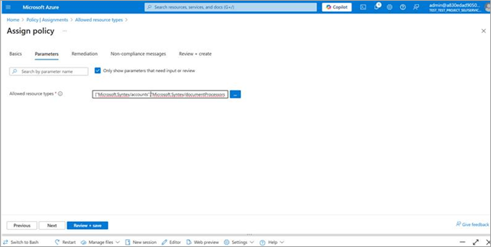
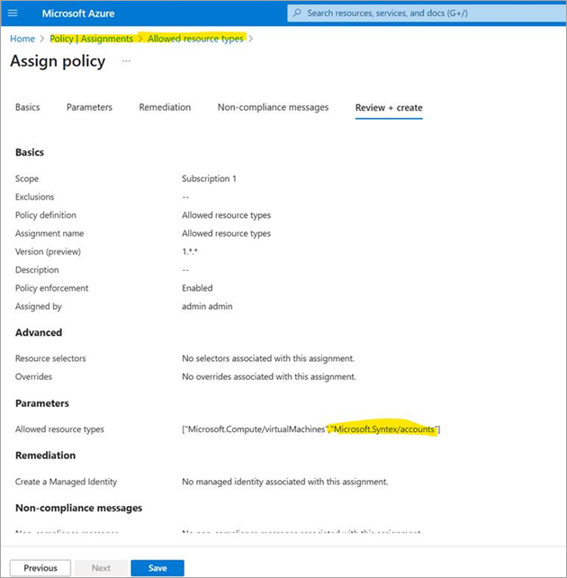

# RequestDisallowedByPolicy

This article describes how to fix the **RequestDisallowedByPolicy** error when creating resources in Azure.

If you’re seeing the error code **RequestDisallowedByPolicy**, it means that the creation of a resource was blocked by an Azure policy assigned in your environment. This often occurs when certain resource types aren't explicitly allowed under a policy—such as the GM Resource Standards policy.

## What’s causing the issue?

Your organization has applied a policy, typically called "Allowed resource types"—to control which Azure resources can be created. If you're trying to deploy a resource type that's not listed in this policy, Azure blocks the request and show this error.

## How to resolve it

To fix this, you need to update the policy assignment to include the resource types you're trying to deploy (for example, for document processing for Microsoft 365 scenarios).

### Step-by-step instructions

1. Sign in to the [Azure portal](https://portal.azure.com/).

2. In the top search bar, type *Policy* and select it.

3. In the Policy blade, select **Assignments** from the left navigation.

4. Locate the policy assignment with the name "Allowed resource types" (usually tied to the GM Resource Standards initiative).

5. Select the policy, and then select **Edit assignment**.

6. Under **Parameters**, add the resource types you want to allow:
    - Microsoft.Syntex/accounts
    - Microsoft.Syntex/documentProcessors

7. Select **Save** to apply the changes.

8. Try creating the resource again.

### Need visual help?

Check out the following screenshots for each step in the Azure portal to guide you through the process.

